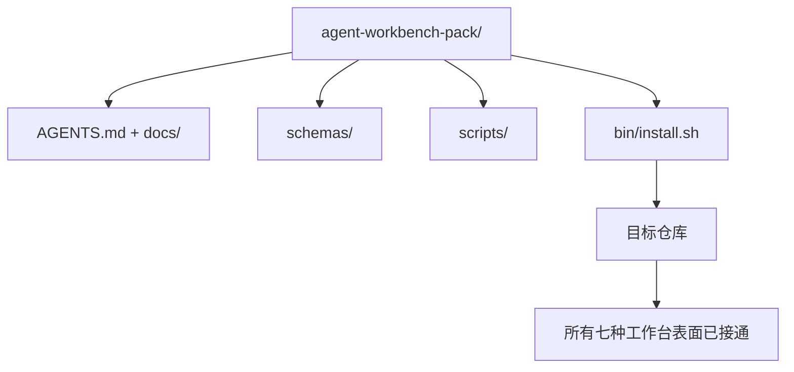

# 结业项目：交付一个可复用的 Agent 工作台包

> 这个迷你系列的终点是一个可直接放入任何仓库的包。将 11 课的内容压缩到一个目录中，你只需 `cp -r`，第二天就能拥有一个稳定工作的 Agent。本结业项目是整个课程体系中最具价值的成果。

**类型：** 构建
**语言：** Python（标准库）
**前置条件：** 阶段 14 · 31 至 14 · 41
**时长：** 约 75 分钟

## 学习目标

- 将七种工作台表面（surfaces）打包成一个即插即用的目录。
- 锁定 schema、脚本和模板，确保新仓库获得一个已知良好的基线。
- 添加一个安装脚本，能够幂等地部署该包。
- 决定哪些内容放入包中、哪些不放入，并为每一项取舍提供理由。

## 问题

一个存在于 Google 文档、聊天记录和三个半遗忘脚本中的工作台，每个季度都要重建一次。解决方案是一个版本化的包：一个包含表面、schema、脚本和单命令安装器的仓库或目录。

完成本课后，你将拥有位于 `outputs/agent-workbench-pack/` 的成品包，以及一个可将其部署到任意目标仓库的 `bin/install.sh`。

## 概念


```mermaid
flowchart TD
  Pack[agent-workbench-pack/] --> Docs[AGENTS.md + docs/]
  Pack --> Schemas[schemas/]
  Pack --> Scripts[scripts/]
  Pack --> Bin[bin/install.sh]
  Bin --> Repo[目标仓库]
  Repo --> Surfaces[所有七种工作台表面已接通]
```

### 包的目录结构

```
outputs/agent-workbench-pack/
├── AGENTS.md
├── docs/
│   ├── agent-rules.md
│   ├── reliability-policy.md
│   ├── handoff-protocol.md
│   └── reviewer-rubric.md
├── schemas/
│   ├── agent_state.schema.json
│   ├── task_board.schema.json
│   └── scope_contract.schema.json
├── scripts/
│   ├── init_agent.py
│   ├── run_with_feedback.py
│   ├── verify_agent.py
│   └── generate_handoff.py
├── bin/
│   └── install.sh
└── README.md
```

### 哪些放入、哪些不放入

**放入：**

- 表面 schema —— 它们是契约。
- 上述四个脚本 —— 它们是运行时。
- 上述四个文档 —— 它们是规则和评审标准。

**不放入：**

- 项目特定的任务。任务属于目标仓库的面板，而非包中。
- 供应商 SDK 调用。包应与框架无关。
- 入职引导文案。包应放在团队现有入职文档旁边，而非嵌入其中。

### 安装器

一个简短的 `bin/install.sh`（或 `bin/install.py`）：

1. 除非使用 `--force`，否则拒绝覆盖已有的包。
2. 将包复制到目标仓库。
3. 如果存在 `.github/workflows/` 目录，则接入 CI。
4. 打印后续步骤：填写任务面板、设置验收命令、运行初始化脚本。

### 版本控制

包中携带一个 `VERSION` 文件。需要进行迁移的 schema 升级和脚本变更，升级主版本号。仅文档变更，升级补丁版本号。目标仓库的 `agent_state.json` 会记录其初始化时使用的包版本。

## 构建

`code/main.py` 将包组装到 `outputs/agent-workbench-pack/` 目录（位于本课旁边），并填充了此前迷你系列课程中的 schema、脚本以及你已编写的文档。

运行：

```
python3 code/main.py
```

该脚本会复制并锁定所有表面、写入 README、打印包目录树，并以零退出码结束。重复运行是幂等的。

## 生产环境中的模式

一个包只有在经历分支、升级和不友好的上游变更后仍然可用，才是有价值的。以下四种模式能确保这一点。

**`VERSION` 是契约，不是营销。** 主版本升级需要状态迁移。次版本升级需要重新运行检查器。补丁版本升级仅限文档变更。安装器在每次安装时都会在目标仓库中写入 `.workbench-version`；`lint_pack.py` 在目标的锁定版本与包的 `VERSION` 不一致时会拒绝发布。这就是 `npm`、`Cargo` 和 `pyproject.toml` 能经受十年变更考验的原因——Agent 并没有改变这些规则。

**跨工具分发的单一源。** Nx 通过一个 `nx ai-setup` 命令，从单一配置中生成 `AGENTS.md`、`CLAUDE.md`、`.cursor/rules/`、`.github/copilot-instructions.md` 和一个 MCP 服务器。包也应如此；安装器会创建符号链接（`ln -s AGENTS.md CLAUDE.md`），使单一真相源辐射到所有编码 Agent。为了支持某个工具而分叉包是一种失败模式。

**`uninstall.sh` 在存在非平凡状态时拒绝执行。** 卸载包不得删除用户的 `agent_state.json`、`task_board.json` 或 `outputs/` 目录。卸载程序会移除 schema、脚本、文档和 `AGENTS.md`（可通过 `--keep-agents-md` 选择保留），并在状态文件存在任何未提交的变更时拒绝继续。状态属于用户，包不拥有它。

**作为可发布的技能，采用 SkillKit 方式分发。** 该包以 SkillKit 技能的形式发布：`skillkit install agent-workbench-pack` 可从单一源将其部署到 32 个 AI Agent 中。包仓库是真相源，SkillKit 是分发渠道。供应商锁定被打破，七种工作台表面保持不变。

## 使用

该包有三种分发方式：

- **作为目录直接放入仓库。** `cp -r outputs/agent-workbench-pack /path/to/repo`
- **作为公共模板仓库。** 可 fork 并定制，通过 `VERSION` 控制差异漂移。
- **作为 SkillKit 技能。** 接入你的 Agent 产品，一条命令即可部署。

包是配方，每次安装都是一份成品。

## 交付

`outputs/skill-workbench-pack.md` 生成一个针对项目调优后的包：规则适配团队历史、作用域 glob 匹配仓库结构、评审标准扩展一个领域专属条目。

## 练习

1. 决定哪个可选的第五份文档值得晋升为规范包的一部分，并为这一取舍提供理由。
2. 将安装器重写为 Python 版本，并添加 `--dry-run` 标志。对比 bash 版本的人机工程学差异。
3. 添加一个 `bin/uninstall.sh`，能够安全移除包，并在状态文件存在非平凡历史时拒绝执行。什么算作"非平凡"？
4. 添加一个 `lint_pack.py`，当包与 `VERSION` 发生漂移时检查失败，并将其接入包自身仓库的 CI。
5. 编写从手动搭建的工作台迁移到本包的运行手册。什么操作顺序能最大限度地减少停机时间？

## 关键术语

| 术语 | 人们常说的 | 实际含义 |
|------|-----------|---------|
| 工作台包（Workbench pack） | "入门套件" | 一个包含全部七种表面的版本化目录 |
| 安装器（Installer） | "安装脚本" | 幂等部署包的 `bin/install.sh` |
| 包版本（Pack version） | "VERSION" | schema/脚本变更升主版本号，仅文档变更升补丁版本号 |
| 即插即用包（Drop-in pack） | "cp -r 开箱即用" | 包无需按仓库定制，第一天即可工作 |
| 可 fork 模板（Forkable template） | "GitHub 模板" | 可通过 GitHub 的 "Use this template" 克隆的公共仓库 |

## 扩展阅读

- 阶段 14 · 31 至 14 · 41 —— 本包打包的每一个表面
- [SkillKit](https://github.com/rohitg00/skillkit) —— 在 32 个 AI Agent 中安装此技能
- [Nx 博客：教会你的 AI Agent 如何在单体仓库中工作](https://nx.dev/blog/nx-ai-agent-skills) —— 跨六种工具的单一源生成器
- [agents.md —— 开放规范](https://agents.md/) —— 你的包路由器必须实现的规范
- [HKUDS/OpenHarness](https://github.com/HKUDS/OpenHarness) —— 包等价物的参考实现
- [andrewgarst/agentic_harness](https://github.com/andrewgarst/agentic_harness) —— 基于 Redis 的参考实现，包含评估套件
- [Augment Code：一份好的 AGENTS.md 就是一次模型升级](https://www.augmentcode.com/blog/how-to-write-good-agents-dot-md-files) —— 包文档的质量标准
- [Anthropic：长期运行 Agent 的有效框架设计](https://www.anthropic.com/engineering/effective-harnesses-for-long-running-agents)
- [Anthropic：长期运行应用开发的框架设计](https://www.anthropic.com/engineering/harness-design-long-running-apps)
- 阶段 14 · 30 —— 消费本包验证门控的评估驱动 Agent 开发
- 阶段 14 · 41 —— 本包改善的前后基准对比
