# Communication Protocols

> 同じ言葉を話せない agents は team ではありません。虚空に向かって叫ぶ strangers です。

**種別:** 構築
**言語:** TypeScript
**前提条件:** Phase 14 (Agent Engineering), Lesson 16.01 (Why Multi-Agent)
**所要時間:** 約120分

## 学習目標

- MCP tool discovery と invocation を実装し、agents が external servers の expose する tools を使えるようにする
- A2A Agent Card と task endpoint を作り、ある agent が HTTP 経由で別 agent に work を delegate できるようにする
- MCP (tool access)、A2A (agent-to-agent)、ACP (enterprise audit)、ANP (decentralized trust) を比較し、どの protocol がどの problem を解くか説明する
- agents が MCP で tools を discover し、A2A で tasks を delegate する single system の中で、複数 protocols を wire する

## 問題

system を複数の agents に分けました。researcher、coder、reviewer。それぞれは自分の仕事をうまくこなします。しかし、次は実際に互いに話す必要があります。

最初の試みは obvious です。strings を渡します。researcher は text の blob を返し、coder は何とか parse します。coder が research summary を誤解する、2 agents が互いを待って deadlock する、別 teams が作った agents を collaborate させる必要が出るまでは動きます。突然、"just pass strings" は崩れます。

これが communication protocol problem です。agents が情報を交換する shared contract がなければ、multi-agent systems は fragile で、audit できず、自分で書いた少数の agents を超えて scale できません。

AI ecosystem は 4 つの protocols でこれに応答しています。それぞれ problem の別 slice を解きます。

- **MCP**: tool access
- **A2A**: agent-to-agent collaboration
- **ACP**: enterprise auditability
- **ANP**: decentralized identity and trust

この lesson では深く入ります。各 spec の real wire formats を読み、working implementations を作り、4 つすべてを unified system に接続します。

## コンセプト

### Protocol Landscape

これら 4 つの protocols は layers と考えてください。それぞれ別の question に答えます。

```mermaid
block-beta
  columns 1
  block:ANP["ANP — How do agents trust strangers?\nDecentralized identity (DID), E2EE, meta-protocol"]
  end
  block:A2A["A2A — How do agents collaborate on goals?\nAgent Cards, task lifecycle, streaming, negotiation"]
  end
  block:ACP["ACP — How do agents talk in auditable systems?\nRuns, trajectory metadata, session continuity"]
  end
  block:MCP["MCP — How does an agent use a tool?\nTool discovery, execution, context sharing"]
  end

  style ANP fill:#f3e8ff,stroke:#7c3aed
  style A2A fill:#dbeafe,stroke:#2563eb
  style ACP fill:#fef3c7,stroke:#d97706
  style MCP fill:#d1fae5,stroke:#059669
```

競合ではありません。different levels で different problems を解きます。

### MCP (recap)

MCP は Phase 13 で詳しく扱いました。要点だけ復習します。MCP は LLM が external tools と data sources に接続する方法を standardize します。agent (client) が server の expose する tools を discover して call する **client-server** protocol です。

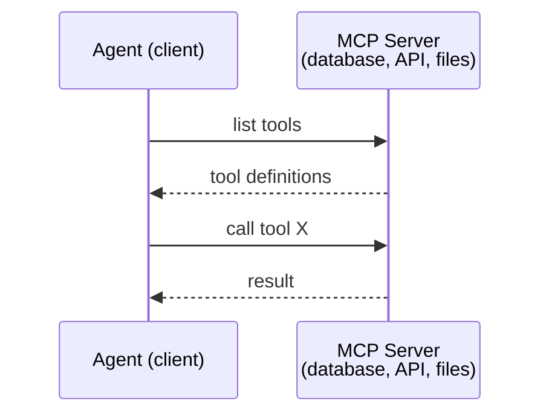

MCP は **agent-to-tool** communication です。agents 同士が話す助けにはなりません。

### A2A (Agent2Agent Protocol)

**Created by:** Google (現在は Linux Foundation の `lf.a2a.v1` 配下)
**Spec version:** 1.0.0
**Problem:** autonomous agents はどう collaborate、negotiate、delegate するか?

A2A は **peer-to-peer agent collaboration** の protocol です。MCP が agent を tools に接続するのに対し、A2A は agent を other agents に接続します。各 agent は well-known URL に **Agent Card** を publish し、ほかの agents はそれを discover、negotiate、delegate します。

#### A2A の流れ

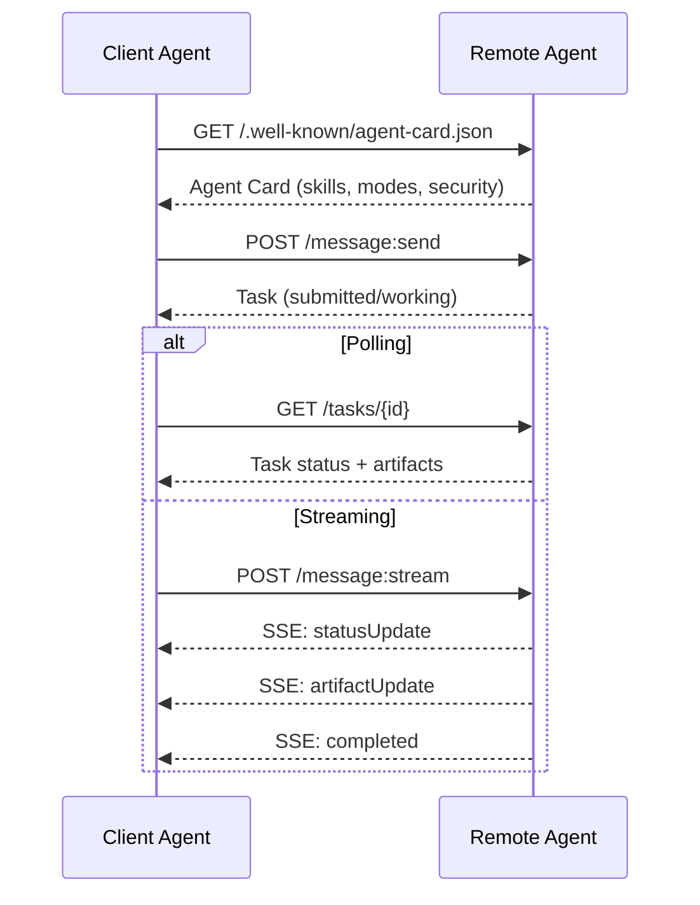

#### Real Agent Card

A2A Agent Card は実際には次のような形です。`GET /.well-known/agent-card.json` で serve されます。

```json
{
  "name": "Research Agent",
  "description": "Searches documentation and summarizes findings",
  "version": "1.0.0",
  "supportedInterfaces": [
    {
      "url": "https://research-agent.example.com/a2a/v1",
      "protocolBinding": "JSONRPC",
      "protocolVersion": "1.0"
    },
    {
      "url": "https://research-agent.example.com/a2a/rest",
      "protocolBinding": "HTTP+JSON",
      "protocolVersion": "1.0"
    }
  ],
  "provider": {
    "organization": "Your Company",
    "url": "https://example.com"
  },
  "capabilities": {
    "streaming": true,
    "pushNotifications": false
  },
  "defaultInputModes": ["text/plain", "application/json"],
  "defaultOutputModes": ["text/plain", "application/json"],
  "skills": [
    {
      "id": "web-research",
      "name": "Web Research",
      "description": "Searches the web and synthesizes findings",
      "tags": ["research", "search", "summarization"],
      "examples": ["Research the latest changes in React 19"]
    }
  ],
  "securitySchemes": {
    "bearer": {
      "httpAuthSecurityScheme": {
        "scheme": "Bearer",
        "bearerFormat": "JWT"
      }
    }
  },
  "security": [{ "bearer": [] }]
}
```

注目点:

- **Skills** は agent ができることです。ID、tags、supported input/output MIME types を持ちます。client agent はこれを使って remote agent が request を handle できるか判断します。
- **supportedInterfaces** は複数の protocol bindings を列挙します。1 つの agent が JSON-RPC、REST、gRPC を同時に話せます。
- **Security** は card に組み込まれています。client は最初の request 前に必要な auth を知ります。

#### Task Lifecycle

A2A の core unit of work は Task です。Task は定義済み states を移動します。

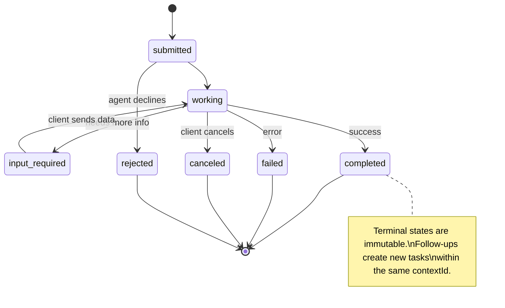

spec は sentinel として `UNSPECIFIED` も定義します。主要 8 states は次の通りです。

| State | Terminal? | Meaning |
|---|---|---|
| `TASK_STATE_SUBMITTED` | No | 受領済み、まだ処理していない |
| `TASK_STATE_WORKING` | No | 処理中 |
| `TASK_STATE_INPUT_REQUIRED` | No | agent が client から追加情報を必要としている |
| `TASK_STATE_AUTH_REQUIRED` | No | authentication が必要 |
| `TASK_STATE_COMPLETED` | Yes | 成功して終了 |
| `TASK_STATE_FAILED` | Yes | error で終了 |
| `TASK_STATE_CANCELED` | Yes | 完了前に canceled |
| `TASK_STATE_REJECTED` | Yes | agent が task を declined |

task が terminal state に到達すると immutable です。追加 messages はありません。follow-up は同じ `contextId` 内の new task として作ります。

#### Wire Format

A2A は JSON-RPC 2.0 を使います。real message exchange は次のようになります。

**Client sends a task:**

```json
{
  "jsonrpc": "2.0",
  "id": 1,
  "method": "SendMessage",
  "params": {
    "message": {
      "messageId": "msg-001",
      "role": "ROLE_USER",
      "parts": [{ "text": "Research React 19 compiler features" }]
    },
    "configuration": {
      "acceptedOutputModes": ["text/plain", "application/json"],
      "historyLength": 10
    }
  }
}
```

**Agent responds with a task:**

```json
{
  "jsonrpc": "2.0",
  "id": 1,
  "result": {
    "task": {
      "id": "task-abc-123",
      "contextId": "ctx-xyz-789",
      "status": {
        "state": "TASK_STATE_COMPLETED",
        "timestamp": "2026-03-27T10:30:00Z"
      },
      "artifacts": [
        {
          "artifactId": "art-001",
          "name": "research-results",
          "parts": [{
            "data": {
              "findings": [
                "React 19 compiler auto-memoizes components",
                "No more manual useMemo/useCallback needed",
                "Compiler runs at build time, not runtime"
              ]
            },
            "mediaType": "application/json"
          }]
        }
      ]
    }
  }
}
```

**Streaming via SSE:**

```text
POST /message:stream HTTP/1.1
Content-Type: application/json
A2A-Version: 1.0

data: {"task":{"id":"task-123","status":{"state":"TASK_STATE_WORKING"}}}

data: {"statusUpdate":{"taskId":"task-123","status":{"state":"TASK_STATE_WORKING","message":{"role":"ROLE_AGENT","parts":[{"text":"Searching documentation..."}]}}}}

data: {"artifactUpdate":{"taskId":"task-123","artifact":{"artifactId":"art-1","parts":[{"text":"partial findings..."}]},"append":true,"lastChunk":false}}

data: {"statusUpdate":{"taskId":"task-123","status":{"state":"TASK_STATE_COMPLETED"}}}
```

### ACP (Agent Communication Protocol)

**Created by:** IBM / BeeAI
**Spec version:** 0.2.0 (OpenAPI 3.1.1)
**Status:** Linux Foundation 配下で A2A に merge 中
**Problem:** full auditability、session continuity、trajectory tracking を持って agents はどう communicate するか?

ACP は **enterprise protocol** です。多くの summary とは異なり、ACP は **JSON-LD を使いません**。OpenAPI で定義された素直な REST/JSON API です。特別なのは **TrajectoryMetadata** です。各 agent response が、それを生み出した reasoning steps と tool calls の詳細 log を持てます。

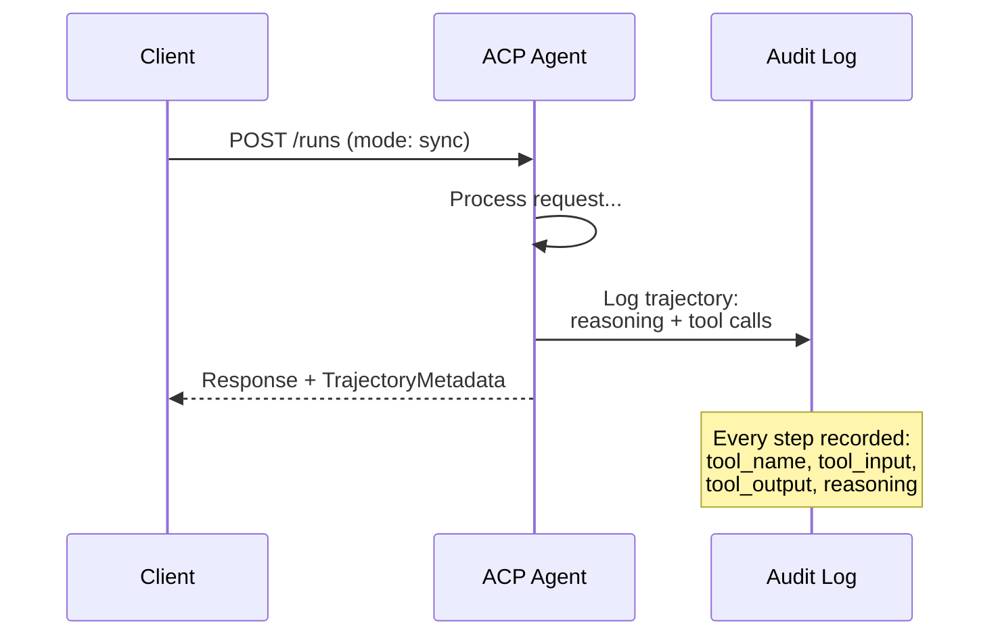

#### ACP の discovery

ACP は 4 つの discovery methods を定義します。

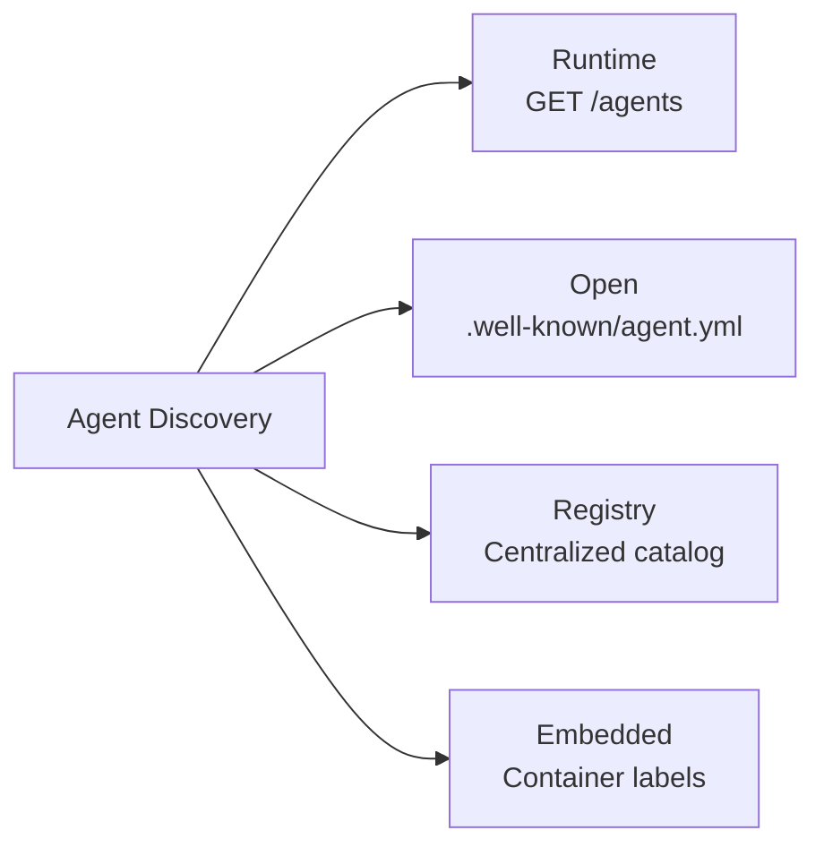

**AgentManifest** は A2A の Agent Card より simple です。

```json
{
  "name": "summarizer",
  "description": "Summarizes documents with source citations",
  "input_content_types": ["text/plain", "application/pdf"],
  "output_content_types": ["text/plain", "application/json"],
  "metadata": {
    "tags": ["summarization", "RAG"],
    "framework": "BeeAI",
    "recommended_models": ["llama3.3:70b-instruct-fp16"],
    "license": "Apache-2.0",
    "programming_language": "Python"
  }
}
```

#### Run Lifecycle

ACP は Tasks ではなく Runs を使います。Run は 3 modes を持つ agent execution です。

| Mode | Behavior |
|---|---|
| `sync` | blocking。response は complete result を含む |
| `async` | すぐ 202 を返す。`GET /runs/{id}` で status を poll |
| `stream` | SSE stream。agent が work するたびに events が fire |

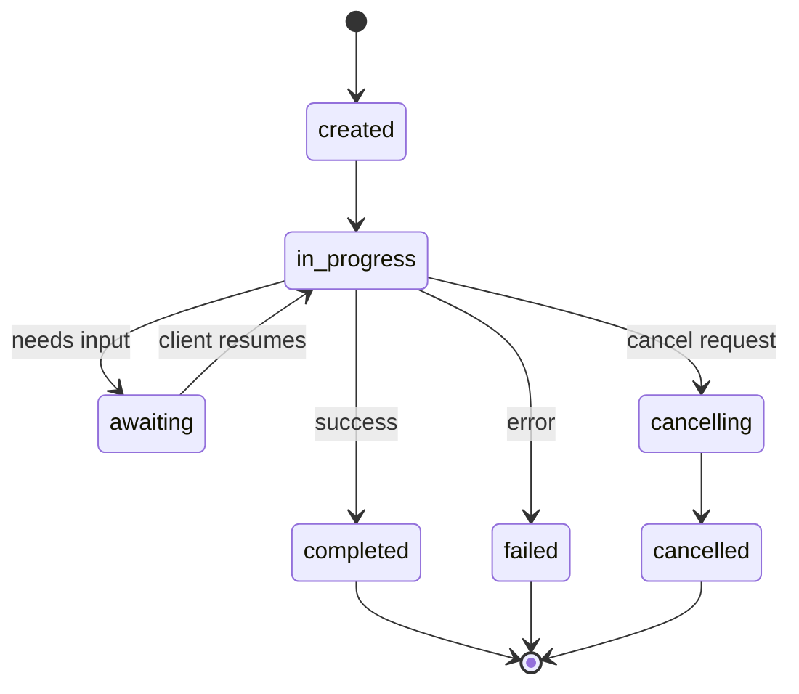

#### TrajectoryMetadata (audit trail)

ACP の key differentiator です。各 message part に agent が何をしたかを示す metadata を付けられます。

```json
{
  "role": "agent/researcher",
  "parts": [
    {
      "content_type": "text/plain",
      "content": "The weather in San Francisco is 72F and sunny.",
      "metadata": {
        "kind": "trajectory",
        "message": "I need to check the weather for this location",
        "tool_name": "weather_api",
        "tool_input": { "location": "San Francisco, CA" },
        "tool_output": { "temperature": 72, "condition": "sunny" }
      }
    }
  ]
}
```

regulated industries にとってこれは非常に重要です。各 answer には、どの tools を呼び、どの inputs を使い、どの outputs を受け取ったかという provable chain of reasoning が付きます。black box ではありません。

ACP は source attribution 用の **CitationMetadata** も support します。

```json
{
  "kind": "citation",
  "start_index": 0,
  "end_index": 47,
  "url": "https://weather.gov/sf",
  "title": "NWS San Francisco Forecast"
}
```

### ANP (Agent Network Protocol)

**Created by:** open-source community (founded by GaoWei Chang)
**Repo:** [github.com/agent-network-protocol/AgentNetworkProtocol](https://github.com/agent-network-protocol/AgentNetworkProtocol)
**Problem:** central authority なしに、different organizations の agents はどう trust するか?

ANP は **decentralized identity protocol** です。W3C Decentralized Identifiers (DIDs) と end-to-end encryption で trust を作ります。A2A が known endpoints から agents を discover するのに対し、ANP は agents が cryptographically に identity を証明できるようにします。

ANP は 3 layers です。

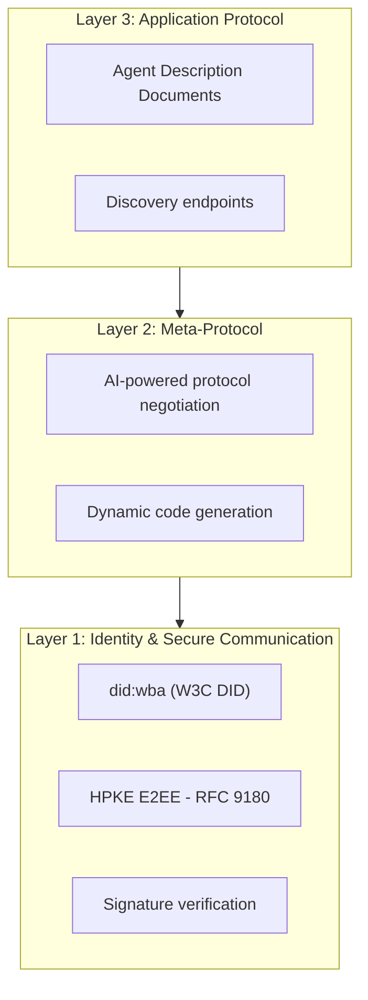

#### DID Documents

ANP は `did:wba` (Web-Based Agent) という custom DID method を使います。`did:wba:example.com:user:alice` は `https://example.com/user/alice/did.json` に resolve されます。

```json
{
  "@context": [
    "https://www.w3.org/ns/did/v1",
    "https://w3id.org/security/suites/jws-2020/v1",
    "https://w3id.org/security/suites/secp256k1-2019/v1"
  ],
  "id": "did:wba:example.com:user:alice",
  "verificationMethod": [
    {
      "id": "did:wba:example.com:user:alice#key-1",
      "type": "EcdsaSecp256k1VerificationKey2019",
      "controller": "did:wba:example.com:user:alice"
    }
  ],
  "authentication": ["did:wba:example.com:user:alice#key-1"],
  "humanAuthorization": ["did:wba:example.com:user:alice#key-1"],
  "service": [
    {
      "id": "did:wba:example.com:user:alice#agent-description",
      "type": "AgentDescription",
      "serviceEndpoint": "https://example.com/agents/alice/ad.json"
    }
  ]
}
```

注目点:

- **Key separation** が enforced されます。signing keys と encryption keys は分離します。
- **`humanAuthorization`** は ANP 固有です。fund transfers のような high-risk operations は、biometric、password、HSM などによる explicit human approval を要求できます。
- **`keyAgreement`** keys は HPKE end-to-end encryption (RFC 9180) に使います。
- **service** section は Agent Description document に link します。

#### ANP で trust がどう機能するか

ANP は web-of-trust や endorsement graph を使いません。trust は bilateral で、interaction ごとに verify します。

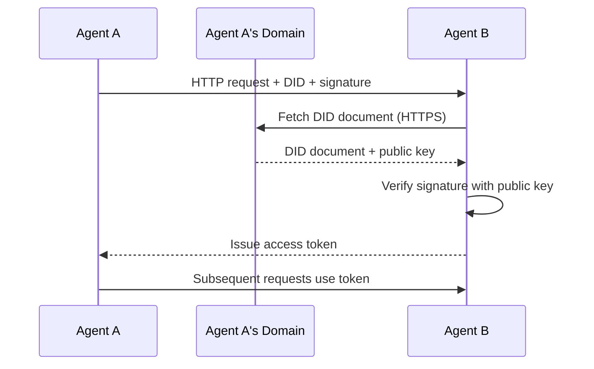

trust は 3 sources から来ます。

1. **Domain-level TLS** が DID document host を verify する
2. **DID cryptographic signatures** が agent identity を verify する
3. **Principle of least trust** が minimum permissions だけを grant する

gossip-based trust propagation や PageRank scoring はありません。各 agent をその DID で直接 verify します。

#### Meta-Protocol Negotiation

これは ANP の最も novel な feature です。different ecosystems の 2 agents が出会ったとき、pre-agreed data formats は不要です。natural language で negotiate します。

```json
{
  "action": "protocolNegotiation",
  "sequenceId": 0,
  "candidateProtocols": "I can communicate using:\n1. JSON-RPC with hotel booking schema\n2. REST with OpenAPI 3.1 spec\n3. Natural language over HTTP",
  "modificationSummary": "Initial proposal",
  "status": "negotiating"
}
```

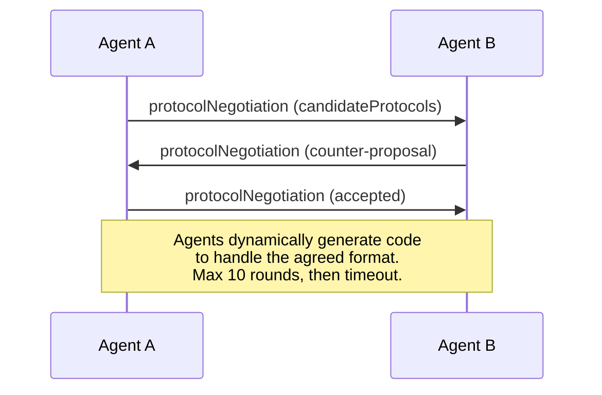

agents は format に合意するまで往復します (max 10 rounds)。合意後、その format を扱う code を dynamically generate します。status values は `negotiating`、`rejected`、`accepted`、`timeout` です。

これにより、互いを見たことのない 2 agents が、shared schema を誰かが事前定義しなくても communication の方法を見つけられます。

### Comparison (Corrected)

| | MCP | A2A | ACP | ANP |
|---|---|---|---|---|
| **Created by** | Anthropic | Google / Linux Foundation | IBM / BeeAI | Community |
| **Spec format** | JSON-RPC | JSON-RPC / REST / gRPC | OpenAPI 3.1 (REST) | JSON-RPC |
| **Primary use** | Agent to Tool | Agent to Agent | Agent to Agent | Agent to Agent |
| **Discovery** | Tool listing | `/.well-known/agent-card.json` | `GET /agents`, `/.well-known/agent.yml` | `/.well-known/agent-descriptions`, DID service endpoints |
| **Identity** | Implicit (local) | Security schemes (OAuth, mTLS) | Server-level | W3C DID (`did:wba`) with E2EE |
| **Audit trail** | N/A | Basic (task history) | TrajectoryMetadata (tool calls, reasoning) | Not formally specified |
| **State machine** | N/A | 9 task states | 7 run states | N/A |
| **Streaming** | N/A | SSE | SSE | Transport-agnostic |
| **Unique feature** | Tool schemas | Agent Cards + Skills | Trajectory audit trail | Meta-protocol negotiation |
| **Best for** | Tools & data | Dynamic collaboration | Regulated industries | Cross-org trust |
| **Status** | Stable | Stable (v1.0) | Merging into A2A | Active development |

### どう組み合わせるか

これら protocols は mutually exclusive ではありません。realistic enterprise system は複数を使います。

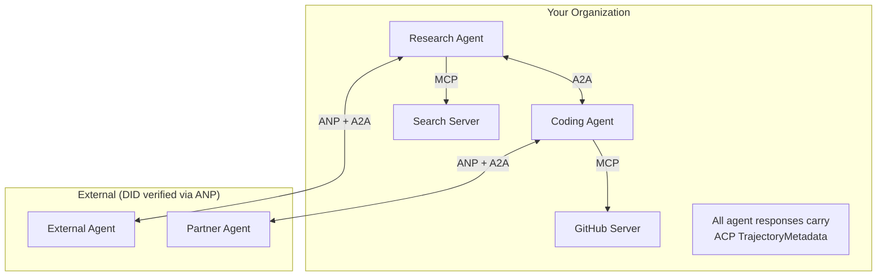

- **MCP** は各 agent を tools に接続する
- **A2A** は agents 間 (internal と external) の collaboration を扱う
- **ACP** は auditability のために responses を trajectory metadata で wrap する
- **ANP** は control していない agents に identity verification を提供する

## 実装

`code/main.ts` は 4 つの protocol patterns をまとめて実装します。実装の focus は、wire format そのものよりも、protocol が要求する shared primitives を小さく再現することです。

### Step 1: Core Message Types

すべての multi-agent system は message format から始まります。real A2A / ACP specs に対応する types を定義します。

```typescript
type MessageRole = "user" | "agent";

type MessagePart =
  | { kind: "text"; text: string }
  | { kind: "data"; data: unknown; mediaType: string }
  | { kind: "file"; name: string; url: string; mediaType: string };

type TrajectoryEntry = {
  reasoning: string;
  toolName?: string;
  toolInput?: unknown;
  toolOutput?: unknown;
  timestamp: number;
};

type AgentMessage = {
  id: string;
  role: MessageRole;
  parts: MessagePart[];
  trajectory?: TrajectoryEntry[];
  replyTo?: string;
  timestamp: number;
};
```

`MessagePart` は text、structured data、files を扱う multimodal structure です。`TrajectoryEntry` は ACP の TrajectoryMetadata に対応する reasoning chain を capture します。

### Step 2: A2A Agent Card and Registry

real A2A spec に近い discovery を作ります。registry は Agent Card を register し、skill tags、input MIME types、name で discover できるようにします。simple な name-to-capability map より豊かで、client agent は request を処理できる candidate agent を runtime に探せます。

### Step 3: A2A Task Lifecycle

`TaskManager` は `submitted`、`working`、`input-required`、`auth-required`、`completed`、`failed`、`canceled`、`rejected` を持つ task state machine を実装します。handlers は async generators で、SSE streaming model に合わせて `statusUpdate` と `artifactUpdate` events を yield します。

terminal state 後は task を immutable として扱います。handler が `completed` の後に artifact を出しても、manager は terminal state を見て処理を止めます。

### Step 4: ACP-style Audit Trail

`AuditableRunner` は agent execution を audit entry で wrap します。entry には `runId`、agent name、input、output、trajectory、status、timestamps、optional session id が入ります。agent、session、run 単位で audit log を query できます。

これにより「何が入ったか」「何が出たか」「途中でどの tools と reasoning steps が発生したか」を replay できます。regulated workloads ではここが production の核心です。

### Step 5: ANP-style Identity Verification

`IdentityRegistry` は DID documents を publish / resolve し、DID signature を verify します。demo では HTTP fetch の代わりに in-memory registry を使います。`createIdentity` は `did:wba:{domain}:agent:{agentName}` を作り、authentication、key agreement、human authorization keys を持つ DID document を生成します。

production では DID document を agent domain から fetch し、TLS domain verification と signature verification を組み合わせます。

### Step 6: Protocol Gateway

`ProtocolGateway` は 1 call で 4 つのことを行います。

1. **ANP**: caller の DID signature を verify する
2. **A2A**: target agent を discover し capabilities を確認する
3. **ACP**: execution を trajectory 付き audit trail で wrap する
4. **A2A**: lifecycle tracking 付き task を create する

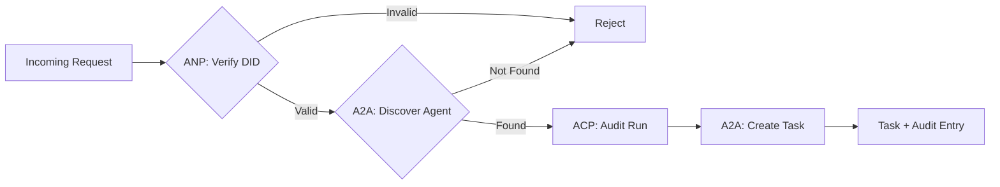

### Step 7: Wire It All Together

demo は researcher と coder を registry に登録し、researcher handler を `TaskManager` に登録し、`AuditableRunner` に trajectory-producing agent を登録します。coder と researcher の DID identities を publish し、gateway 経由で coder から researcher に task を delegate します。

実行:

```
tsx code/main.ts
```

output は次を表示します。

- A2A Agent Discovery で researcher を見つける
- ANP Identity Verification で coder DID signature を verify する
- A2A + ACP + ANP で task delegation を行う
- ACP Audit Trail と full audit log を表示する

## What Goes Wrong

protocols は happy path を解きます。production では次が壊れます。

**Schema drift.** Agent A は `application/json` output を advertise する Agent Card を publish します。しかし JSON schema が versions 間で変わります。Agent B は old format として parse し、garbage を受け取ります。fix: skills と output schemas を versioning する。A2A spec はこのために Agent Cards の `version` を support します。

**State machine violations.** agent handler が `completed` event を yield した後、さらに artifacts を yield しようとします。task は immutable です。code は update を silently drop するか throw します。fix: yield 前に terminal state を確認する。上の `TaskManager` は terminal states 後の `break` で enforce します。

**Trust resolution failures.** Agent A が Agent B の DID を verify しようとしますが、Agent B の domain が down しています。DID document を fetch できません。fail open (unverified agents を accept) しますか、fail closed (すべて reject) しますか。ANP は principle of least trust と fail closed を推奨します。

**Trajectory bloat.** ACP trajectory logging は強力ですが高価です。1 run で 200 tool calls する complex agent は巨大な audit entries を作ります。fix: configurable verbosity levels で trajectory を log する。compliance には tool names と IO を記録し、non-regulated workloads では reasoning steps を skip します。

**Discovery thundering herd.** 50 agents が startup 時に同時に `GET /agents` を query します。fix: Agent Cards を TTL 付きで cache し、discovery intervals を stagger し、polling の代わりに push-based registration を使う。

## Use It

### Real Implementations

**A2A** は最も mature です。Google の [official spec](https://github.com/google/A2A) は Linux Foundation 配下で open-source です。Python と TypeScript の SDK があります。agents に dynamic discovery と collaboration が必要ならここから始めます。

**ACP** は A2A に merge 中です。IBM の [BeeAI project](https://github.com/i-am-bee/acp) は ACP を REST-first alternative として作りましたが、trajectory metadata の concept は A2A ecosystem に吸収されています。transport に A2A を使う場合でも、ACP patterns (trajectory logging、run lifecycle) は使えます。

**ANP** は最も experimental です。[community repo](https://github.com/agent-network-protocol/AgentNetworkProtocol) には Python SDK (AgentConnect) があります。meta-protocol negotiation concept は本当に novel です。cross-organizational agent deployments では注視する価値があります。

**MCP** は Phase 13 で扱いました。agents に tools を使わせたいなら、MCP が standard です。

### Picking the Right Protocol

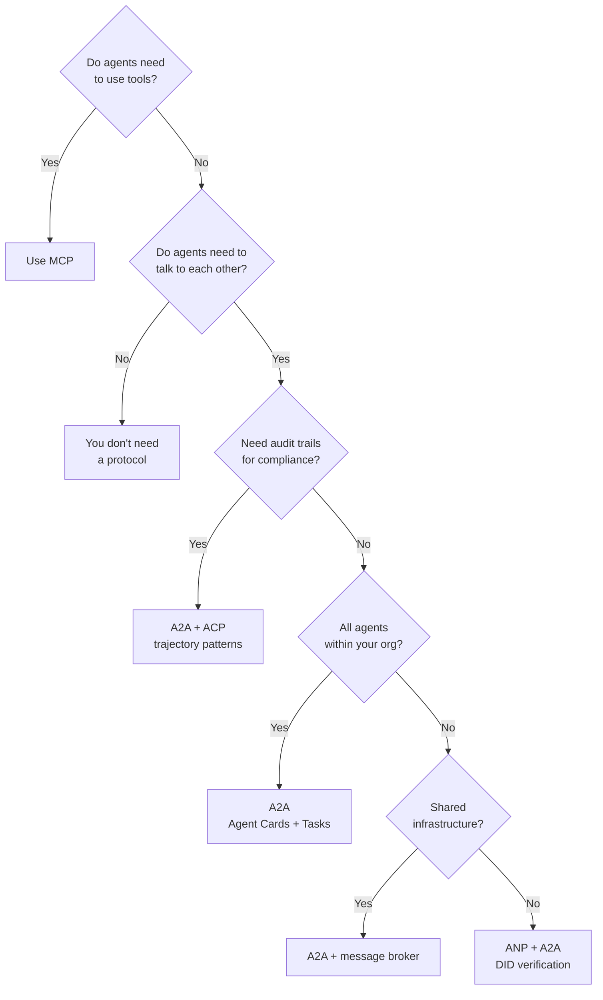

## Ship It

この lesson が生成するもの:

- `code/main.ts` -- 4 つの protocol patterns の complete implementation
- `outputs/prompt-protocol-selector.md` -- system に適した protocols を選ぶための prompt

## Exercises

1. **Multi-hop task delegation.** `TaskManager` を拡張し、agent handler が other agents に subtasks を delegate できるようにする。researcher が task を受け取り、"search" と "summarize" subtasks を 2 specialist agents に delegate し、両方の completion を待って results を artifacts に merge する。
2. **Streaming audit trail.** `AuditableRunner` を streaming mode に対応させる。full result を待つ代わりに、trajectory entries が追加されるたびに `AuditEntry` updates を real-time で yield する。audit snapshots を生成する async generator を使う。
3. **DID rotation.** `IdentityRegistry` に key rotation を追加する。agent は updated keys を持つ new DID document を publish しつつ、`previousDid` reference を維持できる。verifiers は grace period 中、current と previous key の両方の signatures を accept する。
4. **Protocol negotiation.** ANP の meta-protocol concept を実装する。2 agents が candidate formats ("I can speak JSON-RPC" vs "I prefer REST" など) を持つ `protocolNegotiation` messages を交換する。max 3 rounds 後、format に合意するか timeout する。合意 format により、どの `TaskManager` または `AuditableRunner` を使うかが決まる。
5. **Rate-limited discovery.** Agent Card lookups を configurable TTL で cache し、agent ごとの discovery queries per second を制限する `RateLimitedRegistry` wrapper を追加する。startup 時に 100 agents が互いを discover する thundering herd を simulate し、差を測る。

## Key Terms

| Term | よくある言い方 | 実際の意味 |
|------|----------------|------------|
| MCP | "The protocol for AI tools" | agents が tools を discover / use する client-server protocol。agent-to-tool であり agent-to-agent ではない。 |
| A2A | "Google's agent protocol" | Linux Foundation 配下の agent collaboration 用 peer-to-peer protocol。Agent Cards による discovery、9-state task lifecycle、SSE streaming。JSON-RPC、REST、gRPC bindings を support。 |
| ACP | "Enterprise agent messaging" | TrajectoryMetadata 付き agent runs のための IBM/BeeAI REST API。各 response が reasoning と tool calls の full chain を持つ。A2A に merge 中。 |
| ANP | "Decentralized agent identity" | `did:wba` (DID) による cryptographic identity、HPKE による E2EE、未知の agents 同士の AI-powered meta-protocol negotiation を使う community protocol。 |
| Agent Card | "An agent's business card" | `/.well-known/agent-card.json` にある JSON document。skills、supported MIME types、security schemes、protocol bindings を記述する。 |
| DID | "Decentralized ID" | agent 自身の domain で host される cryptographically verifiable identities の W3C standard。ANP は `did:wba` method を使う。 |
| TrajectoryMetadata | "The audit receipt" | reasoning steps、tool calls、その inputs/outputs を agent response に attach する ACP の mechanism。 |
| Meta-protocol | "Agents negotiating how to talk" | agents が natural language で data formats に動的に合意し、それを扱う code を generate する ANP の approach。 |
| Task | "A unit of work" | submission から completion まで work を track する A2A の stateful object。terminal 後は immutable。 |

## 参考文献

- [Google A2A specification](https://github.com/google/A2A) -- official spec and SDKs (v1.0.0, Linux Foundation)
- [IBM/BeeAI ACP specification](https://github.com/i-am-bee/acp) -- agent runs and trajectory metadata 用 OpenAPI 3.1 spec
- [Agent Network Protocol](https://github.com/agent-network-protocol/AgentNetworkProtocol) -- DID-based identity、E2EE、meta-protocol negotiation
- [Model Context Protocol docs](https://modelcontextprotocol.io/) -- Anthropic の MCP specification (Phase 13 で扱う)
- [W3C Decentralized Identifiers](https://www.w3.org/TR/did-core/) -- ANP を支える identity standard
- [RFC 9180 (HPKE)](https://www.rfc-editor.org/rfc/rfc9180) -- ANP が E2EE に使う encryption scheme
- [FIPA Agent Communication Language](http://www.fipa.org/specs/fipa00061/SC00061G.html) -- modern agent protocols の academic precursor
