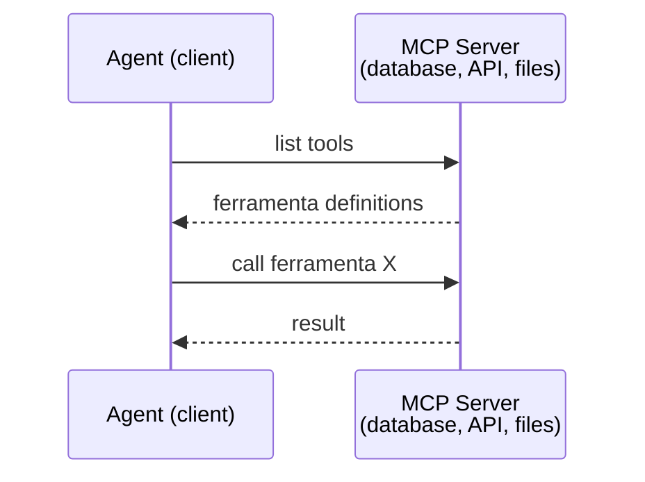
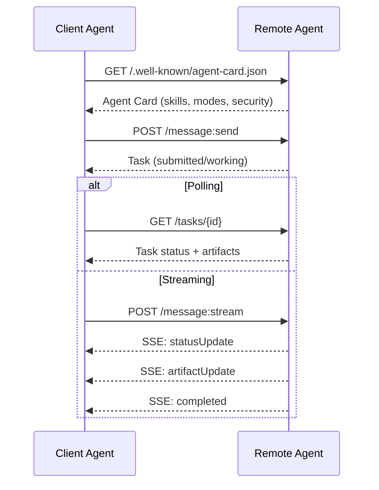
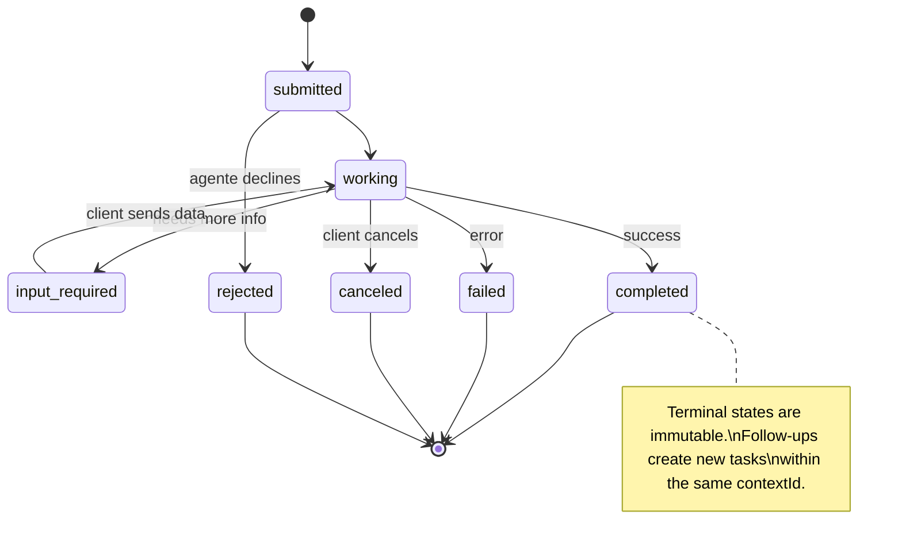
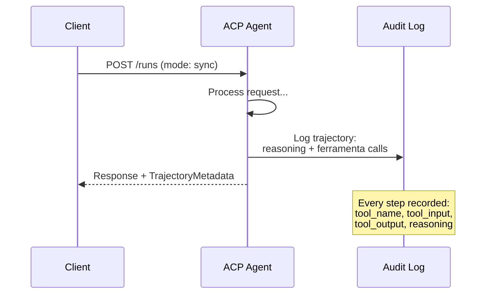
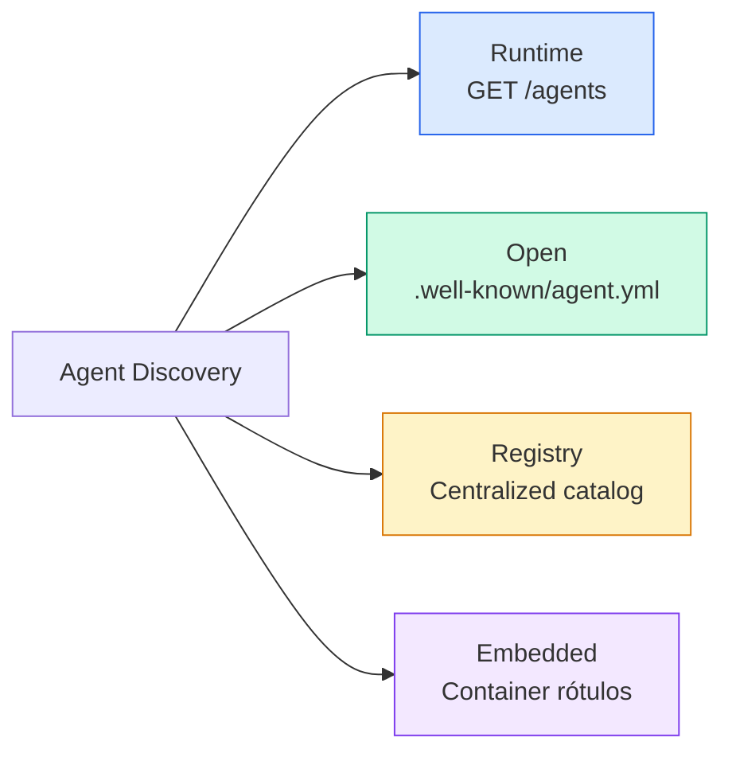
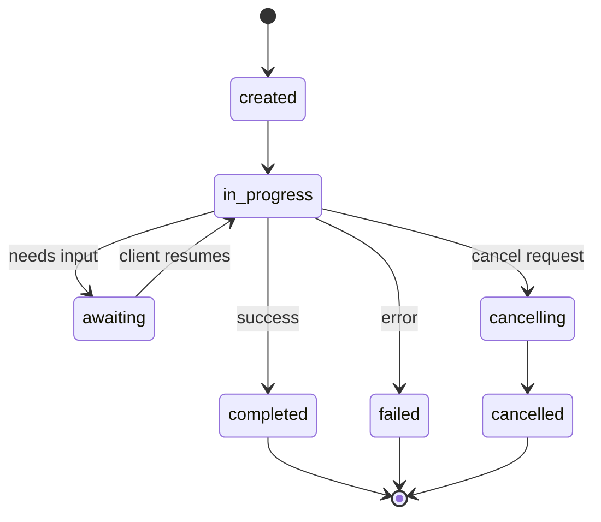
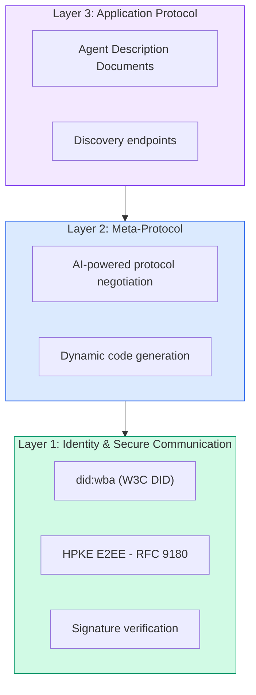

# Protocolos de Comunicação

> Agents que não falam a mesma língua não são um time. São estranhos gritando pro vazio.

**Tipo:** Construir
**Linguagens:** TypeScript
**Pré-requisitos:** Fase 14 (Agent Engineering), Lição 16.01 (Por que Multi-Agent)
**Tempo:** ~120 minutos

## Objetivos de Aprendizado

- Implementar descoberta e invocação de ferramentas via MCP pra que agentes possam usar ferramentas expostas por servidores externos
- Construir um Agent Card e endpoint de tarefa A2A que permita a um agente delegar trabalho pra outro via HTTP
- Comparar MCP (acesso a tools), A2A (agent-a-agent), ACP (auditoria corporativa) e ANP (confiança descentralizada) e explicar qual protocolo resolve qual problema
- Conectar múltiplos protocolos num sistema único onde agentes descobrem ferramentas via MCP e delegam tarefas via A2A

## O Problema

Você dividiu seu sistema em múltiplos agents. Um pesquisador, um programador, um reviewer. Cada um é ótimo no seu trabalho individual. Mas agora você precisa que eles realmente conversem.

Sua primeira tentativa é óbvia: passar strings por aí. O pesquisador retorna um blob de texto, o programador parseia como pode. Funciona até o programador interpretar mal um resumo de pesquisa, ou dois agentes entrem em deadlock esperando um pelo outro, ou você precise que agentes construídos por times diferentes colaborem. De repente "só passar strings" desmorona.

Esse é o problema de protocolo de comunicação. Sem um contrato compartilhado pra como agentes trocam informações, sistemas multi-agent são frágeis, impossíveis de auditar e impossíveis de escalar além de um punhado de agentes que você mesmo escreveu.

O ecossistema de IA respondeu com quatro protocolos, cada um resolvendo uma fatia diferente do problema:

- **MCP** pra acesso a tools
- **A2A** pra colaboração agent-a-agent
- **ACP** pra auditabilidade corporativa
- **ANP** pra identidade e confiança descentralizadas

Esta lição vai fundo. Você vai ler formatos de transmissão reais de cada especificação, construir implementações funcionais e conectar os quatro num sistema unificado.

## O Conceito

### O Panorama de Protocolos

Pense nesses quatro protocolos como camadas, cada uma abordando uma pergunta diferente:

```mermaid
block-beta
  columns 1
  block:ANP["ANP — Como agentes confiam em estranhos?\nIdentidade descentralizada (DID), E2EE, meta-protocolo"]
  end
  block:A2A["A2A — Como agentes colaboram em objetivos?\nAgent Cards, ciclo de vida de tarefas, streaming, negociação"]
  end
  block:ACP["ACP — Como agentes conversam em sistemas auditáveis?\nRuns, metadados de trajetória, continuidade de sessão"]
  end
  block:MCP["MCP — Como um agente usa uma tool?\nDescoberta de tools, execução, compartilhamento de contexto"]
  end

  style ANP fill:#f3e8ff,stroke:#7c3aed
  style A2A fill:#dbeafe,stroke:#2563eb
  style ACP fill:#fef3c7,stroke:#d97706
  style MCP fill:#d1fae5,stroke:#059669
```

Não são concorrentes. Resolvem problemas diferentes em níveis diferentes.

### MCP (Recap)

MCP foi coberto em profundidade na Fase 13. Recap rápido: MCP padroniza como um LLM se conecta a ferramentas e fontes de dados externas. É um protocolo **cliente-servidor** onde o agente (cliente) descobre e chama ferramentas expostas por um servidor.



MCP é comunicação **agent-para-tool**. Não ajuda agentes a conversarem entre si.

### A2A (Agent2Agent Protocol)

**Criado por:** Google (agora sob Linux Foundation como `lf.a2a.v1`)
**Versão da especificação:** 1.0.0
**Problema:** Como agentes autônomos colaboram, negociam e delegam tarefas entre si?

A2A é o protocolo pra **colaboração peer-to-peer entre agents**. Onde o MCP conecta um agente a tools, o A2A conecta um agente a outros agents. Cada agente publica um **Agent Card** numa URL conhecida, e outros agentes descobrem, negociam e delegam tarefas pra ele.

#### Como o A2A Funciona



#### O Agent Card Real

Isso é o que um Agent Card A2A realmente parece no mundo real. Servido em `GET /.well-known/agent-card.json`:

```json
{
  "name": "Research Agent",
  "description": "Searches documentation and summarizes findings",
  "version": "1.0.0",
  "supportedInterfaces": [
    {
      "url": "https://research-agent.example.com/a2a/v1",
      "protocolBinding": "JSONRPC",
      "protocolVersion": "1.0"
    },
    {
      "url": "https://research-agent.example.com/a2a/rest",
      "protocolBinding": "HTTP+JSON",
      "protocolVersion": "1.0"
    }
  ],
  "provider": {
    "organization": "Your Company",
    "url": "https://example.com"
  },
  "capabilities": {
    "streaming": true,
    "pushNotifications": false
  },
  "defaultInputModes": ["text/plain", "application/json"],
  "defaultOutputModes": ["text/plain", "application/json"],
  "skills": [
    {
      "id": "web-research",
      "name": "Web Research",
      "description": "Searches the web and synthesizes findings",
      "tags": ["research", "search", "summarization"],
      "examples": ["Research the latest changes in React 19"]
    },
    {
      "id": "doc-analysis",
      "name": "Documentation Analysis",
      "description": "Reads and analyzes technical documentation",
      "tags": ["docs", "analysis"],
      "inputModes": ["text/plain", "application/pdf"],
      "outputModes": ["application/json"]
    }
  ],
  "securitySchemes": {
    "bearer": {
      "httpAuthSecurityScheme": {
        "scheme": "Bearer",
        "bearerFormat": "JWT"
      }
    }
  },
  "security": [{ "bearer": [] }]
}
```

Pontos importantes pra notar:
- **Skills** são o que um agente pode fazer. Cada uma tem uma ID, tags e tipos MIME de entrada/saída suportados. É assim que um agente cliente decide se esse agente remoto consegue lidar com seu pedido.
- **supportedInterfaces** lista múltiplos bindings de protocolo. Um único agente pode falar JSON-RPC, REST e gRPC simultaneamente.
- **Security** está embutida no card. O cliente sabe que autenticação precisa antes de fazer um único pedido.

#### Ciclo de Vida de Tarefas

Tarefas são a unidade central de trabalho no A2A. Elas passam por estados definidos:



Todos os 8 estados (a eespecificaçãoificação também define `UNSPECIFIED` como sentinela, omitido aqui):

| Estado | Terminal? | Significado |
|---|---|---|
| `TASK_STATE_SUBMITTED` | Não | Reconhecido, ainda não processando |
| `TASK_STATE_WORKING` | Não | Ativamente sendo processado |
| `TASK_STATE_INPUT_REQUIRED` | Não | Agent precisa de mais info do cliente |
| `TASK_STATE_AUTH_REQUIRED` | Não | Autenticação necessária |
| `TASK_STATE_COMPLETED` | Sim | Finalizado com sucesso |
| `TASK_STATE_FAILED` | Sim | Finalizado com erro |
| `TASK_STATE_CANCELED` | Sim | Cancelado antes da conclusão |
| `TASK_STATE_REJECTED` | Sim | Agent recusou a tarefa |

Uma vez que uma tarefa atinge um estado terminal, ela é imutável. Sem mais mensagens. Follow-ups criam uma nova tarefa dentro do mesmo `contextId`.

#### Formato de Transmissão

A2A usa JSON-RPC 2.0. Isso é o que uma troca real de mensagens parece:

**Cliente envia uma tarefa:**
```json
{
  "jsonrpc": "2.0",
  "id": 1,
  "method": "SendMessage",
  "params": {
    "message": {
      "messageId": "msg-001",
      "role": "ROLE_USER",
      "parts": [{ "text": "Research React 19 compiler features" }]
    },
    "configuration": {
      "acceptedOutputModes": ["text/plain", "application/json"],
      "historyLength": 10
    }
  }
}
```

**Agent responde com uma tarefa:**
```json
{
  "jsonrpc": "2.0",
  "id": 1,
  "result": {
    "task": {
      "id": "task-abc-123",
      "contextId": "ctx-xyz-789",
      "status": {
        "state": "TASK_STATE_COMPLETED",
        "timestamp": "2026-03-27T10:30:00Z"
      },
      "artifacts": [
        {
          "artifactId": "art-001",
          "name": "research-results",
          "parts": [{
            "data": {
              "findings": [
                "React 19 compiler auto-memoizes components",
                "No more manual useMemo/useCallback needed",
                "Compiler runs at build time, not runtime"
              ]
            },
            "mediaType": "application/json"
          }]
        }
      ]
    }
  }
}
```

**Streaming via SSE:**
```text
POST /message:stream HTTP/1.1
Content-Type: application/json
A2A-Version: 1.0

data: {"task":{"id":"task-123","status":{"state":"TASK_STATE_WORKING"}}}

data: {"statusUpdate":{"taskId":"task-123","status":{"state":"TASK_STATE_WORKING","message":{"role":"ROLE_AGENT","parts":[{"text":"Searching documentation..."}]}}}}

data: {"artifactUpdate":{"taskId":"task-123","artifact":{"artifactId":"art-1","parts":[{"text":"partial findings..."}]},"append":true,"lastChunk":false}}

data: {"statusUpdate":{"taskId":"task-123","status":{"state":"TASK_STATE_COMPLETED"}}}
```

### ACP (Agent Communication Protocol)

**Criado por:** IBM / BeeAI
**Versão da especificação:** 0.2.0 (OpenAPI 3.1.1)
**Status:** Mergeando no A2A sob a Linux Foundation
**Problema:** Como agentes comunicam com total auditabilidade, continuidade de sessão e rastreamento de trajetória?

ACP é o **protocolo corporativo**. Ao contrário do que muitos resumos dizem, o ACP **não** usa JSON-LD. É uma API REST/JSON simples definida via OpenAPI. O que o torna eespecificaçãoial é o **TrajectoryMetadata**: cada resposta de agente pode carregar um log detalhado dos passos de raciocínio e chamadas de ferramentas que a produziram.



#### Descoberta de Agents no ACP

ACP define quatro métodos de descoberta:



O **AgentManifest** é mais simples que o Agent Card do A2A:

```json
{
  "name": "summarizer",
  "description": "Summarizes documents with source citations",
  "input_content_types": ["text/plain", "application/pdf"],
  "output_content_types": ["text/plain", "application/json"],
  "metadata": {
    "tags": ["summarization", "RAG"],
    "framework": "BeeAI",
    "capabilities": [
      {
        "name": "Document Summarization",
        "description": "Condenses long documents into key points"
      }
    ],
    "recommended_models": ["llama3.3:70b-instruct-fp16"],
    "license": "Apache-2.0",
    "programming_language": "Python"
  }
}
```

#### Ciclo de Vida de Runs

ACP usa "Runs" em vez de "Tasks." Um Run é uma execução de agente com três modos:

| Modo | Comportamento |
|---|---|
| `sync` | Bloqueante. Resposta contém o resultado completo. |
| `async` | Retorna 202 imediatamente. Faz polling em `GET /runs/{id}` pra status. |
| `stream` | Stream SSE. Eventos disparam enquanto o agente trabalha. |



#### TrajectoryMetadata (A Trilha de Auditoria)

Esse é o diferencial do ACP. Cada parte da mensagem pode incluir metadados mostrando exatamente o que o agente fez:

```json
{
  "role": "agent/researcher",
  "parts": [
    {
      "content_type": "text/plain",
      "content": "The weather in San Francisco is 72F and sunny.",
      "metadata": {
        "kind": "trajectory",
        "message": "I need to check the weather for this location",
        "tool_name": "weather_api",
        "tool_input": { "location": "San Francisco, CA" },
        "tool_output": { "temperature": 72, "condition": "sunny" }
      }
    }
  ]
}
```

Pra indústrias reguladas isso é ouro. Cada resposta vem com uma cadeia comprovável de raciocínio: quais ferramentas foram chamadas, quais entradas foram usadas, quais saídas foram recebidas. Sem caixa-preta.

ACP também suporta **CitationMetadata** pra atribuição de fonte:

```json
{
  "kind": "citation",
  "start_index": 0,
  "end_index": 47,
  "url": "https://weather.gov/sf",
  "title": "NWS San Francisco Forecast"
}
```

### ANP (Agent Network Protocol)

**Criado por:** Comunidade open-source (fundado por GaoWei Chang)
**Repo:** [github.com/agent-network-protocol/AgentNetworkProtocol](https://github.com/agent-network-protocol/AgentNetworkProtocol)
**Problema:** Como agentes de diferentes organizações confiam uns nos outros sem uma autoridade central?

ANP é o **protocolo de identidade descentralizada**. Constrói confiança usando W3C Decentralized Identifiers (DIDs) e criptografia de ponta a ponta. Ao contrário do A2A onde você descobre agentes por endpoints conhecidos, o ANP permite que agentes provem sua identidade criptograficamente.

ANP tem três camadas:



#### DID Documents (Estrutura Real)

ANP usa um método DID customizado chamado `did:wba` (Web-Based Agent). O DID `did:wba:example.com:user:alice` resolve pra `https://example.com/user/alice/did.json`:

```json
{
  "@context": [
    "https://www.w3.org/ns/did/v1",
    "https://w3id.org/security/suites/jws-2020/v1",
    "https://w3id.org/security/suites/secp256k1-2019/v1"
  ],
  "id": "did:wba:example.com:user:alice",
  "verificationMethod": [
    {
      "id": "did:wba:example.com:user:alice#key-1",
      "type": "EcdsaSecp256k1VerificationKey2019",
      "controller": "did:wba:example.com:user:alice",
      "publicKeyJwk": {
        "crv": "secp256k1",
        "x": "NtngWpJUr-rlNNbs0u-Aa8e16OwSJu6UiFf0Rdo1oJ4",
        "y": "qN1jKupJlFsPFc1UkWinqljv4YE0mq_Ickwnjgasvmo",
        "kty": "EC"
      }
    },
    {
      "id": "did:wba:example.com:user:alice#key-x25519-1",
      "type": "X25519KeyAgreementKey2019",
      "controller": "did:wba:example.com:user:alice",
      "publicKeyMultibase": "z9hFgmPVfmBZwRvFEyniQDBkz9LmV7gDEqytWyGZLmDXE"
    }
  ],
  "authentication": [
    "did:wba:example.com:user:alice#key-1"
  ],
  "keyAgreement": [
    "did:wba:example.com:user:alice#key-x25519-1"
  ],
  "humanAuthorization": [
    "did:wba:example.com:user:alice#key-1"
  ],
  "service": [
    {
      "id": "did:wba:example.com:user:alice#agent-description",
      "type": "AgentDescription",
      "serviceEndpoint": "https://example.com/agents/alice/ad.json"
    }
  ]
}
```

Pontos importantes pra notar:
- **Separação de chaves** é forçada. Chaves de assinatura (secp256k1) são separadas de chaves de criptografia (X25519).
- **`humanAuthorization`** é único do ANP. Essas chaves exigem aprovação humana explícita (biometria, senha, HSM) antes de uso. Operações de alto risco como transferências de fundos passam por esse caminho.
- As chaves **`keyAgreement`** são usadas pra criptografia de ponta a ponta HPKE (RFC 9180).
- A seção **service** vincula ao documento de Descrição do Agent.

