# İletişim Protokolleri

> Aynı dili konuşamayan Agent'lar takım değildir. Onlar boşluğa bağıran yabancılar.

**Tür:** Yapım
**Diller:** TypeScript
**Önkoşullar:** Aşama 14 (Agent Mühendislik), Ders 16.01 (Neden Çoklu-Agent)
**Süre:** ~120 dakika

## Öğrenme Hedefleri

- agent'ların harici sunucular tarafından kullanıma sunulan araçları kullanabilmesi için MCP aracı keşfi ve çağrısını uygulayın
- Bir agent'ın işi HTTP üzerinden diğerine devretmesine olanak tanıyan bir A2A agent kartı ve görev uç noktası oluşturun
- MCP (araç erişimi), A2A (agent-to-agent), ACP (kurumsal denetim) ve ANP'yi (merkezi olmayan güven) karşılaştırın ve hangi protokolün hangi sorunu çözdüğünü açıklayın
- agent'larin MCP yoluyla araçları keşfettiği ve görevleri A2A aracılığıyla devrettiği tek bir sistemde birden fazla protokolü birbirine bağlayın

## Sorun

Sisteminizi birden fazla agent'a böldünüz. Bir araştırmacı, bir kodlayıcı, bir eleştirmen. Bireysel işlerinde harikalar. Ama artık birbirleriyle gerçekten konuşmalarına ihtiyacınız var.

İlk girişiminiz açık: ipleri dolaştırın. Araştırmacı bir metin bloğu döndürür, kodlayıcı ise onu elinden geldiğince ayrıştırır. Kodlayıcı bir araştırma özetini yanlış yorumlayana veya iki agent birbirini bekleyen çıkmaza girene veya işbirliği yapmak için farklı ekipler tarafından oluşturulan agent'lare ihtiyaç duyana kadar çalışır. Aniden "sadece dizeleri aktarın" dağılıyor.

Bu iletişim protokolü sorunudur. agent'ların nasıl bilgi alışverişinde bulunduklarına ilişkin ortak bir sözleşme olmadan, çokluagent sistemleri kırılgandır, denetlenemezdir ve kişisel olarak yazdığınız bir avuç agent'ın ötesine ölçeklendirmek imkansızdır.

Yapay zeka ekosistemi, her biri sorunun farklı bir bölümünü çözen dört protokolle yanıt verdi:

- Araç erişimi için **MCP**
- agent-to-agent işbirliği için **A2A**
- Kurumsal denetlenebilirlik için **ACP**
- Merkezi olmayan kimlik ve güven için **ANP**

Bu ders derinlere gidiyor. Her spesifikasyondan gerçek kablo formatlarını okuyacak, çalışan uygulamalar oluşturacak ve dördünü de birleşik bir sisteme bağlayacaksınız.

## Konsept

### Protokol Ortamı

Bu dört protokolü, her biri farklı bir soruyu ele alan katmanlar olarak düşünün:

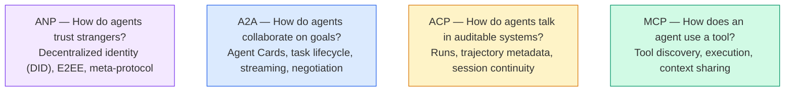

Onlar rakip değiller. Farklı seviyelerdeki farklı sorunları çözerler.

### MCP (Özet)

MCP, Aşama 13'te derinlemesine ele alınmaktadır. Kısa özet: MCP, bir Yüksek Lisans'ın harici araçlara ve veri kaynaklarına nasıl bağlandığını standartlaştırır. Bu, agent (istemci)'nin bir sunucu tarafından kullanıma sunulan araçları keşfedip çağırdığı bir **istemci-sunucu** protokolüdür.

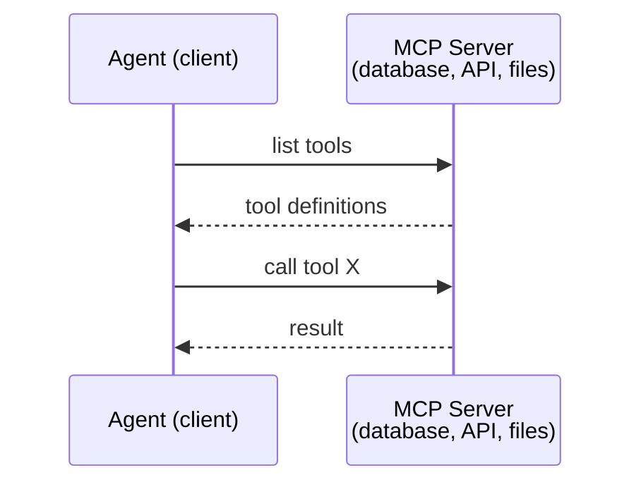

MCP, **agent-araç** iletişimidir. agent'larin birbirleriyle konuşmasına yardımcı olmuyor.

### A2A (Agent2Agent Protokol)

**Oluşturan:** Google (şu anda `lf.a2a.v1` adıyla Linux Foundation altında)
**Özel sürüm:** 1.0.0
**Sorun:** Otonom agent'lar nasıl işbirliği yapıyor, pazarlık yapıyor ve görevleri birbirlerine nasıl devrediyor?

A2A **eşler arası agent işbirliğinin** protokolüdür. MCP'nin bir agent'ı araçlara bağladığı yerde, A2A bir agent'ı diğer agent'lara bağlar. Her agent, iyi bilinen bir URL'de bir **Agent Kartı** yayınlar ve diğer agent'lar bunu keşfeder, müzakere eder ve görevleri ona devreder.

#### A2A Nasıl Çalışır?

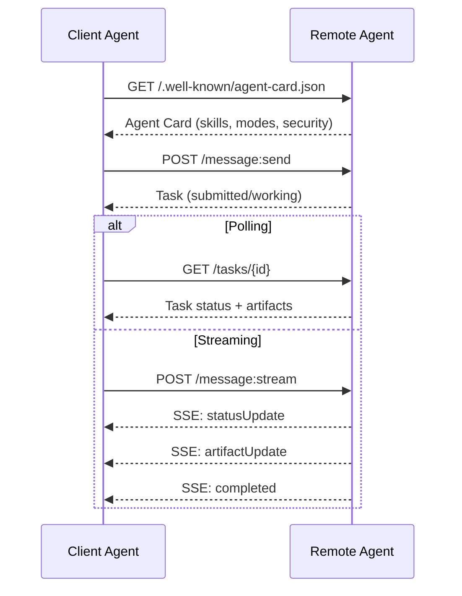

#### Gerçek Agent Kartı

Bir A2A Agent Kartının vahşi doğada gerçekte nasıl göründüğü budur. `GET /.well-known/agent-card.json`'da servis edildi:

```json
{
  "name": "Research Agent",
  "description": "Searches documentation and summarizes findings",
  "version": "1.0.0",
  "supportedInterfaces": [
    {
      "url": "https://research-agent.example.com/a2a/v1",
      "protocolBinding": "JSONRPC",
      "protocolVersion": "1.0"
    },
    {
      "url": "https://research-agent.example.com/a2a/rest",
      "protocolBinding": "HTTP+JSON",
      "protocolVersion": "1.0"
    }
  ],
  "provider": {
    "organization": "Your Company",
    "url": "https://example.com"
  },
  "capabilities": {
    "streaming": true,
    "pushNotifications": false
  },
  "defaultInputModes": ["text/plain", "application/json"],
  "defaultOutputModes": ["text/plain", "application/json"],
  "skills": [
    {
      "id": "web-research",
      "name": "Web Research",
      "description": "Searches the web and synthesizes findings",
      "tags": ["research", "search", "summarization"],
      "examples": ["Research the latest changes in React 19"]
    },
    {
      "id": "doc-analysis",
      "name": "Documentation Analysis",
      "description": "Reads and analyzes technical documentation",
      "tags": ["docs", "analysis"],
      "inputModes": ["text/plain", "application/pdf"],
      "outputModes": ["application/json"]
    }
  ],
  "securitySchemes": {
    "bearer": {
      "httpAuthSecurityScheme": {
        "scheme": "Bearer",
        "bearerFormat": "JWT"
      }
    }
  },
  "security": [{ "bearer": [] }]
}
```

Dikkat edilmesi gereken önemli noktalar:
- **Beceriler** bir agent'ın yapabileceği şeylerdir. Her birinin bir kimliği, etiketleri ve desteklenen giriş/çıkış MIME türleri vardır. Bir agent istemcisi, bu uzak agent'ın isteğini yerine getirip getiremeyeceğine bu şekilde karar verir.
- **supportedInterfaces** birden fazla protokol bağlamasını listeler. Tek bir agent aynı anda JSON-RPC, REST ve gRPC'yi konuşabilir.
- **Güvenlik** kartın içine yerleştirilmiştir. Müşteri, tek bir istekte bulunmadan önce hangi yetkilendirmeye ihtiyacı olduğunu bilir.

#### Görev Yaşam Döngüsü

Görevler A2A'daki temel çalışma birimidir. Tanımlanmış durumlardan geçerler:

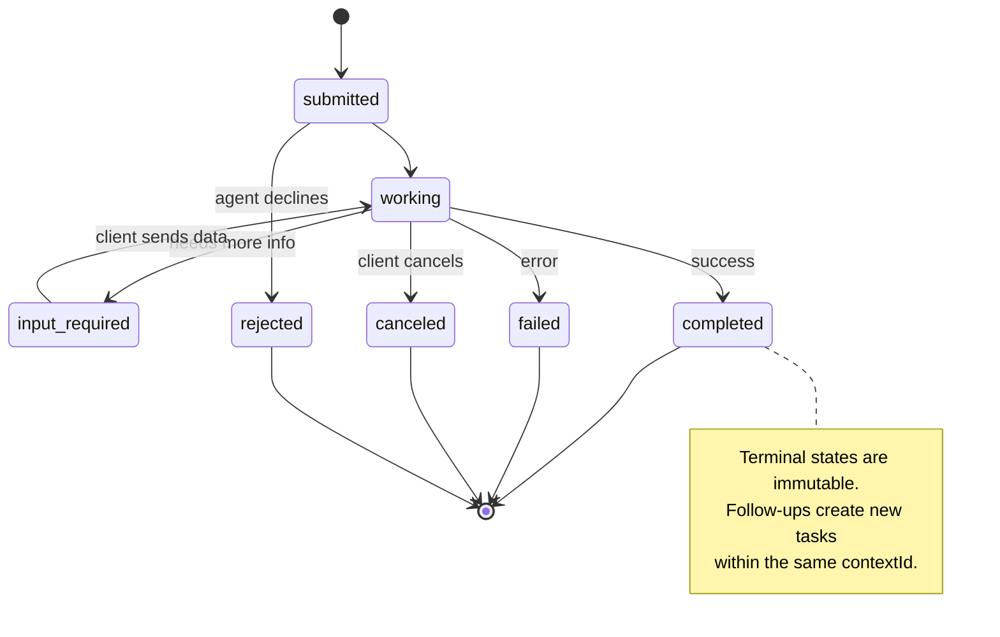

8 durumun tamamı (özellik aynı zamanda `UNSPECIFIED` 'yi bir nöbetçi olarak tanımlar, burada belirtilmemiştir):

| Devlet | Terminal? | Anlamı |
|---|---|---|
| `TASK_STATE_SUBMITTED` | Hayır | Onaylandı, henüz işlenmiyor |
| `TASK_STATE_WORKING` | Hayır | Aktif olarak işleniyor |
| `TASK_STATE_INPUT_REQUIRED` | Hayır | Agent'nin müşteriden daha fazla bilgiye ihtiyacı var |
| `TASK_STATE_AUTH_REQUIRED` | Hayır | Kimlik doğrulama gerekli |
| `TASK_STATE_COMPLETED` | Evet | Başarıyla tamamlandı |
| `TASK_STATE_FAILED` | Evet | Hatayla tamamlandı |
| `TASK_STATE_CANCELED` | Evet | Tamamlanmadan önce iptal edildi |
| `TASK_STATE_REJECTED` | Evet | Agent görevi reddetti |

Bir görev terminal durumuna ulaştığında değiştirilemez. Başka mesaj yok. Takipler aynı `contextId` içinde yeni bir görev oluşturur.

#### Tel Formatı

A2A, JSON-RPC 2.0'ı kullanır. Gerçek bir mesaj alışverişi şöyle görünür:

**İstemci bir görev gönderir:**
```json
{
  "jsonrpc": "2.0",
  "id": 1,
  "method": "SendMessage",
  "params": {
    "message": {
      "messageId": "msg-001",
      "role": "ROLE_USER",
      "parts": [{ "text": "Research React 19 compiler features" }]
    },
    "configuration": {
      "acceptedOutputModes": ["text/plain", "application/json"],
      "historyLength": 10
    }
  }
}
```

**Agent bir görevle yanıt verir:**
```json
{
  "jsonrpc": "2.0",
  "id": 1,
  "result": {
    "task": {
      "id": "task-abc-123",
      "contextId": "ctx-xyz-789",
      "status": {
        "state": "TASK_STATE_COMPLETED",
        "timestamp": "2026-03-27T10:30:00Z"
      },
      "artifacts": [
        {
          "artifactId": "art-001",
          "name": "research-results",
          "parts": [{
            "data": {
              "findings": [
                "React 19 compiler auto-memoizes components",
                "No more manual useMemo/useCallback needed",
                "Compiler runs at build time, not runtime"
              ]
            },
            "mediaType": "application/json"
          }]
        }
      ]
    }
  }
}
```

**SSE aracılığıyla akış:**
```text
POST /message:stream HTTP/1.1
Content-Type: application/json
A2A-Version: 1.0

data: {"task":{"id":"task-123","status":{"state":"TASK_STATE_WORKING"}}}

data: {"statusUpdate":{"taskId":"task-123","status":{"state":"TASK_STATE_WORKING","message":{"role":"ROLE_AGENT","parts":[{"text":"Searching documentation..."}]}}}}

data: {"artifactUpdate":{"taskId":"task-123","artifact":{"artifactId":"art-1","parts":[{"text":"partial findings..."}]},"append":true,"lastChunk":false}}

data: {"statusUpdate":{"taskId":"task-123","status":{"state":"TASK_STATE_COMPLETED"}}}
```

### ACP (Agent İletişim Protokolü)

**Yaratan:** IBM / BeeAI
**Özel sürüm:** 0.2.0 (OpenAPI 3.1.1)
**Durum:** Linux Vakfı kapsamında A2A ile birleşme
**Sorun:** agent'lar tam denetlenebilirlik, oturum sürekliliği ve yörünge takibi ile nasıl iletişim kuruyor?

ACP **kurumsal protokoldür**. Pek çok özette iddia edilenin aksine ACP, JSON-LD'yi **kullanmaz**. OpenAPI aracılığıyla tanımlanan basit bir REST/JSON API'sidir. Onu özel kılan şey **TrajectoryMetadata**'dır: her agent yanıtı, onu üreten akıl yürütme adımlarının ve araç çağrılarının ayrıntılı bir günlüğünü taşıyabilir.

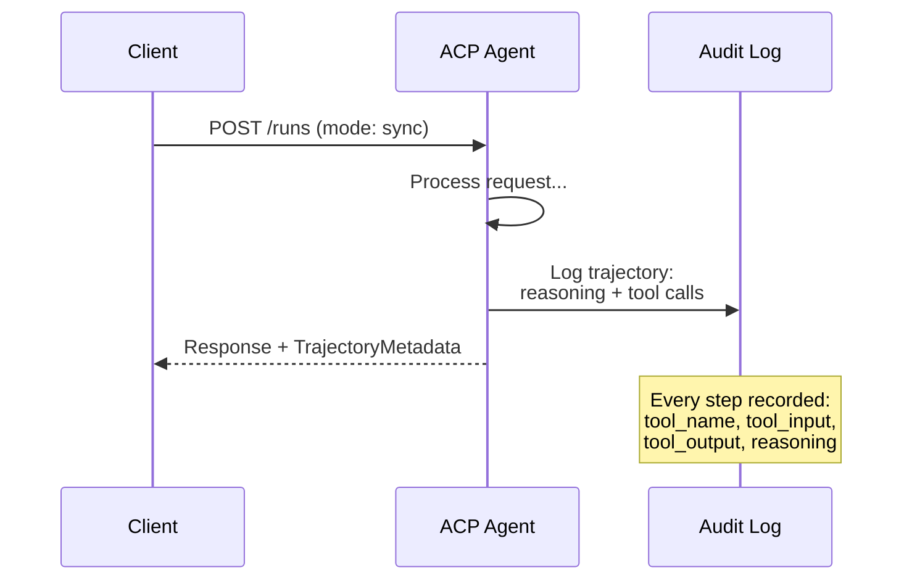

#### Agent ACP'de Keşif

ACP dört keşif yöntemini tanımlar:

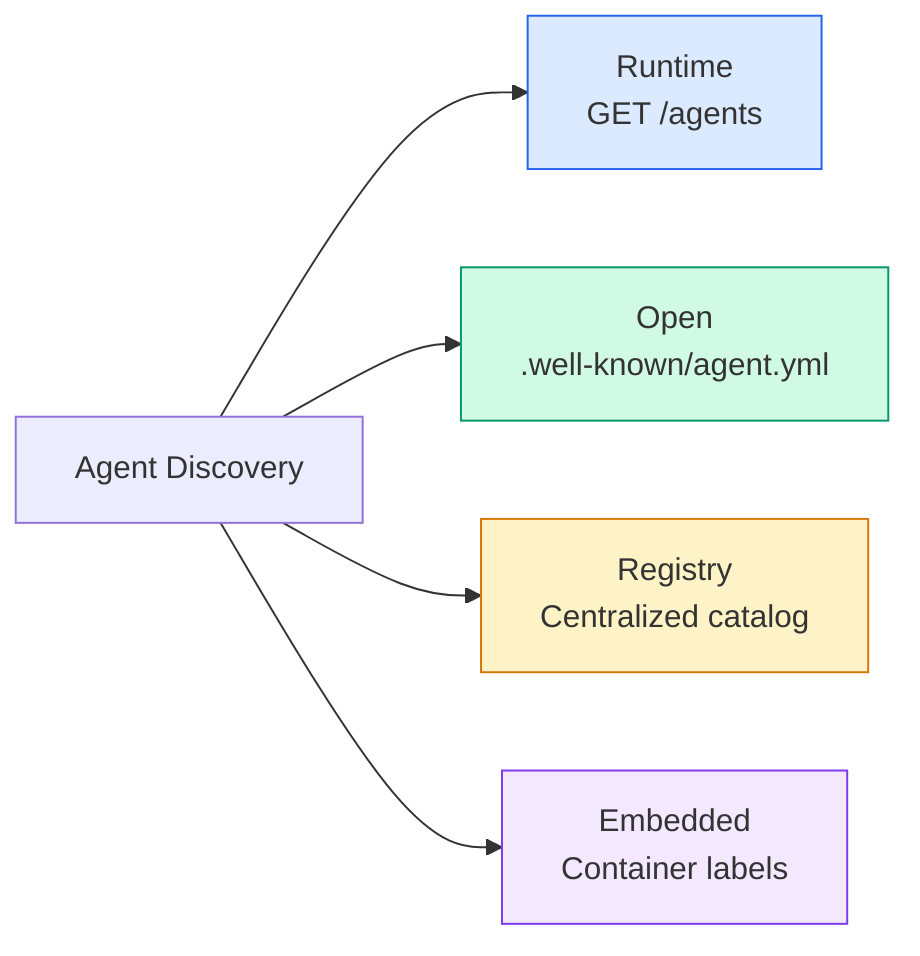

**AgentManifesto**, A2A'nın Agent Kartından daha basittir:

```json
{
  "name": "summarizer",
  "description": "Summarizes documents with source citations",
  "input_content_types": ["text/plain", "application/pdf"],
  "output_content_types": ["text/plain", "application/json"],
  "metadata": {
    "tags": ["summarization", "RAG"],
    "framework": "BeeAI",
    "capabilities": [
      {
        "name": "Document Summarization",
        "description": "Condenses long documents into key points"
      }
    ],
    "recommended_models": ["llama3.3:70b-instruct-fp16"],
    "license": "Apache-2.0",
    "programming_language": "Python"
  }
}
```

#### Yaşam Döngüsünü Çalıştır

ACP, "Görevler" yerine "Çalıştırmalar"ı kullanır. Bir Çalıştırma, üç modlu bir agent yürütmesidir:

| Modu | Davranış |
|---|---|
| `sync` | Engelleme. Yanıt tam sonucu içerir. |
| `async` | Hemen 202'yi döndürür. Durum için `GET /runs/{id}` 'a anket yapın. |
| `stream` | SSE akışı. agent çalışırken olaylar tetiklenir. |

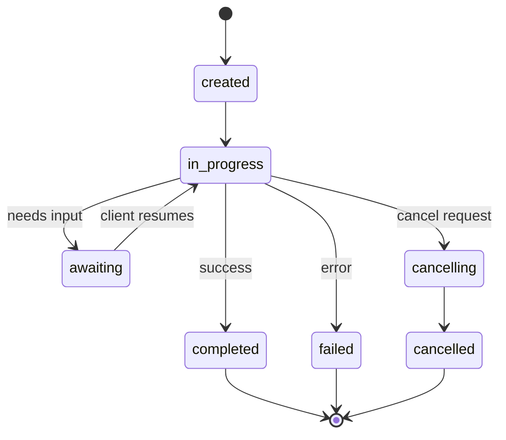

#### Yörünge Meta Verileri (Denetim İzi)

Bu, ACP'nin temel ayırt edici özelliğidir. Her mesaj bölümü, agent'ın tam olarak ne yaptığını gösteren meta verileri içerebilir:

```json
{
  "role": "agent/researcher",
  "parts": [
    {
      "content_type": "text/plain",
      "content": "The weather in San Francisco is 72F and sunny.",
      "metadata": {
        "kind": "trajectory",
        "message": "I need to check the weather for this location",
        "tool_name": "weather_api",
        "tool_input": { "location": "San Francisco, CA" },
        "tool_output": { "temperature": 72, "condition": "sunny" }
      }
    }
  ]
}
```

Düzenlemeye tabi endüstriler için bu altındır. Her yanıt, kanıtlanabilir bir mantık zinciriyle birlikte gelir: Hangi araçlar çağrıldı, hangi girdiler kullanıldı, hangi çıktılar alındı. Kara kutu yok.

ACP ayrıca kaynak ilişkilendirme için **CitationMetadata**'yı da destekler:

```json
{
  "kind": "citation",
  "start_index": 0,
  "end_index": 47,
  "url": "https://weather.gov/sf",
  "title": "NWS San Francisco Forecast"
}
```

### ANP (Agent Ağ Protokolü)

**Yaratan:** Açık kaynak topluluğu (GaoWei Chang tarafından kuruldu)
**Repo:** [github.com/agent-network-protocol/AgentNetworkProtocol](https://github.com/agent-network-protocol/AgentNetworkProtocol)
**Sorun:** Farklı kuruluşlardan agent'lar merkezi bir otorite olmadan birbirlerine nasıl güveniyorlar?

ANP **merkezi olmayan kimlik protokolüdür**. W3C Merkezi Olmayan Tanımlayıcıları (DID'ler) ve uçtan uca şifrelemeyi kullanarak güven oluşturur. agent'lari bilinen uç noktalar aracılığıyla keşfettiğiniz A2A'dan farklı olarak ANP, agent'larin kimliklerini kriptografik olarak kanıtlamasına olanak tanır.

ANP'nin üç katmanı vardır:

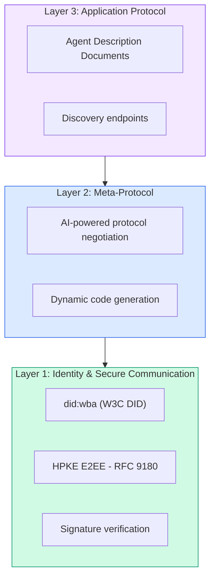

#### DID Belgeleri (Gerçek Yapı)

ANP, `did:wba` (Web Tabanlı Agent) adı verilen özel bir DID yöntemi kullanır. DID `did:wba:example.com:user:alice` , `https://example.com/user/alice/did.json` olarak çözümlenir:

```json
{
  "@context": [
    "https://www.w3.org/ns/did/v1",
    "https://w3id.org/security/suites/jws-2020/v1",
    "https://w3id.org/security/suites/secp256k1-2019/v1"
  ],
  "id": "did:wba:example.com:user:alice",
  "verificationMethod": [
    {
      "id": "did:wba:example.com:user:alice#key-1",
      "type": "EcdsaSecp256k1VerificationKey2019",
      "controller": "did:wba:example.com:user:alice",
      "publicKeyJwk": {
        "crv": "secp256k1",
        "x": "NtngWpJUr-rlNNbs0u-Aa8e16OwSJu6UiFf0Rdo1oJ4",
        "y": "qN1jKupJlFsPFc1UkWinqljv4YE0mq_Ickwnjgasvmo",
        "kty": "EC"
      }
    },
    {
      "id": "did:wba:example.com:user:alice#key-x25519-1",
      "type": "X25519KeyAgreementKey2019",
      "controller": "did:wba:example.com:user:alice",
      "publicKeyMultibase": "z9hFgmPVfmBZwRvFEyniQDBkz9LmV7gDEqytWyGZLmDXE"
    }
  ],
  "authentication": [
    "did:wba:example.com:user:alice#key-1"
  ],
  "keyAgreement": [
    "did:wba:example.com:user:alice#key-x25519-1"
  ],
  "humanAuthorization": [
    "did:wba:example.com:user:alice#key-1"
  ],
  "service": [
    {
      "id": "did:wba:example.com:user:alice#agent-description",
      "type": "AgentDescription",
      "serviceEndpoint": "https://example.com/agents/alice/ad.json"
    }
  ]
}
```

Dikkat edilmesi gereken önemli noktalar:
- **Anahtar ayırma** zorunludur. İmzalama anahtarları (secp256k1) şifreleme anahtarlarından (X25519) ayrıdır.
- **`humanAuthorization`** ANP'ye özeldir. Bu anahtarlar kullanılmadan önce açık bir şekilde insan onayı (biyometrik, şifre, HSM) gerektirir. Fon transferi gibi yüksek riskli operasyonlar bu yoldan geçiyor.
- **`keyAgreement`** anahtarları HPKE uçtan uca şifreleme (RFC 9180) için kullanılır.
- **hizmet** bölümü Agent Açıklama belgesine bağlantı verir.

#### ANP'de Güven Nasıl Çalışır?

ANP, güven ağı veya onay grafiği **kullanmaz**. Güven iki taraflıdır ve etkileşim başına doğrulanır:

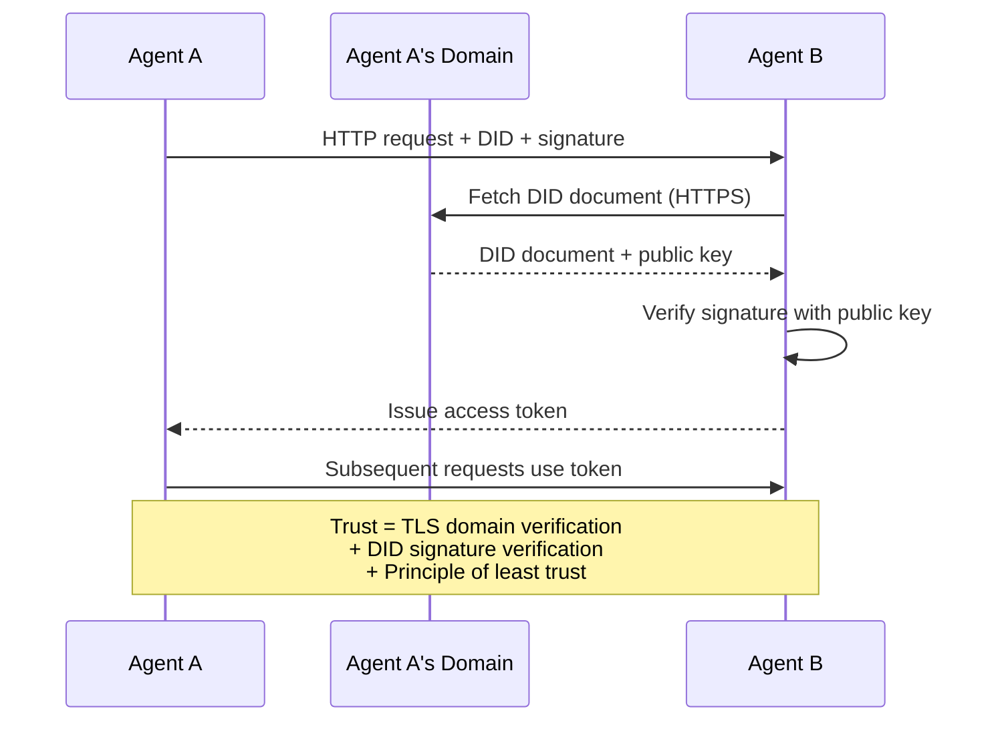

Güven üç kaynaktan gelir:
1. **Alan düzeyinde TLS**, DID belge ana bilgisayarını doğrular
2. **DID şifreleme imzaları** agent'ın kimliğini doğruladı
3. **En az güven ilkesi** yalnızca minimum izinleri verir

Dedikoduya dayalı güven yayılımı veya PageRank puanlaması yoktur. Her agent'ı doğrudan DID'si aracılığıyla doğrularsınız.

#### Meta-Protokol Müzakereleri

Bu ANP'nin en yeni özelliğidir. Farklı ekosistemlerden iki agent buluştuğunda önceden kararlaştırılmış veri formatlarına ihtiyaçları yoktur. Doğal dilde müzakere ederler:

```json
{
  "action": "protocolNegotiation",
  "sequenceId": 0,
  "candidateProtocols": "I can communicate using:\n1. JSON-RPC with hotel booking schema\n2. REST with OpenAPI 3.1 spec\n3. Natural language over HTTP",
  "modificationSummary": "Initial proposal",
  "status": "negotiating"
}
```

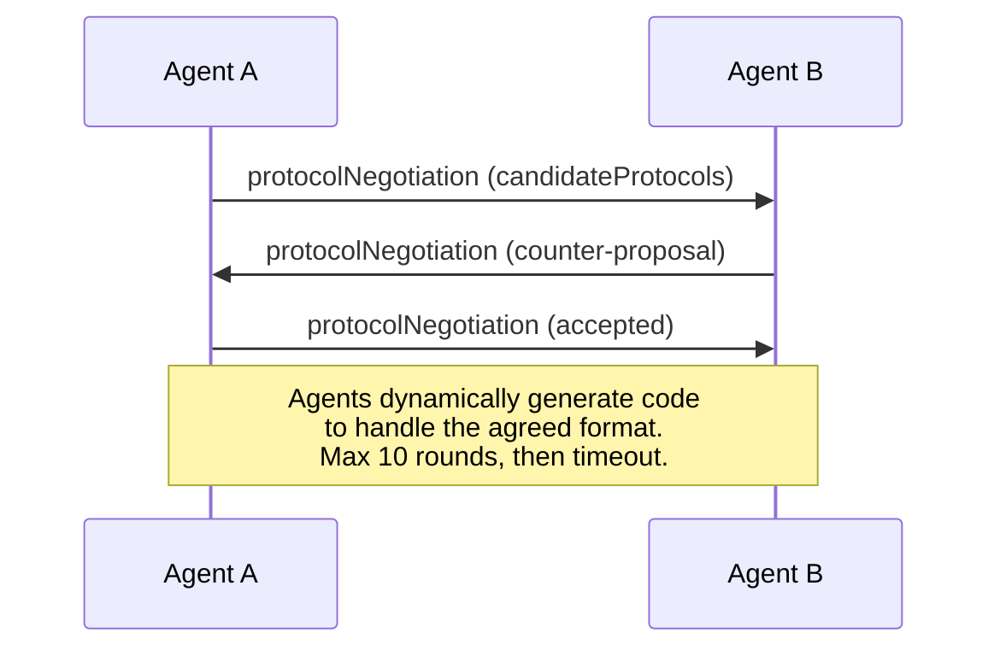

agent'lar bir formatta anlaşıncaya kadar ileri geri giderler (en fazla 10 tur), ardından onu işlemek için dinamik olarak kod üretirler. Durum değerleri: `negotiating`, `rejected`, `accepted`, `timeout`.

Bu, birbirini daha önce hiç görmemiş iki agent'ın, herhangi birinin önceden paylaşılan bir şema tanımlamasına gerek kalmadan nasıl iletişim kuracağını çözebileceği anlamına gelir.

### Karşılaştırma (Düzeltildi)

| | MCP | A2A | AKP | ANAP |
|---|---|---|---|---|
| **Yaratan** | Antropik | Google / Linux Vakfı | IBM / BeeAI | Topluluk |
| **Özellik formatı** | JSON-RPC | JSON-RPC / REST / gRPC | OpenAPI 3.1 (REST) ​​| JSON-RPC |
| **Birincil kullanım** | Agent'den Araç'a | Agent - Agent | Agent - Agent | Agent - Agent |
| **Keşif** | Araç listesi | `/.well-known/agent-card.json` | `GET /agents`, `/.well-known/agent.yml` | `/.well-known/agent-descriptions`, DID hizmeti uç noktaları |
| **Kimlik** | Örtülü (yerel) | Güvenlik şemaları (OAuth, mTLS) | Sunucu düzeyinde | E2EE ile W3C DID (`did:wba`) |
| **Denetim takibi** | Yok | Temel (görev geçmişi) | TrajectoryMetadata (araç çağrıları, akıl yürütme) | Resmi olarak belirtilmemiş |
| **Durum makinesi** | Yok | 9 görev durumu | 7 çalışma durumu | Yok |
| **Akış** | Yok | SSE | SSE | Taşımadan bağımsız |
| **Benzersiz özellik** | Araç şemaları | Agent Kartlar + Beceriler | Yörünge denetim izi | Meta-protokol anlaşması |
| **Şunlar için en iyisi** | Araçlar ve veriler | Dinamik işbirliği | Düzenlemeye tabi endüstriler | Kuruluşlar arası güven |
| **Durum** | Kararlı | Kararlı (v1.0) | A2A ile Birleşme | Aktif gelişim |

### Birlikte Nasıl Çalışıyorlar

Bu protokoller birbirini dışlayan değildir. Gerçekçi bir kurumsal sistem birden fazlasını kullanır:

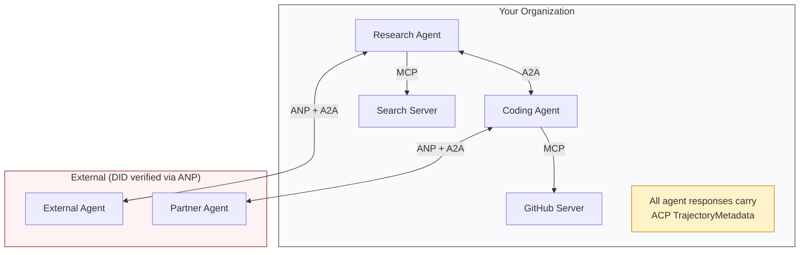

- **MCP** her agent'ı kendi araçlarına bağlar
- **A2A** agent'lar (dahili ve harici) arasındaki işbirliğini yönetir
- **ACP** denetlenebilirlik için yanıtları yörünge meta verilerine sarar
- **ANP**, kontrol etmediğiniz agent'lar için kimlik doğrulaması sağlar

## Build It — Kendin Geliştir

### Adım 1: Temel Mesaj Türleri

Her multi-agent sistemi bir mesaj formatıyla başlar. Gerçek protokollerin kullandıklarıyla eşleşen türleri tanımlarız:

```typescript
import crypto from "node:crypto";

type MessageRole = "user" | "agent";

type MessagePart =
  | { kind: "text"; text: string }
  | { kind: "data"; data: unknown; mediaType: string }
  | { kind: "file"; name: string; url: string; mediaType: string };

type TrajectoryEntry = {
  reasoning: string;
  toolName?: string;
  toolInput?: unknown;
  toolOutput?: unknown;
  timestamp: number;
};

type AgentMessage = {
  id: string;
  role: MessageRole;
  parts: MessagePart[];
  trajectory?: TrajectoryEntry[];
  replyTo?: string;
  timestamp: number;
};

function createMessage(
  role: MessageRole,
  parts: MessagePart[],
  replyTo?: string
): AgentMessage {
  return {
    id: crypto.randomUUID(),
    role,
    parts,
    replyTo,
    timestamp: Date.now(),
  };
}

function textMessage(role: MessageRole, text: string): AgentMessage {
  return createMessage(role, [{ kind: "text", text }]);
}
```

Uyarı: `MessagePart` tıpkı gerçek A2A ve ACP spesifikasyonları gibi çok modludur (metin, yapılandırılmış veriler, dosyalar). `TrajectoryEntry` , ACP'nin Yörünge Meta Verileri ile eşleşen mantık zincirini yakalar.

### Adım 2: A2A Agent Kartı ve Kayıt Defteri

Gerçek A2A spesifikasyonuyla eşleşen agent keşfini oluşturun:

```typescript
type Skill = {
  id: string;
  name: string;
  description: string;
  tags: string[];
  inputModes: string[];
  outputModes: string[];
};

type AgentCard = {
  name: string;
  description: string;
  version: string;
  url: string;
  capabilities: {
    streaming: boolean;
    pushNotifications: boolean;
  };
  defaultInputModes: string[];
  defaultOutputModes: string[];
  skills: Skill[];
};

class AgentRegistry {
  private cards: Map<string, AgentCard> = new Map();

  register(card: AgentCard) {
    this.cards.set(card.name, card);
  }

  discoverBySkillTag(tag: string): AgentCard[] {
    return [...this.cards.values()].filter((card) =>
      card.skills.some((skill) => skill.tags.includes(tag))
    );
  }

  discoverByInputMode(mimeType: string): AgentCard[] {
    return [...this.cards.values()].filter(
      (card) =>
        card.defaultInputModes.includes(mimeType) ||
        card.skills.some((skill) => skill.inputModes.includes(mimeType))
    );
  }

  resolve(name: string): AgentCard | undefined {
    return this.cards.get(name);
  }

  listAll(): AgentCard[] {
    return [...this.cards.values()];
  }
}
```

Bu, basit bir isim-yetenek haritasından önemli ölçüde daha zengindir. Tıpkı gerçek A2A spesifikasyonunun desteklediği gibi agent'ları beceri etiketlerine, giriş MIME türlerine veya ada göre keşfedebilirsiniz.

### Adım 3: A2A Görev Yaşam Döngüsü

Tam görev durumu makinesini oluşturun:

```typescript
type TaskState =
  | "submitted"
  | "working"
  | "input-required"
  | "auth-required"
  | "completed"
  | "failed"
  | "canceled"
  | "rejected";

const TERMINAL_STATES: TaskState[] = [
  "completed",
  "failed",
  "canceled",
  "rejected",
];

type TaskStatus = {
  state: TaskState;
  message?: AgentMessage;
  timestamp: number;
};

type Artifact = {
  id: string;
  name: string;
  parts: MessagePart[];
};

type Task = {
  id: string;
  contextId: string;
  status: TaskStatus;
  artifacts: Artifact[];
  history: AgentMessage[];
};

type TaskEvent =
  | { kind: "statusUpdate"; taskId: string; status: TaskStatus }
  | {
      kind: "artifactUpdate";
      taskId: string;
      artifact: Artifact;
      append: boolean;
      lastChunk: boolean;
    };

type TaskHandler = (
  task: Task,
  message: AgentMessage
) => AsyncGenerator<TaskEvent>;

class TaskManager {
  private tasks: Map<string, Task> = new Map();
  private handlers: Map<string, TaskHandler> = new Map();
  private listeners: Map<string, ((event: TaskEvent) => void)[]> = new Map();

  registerHandler(agentName: string, handler: TaskHandler) {
    this.handlers.set(agentName, handler);
  }

  subscribe(taskId: string, listener: (event: TaskEvent) => void) {
    const existing = this.listeners.get(taskId) ?? [];
    existing.push(listener);
    this.listeners.set(taskId, existing);
  }

  async sendMessage(
    agentName: string,
    message: AgentMessage,
    contextId?: string
  ): Promise<Task> {
    const handler = this.handlers.get(agentName);
    if (!handler) {
      const task = this.createTask(contextId);
      task.status = {
        state: "rejected",
        timestamp: Date.now(),
        message: textMessage("agent", `No handler for ${agentName}`),
      };
      return task;
    }

    const task = this.createTask(contextId);
    task.history.push(message);
    task.status = { state: "submitted", timestamp: Date.now() };

    this.processTask(task, handler, message).catch((err) => {
      task.status = {
        state: "failed",
        timestamp: Date.now(),
        message: textMessage("agent", String(err)),
      };
    });
    return task;
  }

  getTask(taskId: string): Task | undefined {
    return this.tasks.get(taskId);
  }

  cancelTask(taskId: string): boolean {
    const task = this.tasks.get(taskId);
    if (!task || TERMINAL_STATES.includes(task.status.state)) return false;
    task.status = { state: "canceled", timestamp: Date.now() };
    this.emit(taskId, {
      kind: "statusUpdate",
      taskId,
      status: task.status,
    });
    return true;
  }

  private createTask(contextId?: string): Task {
    const task: Task = {
      id: crypto.randomUUID(),
      contextId: contextId ?? crypto.randomUUID(),
      status: { state: "submitted", timestamp: Date.now() },
      artifacts: [],
      history: [],
    };
    this.tasks.set(task.id, task);
    return task;
  }

  private async processTask(
    task: Task,
    handler: TaskHandler,
    message: AgentMessage
  ) {
    task.status = { state: "working", timestamp: Date.now() };
    this.emit(task.id, {
      kind: "statusUpdate",
      taskId: task.id,
      status: task.status,
    });

    try {
      for await (const event of handler(task, message)) {
        if (TERMINAL_STATES.includes(task.status.state)) break;

        if (event.kind === "statusUpdate") {
          task.status = event.status;
        }
        if (event.kind === "artifactUpdate") {
          const existing = task.artifacts.find(
            (a) => a.id === event.artifact.id
          );
          if (existing && event.append) {
            existing.parts.push(...event.artifact.parts);
          } else {
            task.artifacts.push(event.artifact);
          }
        }
        this.emit(task.id, event);
      }
    } catch (err) {
      task.status = {
        state: "failed",
        timestamp: Date.now(),
        message: textMessage("agent", String(err)),
      };
      this.emit(task.id, {
        kind: "statusUpdate",
        taskId: task.id,
        status: task.status,
      });
    }
  }

  private emit(taskId: string, event: TaskEvent) {
    for (const listener of this.listeners.get(taskId) ?? []) {
      listener(event);
    }
  }
}
```

Bu, gerçek A2A görev yaşam döngüsünü uygular: gönderilen, çalışan, giriş gerektiren, terminal durumları. İşleyiciler, SSE akış modeliyle eşleşen olayları (durum güncellemeleri ve artifact parçaları) sağlayan eşzamansız oluşturuculardır.

### Adım 4: ACP Stili Denetim İzi

Yörünge takibi ile iletişimi sarın:

```typescript
type AuditEntry = {
  runId: string;
  agentName: string;
  input: AgentMessage[];
  output: AgentMessage[];
  trajectory: TrajectoryEntry[];
  status: "created" | "in-progress" | "completed" | "failed" | "awaiting";
  startedAt: number;
  completedAt?: number;
  sessionId?: string;
};

class AuditableRunner {
  private log: AuditEntry[] = [];
  private handlers: Map<
    string,
    (input: AgentMessage[]) => Promise<{
      output: AgentMessage[];
      trajectory: TrajectoryEntry[];
    }>
  > = new Map();

  registerAgent(
    name: string,
    handler: (input: AgentMessage[]) => Promise<{
      output: AgentMessage[];
      trajectory: TrajectoryEntry[];
    }>
  ) {
    this.handlers.set(name, handler);
  }

  async run(
    agentName: string,
    input: AgentMessage[],
    sessionId?: string
  ): Promise<AuditEntry> {
    const entry: AuditEntry = {
      runId: crypto.randomUUID(),
      agentName,
      input: structuredClone(input),
      output: [],
      trajectory: [],
      status: "created",
      startedAt: Date.now(),
      sessionId,
    };
    this.log.push(entry);

    const handler = this.handlers.get(agentName);
    if (!handler) {
      entry.status = "failed";
      return entry;
    }

    entry.status = "in-progress";
    try {
      const result = await handler(input);
      entry.output = structuredClone(result.output);
      entry.trajectory = structuredClone(result.trajectory);
      entry.status = "completed";
      entry.completedAt = Date.now();
    } catch (err) {
      entry.status = "failed";
      entry.trajectory.push({
        reasoning: `Error: ${String(err)}`,
        timestamp: Date.now(),
      });
      entry.completedAt = Date.now();
    }
    return entry;
  }

  getFullAuditLog(): AuditEntry[] {
    return structuredClone(this.log);
  }

  getAuditLogForAgent(agentName: string): AuditEntry[] {
    return structuredClone(
      this.log.filter((e) => e.agentName === agentName)
    );
  }

  getAuditLogForSession(sessionId: string): AuditEntry[] {
    return structuredClone(
      this.log.filter((e) => e.sessionId === sessionId)
    );
  }

  getTrajectoryForRun(runId: string): TrajectoryEntry[] {
    const entry = this.log.find((e) => e.runId === runId);
    return entry ? structuredClone(entry.trajectory) : [];
  }
}
```

Her agent yürütmesi tam bir denetim girişi üretir: içeri girenler, çıkanlar ve araç çağrılarının tam yörüngesi ve aradaki akıl yürütme adımları. agent, oturuma veya bireysel çalıştırmaya göre sorgulama yapabilirsiniz.

### Adım 5: ANP Stili Kimlik Doğrulaması

DID tabanlı kimlik ve doğrulama oluşturun:

```typescript
type VerificationMethod = {
  id: string;
  type: string;
  controller: string;
  publicKeyDer: string;
};

type DIDDocument = {
  id: string;
  verificationMethod: VerificationMethod[];
  authentication: string[];
  keyAgreement: string[];
  humanAuthorization: string[];
  service: { id: string; type: string; serviceEndpoint: string }[];
};

type AgentIdentity = {
  did: string;
  document: DIDDocument;
  privateKey: crypto.KeyObject;
  publicKey: crypto.KeyObject;
};

class IdentityRegistry {
  private documents: Map<string, DIDDocument> = new Map();

  publish(doc: DIDDocument) {
    this.documents.set(doc.id, doc);
  }

  resolve(did: string): DIDDocument | undefined {
    return this.documents.get(did);
  }

  verify(did: string, signature: string, payload: string): boolean {
    const doc = this.documents.get(did);
    if (!doc) return false;

    const authKeyIds = doc.authentication;
    const authKeys = doc.verificationMethod.filter((vm) =>
      authKeyIds.includes(vm.id)
    );

    for (const key of authKeys) {
      const publicKey = crypto.createPublicKey({
        key: Buffer.from(key.publicKeyDer, "base64"),
        format: "der",
        type: "spki",
      });
      const isValid = crypto.verify(
        null,
        Buffer.from(payload),
        publicKey,
        Buffer.from(signature, "hex")
      );
      if (isValid) return true;
    }
    return false;
  }

  requiresHumanAuth(did: string, operationKeyId: string): boolean {
    const doc = this.documents.get(did);
    if (!doc) return false;
    return doc.humanAuthorization.includes(operationKeyId);
  }
}

function createIdentity(domain: string, agentName: string): AgentIdentity {
  const did = `did:wba:${domain}:agent:${agentName}`;
  const { publicKey, privateKey } = crypto.generateKeyPairSync("ed25519");

  const publicKeyDer = publicKey
    .export({ format: "der", type: "spki" })
    .toString("base64");

  const keyId = `${did}#key-1`;
  const encKeyId = `${did}#key-x25519-1`;

  const document: DIDDocument = {
    id: did,
    verificationMethod: [
      {
        id: keyId,
        type: "Ed25519VerificationKey2020",
        controller: did,
        publicKeyDer,
      },
      {
        id: encKeyId,
        type: "X25519KeyAgreementKey2019",
        controller: did,
        publicKeyDer,
      },
    ],
    authentication: [keyId],
    keyAgreement: [encKeyId],
    humanAuthorization: [],
    service: [
      {
        id: `${did}#agent-description`,
        type: "AgentDescription",
        serviceEndpoint: `https://${domain}/agents/${agentName}/ad.json`,
      },
    ],
  };

  return { did, document, privateKey, publicKey };
}

function signPayload(identity: AgentIdentity, payload: string): string {
  return crypto
    .sign(null, Buffer.from(payload), identity.privateKey)
    .toString("hex");
}
```

Bu, gerçek ANP kimlik modelini yansıtır: agent'lar ayrı kimlik doğrulama, anahtar anlaşması ve insan yetkilendirme anahtarlarına sahip DID belgelerine sahiptir. `IdentityRegistry` , DID çözümlemesini simüle eder (üretimde bu, agent'ın etki alanına HTTP getirilmesi olacaktır).

### Adım 6: Protokol Ağ Geçidi

Dört protokolün tümünü birleşik bir sisteme bağlayın:

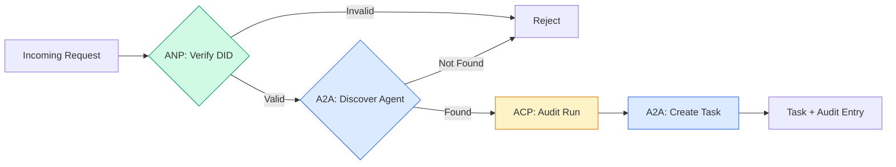

```typescript
class ProtocolGateway {
  private registry: AgentRegistry;
  private taskManager: TaskManager;
  private auditRunner: AuditableRunner;
  private identityRegistry: IdentityRegistry;

  constructor(
    registry: AgentRegistry,
    taskManager: TaskManager,
    auditRunner: AuditableRunner,
    identityRegistry: IdentityRegistry
  ) {
    this.registry = registry;
    this.taskManager = taskManager;
    this.auditRunner = auditRunner;
    this.identityRegistry = identityRegistry;
  }

  async delegateTask(
    fromDid: string,
    signature: string,
    targetAgent: string,
    message: AgentMessage,
    sessionId?: string
  ): Promise<{ task: Task; audit: AuditEntry } | { error: string }> {
    if (!this.identityRegistry.verify(fromDid, signature, message.id)) {
      return { error: "Identity verification failed" };
    }

    const card = this.registry.resolve(targetAgent);
    if (!card) {
      return { error: `Agent ${targetAgent} not found in registry` };
    }

    const audit = await this.auditRunner.run(
      targetAgent,
      [message],
      sessionId
    );
    const task = await this.taskManager.sendMessage(targetAgent, message);

    return { task, audit };
  }

  discoverAndDelegate(
    fromDid: string,
    signature: string,
    skillTag: string,
    message: AgentMessage
  ): Promise<{ task: Task; audit: AuditEntry } | { error: string }> {
    const candidates = this.registry.discoverBySkillTag(skillTag);
    if (candidates.length === 0) {
      return Promise.resolve({
        error: `No agents found with skill tag: ${skillTag}`,
      });
    }
    return this.delegateTask(
      fromDid,
      signature,
      candidates[0].name,
      message
    );
  }
}
```

Ağ geçidi tek çağrıda dört şey yapar:
1. **ANP**: Arayanın kimliğini DID imzasıyla doğrular
2. **A2A**: agent hedefini keşfeder ve yetenekleri kontrol eder
3. **ACP**: Yürütmeyi yörüngeli bir denetim takibine sarar
4. **A2A**: Tam yaşam döngüsü takibine sahip bir görev oluşturur

### Adım 7: Hepsini Bir Araya Bağlayın

```typescript
async function protocolDemo() {
  const registry = new AgentRegistry();
  registry.register({
    name: "researcher",
    description: "Searches and summarizes findings",
    version: "1.0.0",
    url: "https://researcher.local/a2a/v1",
    capabilities: { streaming: true, pushNotifications: false },
    defaultInputModes: ["text/plain"],
    defaultOutputModes: ["text/plain", "application/json"],
    skills: [
      {
        id: "web-research",
        name: "Web Research",
        description: "Searches the web",
        tags: ["research", "search", "summarization"],
        inputModes: ["text/plain"],
        outputModes: ["application/json"],
      },
    ],
  });
  registry.register({
    name: "coder",
    description: "Writes code from specs",
    version: "1.0.0",
    url: "https://coder.local/a2a/v1",
    capabilities: { streaming: false, pushNotifications: false },
    defaultInputModes: ["text/plain", "application/json"],
    defaultOutputModes: ["text/plain"],
    skills: [
      {
        id: "code-gen",
        name: "Code Generation",
        description: "Generates code",
        tags: ["coding", "generation"],
        inputModes: ["text/plain", "application/json"],
        outputModes: ["text/plain"],
      },
    ],
  });

  const taskManager = new TaskManager();
  const auditRunner = new AuditableRunner();

  const researchTrajectory: TrajectoryEntry[] = [];

  taskManager.registerHandler(
    "researcher",
    async function* (task, message) {
      yield {
        kind: "statusUpdate" as const,
        taskId: task.id,
        status: { state: "working" as const, timestamp: Date.now() },
      };

      researchTrajectory.push({
        reasoning: "Searching for React 19 documentation",
        toolName: "web_search",
        toolInput: { query: "React 19 compiler features" },
        toolOutput: {
          results: ["react.dev/blog/react-19", "github.com/react/react"],
        },
        timestamp: Date.now(),
      });

      researchTrajectory.push({
        reasoning: "Extracting key findings from search results",
        toolName: "doc_analysis",
        toolInput: { url: "react.dev/blog/react-19" },
        toolOutput: {
          summary:
            "React 19 compiler auto-memoizes, no manual useMemo needed",
        },
        timestamp: Date.now(),
      });

      yield {
        kind: "artifactUpdate" as const,
        taskId: task.id,
        artifact: {
          id: crypto.randomUUID(),
          name: "research-results",
          parts: [
            {
              kind: "data" as const,
              data: {
                findings: [
                  "React 19 compiler auto-memoizes components",
                  "No more manual useMemo/useCallback needed",
                  "Compiler runs at build time, not runtime",
                ],
                sources: ["react.dev/blog/react-19"],
              },
              mediaType: "application/json",
            },
          ],
        },
        append: false,
        lastChunk: true,
      };

      yield {
        kind: "statusUpdate" as const,
        taskId: task.id,
        status: { state: "completed" as const, timestamp: Date.now() },
      };
    }
  );

  auditRunner.registerAgent("researcher", async () => ({
    output: [
      textMessage("agent", "React 19 compiler auto-memoizes components"),
    ],
    trajectory: researchTrajectory,
  }));

  const identityRegistry = new IdentityRegistry();

  const coderIdentity = createIdentity("coder.local", "coder");
  const researcherIdentity = createIdentity("researcher.local", "researcher");

  identityRegistry.publish(coderIdentity.document);
  identityRegistry.publish(researcherIdentity.document);

  const gateway = new ProtocolGateway(
    registry,
    taskManager,
    auditRunner,
    identityRegistry
  );

  console.log("=== Protocol Demo ===\n");

  console.log("1. Agent Discovery (A2A)");
  const researchAgents = registry.discoverBySkillTag("research");
  console.log(
    `   Found ${researchAgents.length} agent(s):`,
    researchAgents.map((a) => a.name)
  );

  console.log("\n2. Identity Verification (ANP)");
  const message = textMessage("user", "Research React 19 compiler features");
  const signature = signPayload(coderIdentity, message.id);
  const verified = identityRegistry.verify(
    coderIdentity.did,
    signature,
    message.id
  );
  console.log(`   Coder DID: ${coderIdentity.did}`);
  console.log(`   Signature verified: ${verified}`);

  console.log("\n3. Task Delegation (A2A + ACP + ANP)");
  const result = await gateway.delegateTask(
    coderIdentity.did,
    signature,
    "researcher",
    message,
    "session-001"
  );

  if ("error" in result) {
    console.log(`   Error: ${result.error}`);
    return;
  }

  console.log(`   Task ID: ${result.task.id}`);
  console.log(`   Task state: ${result.task.status.state}`);
  console.log(`   Artifacts: ${result.task.artifacts.length}`);

  console.log("\n4. Audit Trail (ACP)");
  console.log(`   Run ID: ${result.audit.runId}`);
  console.log(`   Status: ${result.audit.status}`);
  console.log(`   Trajectory steps: ${result.audit.trajectory.length}`);
  for (const step of result.audit.trajectory) {
    console.log(`     - ${step.reasoning}`);
    if (step.toolName) {
      console.log(`       Tool: ${step.toolName}`);
    }
  }

  console.log("\n5. Full Audit Log");
  const fullLog = auditRunner.getFullAuditLog();
  console.log(`   Total runs: ${fullLog.length}`);
  for (const entry of fullLog) {
    const duration = entry.completedAt
      ? `${entry.completedAt - entry.startedAt}ms`
      : "in-progress";
    console.log(`   ${entry.agentName}: ${entry.status} (${duration})`);
  }
}

protocolDemo().catch((err) => {
  console.error("Protocol demo failed:", err);
  process.exitCode = 1;
});
```

## Ne Yanlış Gidiyor

Protokoller mutlu yolu çözer. İşte üretimdeki kesintiler:

**Şema kayması.** Agent A, bir Agent Kart reklamı `application/json` çıktısı yayınlar. Ancak JSON şeması sürümler arasında değişir. Agent B eski formatı ayrıştırır ve çöp olur. Düzeltme: Becerilerinizi ve çıktı şemalarınızı sürümlendirin. A2A spesifikasyonu bu nedenle Agent Kartlarda `version` 'yi destekler.

**Durum makinesi ihlalleri.** Bir agent işleyicisi bir `completed` olayı üretir ve ardından daha fazla artifact'lar sağlamaya çalışır. Görev değişmez. Kodunuz güncellemeleri sessizce bırakır veya atar. Düzeltme: Teslim olmadan önce terminal durumunu kontrol edin. Yukarıdaki `TaskManager` bunu terminal durumlarından sonraki `break` ile zorlar.

**Güven çözümleme hataları.** Agent A, Agent B'nin DID'sini doğrulamaya çalışıyor, ancak Agent B'nin alan adı çalışmıyor. DID belgesi getirilemiyor. Başarısız bir şekilde mi açıyorsunuz (doğrulanmamış agent'lari kabul ediyorsunuz) yoksa başarısız mı kapatıyorsunuz (her şeyi reddediyorsunuz)? ANP, başarısızlığın en az güven ilkesiyle kapatılmasını önerir.

**Yörünge şişkinliği.** ACP yörünge kaydı güçlü ancak pahalıdır. Çalıştırma başına 200 araç çağrısı yapan karmaşık bir agent, çok büyük denetim girişleri üretir. Düzeltme: yapılandırılabilir ayrıntı düzeylerinde günlük yörüngesi. Uyumluluk için araç adlarını ve GÇ'yi kaydedin, düzenlemeye tabi olmayan iş yükleri için akıl yürütme adımlarını atlayın.

**Gürleyen sürüyü keşfedin.** Başlangıçta 50 agents'nin tümü `GET /agents` 'yi aynı anda sorguluyor. Düzeltme: Agent Kartlarını TTL ile önbelleğe alın, keşif aralıklarını kademeli hale getirin veya yoklama yerine push tabanlı kayıt kullanın.

## Use It — Hazır Araçla Uygula

### Gerçek Uygulamalar

**A2A** en olgun olanıdır. Google'ın [resmi spesifikasyonu](https://github.com/google/A2A) Linux Vakfı kapsamında açık kaynaktır. Python ve TypeScript için SDK'lar. agent'larınızın dinamik keşif ve işbirliğine ihtiyacı varsa buradan başlayın.

**ACP** A2A ile birleşiyor. IBM'in [BeeAI projesi](https://github.com/i-am-bee/acp) ACP'yi REST öncelikli bir alternatif olarak oluşturdu, ancak yörünge meta verisi kavramı A2A ekosistemi tarafından benimseniyor. Aktarım olarak A2A kullansanız bile ACP modellerini (yörünge günlüğü kaydı, yaşam döngüsünü çalıştırma) kullanın.

**ANP** en deneysel olanıdır. [Topluluk deposunda](https://github.com/agent-network-protocol/AgentNetworkProtocol) bir Python SDK'sı (AgentConnect) var. Meta-protokol müzakere konsepti gerçekten yenidir. Kuruluşlar arası agent deployment'lar için izlemeye değer.

**MCP** zaten 13. Aşama kapsamındadır. agent'ların araçları kullanmasını istiyorsanız, MCP standarttır.

### Doğru Protokolü Seçmek

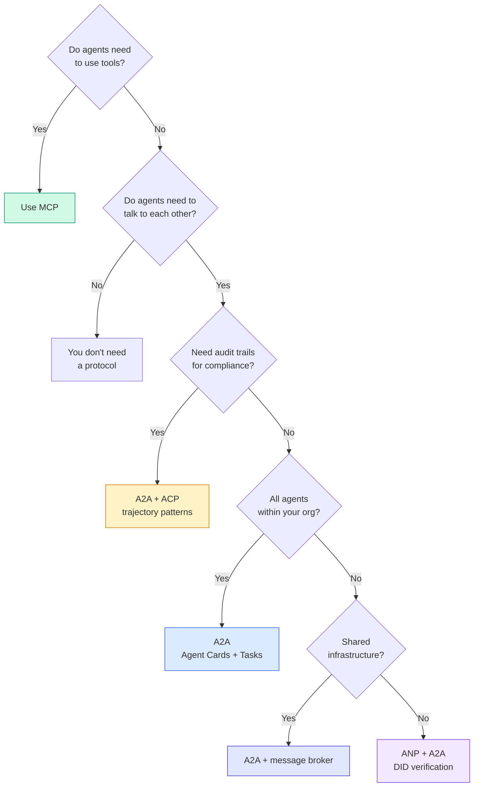

## Ship It — Kullanıma Sun

Bu ders şunları üretir:
- `code/main.ts` -- dört protokol modelinin tamamının uygulanmasını tamamlayın
- `outputs/prompt-protocol-selector.md` -- sisteminiz için protokolleri seçmenize yardımcı olan bir prompt

## Egzersizler

1. **Çok atlamalı görev delegasyonu.** `TaskManager` 'yi, bir agent işleyicisinin alt görevleri diğer agent'lare devredebileceği şekilde genişletin. Araştırmacı bir görev alır, "arama" ve "özetleme" alt görevlerini iki uzman agent'a devreder, her ikisinin de tamamlanmasını bekler ve ardından sonuçları kendi artifact'lariyle birleştirir.

2. **Akış denetim izi.** `AuditableRunner` 'yi akış modunu destekleyecek şekilde değiştirin. Tam sonucu beklemek yerine, yörünge girişleri eklendikçe gerçek zamanlı olarak `AuditEntry` güncellemesini sağlayın. Denetim anlık görüntüleri üreten bir eşzamansız oluşturucu kullanın.

3. **DID rotasyonu.** `IdentityRegistry`'ya anahtar rotasyonu ekleyin. Bir agent, `previousDid` referansını korurken güncellenmiş anahtarlarla yeni bir DID belgesi yayınlayabilmelidir. Doğrulayıcılar, ek süre boyunca hem mevcut hem de önceki anahtardan gelen imzaları kabul etmelidir.

4. **Protokol anlaşması.** ANP'nin meta-protokol konseptini uygulayın. İki agent, aday formatlarıyla `protocolNegotiation` mesaj alışverişinde bulunur (e.g., "JSON-RPC konuşabiliyorum" vs "REST'i tercih ediyorum"). Maksimum 3 turdan sonra format veya mola üzerinde anlaşırlar. Kararlaştırılan format, hangi `TaskManager` veya `AuditableRunner` 'yi kullanacaklarını belirler.

5. **Hız sınırlı keşif.** Yapılandırılabilir bir TTL ile Agent Kart aramalarını önbelleğe alan ve saniyede agent başına keşif sorgularını sınırlayan bir `RateLimitedRegistry` sarmalayıcı ekleyin. Başlangıçta birbirini keşfeden 100 agent'lik gürleyen bir sürüyü simüle edin ve farkı ölçün.

## Anahtar Terimler

| Dönem | İnsanlar ne diyor | Aslında ne anlama geliyor |
|------|----------------|----------------------|
| MCP | "Yapay zeka araçlarına yönelik protokol" | agent'ların araçları keşfetmesi ve kullanması için bir istemci-sunucu protokolü. Agent-araca, agent-to-agent değil. |
| A2A | "Google'ın agent protokolü" | Linux Vakfı kapsamında agent işbirliğine yönelik eşler arası bir protokol. Agent Kartlar aracılığıyla keşif, 9 durumlu görev yaşam döngüsü, SSE aracılığıyla akış. JSON-RPC, REST ve gRPC bağlamalarını destekler. |
| AKP | "Kurumsal agent mesajlaşma" | IBM/BeeAI'nin agent için REST API'si TrajectoryMetadata ile çalışır: her yanıt, tüm akıl yürütme ve araç çağrıları zincirini taşır. A2A ile birleşiyor. |
| ANAP | "Merkezi olmayan agent kimliği" | Kriptografik kimlik için `did:wba` (DID), E2EE için HPKE ve birbirini hiç görmemiş agent'lar için yapay zeka destekli meta-protokol anlaşması kullanan bir topluluk protokolü. |
| Agent Kart | "Bir agent'ın kartviziti" | Becerileri, desteklenen MIME türlerini, güvenlik şemalarını ve protokol bağlantılarını açıklayan `/.well-known/agent-card.json` adresindeki bir JSON belgesi. |
| YAPTIM | "Merkezi Olmayan Kimlik" | agent'ın kendi alanında barındırılan kriptografik olarak doğrulanabilir kimlikler için W3C standardı. ANP `did:wba` yöntemini kullanır. |
| Yörünge Meta Verileri | "Denetim makbuzu" | ACP'nin akıl yürütme adımlarını, araç çağrılarını ve bunların girdilerini/çıktılarını her agent yanıtına ekleme mekanizması. |
| Meta-protokol | "Agentnasıl konuşulacağı konusunda pazarlık yapıyor" | ANP'nin agent'larin veri formatları üzerinde dinamik olarak anlaşmak için doğal dili kullandığı ve ardından bunları işlemek için kod ürettiği yaklaşımı. |
| Görev | "Bir iş birimi" | A2A'nın gönderimden tamamlanmaya kadar durum bilgisi olan nesne izleme çalışması. Bir kez değiştirilemez terminal. |

## Daha Fazla Okuma

- [Google A2A spesifikasyonu](https://github.com/google/A2A) -- resmi spesifikasyon ve SDK'lar (v1.0.0, Linux Foundation)
- [IBM/BeeAI ACP spesifikasyonu](https://github.com/i-am-bee/acp) -- agent çalıştırma ve yörünge meta verileri için OpenAPI 3.1 spesifikasyonu
- [Agent Ağ Protokolü](https://github.com/agent-network-protocol/AgentNetworkProtocol) -- DID tabanlı kimlik, E2EE, meta protokol anlaşması
- [Model Context Protokol belgeleri](https://modelcontextprotocol.io/) -- Anthropic'in MCP spesifikasyonu (Aşama 13'te ele alınmıştır)
- [W3C Merkezi Olmayan Tanımlayıcılar](https://www.w3.org/TR/did-core/) -- ANP'yi destekleyen kimlik standardı
- [RFC 9180 (HPKE)](https://www.rfc-editor.org/rfc/rfc9180) -- ANP'nin E2EE için kullandığı şifreleme şeması
- [FIPA Agent İletişim Dili](http://www.fipa.org/specs/fipa00061/SC00061G.html) -- modern agent protokollerinin akademik öncüsü
