# 03 · 通信协议

> 不会说同一种语言的智能体不是一个团队。它们只是对着虚空喊叫的陌生人。

**类型：** 实践（Build）
**语言：** TypeScript
**前置：** Phase 14（智能体工程）,Lesson 16.01（为什么需要多智能体）
**时长：** 约 120 分钟

## 学习目标

- 实现 MCP 工具发现与调用,使智能体能够使用外部服务器暴露的工具。
- 构建一个 A2A 智能体卡片与任务端点,使得一个智能体能够通过 HTTP 将工作委托给另一个智能体。
- 比较 MCP（工具访问）、A2A（智能体到智能体）、ACP（企业审计）与 ANP（去中心化信任）,并解释每种协议解决的是哪一类问题。
- 将多个协议串联到同一个系统中,使得智能体通过 MCP 发现工具,并通过 A2A 委托任务。

## 问题所在

你把系统拆分成多个智能体:一名研究员、一名编码者、一名审查者。它们各自独当一面,但现在你需要让它们真正互相交谈。

你的第一次尝试是显而易见的:直接传字符串。研究员返回一大段文本,编码者尽自己所能去解析它。这能工作,直到编码者误解了一份研究摘要,或者两个智能体互相死锁等待对方,又或者你需要由不同团队构建的智能体之间协作。突然间,"仅靠传字符串"就全面崩塌了。

这就是通信协议问题。在没有共享契约来约束智能体如何交换信息的情况下,多智能体系统是脆弱的、不可审计的、且无法扩展到超出你个人亲手编写的少数几个智能体。

AI 生态对此给出了四种协议,各自解决不同的问题切片:

- **MCP** 用于工具访问
- **A2A** 用于智能体到智能体的协作
- **ACP** 用于企业级可审计性
- **ANP** 用于去中心化身份与信任

本课将深入展开。你会阅读各规范的真实传输格式、构建可运行的实现,并把四者连接为一个统一的系统。

## 核心概念

### 协议全景

将这四种协议视为分层结构,各自回答不同的问题:

```mermaid
block-beta
  columns 1
  block:ANP["ANP — 智能体如何信任陌生人？\n去中心化身份（DID）、端到端加密、元协议"]
  end
  block:A2A["A2A — 智能体如何围绕目标协作？\n智能体卡片、任务生命周期、流式传输与协商"]
  end
  block:ACP["ACP — 智能体如何在可审计系统中交谈？\n运行、轨迹元数据、会话持续性"]
  end
  block:MCP["MCP — 智能体如何使用某个工具？\n工具发现、执行与上下文共享"]
  end

  style ANP fill:#f3e8ff,stroke:#7c3aed
  style A2A fill:#dbeafe,stroke:#2563eb
  style ACP fill:#fef3c7,stroke:#d97706
  style MCP fill:#d1fae5,stroke:#059669
```

它们不是竞品,而是在不同层面上解决不同的问题。

### MCP（回顾）

MCP 在 Phase 13 中有深入讲解,在此做简要回顾:MCP 标准化了 LLM 如何连接到外部工具与数据源。它是一个**客户端-服务器**协议,人工智能体（客户端）发现并调用由服务器暴露的工具。

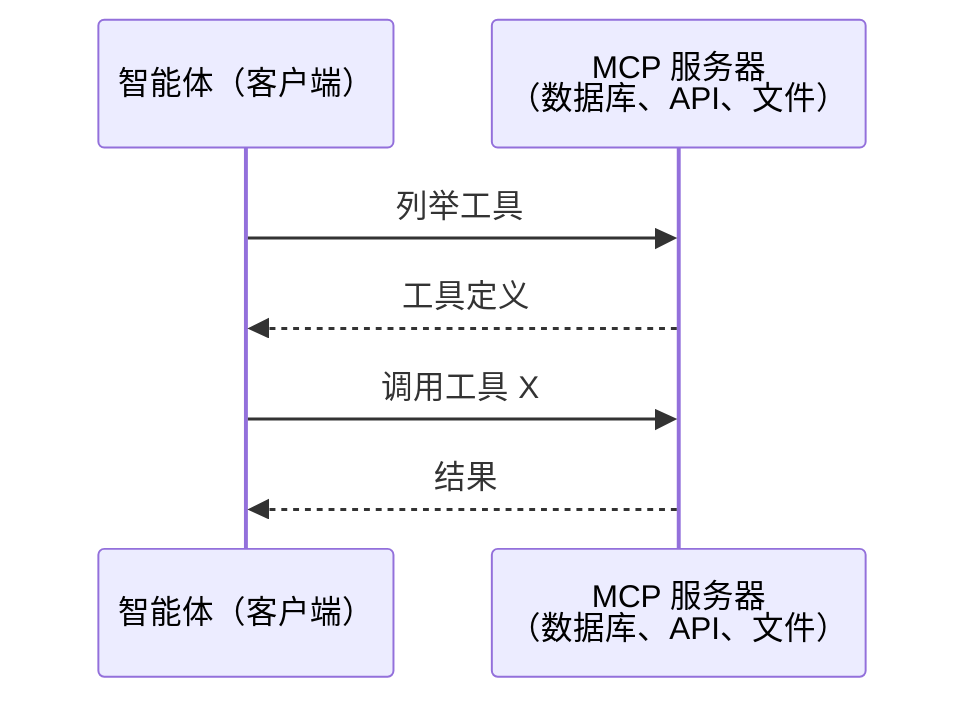

MCP 是**智能体到工具**的通信,它不能帮助智能体彼此交谈。

### A2A（智能体间协议）

**创建者:** Google（现已归于 Linux 基金会,代号 `lf.a2a.v1`）
**规范版本:** 1.0.0
**解决的问题:** 自主智能体如何相互协作、协商和委托任务？

A2A 是用于**对等智能体协作**的协议。MCP 将智能体连接到工具,而 A2A 将智能体连接到其他智能体。每个智能体在知名 URL 上发布一份**智能体卡片**,其他智能体则发现它、与之协商并向其委托任务。

#### A2A 如何工作

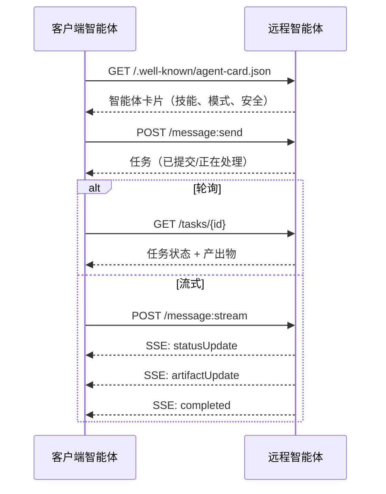

#### 真实的智能体卡片

这是 A2A 智能体卡片在真实环境中的样本,通过 `GET /.well-known/agent-card.json` 提供:

```json
{
  "name": "Research Agent",
  "description": "Searches documentation and summarizes findings",
  "version": "1.0.0",
  "supportedInterfaces": [
    {
      "url": "https://research-agent.example.com/a2a/v1",
      "protocolBinding": "JSONRPC",
      "protocolVersion": "1.0"
    },
    {
      "url": "https://research-agent.example.com/a2a/rest",
      "protocolBinding": "HTTP+JSON",
      "protocolVersion": "1.0"
    }
  ],
  "provider": {
    "organization": "Your Company",
    "url": "https://example.com"
  },
  "capabilities": {
    "streaming": true,
    "pushNotifications": false
  },
  "defaultInputModes": ["text/plain", "application/json"],
  "defaultOutputModes": ["text/plain", "application/json"],
  "skills": [
    {
      "id": "web-research",
      "name": "Web Research",
      "description": "Searches the web and synthesizes findings",
      "tags": ["research", "search", "summarization"],
      "examples": ["Research the latest changes in React 19"]
    },
    {
      "id": "doc-analysis",
      "name": "Documentation Analysis",
      "description": "Reads and analyzes technical documentation",
      "tags": ["docs", "analysis"],
      "inputModes": ["text/plain", "application/pdf"],
      "outputModes": ["application/json"]
    }
  ],
  "securitySchemes": {
    "bearer": {
      "httpAuthSecurityScheme": {
        "scheme": "Bearer",
        "bearerFormat": "JWT"
      }
    }
  },
  "security": [{ "bearer": [] }]
}
```

关键注意事项:
- **技能**定义了智能体可以做什么,每个技能有 ID、标签和支持的输入/输出 MIME 类型。这是客户端智能体判断该远程智能体能否处理其请求的方式。
- **supportedInterfaces** 列出了多种协议绑定的不同 URL,以便单个智能体能够同时支持 JSON-RPC、REST 和 gRPC。
- **安全**内置于卡片中。客户端在发出任何请求之前就知道需要什么认证。

#### 任务生命周期

任务是 A2A 中的核心工作单元,它们经历以下定义好的状态:

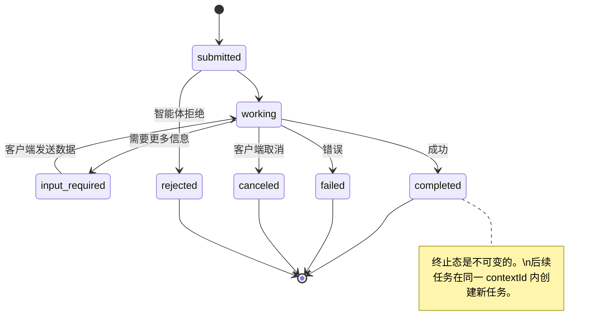

全部 8 种状态（规范还定义了 `UNSPECIFIED` 作为哨兵值,此处省略）：

| 状态 | 终止态？ | 含义 |
|---|---|---|
| `TASK_STATE_SUBMITTED` | 否 | 已确认,尚未开始处理 |
| `TASK_STATE_WORKING` | 否 | 正在处理中 |
| `TASK_STATE_INPUT_REQUIRED` | 否 | 智能体需要客户端提供更多信息 |
| `TASK_STATE_AUTH_REQUIRED` | 否 | 需要认证 |
| `TASK_STATE_COMPLETED` | 是 | 成功完成 |
| `TASK_STATE_FAILED` | 是 | 带错误完成 |
| `TASK_STATE_CANCELED` | 是 | 被客户端在完成前取消 |
| `TASK_STATE_REJECTED` | 是 | 智能体拒绝接收该任务 |

一旦任务进入终止态,它就不可变更,不能再发送任何消息,后续任务应在同一 `contextId` 内创建新任务。

#### 传输格式

A2A 使用 JSON-RPC 2.0。以下是真实的消息交换样本。

**客户端发送任务:**
```json
{
  "jsonrpc": "2.0",
  "id": 1,
  "method": "SendMessage",
  "params": {
    "message": {
      "messageId": "msg-001",
      "role": "ROLE_USER",
      "parts": [{ "text": "Research React 19 compiler features" }]
    },
    "configuration": {
      "acceptedOutputModes": ["text/plain", "application/json"],
      "historyLength": 10
    }
  }
}
```

**智能体响应任务:**
```json
{
  "jsonrpc": "2.0",
  "id": 1,
  "result": {
    "task": {
      "id": "task-abc-123",
      "contextId": "ctx-xyz-789",
      "status": {
        "state": "TASK_STATE_COMPLETED",
        "timestamp": "2026-03-27T10:30:00Z"
      },
      "artifacts": [
        {
          "artifactId": "art-001",
          "name": "research-results",
          "parts": [{
            "data": {
              "findings": [
                "React 19 compiler auto-memoizes components",
                "No more manual useMemo/useCallback needed",
                "Compiler runs at build time, not runtime"
              ]
            },
            "mediaType": "application/json"
          }]
        }
      ]
    }
  }
}
```

**通过 SSE 流式传输:**
```text
POST /message:stream HTTP/1.1
Content-Type: application/json
A2A-Version: 1.0

data: {"task":{"id":"task-123","status":{"state":"TASK_STATE_WORKING"}}}

data: {"statusUpdate":{"taskId":"task-123","status":{"state":"TASK_STATE_WORKING","message":{"role":"ROLE_AGENT","parts":[{"text":"Searching documentation..."}]}}}}

data: {"artifactUpdate":{"taskId":"task-123","artifact":{"artifactId":"art-1","parts":[{"text":"partial findings..."}]},"append":true,"lastChunk":false}}

data: {"statusUpdate":{"taskId":"task-123","status":{"state":"TASK_STATE_COMPLETED"}}}
```

### ACP（智能体通信协议）

**创建者:** IBM / BeeAI
**规范版本:** 0.2.0（OpenAPI 3.1.1）
**状态:** 正以 Linux 基金会项目身份合并进 A2A
**解决的问题:** 智能体如何在完全可审计、具备会话持续性与轨迹追踪的条件下进行通信？

ACP 是**企业级协议**。与许多摘要所宣称的相反,ACP **不**使用 JSON-LD,而是一个通过 OpenAPI 定义的简洁 REST/JSON API。其特殊之处在于 **TrajectoryMetadata**:每条智能体响应都可以带有生成其内容的推理步骤和工具调用的详细日志。

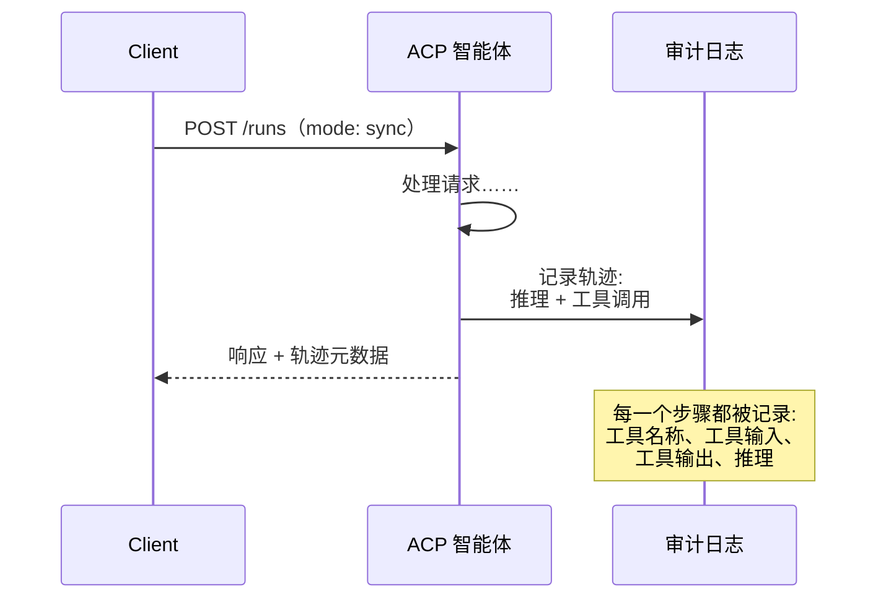

#### ACP 中的智能体发现

ACP 定义了四种发现方式:

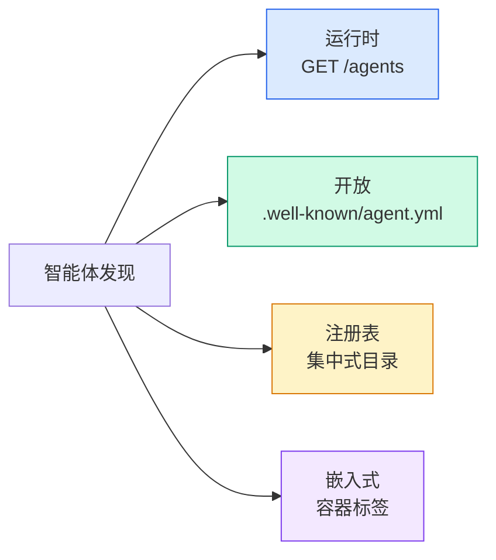

**智能体清单**比 A2A 的智能体卡片更简洁:

```json
{
  "name": "summarizer",
  "description": "Summarizes documents with source citations",
  "input_content_types": ["text/plain", "application/pdf"],
  "output_content_types": ["text/plain", "application/json"],
  "metadata": {
    "tags": ["summarization", "RAG"],
    "framework": "BeeAI",
    "capabilities": [
      {
        "name": "Document Summarization",
        "description": "Condenses long documents into key points"
      }
    ],
    "recommended_models": ["llama3.3:70b-instruct-fp16"],
    "license": "Apache-2.0",
    "programming_language": "Python"
  }
}
```

#### 运行生命周期

ACP 使用"运行（Run）"而非"任务"。运行是智能体的一次执行,支持三种模式:

| 模式 | 行为 |
|---|---|
| `sync` | 阻塞。响应中包含完整结果。 |
| `async` | 立即返回 202。之后轮询 `GET /runs/{id}` 获取状态。 |
| `stream` | SSE 流。智能体工作过程中逐一触发事件。 |

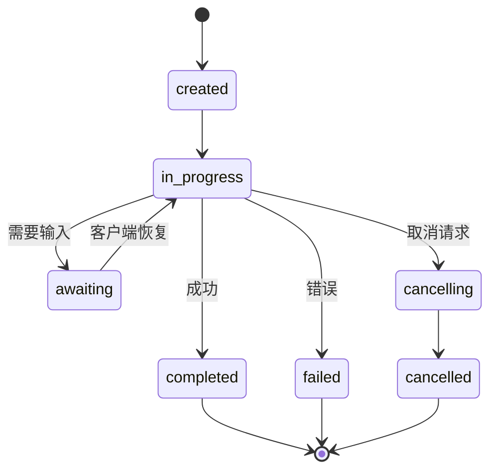

#### 轨迹元数据 —— 审计记录

这是 ACP 的关键差异点。每条消息体都可以带有元数据,展示智能体到底做了什么:

```json
{
  "role": "agent/researcher",
  "parts": [
    {
      "content_type": "text/plain",
      "content": "The weather in San Francisco is 72F and sunny.",
      "metadata": {
        "kind": "trajectory",
        "message": "I need to check the weather for this location",
        "tool_name": "weather_api",
        "tool_input": { "location": "San Francisco, CA" },
        "tool_output": { "temperature": 72, "condition": "sunny" }
      }
    }
  ]
}
```

对于受监管行业,这是金矿。每条答案都带有一条可验证的推理链:调用了哪些工具、使用了什么输入、收到了什么输出。没有黑盒。

ACP 也支持**引用元数据**用于来源归属:

```json
{
  "kind": "citation",
  "start_index": 0,
  "end_index": 47,
  "url": "https://weather.gov/sf",
  "title": "NWS San Francisco Forecast"
}
```

### ANP（智能体网络协议）

**创建者:** 开源社区（由 GaoWei Chang 创立）
**仓库:** [github.com/agent-network-protocol/AgentNetworkProtocol](https://github.com/agent-network-protocol/AgentNetworkProtocol)
**解决的问题:** 来自不同组织的智能体如何在没有中心权威的情况下彼此建立信任？

ANP 是**去中心化身份协议**。它使用 W3C 去中心化标识符（DID）和端到端加密来构建信任。与 A2A 通过已知端点发现智能体不同,ANP 允许智能体通过加密手段证明身份。

ANP 有三个层次:

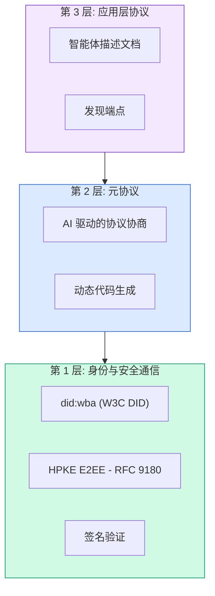

#### DID 文档（真实结构）

ANP 使用一个名为 `did:wba`（基于 Web 的智能体）的自定义 DID 方法。DID `did:wba:example.com:user:alice` 解析为 `https://example.com/user/alice/did.json`:

```json
{
  "@context": [
    "https://www.w3.org/ns/did/v1",
    "https://w3id.org/security/suites/jws-2020/v1",
    "https://w3id.org/security/suites/secp256k1-2019/v1"
  ],
  "id": "did:wba:example.com:user:alice",
  "verificationMethod": [
    {
      "id": "did:wba:example.com:user:alice#key-1",
      "type": "EcdsaSecp256k1VerificationKey2019",
      "controller": "did:wba:example.com:user:alice",
      "publicKeyJwk": {
        "crv": "secp256k1",
        "x": "NtngWpJUr-rlNNbs0u-Aa8e16OwSJu6UiFf0Rdo1oJ4",
        "y": "qN1jKupJlFsPFc1UkWinqljv4YE0mq_Ickwnjgasvmo",
        "kty": "EC"
      }
    },
    {
      "id": "did:wba:example.com:user:alice#key-x25519-1",
      "type": "X25519KeyAgreementKey2019",
      "controller": "did:wba:example.com:user:alice",
      "publicKeyMultibase": "z9hFgmPVfmBZwRvFEyniQDBkz9LmV7gDEqytWyGZLmDXE"
    }
  ],
  "authentication": [
    "did:wba:example.com:user:alice#key-1"
  ],
  "keyAgreement": [
    "did:wba:example.com:user:alice#key-x25519-1"
  ],
  "humanAuthorization": [
    "did:wba:example.com:user:alice#key-1"
  ],
  "service": [
    {
      "id": "did:wba:example.com:user:alice#agent-description",
      "type": "AgentDescription",
      "serviceEndpoint": "https://example.com/agents/alice/ad.json"
    }
  ]
}
```

关键注意事项:
- **密钥分离**是强制的,签名密钥与加密密钥分开。
- **`humanAuthorization`** 是 ANP 独有的。这些密钥在使用前需要明确的人类批准（生物识别、密码、HSM）,高风险操作经过该路径。
- **`keyAgreement`** 密钥用于 HPKE 端到端加密。
- **service** 部分链接到智能体描述文档。

#### ANP 中的信任如何建立

ANP **不使用**信任网络或背书图。信任是双向的、每次交互独立验证的:

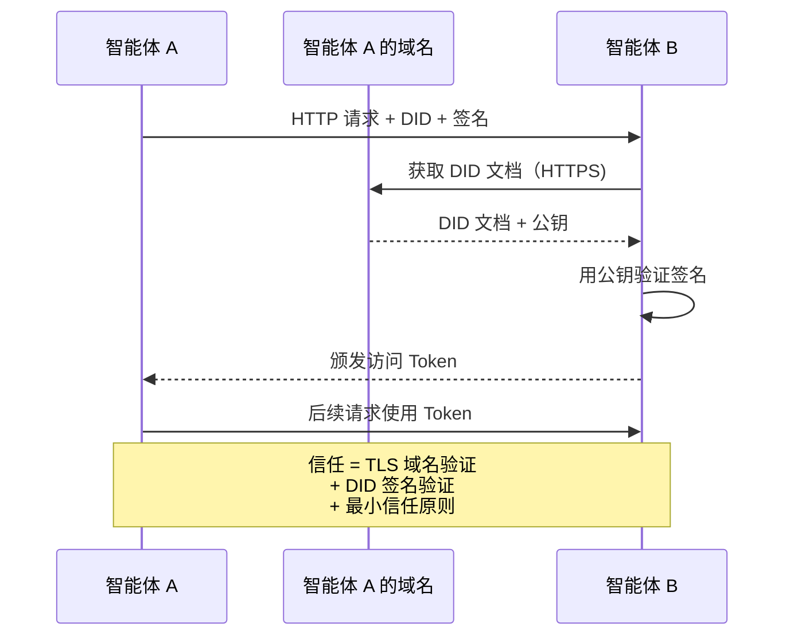

信任来自三个来源:
1. **域名级别 TLS** 验证 DID 文档的托存主机
2. **DID 加密签名**验证智能体身份
3. **最小信任原则**仅授予必要的最小权限

不存在基于 Gossip 传播的信任传播或 PageRank 评分。你通过每个智能体的 DID 直接验证它。

#### 元协议协商

这是 ANP 最具创新性的特性。当两个来自不同生态的智能体相遇时,它们不需要预先约定的数据格式,而是用自然语言进行协商:

```json
{
  "action": "protocolNegotiation",
  "sequenceId": 0,
  "candidateProtocols": "I can communicate using:\n1. JSON-RPC with hotel booking schema\n2. REST with OpenAPI 3.1 spec\n3. Natural language over HTTP",
  "modificationSummary": "Initial proposal",
  "status": "negotiating"
}
```

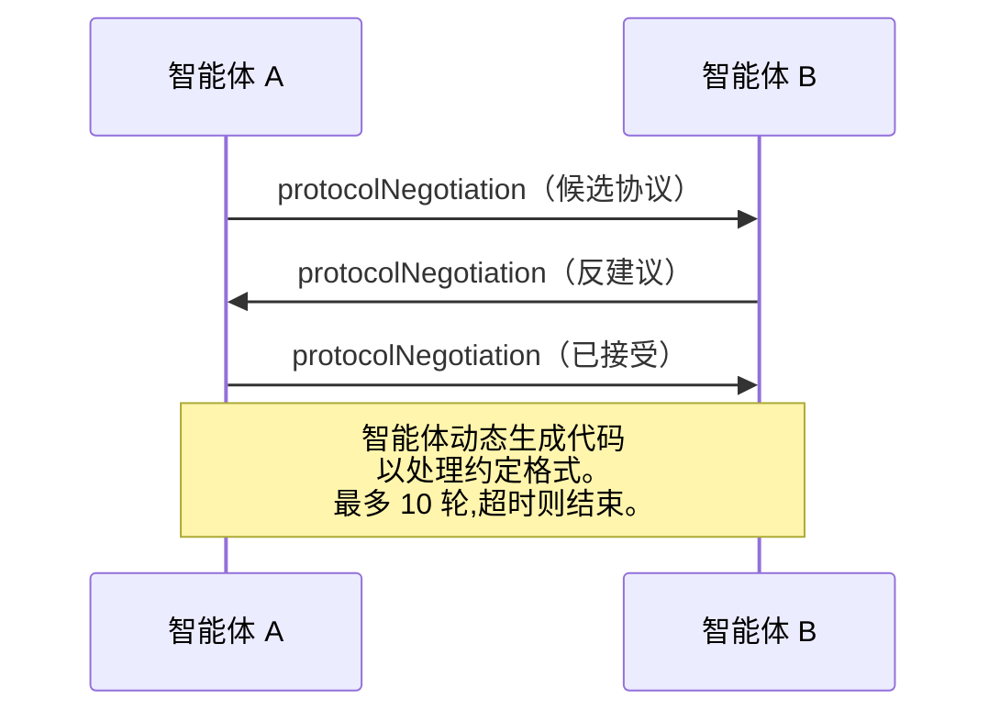

智能体来回交换直到达成一致的格式,然后动态生成代码来处理它。状态值包括:`negotiating`、`rejected`、`accepted`、`timeout`。这意味着两个之前从未见过的智能体可以自行协商如何通信,无需任何人预先定义共享 schema。

### 四种协议对比

| | MCP | A2A | ACP | ANP |
|---|---|---|---|---|
| **创建者** | Anthropic | Google / Linux 基金会 | IBM / BeeAI | 社区 |
| **规范形式** | JSON-RPC | JSON-RPC / REST / gRPC | OpenAPI 3.1（REST) | JSON-RPC |
| **主要用例** | 智能体到工具 | 智能体到智能体 | 智能体到智能体 | 智能体到智能体 |
| **发现** | 工具列表 | `/.well-known/agent-card.json` | `GET /agents`, `/.well-known/agent.yml` | `/.well-known/agent-descriptions`, DID 服务端点 |
| **身份** | 隐式（本地) | 安全机制（OAuth, mTLS) | 服务器级 | W3C DID (`did:wba`),E2EE |
| **审计轨迹** | 不适用 | 基础（任务历史) | 轨迹元数据（工具调用与推理) | 未正式规定 |
| **状态机** | 不适用 | 9 种任务状态 | 7 种运行状态 | 不适用 |
| **流式** | 不适用 | SSE | SSE | 传输层无关 |
| **独特特性** | 工具 schema | 智能体卡片 + 技能 | 轨迹审计记录 | 元协议协商 |
| **最适用** | 工具与数据 | 动态协作 | 受监管行业 | 跨组织信任 |
| **状态** | 稳定 | 稳定（v1.0) | 合并入 A2A | 积极开发中 |

### 它们如何协同工作

这些协议并不互斥。一个真实的企业系统会同时使用多个:

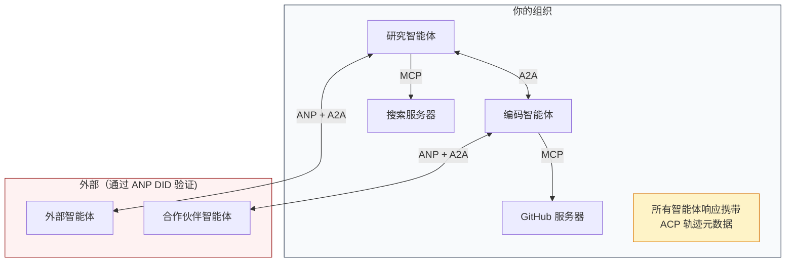

- **MCP** 将每个智能体连接到它的工具
- **A2A** 处理智能体之间的协作（内部和外部）
- **ACP** 将响应包装在轨迹元数据中以实现可审计性
- **ANP** 为你不掌控的智能体提供身份验证
## 动手构建

### 第 1 步:核心消息类型

每个多智能体系统始于消息格式。我们定义映射到真实协议的对应类型:

```typescript
import crypto from "node:crypto";

type MessageRole = "user" | "agent";

type MessagePart =
  | { kind: "text"; text: string }
  | { kind: "data"; data: unknown; mediaType: string }
  | { kind: "file"; name: string; url: string; mediaType: string };

type TrajectoryEntry = {
  reasoning: string;
  toolName?: string;
  toolInput?: unknown;
  toolOutput?: unknown;
  timestamp: number;
};

type AgentMessage = {
  id: string;
  role: MessageRole;
  parts: MessagePart[];
  trajectory?: TrajectoryEntry[];
  replyTo?: string;
  timestamp: number;
};

function createMessage(
  role: MessageRole,
  parts: MessagePart[],
  replyTo?: string
): AgentMessage {
  return {
    id: crypto.randomUUID(),
    role,
    parts,
    replyTo,
    timestamp: Date.now(),
  };
}

function textMessage(role: MessageRole, text: string): AgentMessage {
  return createMessage(role, [{ kind: "text", text }]);
}
```

注意:`MessagePart` 是多模态的（文本、结构化数据、文件）,就像真实的 A2A 和 ACP 规范一样。`TrajectoryEntry` 捕捉推理链,与 ACP 的轨迹元数据对应。

### 第 2 步:A2A 智能体卡片与注册表

构建与 A2A 真实规范匹配的智能体发现机制:

```typescript
type Skill = {
  id: string;
  name: string;
  description: string;
  tags: string[];
  inputModes: string[];
  outputModes: string[];
};

type AgentCard = {
  name: string;
  description: string;
  version: string;
  url: string;
  capabilities: {
    streaming: boolean;
    pushNotifications: boolean;
  };
  defaultInputModes: string[];
  defaultOutputModes: string[];
  skills: Skill[];
};

class AgentRegistry {
  private cards: Map<string, AgentCard> = new Map();

  register(card: AgentCard) {
    this.cards.set(card.name, card);
  }

  discoverBySkillTag(tag: string): AgentCard[] {
    return [...this.cards.values()].filter((card) =>
      card.skills.some((skill) => skill.tags.includes(tag))
    );
  }

  discoverByInputMode(mimeType: string): AgentCard[] {
    return [...this.cards.values()].filter(
      (card) =>
        card.defaultInputModes.includes(mimeType) ||
        card.skills.some((skill) => skill.inputModes.includes(mimeType))
    );
  }

  resolve(name: string): AgentCard | undefined {
    return this.cards.get(name);
  }

  listAll(): AgentCard[] {
    return [...this.cards.values()];
  }
}
```

这比简单的名称到能力映射丰富得多。你可以按技能标签、按输入 MIME 类型、或按名称来发现智能体,就像真实 A2A 规范支持的那样。

### 第 3 步:A2A 任务生命周期

构建完整的任务状态机:

```typescript
type TaskState =
  | "submitted"
  | "working"
  | "input-required"
  | "auth-required"
  | "completed"
  | "failed"
  | "canceled"
  | "rejected";

const TERMINAL_STATES: TaskState[] = [
  "completed",
  "failed",
  "canceled",
  "rejected",
];

type TaskStatus = {
  state: TaskState;
  message?: AgentMessage;
  timestamp: number;
};

type Artifact = {
  id: string;
  name: string;
  parts: MessagePart[];
};

type Task = {
  id: string;
  contextId: string;
  status: TaskStatus;
  artifacts: Artifact[];
  history: AgentMessage[];
};

type TaskEvent =
  | { kind: "statusUpdate"; taskId: string; status: TaskStatus }
  | {
      kind: "artifactUpdate";
      taskId: string;
      artifact: Artifact;
      append: boolean;
      lastChunk: boolean;
    };

type TaskHandler = (
  task: Task,
  message: AgentMessage
) => AsyncGenerator<TaskEvent>;

class TaskManager {
  private tasks: Map<string, Task> = new Map();
  private handlers: Map<string, TaskHandler> = new Map();
  private listeners: Map<string, ((event: TaskEvent) => void)[]> = new Map();

  registerHandler(agentName: string, handler: TaskHandler) {
    this.handlers.set(agentName, handler);
  }

  subscribe(taskId: string, listener: (event: TaskEvent) => void) {
    const existing = this.listeners.get(taskId) ?? [];
    existing.push(listener);
    this.listeners.set(taskId, existing);
  }

  async sendMessage(
    agentName: string,
    message: AgentMessage,
    contextId?: string
  ): Promise<Task> {
    const handler = this.handlers.get(agentName);
    if (!handler) {
      const task = this.createTask(contextId);
      task.status = {
        state: "rejected",
        timestamp: Date.now(),
        message: textMessage("agent", `No handler for ${agentName}`),
      };
      return task;
    }

    const task = this.createTask(contextId);
    task.history.push(message);
    task.status = { state: "submitted", timestamp: Date.now() };

    this.processTask(task, handler, message).catch((err) => {
      task.status = {
        state: "failed",
        timestamp: Date.now(),
        message: textMessage("agent", String(err)),
      };
    });
    return task;
  }

  getTask(taskId: string): Task | undefined {
    return this.tasks.get(taskId);
  }

  cancelTask(taskId: string): boolean {
    const task = this.tasks.get(taskId);
    if (!task || TERMINAL_STATES.includes(task.status.state)) return false;
    task.status = { state: "canceled", timestamp: Date.now() };
    this.emit(taskId, {
      kind: "statusUpdate",
      taskId,
      status: task.status,
    });
    return true;
  }

  private createTask(contextId?: string): Task {
    const task: Task = {
      id: crypto.randomUUID(),
      contextId: contextId ?? crypto.randomUUID(),
      status: { state: "submitted", timestamp: Date.now() },
      artifacts: [],
      history: [],
    };
    this.tasks.set(task.id, task);
    return task;
  }

  private async processTask(
    task: Task,
    handler: TaskHandler,
    message: AgentMessage
  ) {
    task.status = { state: "working", timestamp: Date.now() };
    this.emit(task.id, {
      kind: "statusUpdate",
      taskId: task.id,
      status: task.status,
    });

    try {
      for await (const event of handler(task, message)) {
        if (TERMINAL_STATES.includes(task.status.state)) break;

        if (event.kind === "statusUpdate") {
          task.status = event.status;
        }
        if (event.kind === "artifactUpdate") {
          const existing = task.artifacts.find(
            (a) => a.id === event.artifact.id
          );
          if (existing && event.append) {
            existing.parts.push(...event.artifact.parts);
          } else {
            task.artifacts.push(event.artifact);
          }
        }
        this.emit(task.id, event);
      }
    } catch (err) {
      task.status = {
        state: "failed",
        timestamp: Date.now(),
        message: textMessage("agent", String(err)),
      };
      this.emit(task.id, {
        kind: "statusUpdate",
        taskId: task.id,
        status: task.status,
      });
    }
  }

  private emit(taskId: string, event: TaskEvent) {
    for (const listener of this.listeners.get(taskId) ?? []) {
      listener(event);
    }
  }
}
```

这实现了真实的 A2A 任务生命周期:已提交、处理中、需要输入、终止态。处理器是异步生成器,不断产出事件（状态更新与产出物块）,与 SSE 流式传输模型完全对应。

### 第 4 步:ACP 风格的审计轨迹

用轨迹追踪包装通信:

```typescript
type AuditEntry = {
  runId: string;
  agentName: string;
  input: AgentMessage[];
  output: AgentMessage[];
  trajectory: TrajectoryEntry[];
  status: "created" | "in-progress" | "completed" | "failed" | "awaiting";
  startedAt: number;
  completedAt?: number;
  sessionId?: string;
};

class AuditableRunner {
  private log: AuditEntry[] = [];
  private handlers: Map<
    string,
    (input: AgentMessage[]) => Promise<{
      output: AgentMessage[];
      trajectory: TrajectoryEntry[];
    }>
  > = new Map();

  registerAgent(
    name: string,
    handler: (input: AgentMessage[]) => Promise<{
      output: AgentMessage[];
      trajectory: TrajectoryEntry[];
    }>
  ) {
    this.handlers.set(name, handler);
  }

  async run(
    agentName: string,
    input: AgentMessage[],
    sessionId?: string
  ): Promise<AuditEntry> {
    const entry: AuditEntry = {
      runId: crypto.randomUUID(),
      agentName,
      input: structuredClone(input),
      output: [],
      trajectory: [],
      status: "created",
      startedAt: Date.now(),
      sessionId,
    };
    this.log.push(entry);

    const handler = this.handlers.get(agentName);
    if (!handler) {
      entry.status = "failed";
      return entry;
    }

    entry.status = "in-progress";
    try {
      const result = await handler(input);
      entry.output = structuredClone(result.output);
      entry.trajectory = structuredClone(result.trajectory);
      entry.status = "completed";
      entry.completedAt = Date.now();
    } catch (err) {
      entry.status = "failed";
      entry.trajectory.push({
        reasoning: `Error: ${String(err)}`,
        timestamp: Date.now(),
      });
      entry.completedAt = Date.now();
    }
    return entry;
  }

  getFullAuditLog(): AuditEntry[] {
    return structuredClone(this.log);
  }

  getAuditLogForAgent(agentName: string): AuditEntry[] {
    return structuredClone(
      this.log.filter((e) => e.agentName === agentName)
    );
  }

  getAuditLogForSession(sessionId: string): AuditEntry[] {
    return structuredClone(
      this.log.filter((e) => e.sessionId === sessionId)
    );
  }

  getTrajectoryForRun(runId: string): TrajectoryEntry[] {
    const entry = this.log.find((e) => e.runId === runId);
    return entry ? structuredClone(entry.trajectory) : [];
  }
}
```

每次智能体执行都产出一份完整的审计条目:输入了什么、输出了什么,以及中间每一步工具调用与推理步骤的完整轨迹。你可以按智能体、按会话、按单个运行来查询。

### 第 5 步:ANP 风格的身份验证

构建基于 DID 的身份与验证:

```typescript
type VerificationMethod = {
  id: string;
  type: string;
  controller: string;
  publicKeyDer: string;
};

type DIDDocument = {
  id: string;
  verificationMethod: VerificationMethod[];
  authentication: string[];
  keyAgreement: string[];
  humanAuthorization: string[];
  service: { id: string; type: string; serviceEndpoint: string }[];
};

type AgentIdentity = {
  did: string;
  document: DIDDocument;
  privateKey: crypto.KeyObject;
  publicKey: crypto.KeyObject;
};

class IdentityRegistry {
  private documents: Map<string, DIDDocument> = new Map();

  publish(doc: DIDDocument) {
    this.documents.set(doc.id, doc);
  }

  resolve(did: string): DIDDocument | undefined {
    return this.documents.get(did);
  }

  verify(did: string, signature: string, payload: string): boolean {
    const doc = this.documents.get(did);
    if (!doc) return false;

    const authKeyIds = doc.authentication;
    const authKeys = doc.verificationMethod.filter((vm) =>
      authKeyIds.includes(vm.id)
    );

    for (const key of authKeys) {
      const publicKey = crypto.createPublicKey({
        key: Buffer.from(key.publicKeyDer, "base64"),
        format: "der",
        type: "spki",
      });
      const isValid = crypto.verify(
        null,
        Buffer.from(payload),
        publicKey,
        Buffer.from(signature, "hex")
      );
      if (isValid) return true;
    }
    return false;
  }

  requiresHumanAuth(did: string, operationKeyId: string): boolean {
    const doc = this.documents.get(did);
    if (!doc) return false;
    return doc.humanAuthorization.includes(operationKeyId);
  }
}

function createIdentity(domain: string, agentName: string): AgentIdentity {
  const did = `did:wba:${domain}:agent:${agentName}`;
  const { publicKey, privateKey } = crypto.generateKeyPairSync("ed25519");

  const publicKeyDer = publicKey
    .export({ format: "der", type: "spki" })
    .toString("base64");

  const keyId = `${did}#key-1`;
  const encKeyId = `${did}#key-x25519-1`;

  const document: DIDDocument = {
    id: did,
    verificationMethod: [
      {
        id: keyId,
        type: "Ed25519VerificationKey2020",
        controller: did,
        publicKeyDer,
      },
      {
        id: encKeyId,
        type: "X25519KeyAgreementKey2019",
        controller: did,
        publicKeyDer,
      },
    ],
    authentication: [keyId],
    keyAgreement: [encKeyId],
    humanAuthorization: [],
    service: [
      {
        id: `${did}#agent-description`,
        type: "AgentDescription",
        serviceEndpoint: `https://${domain}/agents/${agentName}/ad.json`,
      },
    ],
  };

  return { did, document, privateKey, publicKey };
}

function signPayload(identity: AgentIdentity, payload: string): string {
  return crypto
    .sign(null, Buffer.from(payload), identity.privateKey)
    .toString("hex");
}
```

这反映了真实的 ANP 身份模型:智能体拥有带有独立认证、密钥协商与人类授权密钥的 DID 文档。`IdentityRegistry` 模拟了 DID 解析（在生产环境中,这会是向智能体所在域发出的 HTTP 请求）。

### 第 6 步:协议网关

将四种协议串联成一个统一系统:


```typescript
class ProtocolGateway {
  private registry: AgentRegistry;
  private taskManager: TaskManager;
  private auditRunner: AuditableRunner;
  private identityRegistry: IdentityRegistry;

  constructor(
    registry: AgentRegistry,
    taskManager: TaskManager,
    auditRunner: AuditableRunner,
    identityRegistry: IdentityRegistry
  ) {
    this.registry = registry;
    this.taskManager = taskManager;
    this.auditRunner = auditRunner;
    this.identityRegistry = identityRegistry;
  }

  async delegateTask(
    fromDid: string,
    signature: string,
    targetAgent: string,
    message: AgentMessage,
    sessionId?: string
  ): Promise<{ task: Task; audit: AuditEntry } | { error: string }> {
    if (!this.identityRegistry.verify(fromDid, signature, message.id)) {
      return { error: "Identity verification failed" };
    }

    const card = this.registry.resolve(targetAgent);
    if (!card) {
      return { error: `Agent ${targetAgent} not found in registry` };
    }

    const audit = await this.auditRunner.run(
      targetAgent,
      [message],
      sessionId
    );
    const task = await this.taskManager.sendMessage(targetAgent, message);

    return { task, audit };
  }

  discoverAndDelegate(
    fromDid: string,
    signature: string,
    skillTag: string,
    message: AgentMessage
  ): Promise<{ task: Task; audit: AuditEntry } | { error: string }> {
    const candidates = this.registry.discoverBySkillTag(skillTag);
    if (candidates.length === 0) {
      return Promise.resolve({
        error: `No agents found with skill tag: ${skillTag}`,
      });
    }
    return this.delegateTask(
      fromDid,
      signature,
      candidates[0].name,
      message
    );
  }
}
```

该网关在一次调用中完成了四件事:
1. **ANP**:通过 DID 签名验证调用者身份
2. **A2A**:发现目标智能体并检查其能力
3. **ACP**:将执行包装在带有轨迹的审计追踪中
4. **A2A**:创建具备完整生命周期跟踪的任务
### 第 7 步:全部串联

```typescript
async function protocolDemo() {
  const registry = new AgentRegistry();
  registry.register({
    name: "researcher",
    description: "Searches and summarizes findings",
    version: "1.0.0",
    url: "https://researcher.local/a2a/v1",
    capabilities: { streaming: true, pushNotifications: false },
    defaultInputModes: ["text/plain"],
    defaultOutputModes: ["text/plain", "application/json"],
    skills: [
      {
        id: "web-research",
        name: "Web Research",
        description: "Searches the web",
        tags: ["research", "search", "summarization"],
        inputModes: ["text/plain"],
        outputModes: ["application/json"],
      },
    ],
  });
  registry.register({
    name: "coder",
    description: "Writes code from specs",
    version: "1.0.0",
    url: "https://coder.local/a2a/v1",
    capabilities: { streaming: false, pushNotifications: false },
    defaultInputModes: ["text/plain", "application/json"],
    defaultOutputModes: ["text/plain"],
    skills: [
      {
        id: "code-gen",
        name: "Code Generation",
        description: "Generates code",
        tags: ["coding", "generation"],
        inputModes: ["text/plain", "application/json"],
        outputModes: ["text/plain"],
      },
    ],
  });

  const taskManager = new TaskManager();
  const auditRunner = new AuditableRunner();

  const researchTrajectory: TrajectoryEntry[] = [];

  taskManager.registerHandler(
    "researcher",
    async function* (task, message) {
      yield {
        kind: "statusUpdate" as const,
        taskId: task.id,
        status: { state: "working" as const, timestamp: Date.now() },
      };

      researchTrajectory.push({
        reasoning: "Searching for React 19 documentation",
        toolName: "web_search",
        toolInput: { query: "React 19 compiler features" },
        toolOutput: {
          results: ["react.dev/blog/react-19", "github.com/react/react"],
        },
        timestamp: Date.now(),
      });

      researchTrajectory.push({
        reasoning: "Extracting key findings from search results",
        toolName: "doc_analysis",
        toolInput: { url: "react.dev/blog/react-19" },
        toolOutput: {
          summary:
            "React 19 compiler auto-memoizes, no manual useMemo needed",
        },
        timestamp: Date.now(),
      });

      yield {
        kind: "artifactUpdate" as const,
        taskId: task.id,
        artifact: {
          id: crypto.randomUUID(),
          name: "research-results",
          parts: [
            {
              kind: "data" as const,
              data: {
                findings: [
                  "React 19 compiler auto-memoizes components",
                  "No more manual useMemo/useCallback needed",
                  "Compiler runs at build time, not runtime",
                ],
                sources: ["react.dev/blog/react-19"],
              },
              mediaType: "application/json",
            },
          ],
        },
        append: false,
        lastChunk: true,
      };

      yield {
        kind: "statusUpdate" as const,
        taskId: task.id,
        status: { state: "completed" as const, timestamp: Date.now() },
      };
    }
  );

  auditRunner.registerAgent("researcher", async () => ({
    output: [
      textMessage("agent", "React 19 compiler auto-memoizes components"),
    ],
    trajectory: researchTrajectory,
  }));

  const identityRegistry = new IdentityRegistry();

  const coderIdentity = createIdentity("coder.local", "coder");
  const researcherIdentity = createIdentity("researcher.local", "researcher");

  identityRegistry.publish(coderIdentity.document);
  identityRegistry.publish(researcherIdentity.document);

  const gateway = new ProtocolGateway(
    registry,
    taskManager,
    auditRunner,
    identityRegistry
  );

  console.log("=== Protocol Demo ===\n");

  console.log("1. Agent Discovery (A2A)");
  const researchAgents = registry.discoverBySkillTag("research");
  console.log(
    `   Found ${researchAgents.length} agent(s):`,
    researchAgents.map((a) => a.name)
  );

  console.log("\n2. Identity Verification (ANP)");
  const message = textMessage("user", "Research React 19 compiler features");
  const signature = signPayload(coderIdentity, message.id);
  const verified = identityRegistry.verify(
    coderIdentity.did,
    signature,
    message.id
  );
  console.log(`   Coder DID: ${coderIdentity.did}`);
  console.log(`   Signature verified: ${verified}`);

  console.log("\n3. Task Delegation (A2A + ACP + ANP)");
  const result = await gateway.delegateTask(
    coderIdentity.did,
    signature,
    "researcher",
    message,
    "session-001"
  );

  if ("error" in result) {
    console.log(`   Error: ${result.error}`);
    return;
  }

  console.log(`   Task ID: ${result.task.id}`);
  console.log(`   Task state: ${result.task.status.state}`);
  console.log(`   Artifacts: ${result.task.artifacts.length}`);

  console.log("\n4. Audit Trail (ACP)");
  console.log(`   Run ID: ${result.audit.runId}`);
  console.log(`   Status: ${result.audit.status}`);
  console.log(`   Trajectory steps: ${result.audit.trajectory.length}`);
  for (const step of result.audit.trajectory) {
    console.log(`     - ${step.reasoning}`);
    if (step.toolName) {
      console.log(`       Tool: ${step.toolName}`);
    }
  }

  console.log("\n5. Full Audit Log");
  const fullLog = auditRunner.getFullAuditLog();
  console.log(`   Total runs: ${fullLog.length}`);
  for (const entry of fullLog) {
    const duration = entry.completedAt
      ? `${entry.completedAt - entry.startedAt}ms`
      : "in-progress";
    console.log(`   ${entry.agentName}: ${entry.status} (${duration})`);
  }
}

protocolDemo().catch((err) => {
  console.error("Protocol demo failed:", err);
  process.exitCode = 1;
});
```

## 哪些地方会出问题

协议解决的是理想路径。以下是在生产环境中会崩溃的地方:

**Schema 漂变。** 智能体 A 发布了一份智能体卡片,声称输出 `application/json`。但 JSON schema 在不同版本间发生了变化。智能体 B 按旧格式解析,得到的是垃圾信息。修复:为你的技能和输出 schema 做版本管理。A2A 规范正是为此而在智能体卡片上支持 `version` 字段。

**状态机违规。** 一个智能体处理器先产出了 `completed` 事件,然后试图产出更多产出物。任务已不可变更。你的代码要么静默丢弃更新,要么抛出异常。修复:在产出之前检查是否处于终止态。上面的 `TaskManager` 通过终止态后 `break` 强制了这一约束。

**信任解析失败。** 智能体 A 试图验证智能体 B 的 DID,但智能体 B 所在的域已下线。DID 文档无法获取。你是放松管控(接受未验证的智能体)还是从严管控(拒绝一切)？ANP 建议与最小信任原则一致的从严模式。

**轨迹信息膨胀。** ACP 的轨迹日志功能强大但也异常昂贵。一个复杂智能体每次运行进行 200 次工具调用,就会产生海量审计条目。修复:以可配置的详细级别记录轨迹。合规场景下记录工具名称和 IO,非受监管工作负载则可跳过推理步骤。

**发现的惊群效应。** 50 个智能体在启动时同时发送 `GET /agents` 查询。修复:用 TTL 缓存智能体卡片,错开发现间隔,或使用基于推送的注册替代轮询。

## 实际运用

### 真实实现

**A2A** 是最成熟的。Google 的[官方规范](https://github.com/google/A2A)在 Linux 基金会下开源,Python 和 TypeScript 均有 SDK。如果你的智能体需要动态发现与协作,从这里开始。

**ACP** 正在合入 A2A。IBM 的 [BeeAI 项目](https://github.com/i-am-bee/acp)将 ACP 创建为 REST 优先的替代方案,但轨迹元数据的概念正在被吸收进 A2A 生态。即便你以 A2A 作为传输层,也可以使用 ACP 的模式(轨迹日志与运行生命周期)。

**ANP** 是最具实验性的。[社区仓库](https://github.com/agent-network-protocol/AgentNetworkProtocol)有一个 Python SDK（AgentConnect）。元协议协商的概念是真正具有创新性的,值得在跨组织智能体部署中保持关注。

**MCP** 已在 Phase 13 中深入覆盖。如果你希望智能体使用工具,MCP 是标准答案。

### 选择正确的协议

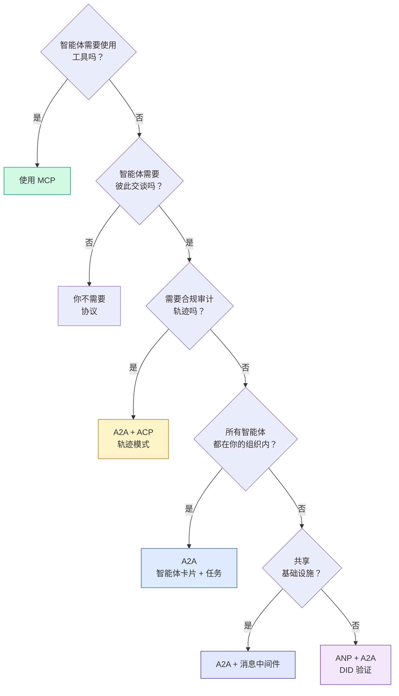

## 交付成果

本课产出:
- `code/main.ts` —— 四种协议模式的完整实现
- `outputs/prompt-protocol-selector.md` —— 为你的系统挑选协议的提示词

## 练习

1. **多跳任务委托。** 扩展 `TaskManager`,使一个智能体处理器能够将子任务委托给其他智能体。研究员接收一个任务,将"搜索"和"摘要"子任务委托给两个专家智能体,等待两者完成,然后将结果合并到自己的产出物中。

2. **流式审计轨迹。** 修改 `AuditableRunner` 以支持流式传输模式。不等待完整结果,而是在轨迹条目被添加时实时产出 `AuditEntry` 更新。使用一个异步生成器来产出审计快照。

3. **DID 轮换。** 为 `IdentityRegistry` 增加密钥轮换。一个智能体应当能够发布带有更新密钥的新 DID 文档,同时维护 `previousDid` 引用。验证方在宽限期内应接受当前密钥和先前密钥两者的签名。

4. **协议协商。** 实现 ANP 的元协议概念。两个智能体交换 `protocolNegotiation` 消息,附带候选格式（例如——"我会说 JSON-RPC"对"我偏好 REST"）。在最多 3 轮之后,它们约定格式或超时。约定的格式决定它们使用哪个 `TaskManager` 或 `AuditableRunner`。

5. **限速发现。** 添加一个 `RateLimitedRegistry` 包装器,以可配置的 TTL 缓存智能体卡片查询,并限制每个智能体每秒的发现查询次数。模拟 100 个智能体在启动时同时发现彼此的惊群效应,并测量差异。

## 关键术语

| 术语 | 人们常这么说 | 实际含义 |
|------|----------------|----------------------|
| MCP | 「AI 工具协议」 | 用于智能体发现和使用工具的客户端-服务器协议。智能体到工具,而非智能体到智能体。 |
| A2A | 「Google 的智能体协议」 | Linux 基金会旗下的对等智能体协作协议。通过智能体卡片发现,9 种状态的任务生命周期,通过 SSE 流式传输。支持 JSON-RPC、REST 与 gRPC 绑定。 |
| ACP | 「企业智能体消息协议」 | IBM/BeeAI 的 REST API,用于带轨迹元数据的智能体运行:每条响应都带有完整的推理链与工具调用记录。正合入 A2A。 |
| ANP | 「去中心化智能体身份协议」 | 社区协议,使用 `did:wba`（DID）作为加密身份,HPKE 用于端到端加密,AI 驱动的元协议协商让从未见过的智能体相互通信。 |
| 智能体卡片 | 「智能体的名片」 | 一份位于 `/.well-known/agent-card.json` 的 JSON 文档,描述技能、支持的 MIME 类型、安全方案与协议绑定。 |
| DID | 「去中心化标识符」 | W3C 标准,用于加密可验证的身份,托管在智能体自己的域上。ANP 使用 `did:wba` 方法。 |
| 轨迹元数据 | 「审计回执」 | ACP 的机制,用于将推理步骤、工具调用及其输入/输出附着到每条智能体响应上。 |
| 元协议 | 「智能体就如何通信进行协商」 | ANP 的方法,智能体使用自然语言动态约定数据格式,然后生成代码来处理这些格式。 |
| 任务 | 「一个工作单元」 | A2A 中追踪从提交到完成的工作的有状态对象,一旦终止即不可变。 |

## 延伸阅读

- [Google A2A 规范](https://github.com/google/A2A) —— 官方规范与 SDK（v1.0.0,Linux 基金会）
- [IBM/BeeAI ACP 规范](https://github.com/i-am-bee/acp) —— 用于智能体运行与轨迹元数据的 OpenAPI 3.1 规范
- [智能体网络协议](https://github.com/agent-network-protocol/AgentNetworkProtocol) —— 基于 DID 的身份、端到端加密、元协议协商
- [模型上下文协议文档](https://modelcontextprotocol.io/) —— Anthropic 的 MCP 规范（Phase 13 已覆盖）
- [W3C 去中心化标识符](https://www.w3.org/TR/did-core/) —— 支撑 ANP 的身份标准
- [RFC 9180（HPKE)](https://www.rfc-editor.org/rfc/rfc9180) —— ANP 用于端到端加密的加密方案
- [FIPA 智能体通信语言](http://www.fipa.org/specs/fipa00061/SC00061G.html) —— 现代智能体协议的学术前身
