# 通信协议（Communication Protocols）

> 译注：本文译自同目录 [`en.md`](./en.md)。术语遵循仓根 [TRANSLATION_GUIDE.md](../../../../TRANSLATION_GUIDE.md)。

> 不能讲同一种语言的 agent 不是团队，是一群对着虚空喊话的陌生人。

**Type:** Build
**Languages:** TypeScript
**Prerequisites:** Phase 14 (Agent Engineering), Lesson 16.01 (Why Multi-Agent)
**Time:** ~120 minutes

## 学习目标（Learning Objectives）

- 实现 MCP 工具发现与调用，让 agent 能使用外部 server 暴露的工具
- 构建 A2A agent card 与 task endpoint，让一个 agent 能通过 HTTP 把工作委派给另一个 agent
- 对比 MCP（工具访问）、A2A（agent 间协作）、ACP（企业级审计）、ANP（去中心化信任），并解释每种协议解决的问题
- 在同一个系统里把多个协议串起来：agent 通过 MCP 发现工具，通过 A2A 委派任务

## 问题（The Problem）

你把系统拆成了多个 agent。一个研究员、一个程序员、一个 reviewer（验证器）。它们各自的活儿干得都很漂亮。但现在你需要它们真正彼此对话。

你的第一反应很自然：传字符串。研究员返回一坨文本，程序员尽力去解析。这能用，直到程序员误读了某份研究摘要，或者两个 agent 互相等死锁，或者你需要不同团队写的 agent 彼此协作。突然之间，「随便传字符串」就崩了。

这就是通信协议问题。如果没有一个共同的契约规定 agent 之间怎么交换信息，多 agent 系统就会脆弱、不可审计，而且无法扩展到你亲手写的那几个 agent 之外。

AI 生态给出了四种协议作为回答，每一种解决问题的一个切片：

- **MCP** 解决工具访问
- **A2A** 解决 agent 间协作
- **ACP** 解决企业级可审计
- **ANP** 解决去中心化身份与信任

这一课讲得深。你会读到每个 spec 真实的 wire format，构建可运行的实现，并把这四种协议串成一个统一的系统。

## 概念（The Concept）

### 协议全景（The Protocol Landscape）

把这四种协议想象成层，每层回答一个不同的问题：

```mermaid
block-beta
  columns 1
  block:ANP["ANP — agent 如何信任陌生对象？\n去中心化身份（DID）、E2EE、元协议"]
  end
  block:A2A["A2A — agent 如何就目标协作？\nAgent Card、任务生命周期、流式、协商"]
  end
  block:ACP["ACP — agent 如何在可审计系统中对话？\n运行、轨迹元数据、会话连续性"]
  end
  block:MCP["MCP — agent 如何使用一个 tool？\ntool 发现、执行、上下文共享"]
  end

  style ANP fill:#f3e8ff,stroke:#7c3aed
  style A2A fill:#dbeafe,stroke:#2563eb
  style ACP fill:#fef3c7,stroke:#d97706
  style MCP fill:#d1fae5,stroke:#059669
```

它们不是竞争关系，而是在不同层次上解决不同的问题。

### MCP 回顾（MCP (Recap)）

MCP 在 Phase 13 已深入讲过。简短回顾：MCP 标准化了 LLM 如何连到外部工具与数据源。这是一个 **client-server** 协议，agent（client）发现并调用 server 暴露的工具。

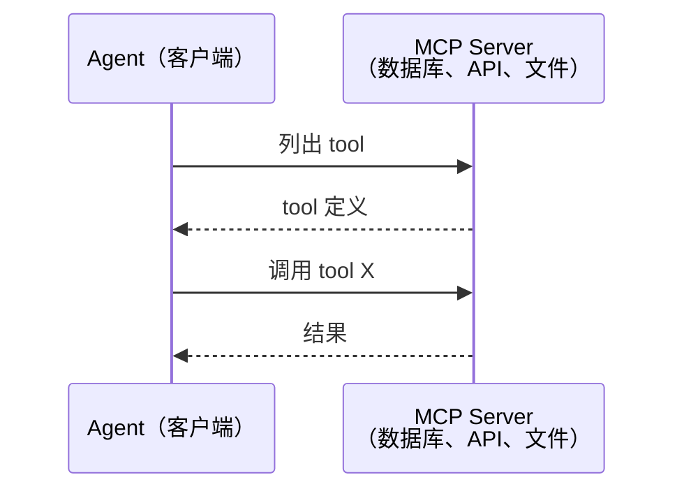

MCP 处理的是 **agent 到工具** 的通信，对 agent 之间的对话没帮助。

### A2A（Agent2Agent Protocol）

**Created by:** Google（现已纳入 Linux Foundation，作为 `lf.a2a.v1`）
**Spec version:** 1.0.0
**Problem:** 自治 agent 如何彼此协作、协商、委派任务？

A2A 是 **peer-to-peer agent 协作** 的协议。MCP 把 agent 连到工具，A2A 把 agent 连到其他 agent。每个 agent 在一个 well-known URL 上发布一份 **Agent Card**，其他 agent 据此发现它、与它协商、把任务委派给它。

#### A2A 如何工作（How A2A Works）

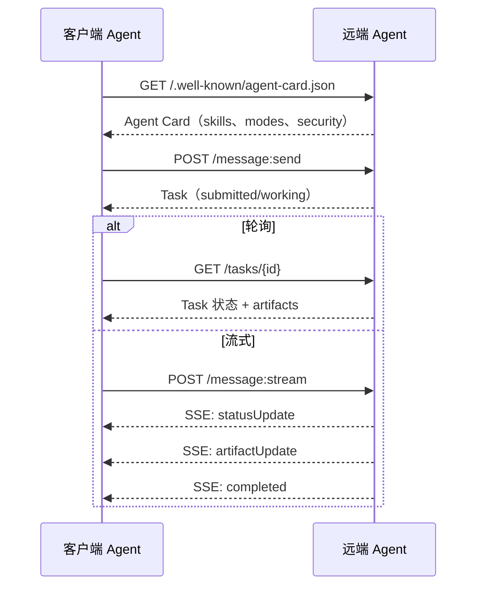

#### 真实的 Agent Card（The Real Agent Card）

下面是真实场景中 A2A Agent Card 的样子，由 `GET /.well-known/agent-card.json` 返回：

```json
{
  "name": "Research Agent",
  "description": "Searches documentation and summarizes findings",
  "version": "1.0.0",
  "supportedInterfaces": [
    {
      "url": "https://research-agent.example.com/a2a/v1",
      "protocolBinding": "JSONRPC",
      "protocolVersion": "1.0"
    },
    {
      "url": "https://research-agent.example.com/a2a/rest",
      "protocolBinding": "HTTP+JSON",
      "protocolVersion": "1.0"
    }
  ],
  "provider": {
    "organization": "Your Company",
    "url": "https://example.com"
  },
  "capabilities": {
    "streaming": true,
    "pushNotifications": false
  },
  "defaultInputModes": ["text/plain", "application/json"],
  "defaultOutputModes": ["text/plain", "application/json"],
  "skills": [
    {
      "id": "web-research",
      "name": "Web Research",
      "description": "Searches the web and synthesizes findings",
      "tags": ["research", "search", "summarization"],
      "examples": ["Research the latest changes in React 19"]
    },
    {
      "id": "doc-analysis",
      "name": "Documentation Analysis",
      "description": "Reads and analyzes technical documentation",
      "tags": ["docs", "analysis"],
      "inputModes": ["text/plain", "application/pdf"],
      "outputModes": ["application/json"]
    }
  ],
  "securitySchemes": {
    "bearer": {
      "httpAuthSecurityScheme": {
        "scheme": "Bearer",
        "bearerFormat": "JWT"
      }
    }
  },
  "security": [{ "bearer": [] }]
}
```

要注意几点：
- **Skills** 是 agent 能做的事。每项 skill 有 ID、tags 以及支持的输入 / 输出 MIME 类型。client agent 据此判断这个远端 agent 是否能处理自己的请求。
- **supportedInterfaces** 列出了多种协议绑定。一个 agent 可以同时讲 JSON-RPC、REST 和 gRPC。
- **Security** 直接写在 card 里。client 在发出第一个请求之前就知道需要哪种鉴权。

#### Task 生命周期（Task Lifecycle）

Task 是 A2A 中最核心的工作单元，会经过若干已定义的状态：

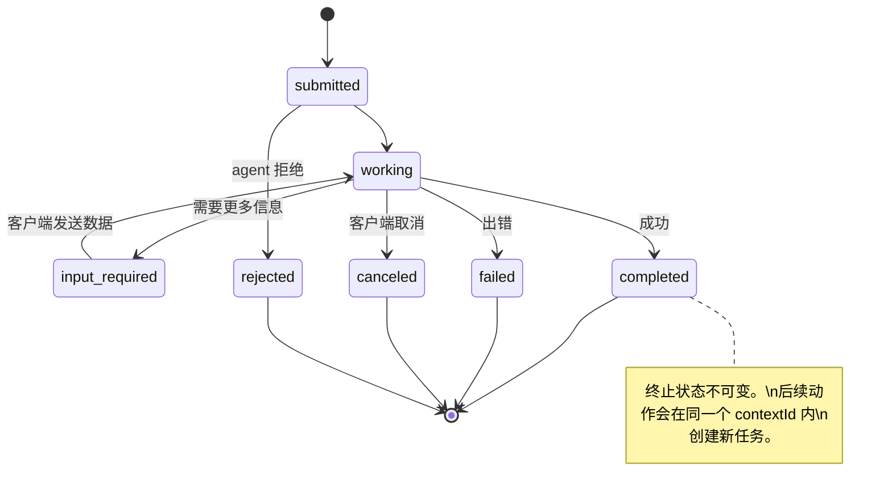

全部 8 种状态（spec 中还定义了一个 `UNSPECIFIED` 哨兵值，此处省略）：

| 状态 | 是否终态？ | 含义 |
|---|---|---|
| `TASK_STATE_SUBMITTED` | 否 | 已确认，但尚未处理 |
| `TASK_STATE_WORKING` | 否 | 正在被处理 |
| `TASK_STATE_INPUT_REQUIRED` | 否 | agent 需要 client 补充信息 |
| `TASK_STATE_AUTH_REQUIRED` | 否 | 需要鉴权 |
| `TASK_STATE_COMPLETED` | 是 | 成功完成 |
| `TASK_STATE_FAILED` | 是 | 失败结束 |
| `TASK_STATE_CANCELED` | 是 | 完成前被取消 |
| `TASK_STATE_REJECTED` | 是 | agent 拒绝该任务 |

一旦 task 进入终态，就不可变了——不再有更多消息。后续追问会在同一 `contextId` 下创建新的 task。

#### Wire Format

A2A 使用 JSON-RPC 2.0。下面是真实的消息交换样例：

**Client 发送一个任务：**
```json
{
  "jsonrpc": "2.0",
  "id": 1,
  "method": "SendMessage",
  "params": {
    "message": {
      "messageId": "msg-001",
      "role": "ROLE_USER",
      "parts": [{ "text": "Research React 19 compiler features" }]
    },
    "configuration": {
      "acceptedOutputModes": ["text/plain", "application/json"],
      "historyLength": 10
    }
  }
}
```

**Agent 返回一个 task：**
```json
{
  "jsonrpc": "2.0",
  "id": 1,
  "result": {
    "task": {
      "id": "task-abc-123",
      "contextId": "ctx-xyz-789",
      "status": {
        "state": "TASK_STATE_COMPLETED",
        "timestamp": "2026-03-27T10:30:00Z"
      },
      "artifacts": [
        {
          "artifactId": "art-001",
          "name": "research-results",
          "parts": [{
            "data": {
              "findings": [
                "React 19 compiler auto-memoizes components",
                "No more manual useMemo/useCallback needed",
                "Compiler runs at build time, not runtime"
              ]
            },
            "mediaType": "application/json"
          }]
        }
      ]
    }
  }
}
```

**通过 SSE streaming：**
```text
POST /message:stream HTTP/1.1
Content-Type: application/json
A2A-Version: 1.0

data: {"task":{"id":"task-123","status":{"state":"TASK_STATE_WORKING"}}}

data: {"statusUpdate":{"taskId":"task-123","status":{"state":"TASK_STATE_WORKING","message":{"role":"ROLE_AGENT","parts":[{"text":"Searching documentation..."}]}}}}

data: {"artifactUpdate":{"taskId":"task-123","artifact":{"artifactId":"art-1","parts":[{"text":"partial findings..."}]},"append":true,"lastChunk":false}}

data: {"statusUpdate":{"taskId":"task-123","status":{"state":"TASK_STATE_COMPLETED"}}}
```

### ACP（Agent Communication Protocol）

**Created by:** IBM / BeeAI
**Spec version:** 0.2.0（OpenAPI 3.1.1）
**Status:** 正在并入 Linux Foundation 下的 A2A
**Problem:** agent 如何在保留完整可审计性、session 连续性和轨迹追踪的前提下通信？

ACP 是 **企业级协议**。和很多摘要里说的不同，ACP **并不**使用 JSON-LD，它就是一个用 OpenAPI 描述的、直白的 REST/JSON API。它的真正特色是 **TrajectoryMetadata**：每个 agent 响应都可以携带产生该响应的推理步骤与工具调用的详细日志。

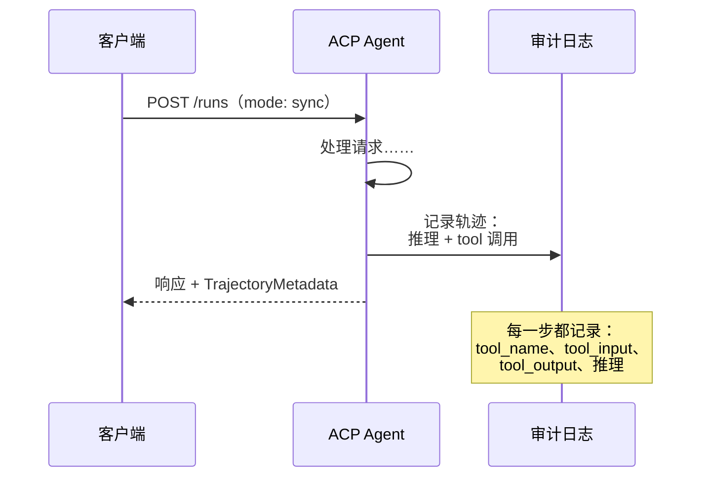

#### ACP 中的 agent 发现（Agent Discovery in ACP）

ACP 定义了四种发现方式：


**AgentManifest** 比 A2A 的 Agent Card 简单：

```json
{
  "name": "summarizer",
  "description": "Summarizes documents with source citations",
  "input_content_types": ["text/plain", "application/pdf"],
  "output_content_types": ["text/plain", "application/json"],
  "metadata": {
    "tags": ["summarization", "RAG"],
    "framework": "BeeAI",
    "capabilities": [
      {
        "name": "Document Summarization",
        "description": "Condenses long documents into key points"
      }
    ],
    "recommended_models": ["llama3.3:70b-instruct-fp16"],
    "license": "Apache-2.0",
    "programming_language": "Python"
  }
}
```

#### Run 生命周期（Run Lifecycle）

ACP 用「Run」而非「Task」。Run 是一次 agent 执行，有三种模式：

| 模式 | 行为 |
|---|---|
| `sync` | 阻塞。响应里直接包含完整结果。 |
| `async` | 立刻返回 202。轮询 `GET /runs/{id}` 查状态。 |
| `stream` | SSE 流。事件随 agent 工作过程实时触发。 |

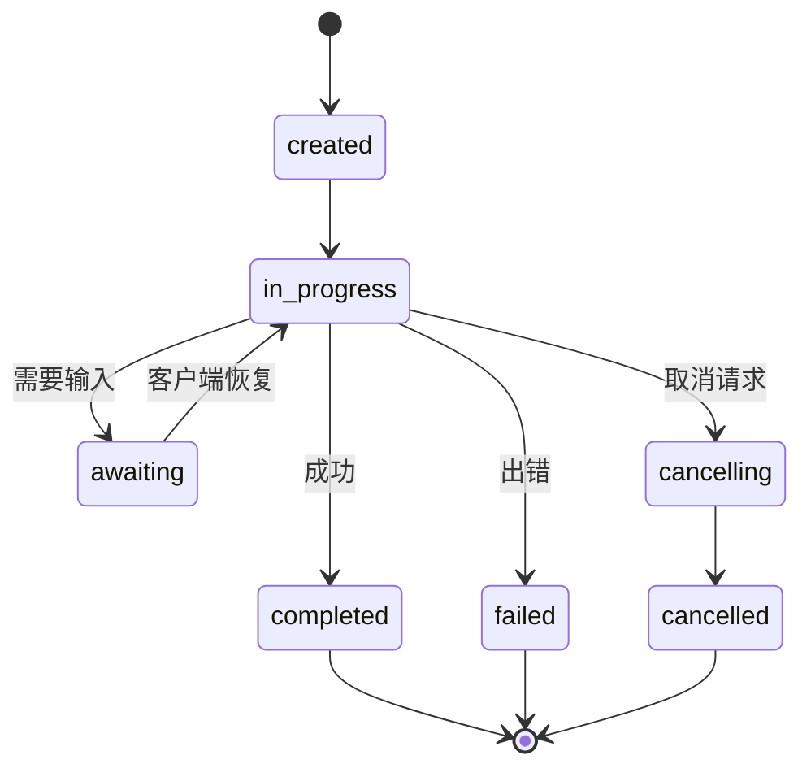

#### TrajectoryMetadata（审计轨迹）

这是 ACP 的核心差异点。每个消息 part 都可以带上 metadata，精确记录 agent 做了什么：

```json
{
  "role": "agent/researcher",
  "parts": [
    {
      "content_type": "text/plain",
      "content": "The weather in San Francisco is 72F and sunny.",
      "metadata": {
        "kind": "trajectory",
        "message": "I need to check the weather for this location",
        "tool_name": "weather_api",
        "tool_input": { "location": "San Francisco, CA" },
        "tool_output": { "temperature": 72, "condition": "sunny" }
      }
    }
  ]
}
```

对受监管行业来说这就是金矿。每个回答都附带可证明的推理链：调用了哪些工具、使用了什么输入、得到了什么输出。没有黑盒。

ACP 还支持 **CitationMetadata** 用于来源溯源：

```json
{
  "kind": "citation",
  "start_index": 0,
  "end_index": 47,
  "url": "https://weather.gov/sf",
  "title": "NWS San Francisco Forecast"
}
```

### ANP（Agent Network Protocol）

**Created by:** 开源社区（由 GaoWei Chang 发起）
**Repo:** [github.com/agent-network-protocol/AgentNetworkProtocol](https://github.com/agent-network-protocol/AgentNetworkProtocol)
**Problem:** 不同组织的 agent 如何在没有中心化权威的情况下彼此信任？

ANP 是 **去中心化身份协议**。它使用 W3C Decentralized Identifiers（DID，去中心化标识符）和端到端加密来建立信任。和 A2A 通过已知 endpoint 发现 agent 不同，ANP 让 agent 能用密码学方式证明自己的身份。

ANP 有三层：

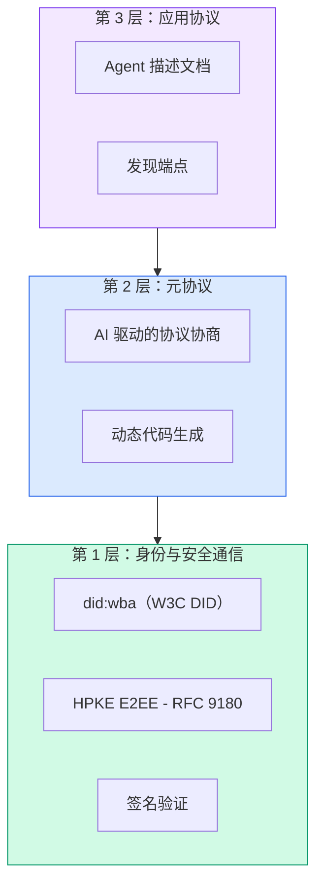

#### DID 文档（真实结构）

ANP 使用一种自定义 DID 方法 `did:wba`（Web-Based Agent）。`did:wba:example.com:user:alice` 这个 DID 解析到 `https://example.com/user/alice/did.json`：

```json
{
  "@context": [
    "https://www.w3.org/ns/did/v1",
    "https://w3id.org/security/suites/jws-2020/v1",
    "https://w3id.org/security/suites/secp256k1-2019/v1"
  ],
  "id": "did:wba:example.com:user:alice",
  "verificationMethod": [
    {
      "id": "did:wba:example.com:user:alice#key-1",
      "type": "EcdsaSecp256k1VerificationKey2019",
      "controller": "did:wba:example.com:user:alice",
      "publicKeyJwk": {
        "crv": "secp256k1",
        "x": "NtngWpJUr-rlNNbs0u-Aa8e16OwSJu6UiFf0Rdo1oJ4",
        "y": "qN1jKupJlFsPFc1UkWinqljv4YE0mq_Ickwnjgasvmo",
        "kty": "EC"
      }
    },
    {
      "id": "did:wba:example.com:user:alice#key-x25519-1",
      "type": "X25519KeyAgreementKey2019",
      "controller": "did:wba:example.com:user:alice",
      "publicKeyMultibase": "z9hFgmPVfmBZwRvFEyniQDBkz9LmV7gDEqytWyGZLmDXE"
    }
  ],
  "authentication": [
    "did:wba:example.com:user:alice#key-1"
  ],
  "keyAgreement": [
    "did:wba:example.com:user:alice#key-x25519-1"
  ],
  "humanAuthorization": [
    "did:wba:example.com:user:alice#key-1"
  ],
  "service": [
    {
      "id": "did:wba:example.com:user:alice#agent-description",
      "type": "AgentDescription",
      "serviceEndpoint": "https://example.com/agents/alice/ad.json"
    }
  ]
}
```

要注意几点：
- **密钥分离**是强制的。签名密钥（secp256k1）与加密密钥（X25519）分开。
- **`humanAuthorization`** 是 ANP 独有的。这些密钥在使用前需要明确的人类批准（生物识别、密码、HSM）。资金转移这类高风险操作走这条路径。
- **`keyAgreement`** 密钥用于 HPKE 端到端加密（RFC 9180）。
- **service** 部分链接到 Agent Description 文档。

#### ANP 中的信任如何建立（How Trust Works in ANP）

ANP **不**用信任网或背书图。信任是双边的，每次交互都重新验证：

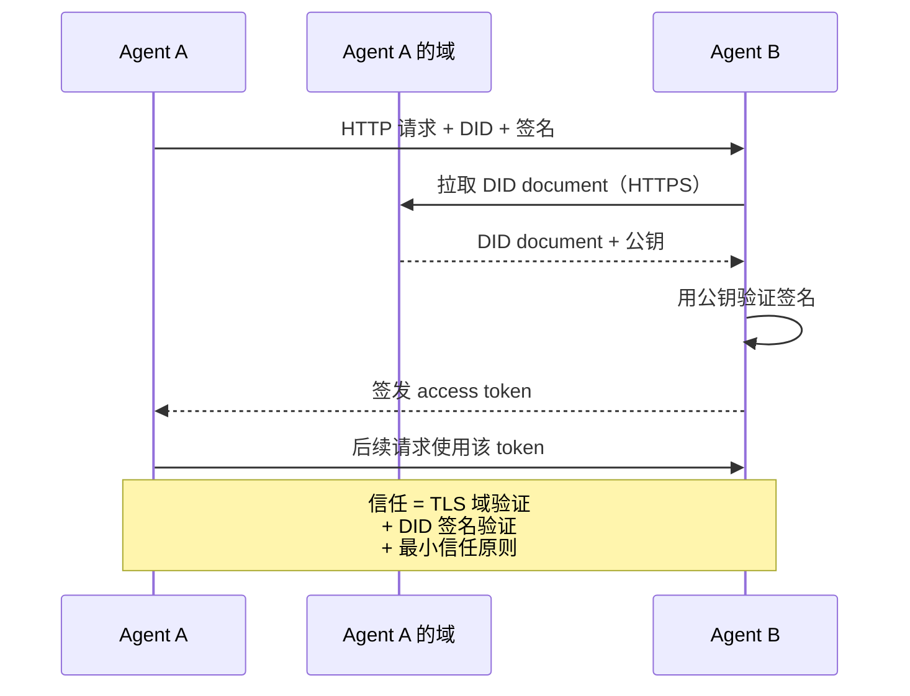

信任来自三个来源：
1. **域级 TLS** 验证 DID 文档所在 host
2. **DID 密码学签名** 验证 agent 身份
3. **最小信任原则**只授予最小权限

这里没有基于流言的信任传播，也没有 PageRank 评分。你直接通过 DID 校验每个 agent。

#### Meta-Protocol 协商（Meta-Protocol Negotiation）

这是 ANP 最新颖的特性。当来自不同生态的两个 agent 相遇时，它们不需要预先约定的数据格式，而是用自然语言协商：

```json
{
  "action": "protocolNegotiation",
  "sequenceId": 0,
  "candidateProtocols": "I can communicate using:\n1. JSON-RPC with hotel booking schema\n2. REST with OpenAPI 3.1 spec\n3. Natural language over HTTP",
  "modificationSummary": "Initial proposal",
  "status": "negotiating"
}
```

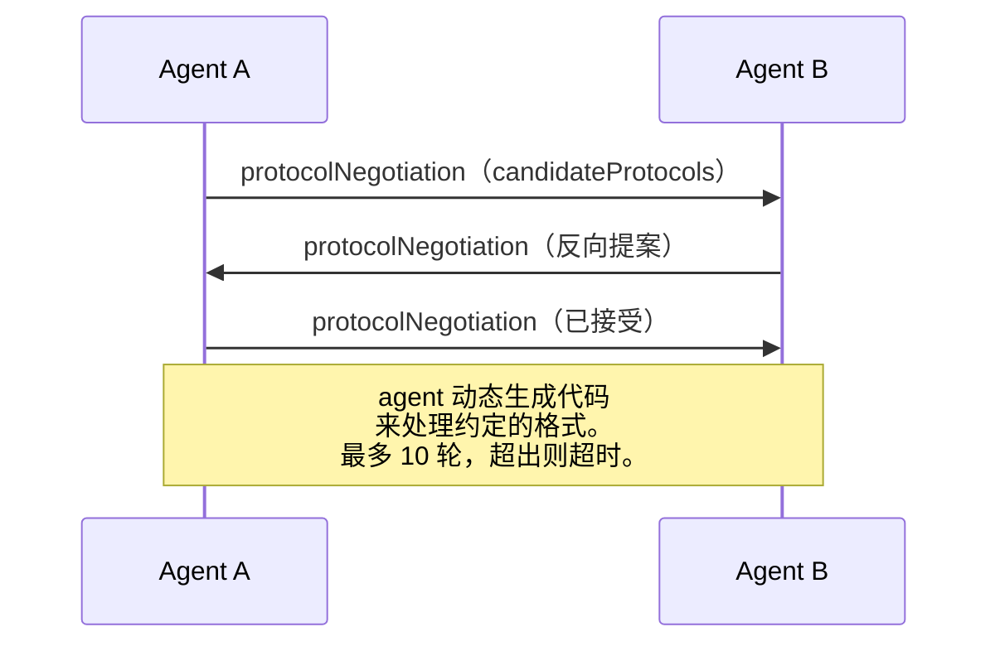

agent 来回拉锯（最多 10 轮）直到就格式达成一致，然后动态生成代码来处理它。状态值有：`negotiating`、`rejected`、`accepted`、`timeout`。

这意味着两个素未谋面的 agent，在没人提前定义共享 schema 的情况下，也能找到办法通信。

### 对比（修正版）（Comparison (Corrected)）

| | MCP | A2A | ACP | ANP |
|---|---|---|---|---|
| **Created by** | Anthropic | Google / Linux Foundation | IBM / BeeAI | 社区 |
| **Spec format** | JSON-RPC | JSON-RPC / REST / gRPC | OpenAPI 3.1（REST） | JSON-RPC |
| **主要用途** | Agent 到工具 | Agent 到 Agent | Agent 到 Agent | Agent 到 Agent |
| **发现方式** | 列出工具 | `/.well-known/agent-card.json` | `GET /agents`、`/.well-known/agent.yml` | `/.well-known/agent-descriptions`、DID service endpoints |
| **身份** | 隐式（本地） | Security schemes（OAuth、mTLS） | server 级别 | W3C DID（`did:wba`）+ E2EE |
| **审计轨迹** | N/A | 基础（task history） | TrajectoryMetadata（工具调用、推理） | spec 未明确 |
| **状态机** | N/A | 9 个 task 状态 | 7 个 run 状态 | N/A |
| **Streaming** | N/A | SSE | SSE | 与传输无关 |
| **独门特性** | 工具 schema | Agent Cards + Skills | 轨迹审计 | Meta-protocol 协商 |
| **最适用** | 工具与数据 | 动态协作 | 受监管行业 | 跨组织信任 |
| **状态** | 稳定 | 稳定（v1.0） | 正在并入 A2A | 活跃开发中 |

### 它们如何协同（How They Work Together）

这些协议并不是互斥的。一个真实的企业系统会同时用上多个：

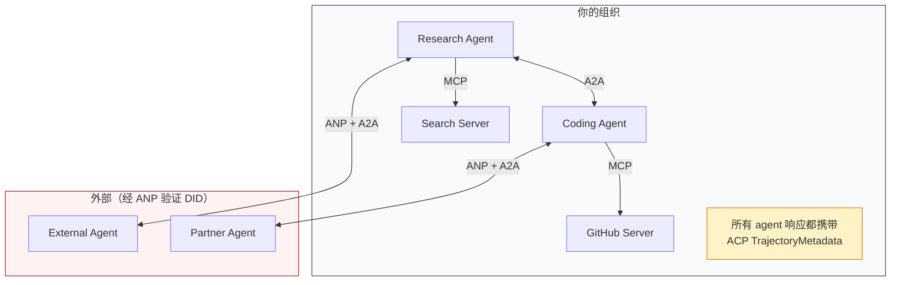

- **MCP** 把每个 agent 连到它的工具
- **A2A** 处理 agent 之间的协作（内部和外部都行）
- **ACP** 在响应里包上轨迹 metadata，提供可审计性
- **ANP** 为你不可控的 agent 提供身份验证

## 动手实现（Build It）

### Step 1：核心消息类型（Core Message Types）

每个多 agent 系统都从一种消息格式开始。我们定义的类型会对应到真实协议在用的东西：

```typescript
import crypto from "node:crypto";

type MessageRole = "user" | "agent";

type MessagePart =
  | { kind: "text"; text: string }
  | { kind: "data"; data: unknown; mediaType: string }
  | { kind: "file"; name: string; url: string; mediaType: string };

type TrajectoryEntry = {
  reasoning: string;
  toolName?: string;
  toolInput?: unknown;
  toolOutput?: unknown;
  timestamp: number;
};

type AgentMessage = {
  id: string;
  role: MessageRole;
  parts: MessagePart[];
  trajectory?: TrajectoryEntry[];
  replyTo?: string;
  timestamp: number;
};

function createMessage(
  role: MessageRole,
  parts: MessagePart[],
  replyTo?: string
): AgentMessage {
  return {
    id: crypto.randomUUID(),
    role,
    parts,
    replyTo,
    timestamp: Date.now(),
  };
}

function textMessage(role: MessageRole, text: string): AgentMessage {
  return createMessage(role, [{ kind: "text", text }]);
}
```

注意：`MessagePart` 是多模态的（text、结构化 data、文件），和真实的 A2A、ACP spec 一致。`TrajectoryEntry` 捕获推理链，对应 ACP 的 TrajectoryMetadata。

### Step 2：A2A Agent Card 与 Registry

按真实 A2A spec 来实现 agent 发现：

```typescript
type Skill = {
  id: string;
  name: string;
  description: string;
  tags: string[];
  inputModes: string[];
  outputModes: string[];
};

type AgentCard = {
  name: string;
  description: string;
  version: string;
  url: string;
  capabilities: {
    streaming: boolean;
    pushNotifications: boolean;
  };
  defaultInputModes: string[];
  defaultOutputModes: string[];
  skills: Skill[];
};

class AgentRegistry {
  private cards: Map<string, AgentCard> = new Map();

  register(card: AgentCard) {
    this.cards.set(card.name, card);
  }

  discoverBySkillTag(tag: string): AgentCard[] {
    return [...this.cards.values()].filter((card) =>
      card.skills.some((skill) => skill.tags.includes(tag))
    );
  }

  discoverByInputMode(mimeType: string): AgentCard[] {
    return [...this.cards.values()].filter(
      (card) =>
        card.defaultInputModes.includes(mimeType) ||
        card.skills.some((skill) => skill.inputModes.includes(mimeType))
    );
  }

  resolve(name: string): AgentCard | undefined {
    return this.cards.get(name);
  }

  listAll(): AgentCard[] {
    return [...this.cards.values()];
  }
}
```

这比一个简单的「name → capability」map 丰富得多。你可以按 skill tags、按输入 MIME 类型、或按名字发现 agent，正如真实 A2A spec 支持的那样。

### Step 3：A2A Task 生命周期

把完整的 task 状态机搭起来：

```typescript
type TaskState =
  | "submitted"
  | "working"
  | "input-required"
  | "auth-required"
  | "completed"
  | "failed"
  | "canceled"
  | "rejected";

const TERMINAL_STATES: TaskState[] = [
  "completed",
  "failed",
  "canceled",
  "rejected",
];

type TaskStatus = {
  state: TaskState;
  message?: AgentMessage;
  timestamp: number;
};

type Artifact = {
  id: string;
  name: string;
  parts: MessagePart[];
};

type Task = {
  id: string;
  contextId: string;
  status: TaskStatus;
  artifacts: Artifact[];
  history: AgentMessage[];
};

type TaskEvent =
  | { kind: "statusUpdate"; taskId: string; status: TaskStatus }
  | {
      kind: "artifactUpdate";
      taskId: string;
      artifact: Artifact;
      append: boolean;
      lastChunk: boolean;
    };

type TaskHandler = (
  task: Task,
  message: AgentMessage
) => AsyncGenerator<TaskEvent>;

class TaskManager {
  private tasks: Map<string, Task> = new Map();
  private handlers: Map<string, TaskHandler> = new Map();
  private listeners: Map<string, ((event: TaskEvent) => void)[]> = new Map();

  registerHandler(agentName: string, handler: TaskHandler) {
    this.handlers.set(agentName, handler);
  }

  subscribe(taskId: string, listener: (event: TaskEvent) => void) {
    const existing = this.listeners.get(taskId) ?? [];
    existing.push(listener);
    this.listeners.set(taskId, existing);
  }

  async sendMessage(
    agentName: string,
    message: AgentMessage,
    contextId?: string
  ): Promise<Task> {
    const handler = this.handlers.get(agentName);
    if (!handler) {
      const task = this.createTask(contextId);
      task.status = {
        state: "rejected",
        timestamp: Date.now(),
        message: textMessage("agent", `No handler for ${agentName}`),
      };
      return task;
    }

    const task = this.createTask(contextId);
    task.history.push(message);
    task.status = { state: "submitted", timestamp: Date.now() };

    this.processTask(task, handler, message).catch((err) => {
      task.status = {
        state: "failed",
        timestamp: Date.now(),
        message: textMessage("agent", String(err)),
      };
    });
    return task;
  }

  getTask(taskId: string): Task | undefined {
    return this.tasks.get(taskId);
  }

  cancelTask(taskId: string): boolean {
    const task = this.tasks.get(taskId);
    if (!task || TERMINAL_STATES.includes(task.status.state)) return false;
    task.status = { state: "canceled", timestamp: Date.now() };
    this.emit(taskId, {
      kind: "statusUpdate",
      taskId,
      status: task.status,
    });
    return true;
  }

  private createTask(contextId?: string): Task {
    const task: Task = {
      id: crypto.randomUUID(),
      contextId: contextId ?? crypto.randomUUID(),
      status: { state: "submitted", timestamp: Date.now() },
      artifacts: [],
      history: [],
    };
    this.tasks.set(task.id, task);
    return task;
  }

  private async processTask(
    task: Task,
    handler: TaskHandler,
    message: AgentMessage
  ) {
    task.status = { state: "working", timestamp: Date.now() };
    this.emit(task.id, {
      kind: "statusUpdate",
      taskId: task.id,
      status: task.status,
    });

    try {
      for await (const event of handler(task, message)) {
        if (TERMINAL_STATES.includes(task.status.state)) break;

        if (event.kind === "statusUpdate") {
          task.status = event.status;
        }
        if (event.kind === "artifactUpdate") {
          const existing = task.artifacts.find(
            (a) => a.id === event.artifact.id
          );
          if (existing && event.append) {
            existing.parts.push(...event.artifact.parts);
          } else {
            task.artifacts.push(event.artifact);
          }
        }
        this.emit(task.id, event);
      }
    } catch (err) {
      task.status = {
        state: "failed",
        timestamp: Date.now(),
        message: textMessage("agent", String(err)),
      };
      this.emit(task.id, {
        kind: "statusUpdate",
        taskId: task.id,
        status: task.status,
      });
    }
  }

  private emit(taskId: string, event: TaskEvent) {
    for (const listener of this.listeners.get(taskId) ?? []) {
      listener(event);
    }
  }
}
```

这实现了真实的 A2A task 生命周期：submitted、working、input-required，以及各种终态。Handler 是 async generator，yield 出事件（状态更新与 artifact 分块），契合 SSE streaming 模型。

### Step 4：ACP 风格的审计轨迹（ACP-Style Audit Trail）

把通信用轨迹追踪包起来：

```typescript
type AuditEntry = {
  runId: string;
  agentName: string;
  input: AgentMessage[];
  output: AgentMessage[];
  trajectory: TrajectoryEntry[];
  status: "created" | "in-progress" | "completed" | "failed" | "awaiting";
  startedAt: number;
  completedAt?: number;
  sessionId?: string;
};

class AuditableRunner {
  private log: AuditEntry[] = [];
  private handlers: Map<
    string,
    (input: AgentMessage[]) => Promise<{
      output: AgentMessage[];
      trajectory: TrajectoryEntry[];
    }>
  > = new Map();

  registerAgent(
    name: string,
    handler: (input: AgentMessage[]) => Promise<{
      output: AgentMessage[];
      trajectory: TrajectoryEntry[];
    }>
  ) {
    this.handlers.set(name, handler);
  }

  async run(
    agentName: string,
    input: AgentMessage[],
    sessionId?: string
  ): Promise<AuditEntry> {
    const entry: AuditEntry = {
      runId: crypto.randomUUID(),
      agentName,
      input: structuredClone(input),
      output: [],
      trajectory: [],
      status: "created",
      startedAt: Date.now(),
      sessionId,
    };
    this.log.push(entry);

    const handler = this.handlers.get(agentName);
    if (!handler) {
      entry.status = "failed";
      return entry;
    }

    entry.status = "in-progress";
    try {
      const result = await handler(input);
      entry.output = structuredClone(result.output);
      entry.trajectory = structuredClone(result.trajectory);
      entry.status = "completed";
      entry.completedAt = Date.now();
    } catch (err) {
      entry.status = "failed";
      entry.trajectory.push({
        reasoning: `Error: ${String(err)}`,
        timestamp: Date.now(),
      });
      entry.completedAt = Date.now();
    }
    return entry;
  }

  getFullAuditLog(): AuditEntry[] {
    return structuredClone(this.log);
  }

  getAuditLogForAgent(agentName: string): AuditEntry[] {
    return structuredClone(
      this.log.filter((e) => e.agentName === agentName)
    );
  }

  getAuditLogForSession(sessionId: string): AuditEntry[] {
    return structuredClone(
      this.log.filter((e) => e.sessionId === sessionId)
    );
  }

  getTrajectoryForRun(runId: string): TrajectoryEntry[] {
    const entry = this.log.find((e) => e.runId === runId);
    return entry ? structuredClone(entry.trajectory) : [];
  }
}
```

每次 agent 执行都产出一个完整的审计条目：什么进去了、什么出来了、中间完整的工具调用与推理轨迹。你可以按 agent、按 session 或按单次 run 来查询。

### Step 5：ANP 风格的身份验证（ANP-Style Identity Verification）

构建基于 DID 的身份与验证：

```typescript
type VerificationMethod = {
  id: string;
  type: string;
  controller: string;
  publicKeyDer: string;
};

type DIDDocument = {
  id: string;
  verificationMethod: VerificationMethod[];
  authentication: string[];
  keyAgreement: string[];
  humanAuthorization: string[];
  service: { id: string; type: string; serviceEndpoint: string }[];
};

type AgentIdentity = {
  did: string;
  document: DIDDocument;
  privateKey: crypto.KeyObject;
  publicKey: crypto.KeyObject;
};

class IdentityRegistry {
  private documents: Map<string, DIDDocument> = new Map();

  publish(doc: DIDDocument) {
    this.documents.set(doc.id, doc);
  }

  resolve(did: string): DIDDocument | undefined {
    return this.documents.get(did);
  }

  verify(did: string, signature: string, payload: string): boolean {
    const doc = this.documents.get(did);
    if (!doc) return false;

    const authKeyIds = doc.authentication;
    const authKeys = doc.verificationMethod.filter((vm) =>
      authKeyIds.includes(vm.id)
    );

    for (const key of authKeys) {
      const publicKey = crypto.createPublicKey({
        key: Buffer.from(key.publicKeyDer, "base64"),
        format: "der",
        type: "spki",
      });
      const isValid = crypto.verify(
        null,
        Buffer.from(payload),
        publicKey,
        Buffer.from(signature, "hex")
      );
      if (isValid) return true;
    }
    return false;
  }

  requiresHumanAuth(did: string, operationKeyId: string): boolean {
    const doc = this.documents.get(did);
    if (!doc) return false;
    return doc.humanAuthorization.includes(operationKeyId);
  }
}

function createIdentity(domain: string, agentName: string): AgentIdentity {
  const did = `did:wba:${domain}:agent:${agentName}`;
  const { publicKey, privateKey } = crypto.generateKeyPairSync("ed25519");

  const publicKeyDer = publicKey
    .export({ format: "der", type: "spki" })
    .toString("base64");

  const keyId = `${did}#key-1`;
  const encKeyId = `${did}#key-x25519-1`;

  const document: DIDDocument = {
    id: did,
    verificationMethod: [
      {
        id: keyId,
        type: "Ed25519VerificationKey2020",
        controller: did,
        publicKeyDer,
      },
      {
        id: encKeyId,
        type: "X25519KeyAgreementKey2019",
        controller: did,
        publicKeyDer,
      },
    ],
    authentication: [keyId],
    keyAgreement: [encKeyId],
    humanAuthorization: [],
    service: [
      {
        id: `${did}#agent-description`,
        type: "AgentDescription",
        serviceEndpoint: `https://${domain}/agents/${agentName}/ad.json`,
      },
    ],
  };

  return { did, document, privateKey, publicKey };
}

function signPayload(identity: AgentIdentity, payload: string): string {
  return crypto
    .sign(null, Buffer.from(payload), identity.privateKey)
    .toString("hex");
}
```

这映射了真实 ANP 的身份模型：agent 拥有 DID 文档，其中 authentication、key agreement、human authorization 三类密钥分离。`IdentityRegistry` 模拟了 DID 解析（生产环境下这是对 agent 所在域名的 HTTP fetch）。

### Step 6：协议网关（Protocol Gateway）

把四种协议串成一个统一的系统：

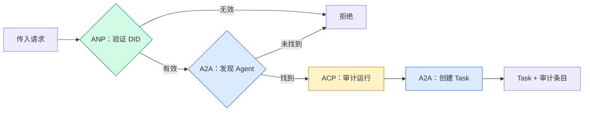

```typescript
class ProtocolGateway {
  private registry: AgentRegistry;
  private taskManager: TaskManager;
  private auditRunner: AuditableRunner;
  private identityRegistry: IdentityRegistry;

  constructor(
    registry: AgentRegistry,
    taskManager: TaskManager,
    auditRunner: AuditableRunner,
    identityRegistry: IdentityRegistry
  ) {
    this.registry = registry;
    this.taskManager = taskManager;
    this.auditRunner = auditRunner;
    this.identityRegistry = identityRegistry;
  }

  async delegateTask(
    fromDid: string,
    signature: string,
    targetAgent: string,
    message: AgentMessage,
    sessionId?: string
  ): Promise<{ task: Task; audit: AuditEntry } | { error: string }> {
    if (!this.identityRegistry.verify(fromDid, signature, message.id)) {
      return { error: "Identity verification failed" };
    }

    const card = this.registry.resolve(targetAgent);
    if (!card) {
      return { error: `Agent ${targetAgent} not found in registry` };
    }

    const audit = await this.auditRunner.run(
      targetAgent,
      [message],
      sessionId
    );
    const task = await this.taskManager.sendMessage(targetAgent, message);

    return { task, audit };
  }

  discoverAndDelegate(
    fromDid: string,
    signature: string,
    skillTag: string,
    message: AgentMessage
  ): Promise<{ task: Task; audit: AuditEntry } | { error: string }> {
    const candidates = this.registry.discoverBySkillTag(skillTag);
    if (candidates.length === 0) {
      return Promise.resolve({
        error: `No agents found with skill tag: ${skillTag}`,
      });
    }
    return this.delegateTask(
      fromDid,
      signature,
      candidates[0].name,
      message
    );
  }
}
```

网关一次调用做四件事：
1. **ANP**：通过 DID 签名验证调用方身份
2. **A2A**：发现目标 agent 并检查能力
3. **ACP**：把执行包进带轨迹的审计条目
4. **A2A**：创建带完整生命周期追踪的 task

### Step 7：把全部串起来（Wire It All Together）

```typescript
async function protocolDemo() {
  const registry = new AgentRegistry();
  registry.register({
    name: "researcher",
    description: "Searches and summarizes findings",
    version: "1.0.0",
    url: "https://researcher.local/a2a/v1",
    capabilities: { streaming: true, pushNotifications: false },
    defaultInputModes: ["text/plain"],
    defaultOutputModes: ["text/plain", "application/json"],
    skills: [
      {
        id: "web-research",
        name: "Web Research",
        description: "Searches the web",
        tags: ["research", "search", "summarization"],
        inputModes: ["text/plain"],
        outputModes: ["application/json"],
      },
    ],
  });
  registry.register({
    name: "coder",
    description: "Writes code from specs",
    version: "1.0.0",
    url: "https://coder.local/a2a/v1",
    capabilities: { streaming: false, pushNotifications: false },
    defaultInputModes: ["text/plain", "application/json"],
    defaultOutputModes: ["text/plain"],
    skills: [
      {
        id: "code-gen",
        name: "Code Generation",
        description: "Generates code",
        tags: ["coding", "generation"],
        inputModes: ["text/plain", "application/json"],
        outputModes: ["text/plain"],
      },
    ],
  });

  const taskManager = new TaskManager();
  const auditRunner = new AuditableRunner();

  const researchTrajectory: TrajectoryEntry[] = [];

  taskManager.registerHandler(
    "researcher",
    async function* (task, message) {
      yield {
        kind: "statusUpdate" as const,
        taskId: task.id,
        status: { state: "working" as const, timestamp: Date.now() },
      };

      researchTrajectory.push({
        reasoning: "Searching for React 19 documentation",
        toolName: "web_search",
        toolInput: { query: "React 19 compiler features" },
        toolOutput: {
          results: ["react.dev/blog/react-19", "github.com/react/react"],
        },
        timestamp: Date.now(),
      });

      researchTrajectory.push({
        reasoning: "Extracting key findings from search results",
        toolName: "doc_analysis",
        toolInput: { url: "react.dev/blog/react-19" },
        toolOutput: {
          summary:
            "React 19 compiler auto-memoizes, no manual useMemo needed",
        },
        timestamp: Date.now(),
      });

      yield {
        kind: "artifactUpdate" as const,
        taskId: task.id,
        artifact: {
          id: crypto.randomUUID(),
          name: "research-results",
          parts: [
            {
              kind: "data" as const,
              data: {
                findings: [
                  "React 19 compiler auto-memoizes components",
                  "No more manual useMemo/useCallback needed",
                  "Compiler runs at build time, not runtime",
                ],
                sources: ["react.dev/blog/react-19"],
              },
              mediaType: "application/json",
            },
          ],
        },
        append: false,
        lastChunk: true,
      };

      yield {
        kind: "statusUpdate" as const,
        taskId: task.id,
        status: { state: "completed" as const, timestamp: Date.now() },
      };
    }
  );

  auditRunner.registerAgent("researcher", async () => ({
    output: [
      textMessage("agent", "React 19 compiler auto-memoizes components"),
    ],
    trajectory: researchTrajectory,
  }));

  const identityRegistry = new IdentityRegistry();

  const coderIdentity = createIdentity("coder.local", "coder");
  const researcherIdentity = createIdentity("researcher.local", "researcher");

  identityRegistry.publish(coderIdentity.document);
  identityRegistry.publish(researcherIdentity.document);

  const gateway = new ProtocolGateway(
    registry,
    taskManager,
    auditRunner,
    identityRegistry
  );

  console.log("=== Protocol Demo ===\n");

  console.log("1. Agent Discovery (A2A)");
  const researchAgents = registry.discoverBySkillTag("research");
  console.log(
    `   Found ${researchAgents.length} agent(s):`,
    researchAgents.map((a) => a.name)
  );

  console.log("\n2. Identity Verification (ANP)");
  const message = textMessage("user", "Research React 19 compiler features");
  const signature = signPayload(coderIdentity, message.id);
  const verified = identityRegistry.verify(
    coderIdentity.did,
    signature,
    message.id
  );
  console.log(`   Coder DID: ${coderIdentity.did}`);
  console.log(`   Signature verified: ${verified}`);

  console.log("\n3. Task Delegation (A2A + ACP + ANP)");
  const result = await gateway.delegateTask(
    coderIdentity.did,
    signature,
    "researcher",
    message,
    "session-001"
  );

  if ("error" in result) {
    console.log(`   Error: ${result.error}`);
    return;
  }

  console.log(`   Task ID: ${result.task.id}`);
  console.log(`   Task state: ${result.task.status.state}`);
  console.log(`   Artifacts: ${result.task.artifacts.length}`);

  console.log("\n4. Audit Trail (ACP)");
  console.log(`   Run ID: ${result.audit.runId}`);
  console.log(`   Status: ${result.audit.status}`);
  console.log(`   Trajectory steps: ${result.audit.trajectory.length}`);
  for (const step of result.audit.trajectory) {
    console.log(`     - ${step.reasoning}`);
    if (step.toolName) {
      console.log(`       Tool: ${step.toolName}`);
    }
  }

  console.log("\n5. Full Audit Log");
  const fullLog = auditRunner.getFullAuditLog();
  console.log(`   Total runs: ${fullLog.length}`);
  for (const entry of fullLog) {
    const duration = entry.completedAt
      ? `${entry.completedAt - entry.startedAt}ms`
      : "in-progress";
    console.log(`   ${entry.agentName}: ${entry.status} (${duration})`);
  }
}

protocolDemo().catch((err) => {
  console.error("Protocol demo failed:", err);
  process.exitCode = 1;
});
```

## 哪里会出问题（What Goes Wrong）

协议解决的是 happy path。下面是生产环境会崩的地方：

**Schema 漂移（Schema drift）。** Agent A 发布的 Agent Card 声明输出是 `application/json`。但 JSON schema 在版本之间变了。Agent B 按旧格式解析，拿到一堆乱码。修法：给 skill 和输出 schema 打版本号。A2A spec 在 Agent Card 上支持 `version` 就是为这个。

**违反状态机。** 一个 agent handler yield 了 `completed` 事件，然后还想继续 yield artifact。task 已经不可变了，你的代码要么静默丢弃更新，要么抛错。修法：yield 之前检查终态。上面的 `TaskManager` 通过终态后 `break` 强制了这一点。

**信任解析失败。** Agent A 想验证 Agent B 的 DID，但 Agent B 的域名挂了，DID 文档 fetch 不到。是 fail open（接受未验证的 agent）还是 fail closed（一律拒绝）？ANP 推荐 fail closed，遵循最小信任原则。

**轨迹爆炸（Trajectory bloat）。** ACP 的轨迹日志强大但昂贵。一个复杂 agent 一次 run 调 200 次工具，会产生庞大的审计条目。修法：按可配置的详细度记录轨迹。合规场景下记录 tool name 和 IO，非监管场景下跳过推理步骤。

**发现风暴（Discovery thundering herd）。** 50 个 agent 启动时同时查 `GET /agents`。修法：给 Agent Card lookup 加 TTL 缓存、错开发现间隔，或者用基于推送的注册替代轮询。

## 用起来（Use It）

### 真实实现（Real Implementations）

**A2A** 是最成熟的。Google 的 [official spec](https://github.com/google/A2A) 在 Linux Foundation 下开源，有 Python 和 TypeScript 的 SDK。如果你的 agent 需要动态发现与协作，从这里开始。

**ACP** 正在并入 A2A。IBM 的 [BeeAI project](https://github.com/i-am-bee/acp) 把 ACP 做成了一个 REST 优先的替代方案，但其轨迹 metadata 概念正被 A2A 生态吸收。即便你用 A2A 做传输，也建议沿用 ACP 的模式（轨迹日志、run 生命周期）。

**ANP** 是最实验性的。[community repo](https://github.com/agent-network-protocol/AgentNetworkProtocol) 提供了 Python SDK（AgentConnect）。meta-protocol 协商这个概念是真正的创新。跨组织 agent 部署时值得关注。

**MCP** 已在 Phase 13 讲过。如果你想让 agent 用工具，MCP 就是标准。

### 选对协议（Picking the Right Protocol）

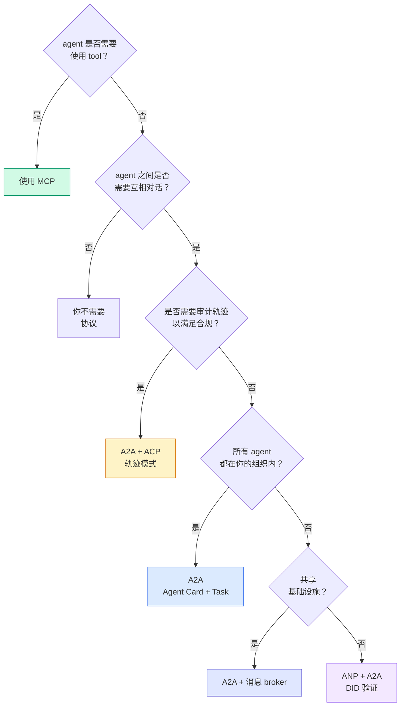

## 上线部署（Ship It）

这一课的产物：
- `code/main.ts` —— 四种协议模式的完整实现
- `outputs/prompt-protocol-selector.md` —— 一份帮你为系统选协议的 prompt

## 练习（Exercises）

1. **多跳任务委派。** 扩展 `TaskManager`，让 agent handler 可以把子任务委派给其他 agent。研究员 agent 收到任务后，把「search」和「summarize」两个子任务分别派给两个专家 agent，等两边都完成后把结果合并到自己的 artifacts 里。

2. **流式审计轨迹。** 修改 `AuditableRunner` 支持 streaming 模式：不要等整个结果出来，而是在轨迹条目陆续产出时实时 yield `AuditEntry` 更新。用 async generator 输出审计快照。

3. **DID 轮换。** 给 `IdentityRegistry` 加上密钥轮换。一个 agent 应该能发布带新密钥的 DID 文档，同时保留 `previousDid` 引用。在过渡期内，验证方应同时接受当前密钥和上一把密钥的签名。

4. **协议协商。** 实现 ANP 的 meta-protocol 概念。两个 agent 互发 `protocolNegotiation` 消息，附带候选格式（比如「我能讲 JSON-RPC」vs「我更喜欢 REST」）。最多 3 轮后，要么达成一致，要么 timeout。约定的格式决定它们走哪个 `TaskManager` 或 `AuditableRunner`。

5. **限流的发现。** 加一个 `RateLimitedRegistry` wrapper，给 Agent Card 查询加 TTL 缓存，并对每个 agent 每秒的发现查询做限流。模拟 100 个 agent 在启动时互相发现的「thundering herd」场景，量化前后差异。

## 关键术语（Key Terms）

| 术语 | 大家怎么说 | 实际含义 |
|------|----------------|----------------------|
| MCP | 「AI 工具的协议」 | 一个 client-server 协议，让 agent 发现并使用工具。是 agent 到工具，不是 agent 到 agent。 |
| A2A | 「Google 的 agent 协议」 | Linux Foundation 下的 peer-to-peer agent 协作协议。通过 Agent Card 发现，9 状态 task 生命周期，SSE streaming。支持 JSON-RPC、REST、gRPC 多种绑定。 |
| ACP | 「企业级 agent 通信」 | IBM/BeeAI 的 agent run REST API，带 TrajectoryMetadata：每个响应都附带完整的推理与工具调用链。正在并入 A2A。 |
| ANP | 「去中心化 agent 身份」 | 一个社区协议，使用 `did:wba`（DID）做密码学身份、用 HPKE 做端到端加密、用 AI 驱动的 meta-protocol 协商让从未谋面的 agent 也能通信。 |
| Agent Card | 「agent 的名片」 | 放在 `/.well-known/agent-card.json` 的 JSON 文档，描述 skill、支持的 MIME 类型、安全方案与协议绑定。 |
| DID | 「Decentralized ID」 | W3C 的可密码学验证身份标准，由 agent 自身的域名托管。ANP 用 `did:wba` 方法。 |
| TrajectoryMetadata | 「审计回执」 | ACP 的机制，把推理步骤、工具调用及其输入输出附加到每个 agent 响应上。 |
| Meta-protocol | 「agent 协商怎么对话」 | ANP 的方式：agent 用自然语言动态商定数据格式，然后生成代码处理。 |
| Task | 「一个工作单元」 | A2A 中追踪从提交到完成全过程的有状态对象，进入终态后即不可变。 |

## 延伸阅读（Further Reading）

- [Google A2A specification](https://github.com/google/A2A) —— 官方 spec 与 SDK（v1.0.0，Linux Foundation）
- [IBM/BeeAI ACP specification](https://github.com/i-am-bee/acp) —— agent run 与轨迹 metadata 的 OpenAPI 3.1 spec
- [Agent Network Protocol](https://github.com/agent-network-protocol/AgentNetworkProtocol) —— 基于 DID 的身份、E2EE、meta-protocol 协商
- [Model Context Protocol docs](https://modelcontextprotocol.io/) —— Anthropic 的 MCP spec（在 Phase 13 中讲过）
- [W3C Decentralized Identifiers](https://www.w3.org/TR/did-core/) —— 支撑 ANP 的身份标准
- [RFC 9180 (HPKE)](https://www.rfc-editor.org/rfc/rfc9180) —— ANP 用于 E2EE 的加密方案
- [FIPA Agent Communication Language](http://www.fipa.org/specs/fipa00061/SC00061G.html) —— 现代 agent 协议的学术先驱
