# 通信协议

> 不能说同一种语言的智能体不是团队。他们是向虚空大喊的陌生人。

**类型：** 构建
**语言：** TypeScript
**前置知识：** 第14阶段（智能体工程），第16.01课（为什么需要多智能体）
**时间：** 约120分钟

## 学习目标

- 实现MCP工具发现和调用，使智能体能够使用外部服务器暴露的工具
- 构建A2A智能体卡片和任务端点，允许一个智能体通过HTTP将工作委派给另一个智能体
- 比较MCP（工具访问）、A2A（智能体对智能体）、ACP（企业审计）和ANP（去中心化信任），并解释哪种协议解决哪种问题
- 在单个系统中将多种协议连接在一起，智能体通过MCP发现工具，通过A2A委派任务

## 问题所在

你将系统拆分为多个智能体。研究员、编码者、审查者。他们擅长各自的个人工作。但现在你需要他们实际互相交谈。

你的第一次尝试很明显：传递字符串。研究员返回一大段文本，编码者尽其所能解析它。它有效，直到编码者误解了研究摘要，或两个智能体互相等待死锁，或你需要不同团队构建的智能体协作。突然之间，"只是传递字符串"就崩溃了。

这就是通信协议问题。没有关于智能体如何交换信息的共享契约，多智能体系统是脆弱的、不可审计的，并且不可能扩展到你自己编写的少数几个智能体之外。

AI生态系统用四种协议做出了回应，每种解决不同的问题切片：

- **MCP** 用于工具访问
- **A2A** 用于智能体对智能体协作
- **ACP** 用于企业可审计性
- **ANP** 用于去中心化身份和信任

本课程深入探讨。你将阅读每个规范的真实有线格式，构建工作实现，并将所有四种连接到一个统一的系统中。

## 核心概念

### 协议全景

将这四种协议视为层，每层解决不同的问题：

```mermaid
block-beta
  columns 1
  block:ANP["ANP — 智能体如何信任陌生人？\n去中心化身份（DID）、E2EE、元协议"]
  end
  block:A2A["A2A — 智能体如何协作实现目标？\n智能体卡片、任务生命周期、流式传输、协商"]
  end
  block:ACP["ACP — 智能体如何在可审计系统中交谈？\n运行、轨迹元数据、会话连续性"]
  end
  block:MCP["MCP — 智能体如何使用工具？\n工具发现、执行、上下文共享"]
  end

  style ANP fill:#f3e8ff,stroke:#7c3aed
  style A2A fill:#dbeafe,stroke:#2563eb
  style ACP fill:#fef3c7,stroke:#d97706
  style MCP fill:#d1fae5,stroke:#059669
```

它们不是竞争对手。它们在不同层次解决不同的问题。

### MCP（回顾）

MCP在第13阶段有深入介绍。快速回顾：MCP标准化了LLM如何连接外部工具和数据源。它是一个**客户端-服务器**协议，智能体（客户端）发现并由服务器暴露的工具。

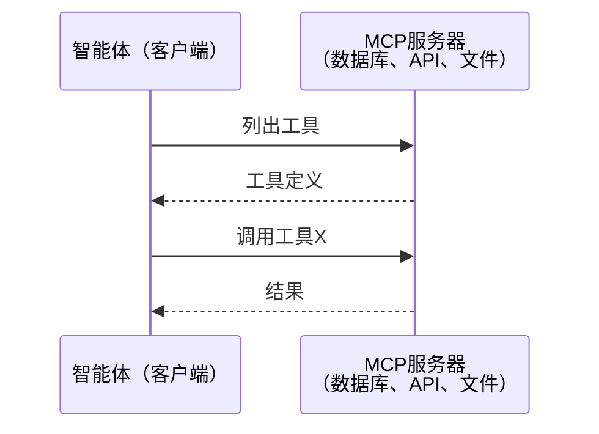

MCP是**智能体对工具**通信。它不帮助智能体互相交谈。

### A2A（智能体对智能体协议）

**创建者：** Google（现由Linux Foundation作为`lf.a2a.v1`管理）
**规范版本：** 1.0.0
**问题：** 自主智能体如何协作、协商和将任务委派给彼此？

A2A是**对等智能体协作**的协议。MCP将智能体连接到工具的地方，A2A将智能体连接到其他智能体。每个智能体在众所周知的URL上发布一个**智能体卡片**，其他智能体发现、协商并向其委派任务。

#### A2A如何工作

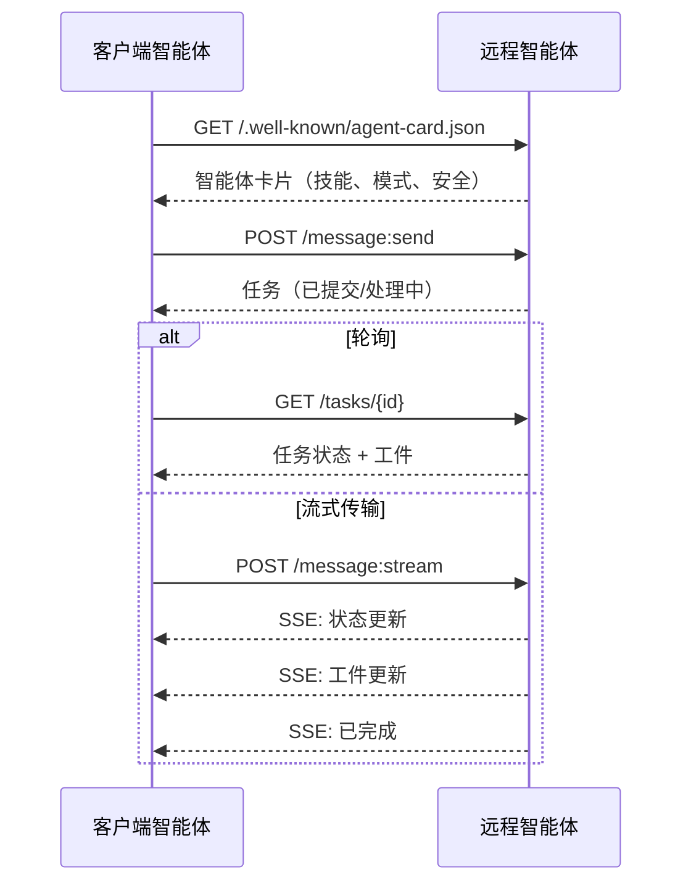

#### 真实的智能体卡片

这是A2A智能体卡片在现实中的样子。在`GET /.well-known/agent-card.json`处提供：

```json
{
  "name": "Research Agent",
  "description": "Searches documentation and summarizes findings",
  "version": "1.0.0",
  "supportedInterfaces": [
    {
      "url": "https://research-agent.example.com/a2a/v1",
      "protocolBinding": "JSONRPC",
      "protocolVersion": "1.0"
    },
    {
      "url": "https://research-agent.example.com/a2a/rest",
      "protocolBinding": "HTTP+JSON",
      "protocolVersion": "1.0"
    }
  ],
  "provider": {
    "organization": "Your Company",
    "url": "https://example.com"
  },
  "capabilities": {
    "streaming": true,
    "pushNotifications": false
  },
  "defaultInputModes": ["text/plain", "application/json"],
  "defaultOutputModes": ["text/plain", "application/json"],
  "skills": [
    {
      "id": "web-research",
      "name": "Web Research",
      "description": "Searches the web and synthesizes findings",
      "tags": ["research", "search", "summarization"],
      "examples": ["Research the latest changes in React 19"]
    },
    {
      "id": "doc-analysis",
      "name": "Documentation Analysis",
      "description": "Reads and analyzes technical documentation",
      "tags": ["docs", "analysis"],
      "inputModes": ["text/plain", "application/pdf"],
      "outputModes": ["application/json"]
    }
  ],
  "securitySchemes": {
    "bearer": {
      "httpAuthSecurityScheme": {
        "scheme": "Bearer",
        "bearerFormat": "JWT"
      }
    }
  },
  "security": [{ "bearer": [] }]
}
```

需要注意的关键点：
- **技能**是智能体能做什么。每个都有ID、标签和支持的输入/输出MIME类型。这就是客户端智能体决定该远程智能体是否能处理其请求的方式。
- **supportedInterfaces**列出多个协议绑定。单个智能体可以同时说JSON-RPC、REST和gRPC。
- **安全**内置于卡片中。客户端在发出单个请求之前就知道需要什么认证。

#### 任务生命周期

任务是A2A中工作的核心单元。它们通过定义的状态移动：

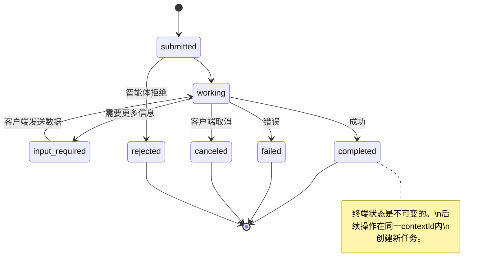

所有8个状态（规范还定义了`UNSPECIFIED`作为哨兵，此处省略）：

| 状态 | 终端？ | 含义 |
|---|---|---|
| `TASK_STATE_SUBMITTED` | 否 | 已确认，尚未处理 |
| `TASK_STATE_WORKING` | 否 | 正在积极处理 |
| `TASK_STATE_INPUT_REQUIRED` | 否 | 智能体需要客户端提供更多信息 |
| `TASK_STATE_AUTH_REQUIRED` | 否 | 需要认证 |
| `TASK_STATE_COMPLETED` | 是 | 成功完成 |
| `TASK_STATE_FAILED` | 是 | 以错误完成 |
| `TASK_STATE_CANCELED` | 是 | 在完成前取消 |
| `TASK_STATE_REJECTED` | 是 | 智能体拒绝了任务 |

一旦任务到达终端状态，它就是不可变的。没有进一步的消息。后续操作在同一`contextId`内创建新任务。

#### 有线格式

A2A使用JSON-RPC 2.0。以下是真实消息交换的样子：

**客户端发送任务：**
```json
{
  "jsonrpc": "2.0",
  "id": 1,
  "method": "SendMessage",
  "params": {
    "message": {
      "messageId": "msg-001",
      "role": "ROLE_USER",
      "parts": [{ "text": "Research React 19 compiler features" }]
    },
    "configuration": {
      "acceptedOutputModes": ["text/plain", "application/json"],
      "historyLength": 10
    }
  }
}
```

**智能体用任务回应：**
```json
{
  "jsonrpc": "2.0",
  "id": 1,
  "result": {
    "task": {
      "id": "task-abc-123",
      "contextId": "ctx-xyz-789",
      "status": {
        "state": "TASK_STATE_COMPLETED",
        "timestamp": "2026-03-27T10:30:00Z"
      },
      "artifacts": [
        {
          "artifactId": "art-001",
          "name": "research-results",
          "parts": [{
            "data": {
              "findings": [
                "React 19 compiler auto-memoizes components",
                "No more manual useMemo/useCallback needed",
                "Compiler runs at build time, not runtime"
              ]
            },
            "mediaType": "application/json"
          }]
        }
      ]
    }
  }
}
```

**通过SSE流式传输：**
```text
POST /message:stream HTTP/1.1
Content-Type: application/json
A2A-Version: 1.0

data: {"task":{"id":"task-123","status":{"state":"TASK_STATE_WORKING"}}}

data: {"statusUpdate":{"taskId":"task-123","status":{"state":"TASK_STATE_WORKING","message":{"role":"ROLE_AGENT","parts":[{"text":"Searching documentation..."}]}}}}

data: {"artifactUpdate":{"taskId":"task-123","artifact":{"artifactId":"art-1","parts":[{"text":"partial findings..."}]},"append":true,"lastChunk":false}}

data: {"statusUpdate":{"taskId":"task-123","status":{"state":"TASK_STATE_COMPLETED"}}}
```

### ACP（智能体通信协议）

**创建者：** IBM / BeeAI
**规范版本：** 0.2.0（OpenAPI 3.1.1）
**状态：** 正在合并到Linux Foundation下的A2A
**问题：** 智能体如何在具有完全可审计性、会话连续性和轨迹跟踪的情况下通信？

ACP是**企业协议**。与许多摘要声称的不同，ACP**不**使用JSON-LD。它是一个通过OpenAPI定义的简单REST/JSON API。它的特别之处在于**TrajectoryMetadata**：每个智能体响应都可以携带产生它的推理步骤和工具调用的详细日志。

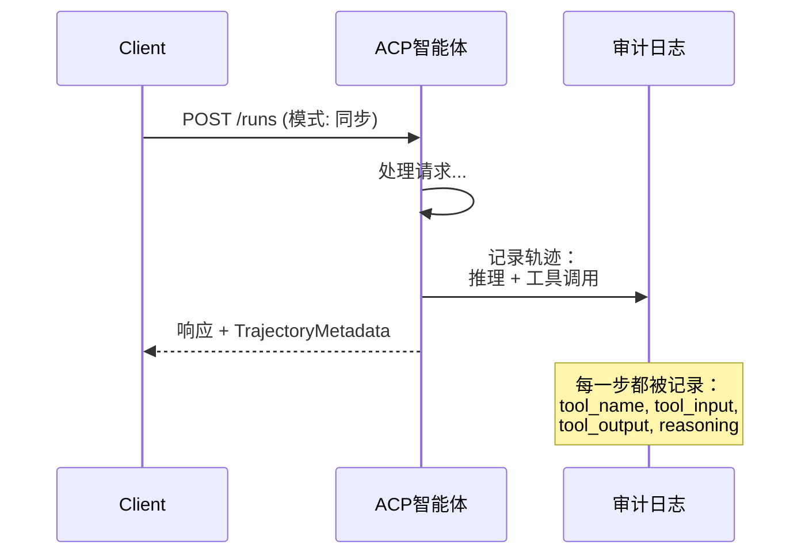

#### ACP中的智能体发现

ACP定义了四种发现方法：

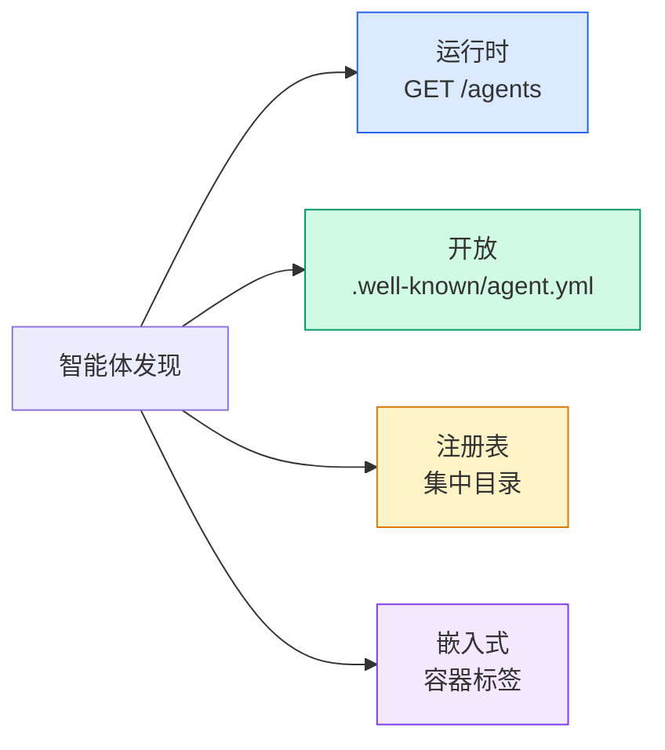

**AgentManifest**比A2A的智能体卡片更简单：

```json
{
  "name": "summarizer",
  "description": "Summarizes documents with source citations",
  "input_content_types": ["text/plain", "application/pdf"],
  "output_content_types": ["text/plain", "application/json"],
  "metadata": {
    "tags": ["summarization", "RAG"],
    "framework": "BeeAI",
    "capabilities": [
      {
        "name": "Document Summarization",
        "description": "Condenses long documents into key points"
      }
    ],
    "recommended_models": ["llama3.3:70b-instruct-fp16"],
    "license": "Apache-2.0",
    "programming_language": "Python"
  }
}
```

#### 运行生命周期

ACP使用"运行"而不是"任务"。运行是具有三种模式的智能体执行：

| 模式 | 行为 |
|---|---|
| `sync` | 阻塞。响应包含完整结果。 |
| `async` | 立即返回202。轮询`GET /runs/{id}`获取状态。 |
| `stream` | SSE流。事件在智能体工作时触发。 |

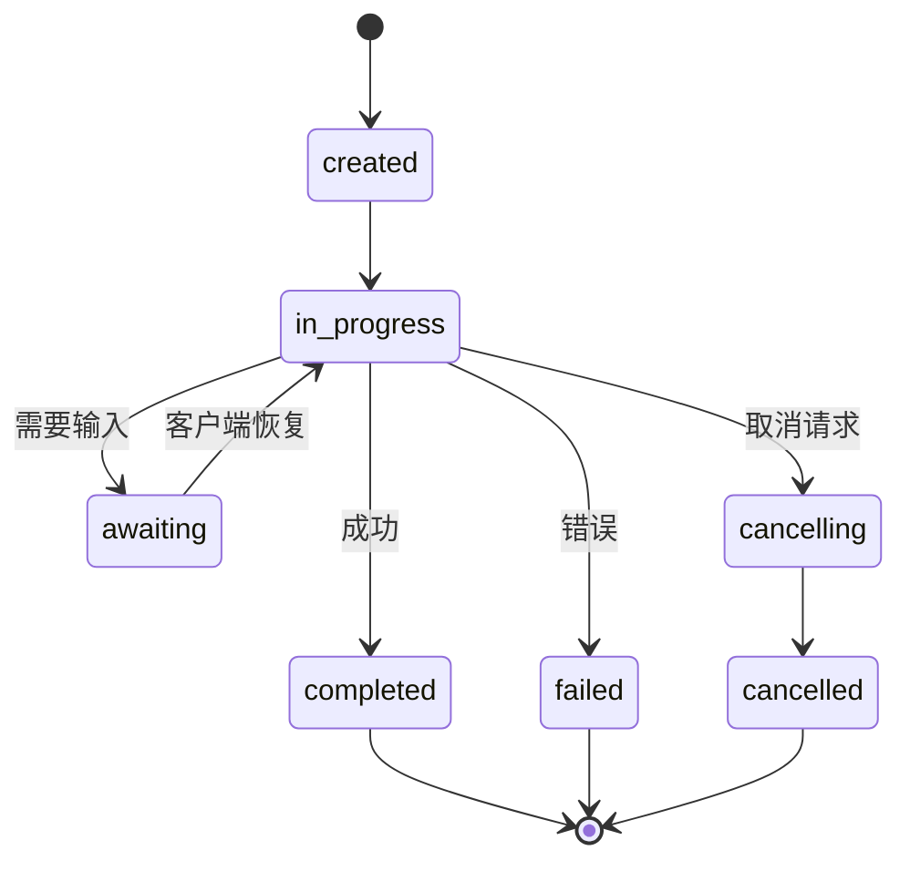

#### TrajectoryMetadata（审计追踪）

这是ACP的关键差异化因素。每个消息部分都可以包含元数据，显示智能体确切做了什么：

```json
{
  "role": "agent/researcher",
  "parts": [
    {
      "content_type": "text/plain",
      "content": "The weather in San Francisco is 72F and sunny.",
      "metadata": {
        "kind": "trajectory",
        "message": "I need to check the weather for this location",
        "tool_name": "weather_api",
        "tool_input": { "location": "San Francisco, CA" },
        "tool_output": { "temperature": 72, "condition": "sunny" }
      }
    }
  ]
}
```

对于受监管的行业来说，这是金子。每个答案都附带可证明的推理链：调用了哪些工具，使用了什么输入，收到了什么输出。没有黑箱。

ACP还支持用于来源归属的**CitationMetadata**：

```json
{
  "kind": "citation",
  "start_index": 0,
  "end_index": 47,
  "url": "https://weather.gov/sf",
  "title": "NWS San Francisco Forecast"
}
```

### ANP（智能体网络协议）

**创建者：** 开源社区（由GaoWei Chang创立）
**仓库：** [github.com/agent-network-protocol/AgentNetworkProtocol](https://github.com/agent-network-protocol/AgentNetworkProtocol)
**问题：** 来自不同组织的智能体如何在没有中央权威的情况下相互信任？

ANP是**去中心化身份协议**。它使用W3C去中心化标识符（DID）和端到端加密构建信任。与A2A中你通过已知端点发现智能体不同，ANP让智能体通过密码学证明其身份。

ANP有三层：

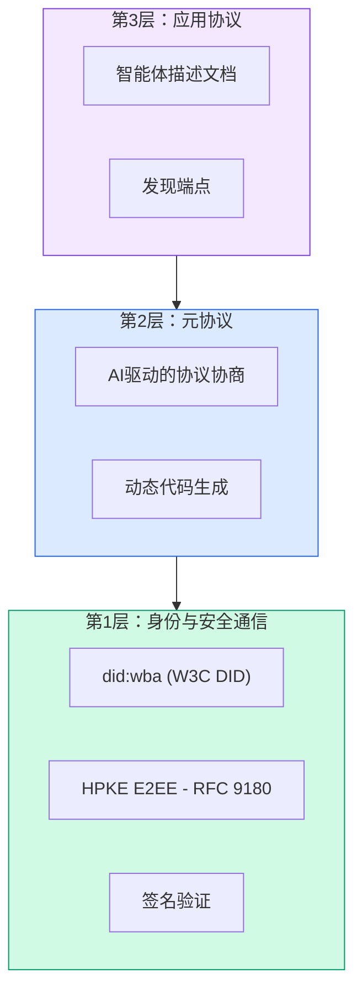

#### DID文档（真实结构）

ANP使用一种名为`did:wba`（基于Web的智能体）的自定义DID方法。DID `did:wba:example.com:user:alice`解析为`https://example.com/user/alice/did.json`：

```json
{
  "@context": [
    "https://www.w3.org/ns/did/v1",
    "https://w3id.org/security/suites/jws-2020/v1",
    "https://w3id.org/security/suites/secp256k1-2019/v1"
  ],
  "id": "did:wba:example.com:user:alice",
  "verificationMethod": [
    {
      "id": "did:wba:example.com:user:alice#key-1",
      "type": "EcdsaSecp256k1VerificationKey2019",
      "controller": "did:wba:example.com:user:alice",
      "publicKeyJwk": {
        "crv": "secp256k1",
        "x": "NtngWpJUr-rlNNbs0u-Aa8e16OwSJu6UiFf0Rdo1oJ4",
        "y": "qN1jKupJlFsPFc1UkWinqljv4YE0mq_Ickwnjgasvmo",
        "kty": "EC"
      }
    },
    {
      "id": "did:wba:example.com:user:alice#key-x25519-1",
      "type": "X25519KeyAgreementKey2019",
      "controller": "did:wba:example.com:user:alice",
      "publicKeyMultibase": "z9hFgmPVfmBZwRvFEyniQDBkz9LmV7gDEqytWyGZLmDXE"
    }
  ],
  "authentication": [
    "did:wba:example.com:user:alice#key-1"
  ],
  "keyAgreement": [
    "did:wba:example.com:user:alice#key-x25519-1"
  ],
  "humanAuthorization": [
    "did:wba:example.com:user:alice#key-1"
  ],
  "service": [
    {
      "id": "did:wba:example.com:user:alice#agent-description",
      "type": "AgentDescription",
      "serviceEndpoint": "https://example.com/agents/alice/ad.json"
    }
  ]
}
```

需要注意的关键点：
- **密钥分离**是强制的。签名密钥（secp256k1）与加密密钥（X25519）分开。
- **`humanAuthorization`**是ANP独有的。这些密钥需要显式的人类批准（生物识别、密码、HSM）才能使用。资金转账等高风险操作通过此路径。
- **`keyAgreement`**密钥用于HPKE端到端加密（RFC 9180）。
- **service**部分链接到智能体描述文档。

#### ANP中的信任如何工作

ANP**不**使用网络信任或背书图。信任是双边的，每次交互都进行验证：

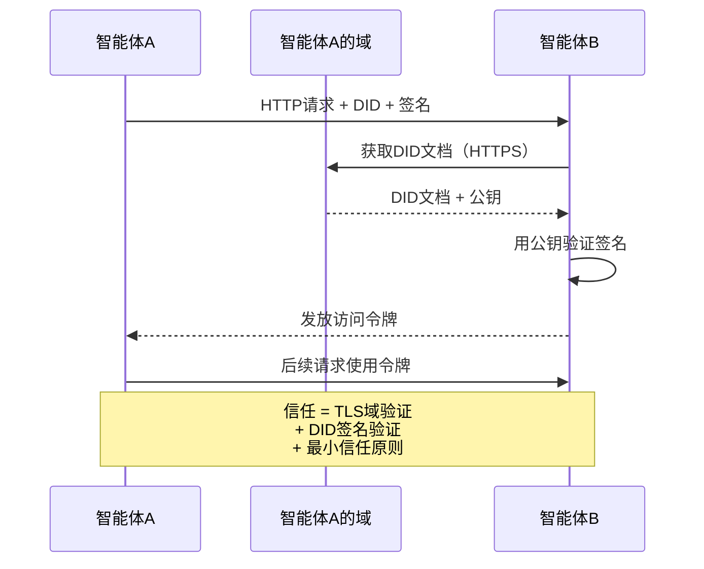

信任来自三个来源：
1. **域级TLS**验证DID文档主机
2. **DID密码学签名**验证智能体的身份
3. **最小信任原则**仅授予最小权限

没有基于八卦的信任传播或PageRank评分。你通过其DID直接验证每个智能体。

#### 元协议协商

这是ANP最新颖的特性。当来自不同生态系统的两个智能体相遇时，它们不需要预先商定的数据格式。它们用自然语言协商：

```json
{
  "action": "protocolNegotiation",
  "sequenceId": 0,
  "candidateProtocols": "I can communicate using:\n1. JSON-RPC with hotel booking schema\n2. REST with OpenAPI 3.1 spec\n3. Natural language over HTTP",
  "modificationSummary": "Initial proposal",
  "status": "negotiating"
}
```

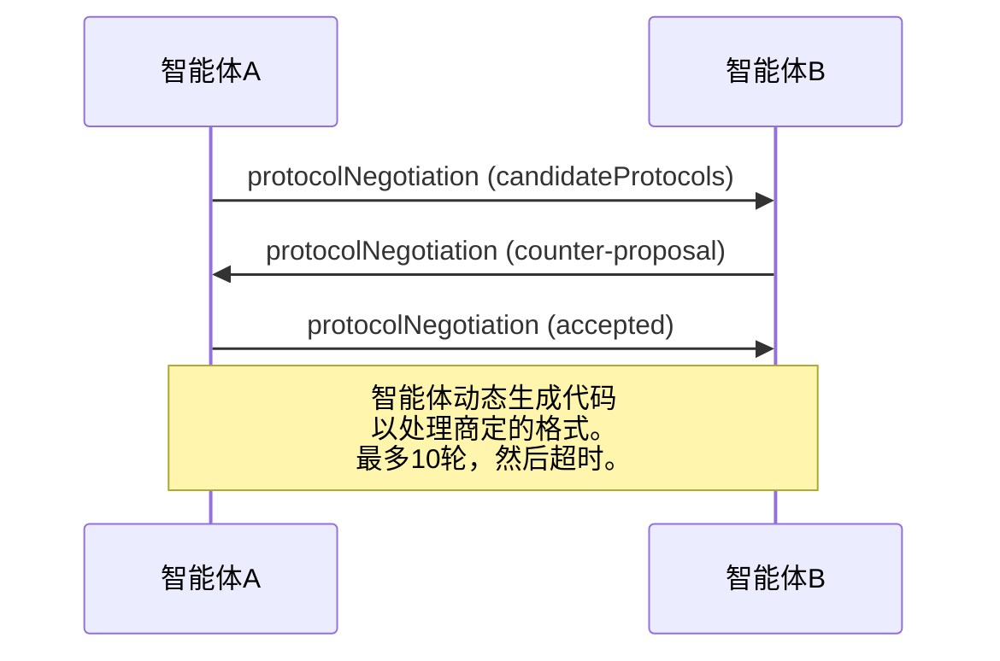

智能体来回协商（最多10轮），直到他们就格式达成一致，然后动态生成代码来处理它。状态值：`negotiating`、`rejected`、`accepted`、`timeout`。

这意味着两个从未见过彼此的智能体可以在没有人预先定义共享模式的情况下弄清楚如何通信。

### 比较（已修正）

| | MCP | A2A | ACP | ANP |
|---|---|---|---|---|
| **创建者** | Anthropic | Google / Linux Foundation | IBM / BeeAI | 社区 |
| **规范格式** | JSON-RPC | JSON-RPC / REST / gRPC | OpenAPI 3.1 (REST) | JSON-RPC |
| **主要用途** | 智能体对工具 | 智能体对智能体 | 智能体对智能体 | 智能体对智能体 |
| **发现** | 工具列表 | `/.well-known/agent-card.json` | `GET /agents`, `/.well-known/agent.yml` | `/.well-known/agent-descriptions`, DID服务端点 |
| **身份** | 隐式（本地） | 安全方案（OAuth, mTLS） | 服务器级 | W3C DID (`did:wba`) with E2EE |
| **审计追踪** | 不适用 | 基本（任务历史） | TrajectoryMetadata（工具调用、推理） | 未正式指定 |
| **状态机** | 不适用 | 9个任务状态 | 7个运行状态 | 不适用 |
| **流式传输** | 不适用 | SSE | SSE | 传输无关 |
| **独特特性** | 工具模式 | 智能体卡片 + 技能 | 轨迹审计追踪 | 元协议协商 |
| **最适合** | 工具和数据 | 动态协作 | 受监管行业 | 跨组织信任 |
| **状态** | 稳定 | 稳定 (v1.0) | 正在合并到A2A | 积极开发中 |

### 它们如何协同工作

这些协议不是互斥的。一个现实的企业系统使用多种：

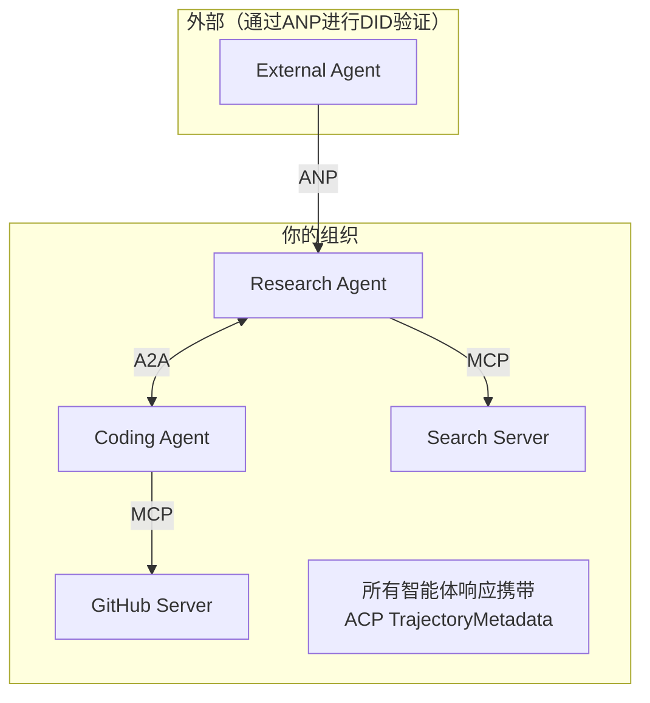

每个智能体执行都会产生完整的审计条目：输入了什么、输出了什么，以及中间的完整工具调用和推理步骤轨迹。你可以按智能体、按会话或按单个运行查询。

### 步骤5：ANP风格身份验证

构建基于DID的身份和验证：

```typescript
type VerificationMethod = {
  id: string;
  type: string;
  controller: string;
  publicKeyDer: string;
};

type DIDDocument = {
  id: string;
  verificationMethod: VerificationMethod[];
  authentication: string[];
  keyAgreement: string[];
  humanAuthorization: string[];
  service: { id: string; type: string; serviceEndpoint: string }[];
};

type AgentIdentity = {
  did: string;
  document: DIDDocument;
  privateKey: crypto.KeyObject;
  publicKey: crypto.KeyObject;
};

class IdentityRegistry {
  private documents: Map<string, DIDDocument> = new Map();

  publish(doc: DIDDocument) {
    this.documents.set(doc.id, doc);
  }

  resolve(did: string): DIDDocument | undefined {
    return this.documents.get(did);
  }

  verify(did: string, signature: string, payload: string): boolean {
    const doc = this.documents.get(did);
    if (!doc) return false;

    const authKeyIds = doc.authentication;
    const authKeys = doc.verificationMethod.filter((vm) =>
      authKeyIds.includes(vm.id)
    );

    for (const key of authKeys) {
      const publicKey = crypto.createPublicKey({
        key: Buffer.from(key.publicKeyDer, "base64"),
        format: "der",
        type: "spki",
      });
      const isValid = crypto.verify(
        null,
        Buffer.from(payload),
        publicKey,
        Buffer.from(signature, "hex")
      );
      if (isValid) return true;
    }
    return false;
  }

  requiresHumanAuth(did: string, operationKeyId: string): boolean {
    const doc = this.documents.get(did);
    if (!doc) return false;
    return doc.humanAuthorization.includes(operationKeyId);
  }
}

function createIdentity(domain: string, agentName: string): AgentIdentity {
  const did = `did:wba:${domain}:agent:${agentName}`;
  const { publicKey, privateKey } = crypto.generateKeyPairSync("ed25519");

  const publicKeyDer = publicKey
    .export({ format: "der", type: "spki" })
    .toString("base64");

  const keyId = `${did}#key-1`;
  const encKeyId = `${did}#key-x25519-1`;

  const document: DIDDocument = {
    id: did,
    verificationMethod: [
      {
        id: keyId,
        type: "Ed25519VerificationKey2020",
        controller: did,
        publicKeyDer,
      },
      {
        id: encKeyId,
        type: "X25519KeyAgreementKey2019",
        controller: did,
        publicKeyDer,
      },
    ],
    authentication: [keyId],
    keyAgreement: [encKeyId],
    humanAuthorization: [],
    service: [
      {
        id: `${did}#agent-description`,
        type: "AgentDescription",
        serviceEndpoint: `https://${domain}/agents/${agentName}/ad.json`,
      },
    ],
  };

  return { did, document, privateKey, publicKey };
}

function signPayload(identity: AgentIdentity, payload: string): string {
  return crypto
    .sign(null, Buffer.from(payload), identity.privateKey)
    .toString("hex");
}
```

这反映了真实的ANP身份模型：智能体具有独立的认证、密钥协商和人类授权的DID文档。`IdentityRegistry`模拟DID解析（在生产环境中，这将是到智能体域的HTTP获取）。

### 步骤6：协议网关

将所有四种协议连接到一个统一的系统中：


```typescript
class ProtocolGateway {
  private registry: AgentRegistry;
  private taskManager: TaskManager;
  private auditRunner: AuditableRunner;
  private identityRegistry: IdentityRegistry;

  constructor(
    registry: AgentRegistry,
    taskManager: TaskManager,
    auditRunner: AuditableRunner,
    identityRegistry: IdentityRegistry
  ) {
    this.registry = registry;
    this.taskManager = taskManager;
    this.auditRunner = auditRunner;
    this.identityRegistry = identityRegistry;
  }

  async delegateTask(
    fromDid: string,
    signature: string,
    targetAgent: string,
    message: AgentMessage,
    sessionId?: string
  ): Promise<{ task: Task; audit: AuditEntry } | { error: string }> {
    if (!this.identityRegistry.verify(fromDid, signature, message.id)) {
      return { error: "Identity verification failed" };
    }

    const card = this.registry.resolve(targetAgent);
    if (!card) {
      return { error: `Agent ${targetAgent} not found in registry` };
    }

    const audit = await this.auditRunner.run(
      targetAgent,
      [message],
      sessionId
    );
    const task = await this.taskManager.sendMessage(targetAgent, message);

    return { task, audit };
  }

  discoverAndDelegate(
    fromDid: string,
    signature: string,
    skillTag: string,
    message: AgentMessage
  ): Promise<{ task: Task; audit: AuditEntry } | { error: string }> {
    const candidates = this.registry.discoverBySkillTag(skillTag);
    if (candidates.length === 0) {
      return Promise.resolve({
        error: `No agents found with skill tag: ${skillTag}`,
      });
    }
    return this.delegateTask(
      fromDid,
      signature,
      candidates[0].name,
      message
    );
  }
}
```

网关在单次调用中做四件事：
1. **ANP**：通过DID签名验证调用者身份
2. **A2A**：发现目标智能体并检查能力
3. **ACP**：将执行包装在带有轨迹的审计追踪中
4. **A2A**：创建具有完整生命周期跟踪的任务

### 步骤7：将所有内容连接在一起

```typescript
async function protocolDemo() {
  const registry = new AgentRegistry();
  registry.register({
    name: "researcher",
    description: "Searches and summarizes findings",
    version: "1.0.0",
    url: "https://researcher.local/a2a/v1",
    capabilities: { streaming: true, pushNotifications: false },
    defaultInputModes: ["text/plain"],
    defaultOutputModes: ["text/plain", "application/json"],
    skills: [
      {
        id: "web-research",
        name: "Web Research",
        description: "Searches the web",
        tags: ["research", "search", "summarization"],
        inputModes: ["text/plain"],
        outputModes: ["application/json"],
      },
    ],
  });
  registry.register({
    name: "coder",
    description: "Writes code from specs",
    version: "1.0.0",
    url: "https://coder.local/a2a/v1",
    capabilities: { streaming: false, pushNotifications: false },
    defaultInputModes: ["text/plain", "application/json"],
    defaultOutputModes: ["text/plain"],
    skills: [
      {
        id: "code-gen",
        name: "Code Generation",
        description: "Generates code",
        tags: ["coding", "generation"],
        inputModes: ["text/plain", "application/json"],
        outputModes: ["text/plain"],
      },
    ],
  });

  const taskManager = new TaskManager();
  const auditRunner = new AuditableRunner();

  const researchTrajectory: TrajectoryEntry[] = [];

  taskManager.registerHandler(
    "researcher",
    async function* (task, message) {
      yield {
        kind: "statusUpdate" as const,
        taskId: task.id,
        status: { state: "working" as const, timestamp: Date.now() },
      };

      researchTrajectory.push({
        reasoning: "Searching for React 19 documentation",
        toolName: "web_search",
        toolInput: { query: "React 19 compiler features" },
        toolOutput: {
          results: ["react.dev/blog/react-19", "github.com/react/react"],
        },
        timestamp: Date.now(),
      });

      researchTrajectory.push({
        reasoning: "Extracting key findings from search results",
        toolName: "doc_analysis",
        toolInput: { url: "react.dev/blog/react-19" },
        toolOutput: {
          summary:
            "React 19 compiler auto-memoizes, no manual useMemo needed",
        },
        timestamp: Date.now(),
      });

      yield {
        kind: "artifactUpdate" as const,
        taskId: task.id,
        artifact: {
          id: crypto.randomUUID(),
          name: "research-results",
          parts: [
            {
              kind: "data" as const,
              data: {
                findings: [
                  "React 19 compiler auto-memoizes components",
                  "No more manual useMemo/useCallback needed",
                  "Compiler runs at build time, not runtime",
                ],
                sources: ["react.dev/blog/react-19"],
              },
              mediaType: "application/json",
            },
          ],
        },
        append: false,
        lastChunk: true,
      };

      yield {
        kind: "statusUpdate" as const,
        taskId: task.id,
        status: { state: "completed" as const, timestamp: Date.now() },
      };
    }
  );

  auditRunner.registerAgent("researcher", async () => ({
    output: [
      textMessage("agent", "React 19 compiler auto-memoizes components"),
    ],
    trajectory: researchTrajectory,
  }));

  const identityRegistry = new IdentityRegistry();

  const coderIdentity = createIdentity("coder.local", "coder");
  const researcherIdentity = createIdentity("researcher.local", "researcher");

  identityRegistry.publish(coderIdentity.document);
  identityRegistry.publish(researcherIdentity.document);

  const gateway = new ProtocolGateway(
    registry,
    taskManager,
    auditRunner,
    identityRegistry
  );

  console.log("=== Protocol Demo ===\n");

  console.log("1. Agent Discovery (A2A)");
  const researchAgents = registry.discoverBySkillTag("research");
  console.log(
    `   Found ${researchAgents.length} agent(s):`,
    researchAgents.map((a) => a.name)
  );

  console.log("\n2. Identity Verification (ANP)");
  const message = textMessage("user", "Research React 19 compiler features");
  const signature = signPayload(coderIdentity, message.id);
  const verified = identityRegistry.verify(
    coderIdentity.did,
    signature,
    message.id
  );
  console.log(`   Coder DID: ${coderIdentity.did}`);
  console.log(`   Signature verified: ${verified}`);

  console.log("\n3. Task Delegation (A2A + ACP + ANP)");
  const result = await gateway.delegateTask(
    coderIdentity.did,
    signature,
    "researcher",
    message,
    "session-001"
  );

  if ("error" in result) {
    console.log(`   Error: ${result.error}`);
    return;
  }

  console.log(`   Task ID: ${result.task.id}`);
  console.log(`   Task state: ${result.task.status.state}`);
  console.log(`   Artifacts: ${result.task.artifacts.length}`);

  console.log("\n4. Audit Trail (ACP)");
  console.log(`   Run ID: ${result.audit.runId}`);
  console.log(`   Status: ${result.audit.status}`);
  console.log(`   Trajectory steps: ${result.audit.trajectory.length}`);
  for (const step of result.audit.trajectory) {
    console.log(`     - ${step.reasoning}`);
    if (step.toolName) {
      console.log(`       Tool: ${step.toolName}`);
    }
  }

  console.log("\n5. Full Audit Log");
  const fullLog = auditRunner.getFullAuditLog();
  console.log(`   Total runs: ${fullLog.length}`);
  for (const entry of fullLog) {
    const duration = entry.completedAt
      ? `${entry.completedAt - entry.startedAt}ms`
      : "in-progress";
    console.log(`   ${entry.agentName}: ${entry.status} (${duration})`);
  }
}

protocolDemo().catch((err) => {
  console.error("Protocol demo failed:", err);
  process.exitCode = 1;
});
```

## 什么会出错

协议解决快乐路径。以下是生产中会出现的问题：

**模式漂移。** 智能体A发布一个Agent Card，宣传`application/json`输出。但JSON模式在版本之间变化。智能体B解析旧格式并得到垃圾。修复：为你的技能和输出模式设置版本。A2A规范在Agent Card上支持`version`就是为此原因。

**状态机违规。** 智能体处理程序产生一个`completed`事件，然后试图产生更多工件。任务是不可变的。你的代码静默丢弃更新或抛出。修复：在产生之前检查终端状态。上面的`TaskManager`在终端状态后用`break`强制执行此操作。

**信任解析失败。** 智能体A试图验证智能体B的DID，但智能体B的域已关闭。DID文档无法获取。你是失败开放（接受未验证的智能体）还是失败关闭（拒绝一切）？ANP建议以最小信任原则失败关闭。

**轨迹膨胀。** ACP轨迹记录功能强大但昂贵。每个运行进行200次工具调用的复杂智能体会产生大量审计条目。修复：以可配置的详细程度级别记录轨迹。为合规性记录工具名称和IO，为非监管工作负载跳过推理步骤。

**发现惊群效应。** 50个智能体在启动时同时查询`GET /agents`。修复：用TTL缓存Agent Card，错开发现间隔，或使用基于推送的注册代替轮询。

## 使用它

### 真实实现

**A2A**是最成熟的。Google的[官方规范](https://github.com/google/A2A)在Linux Foundation下开源。Python和TypeScript的SDK。如果你的智能体需要动态发现和协作，从这里开始。

**ACP**正在合并到A2A。IBM的[BeeAI项目](https://github.com/i-am-bee/acp)创建了ACP作为REST优先的替代方案，但轨迹元数据概念正被吸收到A2A生态系统中。即使使用A2A作为传输，也使用ACP模式（轨迹记录、运行生命周期）。

**ANP**是最实验性的。[社区仓库](https://github.com/agent-network-protocol/AgentNetworkProtocol)有一个Python SDK（AgentConnect）。元协议协商概念是真正新颖的。值得关注的跨组织智能体部署。

**MCP**已在第13阶段介绍。如果你想让智能体使用工具，MCP是标准。

### 选择正确的协议

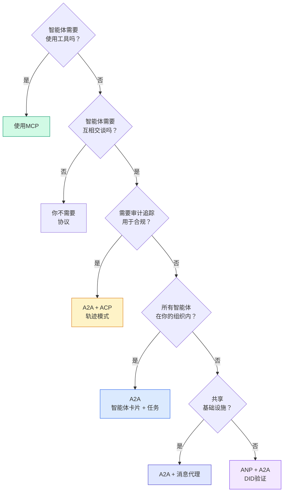

## 交付它

本课程产生：
- `code/main.ts` —— 所有四种协议模式的完整实现
- `outputs/prompt-protocol-selector.md` —— 一个帮助你为系统选择协议的提示

## 练习

1. **多跳任务委派。** 扩展`TaskManager`，使智能体处理程序可以将子任务委派给其他智能体。研究员接收任务，将"搜索"和"总结"子任务委派给两个专家智能体，等待两者完成，然后将结果合并到自己的工件中。

2. **流式审计追踪。** 修改`AuditableRunner`以支持流式模式。不是等待完整结果，而是在轨迹条目添加时实时产生`AuditEntry`更新。使用产生审计快照的异步生成器。

3. **DID轮换。** 向`IdentityRegistry`添加密钥轮换。智能体应该能够发布带有更新密钥的新DID文档，同时维护`previousDid`引用。验证者应该在宽限期内接受当前和先前密钥的签名。

4. **协议协商。** 实现ANP的元协议概念。两个智能体交换带有候选格式的`protocolNegotiation`消息（例如，"我会说JSON-RPC" vs "我更喜欢REST"）。最多3轮后，他们就格式达成一致或超时。商定的格式决定他们使用哪个`TaskManager`或`AuditableRunner`。

5. **速率限制发现。** 添加一个`RateLimitedRegistry`包装器，用可配置的TTL缓存Agent Card查找，并限制每个智能体每秒的发现查询。模拟启动时100个智能体互相发现的惊群效应，并测量差异。

## 关键术语

| 术语 | 人们怎么说 | 实际含义 |
|------|-----------|---------|
| MCP | "AI工具的协议" | 智能体发现和使用工具的客户端-服务器协议。智能体对工具，不是智能体对智能体。 |
| A2A | "Google的智能体协议" | Linux Foundation下用于智能体协作的对等协议。通过智能体卡片发现，9状态任务生命周期，通过SSE流式传输。支持JSON-RPC、REST和gRPC绑定。 |
| ACP | "企业智能体消息传递" | IBM/BeeAI的用于智能体运行的REST API，带有TrajectoryMetadata：每个响应携带完整的推理和工具调用链。正在合并到A2A。 |
| ANP | "去中心化智能体身份" | 使用`did:wba`（DID）进行密码学身份、HPKE进行E2EE、AI驱动的元协议协商的社区协议，用于从未见过彼此的智能体。 |
| 智能体卡片 | "智能体的名片" | 在`/.well-known/agent-card.json`处的JSON文档，描述技能、支持的MIME类型、安全方案和协议绑定。 |
| DID | "去中心化ID" | W3C标准，用于在智能体自己的域上托管的密码学可验证身份。ANP使用`did:wba`方法。 |
| TrajectoryMetadata | "审计收据" | ACP的机制，用于将推理步骤、工具调用及其输入/输出附加到每个智能体响应。 |
| 元协议 | "智能体协商如何交谈" | ANP的方法，智能体使用自然语言动态商定数据格式，然后生成代码来处理它们。 |
| 任务 | "工作单元" | A2A的有状态对象，跟踪从提交到完成的工作。一旦终端即不可变。 |

## 延伸阅读

- [Google A2A规范](https://github.com/google/A2A) —— 官方规范和SDK（v1.0.0，Linux Foundation）
- [IBM/BeeAI ACP规范](https://github.com/i-am-bee/acp) —— 用于智能体运行和轨迹元数据的OpenAPI 3.1规范
- [智能体网络协议](https://github.com/agent-network-protocol/AgentNetworkProtocol) —— 基于DID的身份、E2EE、元协议协商
- [模型上下文协议文档](https://modelcontextprotocol.io/) —— Anthropic的MCP规范（第13阶段介绍）
- [W3C去中心化标识符](https://www.w3.org/TR/did-core/) —— ANP底层身份标准
- [RFC 9180 (HPKE)](https://www.rfc-editor.org/rfc/rfc9180) —— ANP用于E2EE的加密方案
- [FIPA智能体通信语言](http://www.fipa.org/specs/fipa00061/SC00061G.html) —— 现代智能体协议的学术先驱