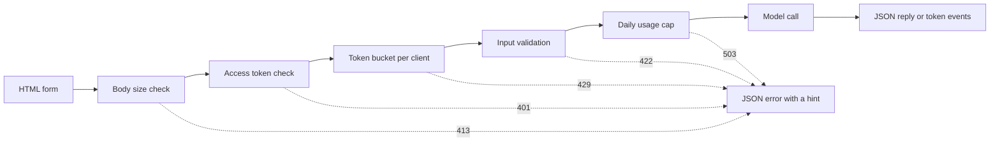

# Model Demo Interfaces — From a Function to a Shareable App

> A model demo has one contract: an input, a model call, and an output. Put a limit on each part before you share the link.

**Type:** Build
**Languages:** Python
**Prerequisites:** Phase 11 · 13 (Building a Production LLM Application), Phase 17 · 08 (Inference Metrics), Phase 17 · 19 (AI Gateways)
**Time:** ~90 minutes

## Learning Objectives

- Write the input, model call, and output contract of a demo, with a limit on each part.
- Build a standard library HTTP app with one HTML page, a JSON endpoint, and a Server-Sent Events endpoint.
- Validate input in order of cost, and return JSON errors that tell the user the next action.
- Protect a public demo with a per-client token bucket, a daily usage cap, and an optional access token.
- Write request logs that keep no input text and no client address.
- Compare the standard library demo with two framework versions, and name the signals that a demo must become a product.

## The Problem

Your model works in a notebook. Now a reviewer wants to try ten inputs, and a customer wants to see one result on a phone. Neither of them will open your notebook.

A notebook cell has no input limits and no progress display. Its errors are stack traces that only you can read. It also runs with your credentials and your budget. If you put the cell behind a public URL without changes, you can expect failures like these:

- A user pastes a 40,000-character document. The model call runs for a minute and then fails with a stack trace.
- One script sends 500 requests in one minute. Each request is a paid model call.
- The page shows nothing for eight seconds, so the user clicks the button four more times.
- The server log keeps every input, including the input with a customer account number.

A demo interface prevents these failures with a small amount of code. This lesson builds one with the Python standard library, so you can see every part. Then it builds the same demo with two popular frameworks and compares what each one does by default.

## The Concept

### A demo is a contract

Every demo has three parts. The input is what the user can send. The model call turns the input into an output. The output is what the user sees, and that includes errors.

Write the contract down before you write the page:

| Part | Question to answer | Answer in this lesson |
|------|--------------------|-----------------------|
| Input | What type, what size, which characters? | A string of 1 to 500 characters, with no control characters |
| Model call | How long does one call take, and what does it cost? | A toy keyword model that runs in under a millisecond at no cost |
| Output | What does the user see on success and on failure? | A label, a score, and a reply, or a JSON error with a hint |

A notebook has no limit on any of the three parts. A demo sets a limit on each part, and the server applies the limits to every client.



The checks run in order of cost. A bad request stops at the first check that it fails, so it costs the server almost nothing. The model call comes last, because it is the only step that costs money.

### Validate before the model runs

The browser can check input before it sends anything. The `maxlength` and `required` attributes on a text area give the user feedback with no network call. These checks help honest users only. Any client can send a request without the page, so the server repeats every check.

Put the server checks in order of cost:

1. Read the `Content-Length` header. Refuse a body over the limit before you read it.
2. Parse the JSON body. Refuse a body that is not a JSON object.
3. Check the fields. Refuse empty text, text over the limit, and control characters.
4. Spend a model call only on a request that passed every check.

| Failed check | HTTP status | Error code |
|--------------|-------------|------------|
| Body over 4,096 bytes | 413 Content Too Large | `body_too_large` |
| Content type is not JSON | 415 Unsupported Media Type | `unsupported_media_type` |
| Body is not a JSON object | 400 Bad Request | `bad_json` |
| Text is missing, empty, too long, or has control characters | 422 Unprocessable Content | `missing_text`, `empty_text`, `text_too_long`, `control_characters` |

RFC 9110 defines these status codes and their names.

Examples are part of the input design. An example shows the user what a good input looks like. It also gives a reviewer a test with one click. Pick one example for each output class. This demo has a positive, a negative, and a neutral example.

### Show that the model is working

A model call can take several seconds. With no feedback, the user cannot tell a slow model from a broken page. A user who sees no change can click again, and then the server gets a second paid request.

The page in this lesson gives four kinds of feedback:

- It disables the submit button while a request runs.
- It shows the elapsed time and updates it every 100 milliseconds.
- It shows the time to first token when the first token arrives.
- It shows the total time when the request ends.

When you studied [inference metrics](../../08-inference-metrics-goodput/), time to first token (TTFT) was a server metric. The demo page shows the same number to the user, measured in the browser.

### Send the output as a stream

A language model produces its reply one token at a time. If the server waits for the last token, the user waits for the full generation. If the server sends each token when it is ready, the user starts to read after the first token.

Server-Sent Events (SSE) is the standard format for this. The response has the content type `text/event-stream`. Each event is a group of `event:` and `data:` lines, and a blank line ends the event. The WHATWG HTML standard defines the format.

```text
event: token
data: {"index":0,"text":"Label:"}

event: token
data: {"index":1,"text":" positive."}

event: done
data: {"label":"positive","score":1.0,"tokens":11}
```

The browser has an `EventSource` interface for SSE, but it only sends GET requests. A GET request puts the input in the URL, and web servers and proxies write URLs into their access logs. This demo sends a POST request with a JSON body instead. The page reads the response with `fetch()` and `response.body.getReader()`, and it parses the event format itself.

A stream has one problem that a single JSON reply does not have. The server sends status 200 before the first token. If the model fails after that, the server cannot change the status. So the server sends an `error` event in the stream, and the page shows that event as an error.

When you built the [production LLM application](../../../11-llm-engineering/13-production-app/), a framework sent the tokens over SSE for you. This lesson writes the same protocol by hand, so you can see each line that the server sends.

### Write errors that a user can act on

An error message has two jobs. It tells the user what happened, and it tells the user what to do next. A stack trace does neither job for a stranger.

Every error in this demo has the same JSON shape:

```json
{
  "error": {
    "code": "text_too_long",
    "message": "The text has 812 characters. The limit is 500.",
    "hint": "Shorten the text to 500 characters or fewer.",
    "request_id": "a8f3c2b435e3"
  }
}
```

- `code` is a stable name. Client code and tests compare against it.
- `message` states the fact, with the numbers that the user needs.
- `hint` gives the user one action.
- `request_id` connects a user report to one log record.

RFC 9457 defines a standard error format for HTTP APIs, called problem details. This demo uses a smaller shape for the same purpose. Use RFC 9457 when other teams call your API.

### Share a public demo safely

A public link changes who can send requests. Plan one control for each risk:

| Risk | Control in this demo | Control for a larger audience |
|------|----------------------|-------------------------------|
| One client sends too many requests | A token bucket per client, with 429 and `Retry-After` | Per-user limits after sign-in |
| Strangers find the link | An optional access token in the `Authorization` header | Single sign-on with an identity provider |
| Total cost grows with no limit | A daily usage cap, with 503 and `Retry-After` | Spend limits and alerts at the model provider |
| Very large or unusual input | Body size limit, text length limit, control character check | Content moderation on input and output |
| Logs keep private input | Records with the input length and a keyed hash of the client | A retention period and access control on the logs |

A token bucket uses two numbers. The capacity is the largest burst that one client can send. The refill rate is the long-run request rate. Each request takes one token, and the bucket refills continuously up to its capacity:

```text
tokens = min(capacity, tokens + refill_rate * seconds_since_last_request)
accept the request if tokens >= 1, then subtract 1
```

When the bucket is empty, the server answers `429 Too Many Requests`. RFC 6585 defines status 429, and it lets the server add a `Retry-After` header. This demo always adds the header, with the number of seconds until the next token. The page reads the header and disables the button for that time.

The demo uses the client IP address as the bucket key. Behind a reverse proxy, every request comes from the proxy address, so all users share one bucket. In that case, read the client address from a header that your own proxy sets. Do not trust that header from any other source, because a client can put any value in it.

When you studied [AI gateways](../../19-ai-gateways/), the gateway applied rate limits per tenant. A demo needs the same control at a smaller scale. A rate limit controls each client, but it does not control the total. A hundred clients that each stay under the limit can still use the full budget. A usage cap counts all model calls in one day and refuses calls after a fixed number.

Logs need the same care as input. The default `http.server` handler writes the client IP address and the request line to standard error. If the input is in the URL, the input goes into the log. This demo replaces that log line. Each request writes one record with the route, the status, the error code, the latency, and the input length. The client address becomes a keyed hash, so you can count requests per client without storing the address.

Tell users what you keep. The demo page says that the server keeps the length of the text and never the text itself.

### When a demo becomes a product

A demo serves known people in short sessions from one process. These signals tell you that the demo is now a product:

- People outside your team use it every week.
- Someone asks for an uptime target, or reports an outage.
- Users ask to sign in, save results, or see their history.
- The weekly model cost is a line in a budget.
- The input includes data that a contract or a law covers.

| Property | Demo | Product |
|----------|------|---------|
| Users | Known people, short sessions | Unknown people, daily use |
| State | None | Accounts, history, saved results |
| Availability | Best effort, one process | A written target, replicas, an on-call owner |
| Cost control | One daily usage cap | Per-user quotas and billing |
| Observability | One log record per request | Traces, metrics, and alerts |

When you see these signals, move the demo onto the production stack from the production LLM application lesson. That stack adds real authentication, fallback models, tracing, and cost tracking per user.

```figure
demo-token-bucket
```

## Build It

The code is one file, `code/main.py`, with no dependencies outside the standard library. Run the self-test first:

```bash
python3 code/main.py
```

The self-test checks the validator, the token bucket, the stream format, and one real HTTP round trip. It starts the server on a free port, sends three requests, stops the server, and exits. Start the server for a browser only when you need it:

```bash
python3 code/main.py --serve
```

Open `http://127.0.0.1:8000` in a browser. Press Ctrl+C to stop the server.

### Step 1: The model call

The model is a toy keyword counter. It labels text as positive, negative, or neutral. It also produces a short reply, one token at a time.

```python
def classify(text):
    words = WORD_RE.findall(text.lower())
    positive = sum(1 for word in words if word in POSITIVE)
    negative = sum(1 for word in words if word in NEGATIVE)
    score = (positive - negative) / max(1, positive + negative)
    if score > 0:
        label = "positive"
    elif score < 0:
        label = "negative"
    else:
        label = "neutral"
    return {"label": label, "score": round(score, 3), "positive_cues": positive,
            "negative_cues": negative, "words": len(words)}


def generate(text):
    result = classify(text)
    reply = (
        f"Label: {result['label']}. Positive cues: {result['positive_cues']}. "
        f"Negative cues: {result['negative_cues']}. Words read: {result['words']}."
    )
    parts = reply.split(" ")
    yield parts[0]
    for part in parts[1:]:
        yield " " + part
```

A real model replaces `generate` and nothing else. Put an API call or a local model inside it. Keep the signature: a string goes in, and tokens come out. The validator, the limits, and the page stay the same.

### Step 2: Validation and error responses

One exception class carries every error. It holds the HTTP status, a stable code, a message, a hint, and optional response headers.

```python
class DemoError(Exception):
    def __init__(self, status, code, message, hint, headers=None):
        super().__init__(message)
        self.status = status
        self.code = code
        self.message = message
        self.hint = hint
        self.headers = dict(headers or {})


def validate_text(payload, max_chars=MAX_CHARS):
    if "text" not in payload:
        raise DemoError(422, "missing_text", 'The field "text" is missing.', 'Add a "text" field with your input.')
    text = payload["text"]
    if not isinstance(text, str):
        raise DemoError(422, "text_not_string", 'The field "text" is not a string.', "Send the input as a string.")
    text = text.strip()
    if not text:
        raise DemoError(422, "empty_text", "The text is empty.", "Type a sentence or pick an example.")
    if len(text) > max_chars:
        raise DemoError(422, "text_too_long", f"The text has {len(text)} characters. The limit is {max_chars}.",
                        f"Shorten the text to {max_chars} characters or fewer.")
    if CONTROL_RE.search(text):
        raise DemoError(422, "control_characters", "The text contains control characters.",
                        "Remove the hidden characters, then send the text again.")
    return text
```

The validator removes leading and trailing white space first. A text of only spaces then fails as empty, and the hint tells the user what to type. `check_body_size` and `parse_json_body` use the same pattern for the 411, 413, 415, and 400 cases. `error_body` turns any `DemoError` into the JSON shape from the concept section.

### Step 3: The token bucket

```python
class TokenBucket:
    def __init__(self, capacity, refill_per_second, now):
        if capacity < 1:
            raise ValueError("capacity must be at least 1")
        if refill_per_second <= 0:
            raise ValueError("refill_per_second must be positive")
        self.capacity = float(capacity)
        self.refill_per_second = float(refill_per_second)
        self.tokens = float(capacity)
        self.updated = now

    def take(self, now, cost=1.0):
        elapsed = max(0.0, now - self.updated)
        self.tokens = min(self.capacity, self.tokens + elapsed * self.refill_per_second)
        self.updated = now
        if self.tokens >= cost:
            self.tokens -= cost
            return 0.0
        return (cost - self.tokens) / self.refill_per_second
```

`take` returns 0.0 when it accepts the request. Otherwise it returns the seconds until the bucket has enough tokens. The server rounds that value up and sends it in `Retry-After`.

`RateLimiter` keeps one bucket per client in an `OrderedDict`. A lock protects the dictionary, because `ThreadingHTTPServer` handles each request in its own thread. When the dictionary has more than `max_clients` entries, the limiter removes the client with the oldest request. A removed client gets a full bucket on its next request. Set `max_clients` above the number of active clients that you expect.

The limiter takes a `clock` argument. The tests pass a `FakeClock`, so a test can move time forward by ten seconds with no wait. `UsageCap` uses the same clock pattern for the daily total. It counts calls in fixed windows of 86,400 seconds, and it returns the seconds until the next window when the count is full.

### Step 4: The stream

```python
def sse_event(event, data):
    payload = json.dumps(data, separators=(",", ":"), ensure_ascii=False)
    return f"event: {event}\ndata: {payload}\n\n".encode("utf-8")


def stream_events(text, generate_fn=generate, delay=0.0, sleep=time.sleep):
    count = 0
    try:
        for token in generate_fn(text):
            yield sse_event("token", {"index": count, "text": token})
            count += 1
            if delay:
                sleep(delay)
    except Exception:
        yield sse_event("error", MODEL_ERROR)
        return
    result = classify(text)
    yield sse_event("done", {"label": result["label"], "score": result["score"], "tokens": count})
```

`json.dumps` writes a newline inside a string as the two characters `\n`. Each event therefore has one data line with no raw newline in it. A raw newline in the data would break the event format.

The generator catches a model failure and sends an `error` event, because the server already sent the status line. The `delay` and `sleep` arguments slow the stream down for a browser, and they keep the tests fast.

### Step 5: The request handler

`DemoHandler` extends `BaseHTTPRequestHandler`. The POST handler runs the checks in the order from the concept section:

```python
def do_POST(self):
    app = self.server.app
    request_id = uuid.uuid4().hex[:12]
    client_id = self.client_address[0]
    started = time.perf_counter()
    route = self.path if self.path in self.routes else "other"
    status, code, chars = 200, None, 0
    try:
        declared = self.headers.get("Content-Length")
        try:
            if route == "other":
                raise DemoError(404, "not_found", "This endpoint does not exist.",
                                "Send requests to /api/predict or /api/stream.")
            size = check_body_size(declared, app.config.max_body_bytes)
        except DemoError:
            self.drain(int(declared) if declared and declared.isdigit() else 0)
            raise
        body = self.rfile.read(size)
        app.admit(client_id, self.headers.get("Authorization"))
        text = app.read_text(self.headers.get("Content-Type"), body)
        chars = len(text)
        app.charge()
        if route == "/api/predict":
            self.send_json(200, predict(text), request_id)
        else:
            code = self.send_stream(text, request_id)
    except DemoError as err:
        status, code = err.status, err.code
        self.send_error_json(err, request_id)
    except TimeoutError:
        status, code = 408, "request_timeout"
        self.close_connection = True
    except Exception:
        status, code = 500, "internal_error"
        self.send_error_json(DemoError(500, "internal_error", "The server failed on this request.",
                                       "Try again. Quote the request id if you report the problem."), request_id)
    finally:
        latency_ms = (time.perf_counter() - started) * 1000
        app.log.record(request_id, route, client_id, status, chars, latency_ms, code)
```

`admit` checks the access token and the token bucket. `charge` checks the daily cap. It runs last, so only valid requests count against the cap. Every request writes one log record in the `finally` block, and that includes rejected requests. The record keeps `route`, never the raw path, because a path can carry a query string with user text.

Four details prevent failures that are easy to miss:

- `timeout = 10` on the handler class closes a connection when the client stops sending. Without it, a client that declares 100 bytes and sends 10 holds a server thread forever. The handler logs a 408 and closes the connection.
- `log_message` returns without output. This removes the default log line with the client address and the request line.
- `drain` reads and discards up to 64 KiB of a refused body. RFC 1122 says that TCP sends a reset when a host closes a connection with unread data. The client can then lose the 413 reply.
- `send_stream` catches `BrokenPipeError` and closes the generator. When the user closes the tab, the model stops, and the request costs nothing more.

`BaseHTTPRequestHandler` uses HTTP/1.0 by default. The end of a streamed body is then the moment when the server closes the connection. A server that uses HTTP/1.1 sends the body with chunked transfer coding for the same purpose.

### Step 6: The page

`render_page` returns one HTML document with an inline style and an inline script. The page loads no external script, font, or image. The script reads the stream like this:

```javascript
const reader = response.body.getReader();
const decoder = new TextDecoder();
let buffer = "";
while (true) {
  const chunk = await reader.read();
  if (chunk.done) { break; }
  buffer += decoder.decode(chunk.value, { stream: true });
  let cut = buffer.indexOf("\n\n");
  while (cut >= 0) {
    const frame = parseFrame(buffer.slice(0, cut));
    buffer = buffer.slice(cut + 2);
    cut = buffer.indexOf("\n\n");
    if (frame.event === "token") { output.textContent += frame.data.text; }
  }
}
```

A network chunk can end in the middle of an event. The reader keeps the incomplete part in `buffer` until the blank line arrives.

The page writes model output with `textContent` and never with `innerHTML`. Model output is untrusted text. Suppose the page inserts a reply as HTML, and the reply contains an element with an `onerror` attribute. That attribute can then run code in the user's browser.

The server also sends a `Content-Security-Policy` header with `default-src 'none'`. The policy allows one inline script and one inline style, identified by their SHA-256 hashes. The browser refuses every other script, including a script that an attacker injects into the page.

```python
def csp_hash(source):
    digest = hashlib.sha256(source.encode("utf-8")).digest()
    return "'sha256-" + base64.b64encode(digest).decode("ascii") + "'"
```

### Step 7: Run it and try to break it

Start the server, then use `curl` from a second terminal. Send seven requests in a row to a fresh server. The bucket holds five tokens and gets one new token every two seconds:

```bash
for i in 1 2 3 4 5 6 7; do
  curl -s -o /dev/null -w '%{http_code} ' -X POST http://127.0.0.1:8000/api/predict \
    -H 'Content-Type: application/json' -d '{"text": "ok"}'
done
```

```text
200 200 200 200 200 429 429
```

Wait ten seconds, then send an empty text:

```bash
curl -s -X POST http://127.0.0.1:8000/api/predict \
  -H 'Content-Type: application/json' -d '{"text": ""}'
```

```json
{"error": {"code": "empty_text", "message": "The text is empty.", "hint": "Type a sentence or pick an example.", "request_id": "e3e3599feaea"}}
```

Watch the event stream with `curl -N`, which turns off output buffering:

```bash
curl -N -X POST http://127.0.0.1:8000/api/stream \
  -H 'Content-Type: application/json' -d '{"text": "The screen is bright."}'
```

To require an access token, set `DEMO_ACCESS_TOKEN` before you start the server. The page then shows a field for the token.

```bash
export DEMO_ACCESS_TOKEN="$(python3 -c 'import secrets; print(secrets.token_urlsafe(24))')"
echo "$DEMO_ACCESS_TOKEN"
python3 code/main.py --serve
```

Run the tests:

```bash
python3 -m unittest discover -s code/tests -v
```

The HTTP tests start the server on port 0, so the operating system picks a free port. `tearDown` stops the server and checks that its thread has ended.

## Use It

Two Python frameworks build the same kind of demo with less code: Gradio and Streamlit. Both examples below import the contract from `main.py`, so the validator and the model stay the same. You do not need either framework to run `main.py` or the tests.

### Components around one function

Gradio puts a web interface around one Python function. Input and output components describe the contract, and a generator function sends partial output.

```python
import os

import gradio as gr

from main import EXAMPLES, MAX_CHARS, DemoError, classify, generate, validate_text


def label_text(text):
    try:
        clean = validate_text({"text": text})
    except DemoError as err:
        raise gr.Error(f"{err.message} {err.hint}")
    label = classify(clean)["label"]
    reply = ""
    for token in generate(clean):
        reply += token
        yield reply, label


demo = gr.Interface(
    fn=label_text,
    inputs=gr.Textbox(label="Text to label", lines=5, max_length=MAX_CHARS),
    outputs=[gr.Textbox(label="Reply"), gr.Textbox(label="Label")],
    examples=list(EXAMPLES),
    flagging_mode="never",
)

if __name__ == "__main__":
    demo.queue(max_size=20).launch(auth=("demo", os.environ["DEMO_PASSWORD"]))
```

Each `yield` replaces the whole output value. The function therefore yields the full reply so far at each step.

Set `flagging_mode` on purpose before you share a link. The default mode shows a flag button. When a user presses it, Gradio writes the input and the output to a CSV file on the server. The value `"never"` removes the button.

`queue(max_size=20)` limits the number of waiting requests. The default concurrency limit is one running call per event. A slow model then serves one user at a time until you raise the limit. Gradio also creates API endpoints when the app launches, so scripts can call the demo without the page. Your rate limit must apply to those endpoints too.

### A script that reruns on every input

Streamlit runs your whole script from top to bottom each time the user changes a widget. A form collects its widget values and sends them in one batch when the user presses the submit button.

```python
import streamlit as st

from main import EXAMPLES, MAX_CHARS, DemoError, classify, generate, validate_text

st.title("Toy sentiment demo")
st.caption("Do not paste private data.")

example = st.selectbox("Start from an example", ["", *EXAMPLES])
with st.form("demo"):
    text = st.text_area("Text to label", value=example, max_chars=MAX_CHARS)
    submitted = st.form_submit_button("Run model")

if submitted:
    try:
        clean = validate_text({"text": text})
    except DemoError as err:
        st.error(f"{err.message} {err.hint}")
    else:
        st.write_stream(generate(clean))
        st.write(f"Label: {classify(clean)['label']}")
```

`st.write_stream` takes the generator directly and writes each chunk when it arrives. Load a real model with `@st.cache_resource`, because the script runs again on every submit. The decorator keeps one copy of the model for all sessions.

### What each option does by default

| Need | Standard library (this lesson) | Gradio | Streamlit |
|------|--------------------------------|--------|-----------|
| Form, examples, result area | You write the HTML | `Interface` builds them from components and `examples` | Widgets such as `st.text_area` and `st.selectbox` |
| Input length limit | `maxlength` on the page and a server check | `max_length` on `Textbox` | `max_chars` on `st.text_area` |
| Partial output | You write SSE and the stream reader | A generator function, where each `yield` replaces the output | `st.write_stream` with a generator of chunks |
| Progress display | You write the timer | A progress display on the output area, set by `show_progress` | `st.write_stream` shows each chunk when it arrives |
| Errors for the user | JSON with `code`, `message`, `hint`, `request_id` | `raise gr.Error(...)` shows the message | `st.error(...)` shows the message |
| Concurrency | One thread per request, no limit | A queue, with one running call per event by default | Each interaction runs the script again for that session |
| Public link | You run the server and the domain | `launch(share=True)` gives a link that expires after one week | You deploy the app to a server |
| Sign-in | A bearer token check | `launch(auth=...)` with user names and passwords | `st.login()` with an OpenID Connect provider |
| Rate limit and cost cap | Token bucket and daily cap | Your code, with the client address from the request | Your code |
| Input that the tool writes to disk | Only the input length, in the log | Flagged samples in a CSV file, unless `flagging_mode="never"` | Your code decides |

The frameworks save the most work on the page: the form, the examples, the progress display, and the partial output. They save less work on the risks of a public link. In all three versions, the rate limit, the cost cap, and log privacy are your job. The standard library version shows each of these parts, so you know what to check in a framework.

## Ship It

This lesson produces `outputs/skill-demo-interface-checklist.md`. Give it a description of a model demo or its code. It returns a pass or fail review of the contract, the feedback, the errors, and the controls for a public link. Each failure comes with one fix.

## Exercises

1. Set `BUCKET_CAPACITY` to 2 and `REFILL_PER_SECOND` to 1. Predict the output of the seven-request loop. Then run it and compare.
2. Add a `language` field to the request body. Accept only `"en"`. Return a 422 error with a hint for any other value, and add two tests.
3. Find a sentence that the toy model labels wrong, such as "The screen is not good." Add it as a fourth example, with a note on the page that explains the limit.
4. Put the demo behind a reverse proxy on your machine. Add a `trust_proxy` option that reads `X-Forwarded-For` only from the proxy address. Write a test that proves a client cannot choose its own bucket key.
5. Replace `generate` with a call to a model API that returns tokens as a stream. Keep the validator, the limits, and the event format. Compare the time to first token in the page with the latency in the server log.

## Key Terms

| Term | What people say | What it actually means |
|------|-----------------|------------------------|
| Demo contract | "The UI" | The input limits, the model call, and the output shape, including errors |
| Token bucket | "A rate limiter" | A per-client counter that refills at a fixed rate up to a capacity. Each request uses one token |
| Retry-After | "Try later" | A response header with the number of seconds, or a date, after which the client can try again |
| Server-Sent Events | "Streaming" | A `text/event-stream` response of `event:` and `data:` lines, with a blank line after each event |
| Time to first token | "Latency" | The time from the request to the first token on the user's screen |
| Usage cap | "The budget" | A limit on the total number of model calls in a time window, for all clients together |
| Keyed hash | "An anonymous ID" | An HMAC of the client address with a secret salt. It is a pseudonym: anyone with the salt can test a known address |
| Content Security Policy | "CSP" | A response header that tells the browser which scripts, styles, and connections the page can use |

## Further Reading

- [Python `http.server` documentation](https://docs.python.org/3/library/http.server.html): the server classes, the HTTP/1.0 default, the default log line, and the warning that the module is not for production.
- [WHATWG HTML Standard, server-sent events](https://html.spec.whatwg.org/multipage/server-sent-events.html): the event stream format and the `EventSource` interface.
- [MDN, Using server-sent events](https://developer.mozilla.org/en-US/docs/Web/API/Server-sent_events/Using_server-sent_events): examples of the event format and the browser API.
- [MDN, Using readable streams](https://developer.mozilla.org/en-US/docs/Web/API/Streams_API/Using_readable_streams): how to read a `fetch()` response body chunk by chunk.
- [MDN, Using the Fetch API](https://developer.mozilla.org/en-US/docs/Web/API/Fetch_API/Using_Fetch): requests with a JSON body, and response handling.
- [MDN, 429 Too Many Requests](https://developer.mozilla.org/en-US/docs/Web/HTTP/Reference/Status/429) and [MDN, Retry-After](https://developer.mozilla.org/en-US/docs/Web/HTTP/Reference/Headers/Retry-After): the rate limit status and its header.
- [MDN, Content Security Policy](https://developer.mozilla.org/en-US/docs/Web/HTTP/Guides/CSP): hashes for inline scripts and the `default-src` directive.
- [RFC 6585](https://www.rfc-editor.org/rfc/rfc6585.html): additional HTTP status codes, including 429.
- [RFC 9110](https://www.rfc-editor.org/rfc/rfc9110.html): HTTP semantics, including 413, 415, and 422.
- [RFC 9457](https://www.rfc-editor.org/rfc/rfc9457.html): problem details, a standard JSON error format for HTTP APIs.
- [RFC 1122](https://www.rfc-editor.org/rfc/rfc1122.html): host requirements, including the TCP reset on close with unread data (section 4.2.2.13).
- [Gradio, Sharing your app](https://gradio.app/guides/sharing-your-app): share links, authentication, the API page, and rate limits.
- [Gradio, Streaming outputs](https://gradio.app/guides/streaming-outputs): generator functions as partial output.
- [Gradio, Interface](https://gradio.app/docs/gradio/interface): `examples`, `flagging_mode`, and `concurrency_limit`.
- [Gradio, Using flagging](https://gradio.app/guides/using-flagging): where flagged samples go on disk.
- [Streamlit, Basic concepts](https://docs.streamlit.io/get-started/fundamentals/main-concepts): the rerun data flow.
- [Streamlit, st.write_stream](https://docs.streamlit.io/develop/api-reference/write-magic/st.write_stream) and [Streamlit, Caching](https://docs.streamlit.io/develop/concepts/architecture/caching): partial output and a model that loads once.
- [Streamlit, st.login](https://docs.streamlit.io/develop/api-reference/user/st.login): sign-in with an OpenID Connect provider.
