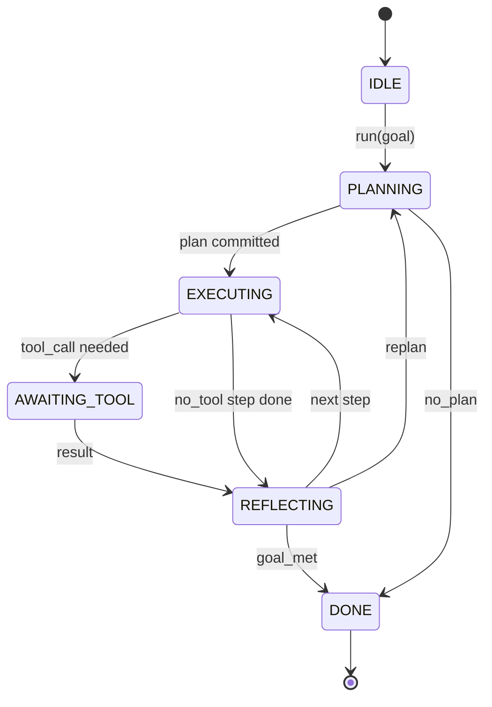

# Agent Harness Loop Contract

> Harness こそが agent である。Model は coprocessor である。この lesson では、任意の model を差し込める loop contract を固定する。

**種類:** Build
**言語:** Python
**前提:** Phase 13 lessons 01-07、Phase 14 lesson 01
**時間:** 約 90 分

## 学習目標

- 明示的な transition を持つ deterministic state machine として agent harness loop を定義する。
- Operator が policy、telemetry、guardrails を配線する 10 個の lifecycle hook topic を実装する。
- Loop が caller に control を返し、新しい input で resume する 2 つの pull point を定義する。
- Per-session budget (turns、tool calls、wall-clock) を、超過時に partial state を漏らさず enforce する。
- Downstream UI や tracer が loop を直接 inspect せずに subscribe できるよう、11 種類の typed event stream を emit する。

## フレーム

40 turn 無人で走る coding agent は chat loop ではない。Operator が node を intercept でき、edge を audit できる state machine である。Contract を書き下せば、model、tool、policy の差し替えは refactor ではなくなる。Registration call になる。

この lesson ではその contract を作る。6 つの state、10 個の hook topic、2 つの pull point、11 個の event type、budget envelope に名前を付ける。Harness の他の要素 (tool registry、JSON-RPC transport、dispatcher、planner) はすべてこの形に plug する。

## State

Loop には 6 つの state がある。5 つは active、1 つは terminal である。



`IDLE` は唯一の legal entry point である。`DONE` は唯一の legal exit である。`AWAITING_TOOL` は pull point を yield する唯一の state である。その他の transition は内部 transition である。

State machine は deterministic である。同じ event log を与えると、harness は同じ state に再入する。この性質により、model を再呼び出しせずに session を replay して debug できる。

## Hook topic

Hook は operator が loop に差し込むための seam である。Harness は 10 個の topic を fire する。各 topic は任意個の subscriber を受け付ける。Subscriber は registration order で fire される。Subscriber は payload を mutate したり、raise して turn を abort したり、sentinel を返して次 step を skip したりできる。

```text
before_plan         after_plan
before_tool_call    after_tool_call
before_step         after_step
on_error
on_pause
on_budget_exceeded
on_complete
```

この形は Claude Code、Cursor、OpenCode が 2025 年半ばまでに収束したものと対応している。名前は branded ではなく functional である。`rm -rf` を block する hook は `before_tool_call` に置く。OpenTelemetry span を送る hook は `after_step` に置く。Paused session の resume に関わる hook は `on_pause` に置く。

## Pull point

Loop は 2 回 control を yield する。1 つ目は、tool result なしに進めない `AWAITING_TOOL` のとき。2 つ目は、budget が尽きた、または hook が明示的に human review を要求した `on_pause` のときである。

Pull point は exception ではない。Return である。Caller は harness state を inspect し、harness が求めたものを fetch し、`resume(payload)` を呼ぶ。Harness は止まった場所から続行する。これは Python generator と同じ形である。Pull point 上の transport は選べる。TUI では keypress、MCP では `tools/call`、queue では job poll になる。

## Event stream

Loop は contract 上の特定点で typed stream に event を append する。Stream は append-only で、subscriber は任意の offset から replay できる。実装される 11 個の event type は次の通り。

- `session.start` — `run(goal)` が呼ばれたときに 1 回 emit
- `plan.draft` — planner が draft plan を返したときに emit
- `plan.commit` — draft が active plan として commit された後に emit
- `step.start` — executing step の開始時に emit
- `step.end` — executing step の終了時に emit
- `tool.call` — tool を必要とする step が caller に control を yield したときに emit
- `tool.result` — tool result とともに resume されたときに emit
- `tool.error` — error とともに resume されたとき、または hook が call を abort したときに emit
- `budget.warn` — budget limit に到達したときに emit
- `session.pause` — loop が pause (budget または hook) で yield したときに emit
- `session.complete` — loop が `DONE` に到達したときに 1 回 emit

Event は hook payload を重複させない。Hook は imperative (mutate、abort) である。Event は observational (record、ship) である。両者は orthogonal に扱う。

## Budget envelope

Session は 3 つの limit を持つ。Turn count、tool call count、wall-clock seconds。各 turn は turns を 1 増やす。各 tool call は tool calls を 1 増やす。Wall-clock は state transition ごとに check する。いずれかの limit に達すると、loop は `on_budget_exceeded` を fire し、`budget.warn` を emit し、次の pull point で budget-exceeded reason を持って `IDLE` に transition する。

Budget は kill switch ではない。Yield である。Caller が budget を延長して resume するか、session を close するかを決める。

## この lesson でやらないこと

Model は呼ばない。Real tool は register しない。Transport も実装しない。それらは次の 4 lesson で扱う。この lesson は contract を固め、次の 4 つが書き直しなしに plug できるようにする。

`main.py` の deterministic planner は stand-in である。3 step の hardcoded plan を返し、そのうち 2 つは tool result を必要とする。重要なのは plan ではなく loop である。

## Code の読み方

`HarnessLoop` が main class である。State を保持し、hook を fire し、event を emit する。`Budget` は limit を追跡する。`Event` は stream 上の typed envelope である。`HookRegistry` は dispatch table である。`_transition` だけが state を変更する function なので、state machine invariant は 1 か所に集まる。

`main.py` を上から下まで読む。次に `code/tests/test_loop.py` を読む。Test はすべての transition と hook firing order を固定している。

## さらに進める

Production で harness を作るときに難しいのは state machine そのものではない。Contract を enforce 可能にすることだ。Contract は planner の hot reload に耐えなければならない。Malformed JSON を返す tool に耐えなければならない。40 turn session の 3 分の 2 まで進んだところで `before_tool_call` の hook が raise しても耐えなければならない。この lesson の test はそうした failure mode を exercise する。実行し、壊し、case を追加する。

次の lesson では tool registry を追加する。その次に JSON-RPC transport。その次に dispatcher。Lesson 24 までには、この file の loop が real tool に対して real plan を実行し、real budget を enforce している。
