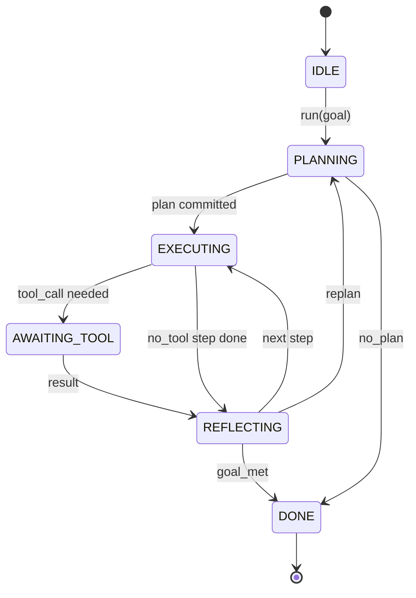

# Agent Harness Loop Contract

> O harness é o agent. O model é um coprocessador. Esta aula congela o contrato do loop que você pode conectar qualquer model.

**Tipo:** Build
**Linguagens:** Python
**Pré-requisitos:** Fase 13 aulas 01-07, Fase 14 aula 01
**Tempo:** ~90 minutos

## Objetivos de Aprendizado
- Eespecificaçãoificar um agente harness loop como uma máquina de estados determinística com transições explícitas.
- Implementar dez tópicos de lifecycle hooks que operadores conectam política, telemetria e guardrails.
- Dois pontos de pull onde o loop cede controle de volta ao caller e retoma com uma nova entrada.
- Forçar orçamentos por sessão (turns, chamadas de ferramentas, wall-clock) sem vazar estado parcial ao exceder.
- Emitir um stream tipado de onze tipos de eventos para que UIs e tracers downstream possam se inespecificaçãoionar sem inespecificaçãoionar o loop diretamente.

## O enquadramento

Um coding agente que roda sem supervisão por quarenta turns não é um chat loop. É uma máquina de estados cujos nós o operador pode interceptar e cujas arestas o operador pode auditar. Uma vez que você escreve o contrato, trocar models, ferramentas ou políticas deixa de ser um refactor. Vira uma chamada de registro.

Esta aula constrói esse contrato. Nós nomeamos seis estados, dez tópicos de hooks, dois pontos de pull, onze tipos de eventos e um envelope de orçamento. Todo o resto no harness (tool registry, JSON-RPC transport, dispatcher, planner) se conecta nessa forma.

## Os estados

O loop tem seis estados. Cinco são ativos. Um é terminal.



`IDLE` é o único ponto de entrada legal. `DONE` é o único ponto de saída legal. `AWAITING_TOOL` é o único estado que cede um ponto de pull. Toda outra transição é interna.

A máquina de estados é determinística. Dado o mesmo log de eventos, o harness reentra no mesmo estado. Essa propriedade é o que permite você replay de sessões para debug sem chamar o model de novo.

## Os tópicos de hooks

Hooks são a costura do operador dentro do loop. O harness dispara dez tópicos. Cada tópico aceita qualquer número de subscribers. Subscribers disparam em ordem de registro. Um subscriber pode mutar o payload, levantar uma exceção para abortar o turn, ou retornar um sentinela para pular o próximo passo.

```text
before_plan         after_plan
before_tool_call    after_tool_call
before_step         after_step
on_error
on_pause
on_budget_exceeded
on_complete
```

A forma espelha o que Claude Code, Cursor e OpenCode convergiram até meados de 2025. Os nomes são funcionais, não de marca. Um hook que bloqueia `rm -rf` fica em `before_tool_call`. Um hook que envia um span de OpenTelemetry fica em `after_step`. Um hook que retoma uma sessão pausada fica em `on_pause`.

## Os pontos de pull

O loop cede controle duas vezes. Primeiro em `AWAITING_TOOL` quando não pode progredir sem um resultado de ferramenta. Segundo em `on_pause` quando o orçamento é esgotado ou um hook pede explicitamente revisão humana.

Um ponto de pull não é uma exceção. É um return. O caller inespecificaçãoiona o estado do harness, busca o que o harness pediu, e chama `resume(payload)`. O harness retoma de onde parou. Essa é a mesma forma de um Python generator. O transport sobre o ponto de pull é sua escolha. Em uma TUI é tecla pressionada. Via MCP é `tools/call`. Via fila é um job poll.

## O stream de eventos

O loop adiciona eventos a um stream tipado em pontos eespecificaçãoíficos do contrato. O stream é append-only e subscribers podem replay de qualquer offset. Os onze tipos de eventos implementados são:

- `session.start` — emitido uma vez quando `run(goal)` é chamado
- `plan.draft` — emitido quando o planner retorna um rascunho de plano
- `plan.commit` — emitido depois que o rascunho é comprometido como plano ativo
- `step.start` — emitido no início de cada passo em execução
- `step.end` — emitido no final de cada passo em execução
- `tool.call` — emitido quando um passo que requer ferramenta cede controle ao caller
- `tool.result` — emitido no retome com um resultado de ferramenta
- `tool.error` — emitido no retome com um erro ou quando um hook aborta a chamada
- `budget.warn` — emitido quando um limite de orçamento é atingido
- `session.pause` — emitido quando o loop cede em uma pausa (orçamento ou hook)
- `session.complete` — emitido uma vez quando o loop alcança `DONE`

Os eventos não duplicam os payloads dos hooks. Hooks são imperativos (mutam, abortam). Eventos são observacionais (registram, enviam). Trate-os como ortogonais.

## O envelope de orçamento

Uma sessão carrega três limites. Contagem de turns, contagem de chamadas de ferramenta, segundos de wall-clock. Cada turn incrementa turns em um. Cada chamada de ferramenta incrementa ferramenta calls em um. Wall-clock é verificado em cada transição de estado. Quando qualquer limite é atingido, o loop dispara `on_budget_exceeded`, emite `budget.warn`, depois transita para `IDLE` com uma razão de orçamento excedido no próximo ponto de pull.

O orçamento não é um interruptor de desligamento. É um yield. O caller decide se estende o orçamento e retoma, ou fecha a sessão.

## O que esta aula não faz

Não chama um model. Não registra ferramentas reais. Não implementa um transport. Essas são as quatro próximas aulas. Esta aula fixa o contrato para que as quatro próximas possam se conectar sem reescrever.

O planner determinístico em `main.py` é um substituto. Retorna um plano hardcode de três passos, dois dos quais requerem um resultado de ferramenta. O ponto é o loop, não o plano.

## Como ler o código

`HarnessLoop` é a classe principal. Segura estado, dispara hooks, emite eventos. `Budget` rastreia limites. `Event` é o envelope tipado no stream. `HookRegistry` é a tabela de despacho. `_transition` é a única função que muda estado, então as invariantes da máquina de estados ficam em um lugar.

Leia `main.py` de cima para baixo. Depois leia `code/tests/test_loop.py`. Os testes fixam cada transição e cada ordem de disparo de hook.

## Indo além

A parte mais difícil de construir um harness em produção não é a máquina de estados. É tornar o contrato aplicável. O contrato tem que sobreviver a um hot reload do planner. Tem que sobreviver a uma ferramenta que retorna JSON malformado. Tem que sobreviver a um hook que levanta exceção em `before_tool_call` dois terços do caminho em uma sessão de quarenta turns. Os testes nesta aula exercitam esses modos de falha. Rode-os. Quebre-os. Adicione casos.

A próxima aula adiciona o ferramenta registry. Depois disso, o JSON-RPC transport. Depois disso, o dispatcher. Na aula vinte e quatro, o loop neste arquivo estará rodando um plano real contra ferramentas reais com orçamentos reais aplicados.
