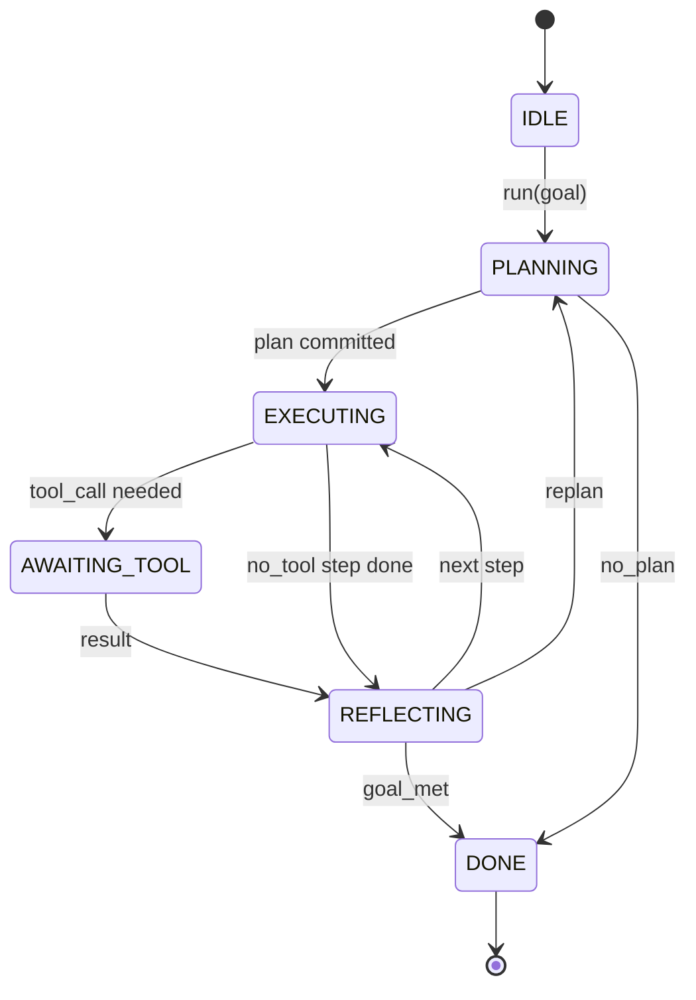

# Agent Kemer Döngüsü Sözleşmesi

> Emniyet kemeri agent'dur. Model bir yardımcı işlemcidir. Bu ders, herhangi bir modeli bağlayabileceğiniz döngü sözleşmesini dondurur.

**Tür:** Yapım
**Diller:** Python
**Önkoşullar:** Aşama 13 dersleri 01-07, Aşama 14 dersi 01
**Süre:** ~90 dakika

## Öğrenme Hedefleri
- Açık geçişlere sahip deterministik bir durum makinesi olarak bir agent kablo demeti döngüsünü belirtin.
- Operatörlerin politikayı, telemetriyi ve korkulukları bağlayacağı on yaşam döngüsü kancası konusunu uygulayın.
- Döngünün kontrolü arayan kişiye devrettiği ve yeni bir girişle devam ettiği iki çekme noktası tanımlayın.
- Aşma durumunda kısmi durum sızıntısı olmadan oturum başına bütçeleri (dönüşümler, araç çağrıları, duvar saati) uygulayın.
- Aşağı akış kullanıcı arayüzlerinin ve izleyicilerin döngüyü doğrudan incelemeden abone olabilmesi için on bir olay türünden oluşan yazılı bir akış yayınlayın.

## Çerçeve

Kırk tur boyunca gözetimsiz çalışan bir agent kodlaması bir sohbet döngüsü değildir. Operatörün düğümlerine müdahale edebileceği ve kenarlarının denetlenebileceği bir durum makinesidir. Sözleşmeyi bir kez yazdığınızda, modelleri, araçları veya politikaları değiştirmek yeniden düzenleme işlevi olmaktan çıkar. Bu bir kayıt çağrısına dönüşür.

Bu ders bu sözleşmeyi oluşturur. Altı eyalet, on kanca konusu, iki çekme noktası, on bir etkinlik türü ve bir bütçe zarfı adlandırıyoruz. Donanımdaki diğer her şey (araç kaydı, JSON-RPC aktarımı, dağıtıcı, planlayıcı) bu şekle uyar.

## Eyaletler

Döngünün altı durumu vardır. Beşi aktif. Biri terminal.



`IDLE` tek yasal giriş noktasıdır. `DONE` tek yasal çıkıştır. `AWAITING_TOOL` , çekme noktası sağlayan tek durumdur. Diğer tüm geçişler içseldir.

Durum makinesi deterministiktir. Aynı olay günlüğü göz önüne alındığında, donanım aynı duruma yeniden girer. Bu özellik, modeli yeniden çağırmadan hata ayıklama için oturumları yeniden oynatmanıza olanak tanıyan şeydir.

## Kanca konuları

Kancalar operatörün ilmek içindeki dikişidir. Koşum takımı on konuyu ateşliyor. Her konu herhangi bir sayıda aboneyi kabul eder. Aboneler kayıt sırasına göre ateş ederler. Bir abone yükü değiştirebilir, dönüşü iptal etmek için yükseltebilir veya bir sonraki adımı atlamak için bir nöbetçi döndürebilir.

```text
before_plan         after_plan
before_tool_call    after_tool_call
before_step         after_step
on_error
on_pause
on_budget_exceeded
on_complete
```

Şekil, Claude Code, Cursor ve OpenCode'un 2025 ortalarında birleştiği noktayı yansıtıyor. İsimler markalı değil işlevseldir. `rm -rf` 'yi engelleyen bir kanca `before_tool_call`'da yaşıyor. OpenTelemetry yayılımını gönderen bir kanca `after_step` içinde yaşıyor. Duraklatılmış bir oturumda devam eden bir kanca `on_pause` içinde yaşar.

## Çekme noktaları

Döngü kontrolü iki kez sağlar. Araç sonucu olmadan ilerleme sağlanamadığında ilk olarak `AWAITING_TOOL` 'da. İkinci olarak, bütçe tükendiğinde veya bir kanca açıkça insan incelemesi istediğinde `on_pause` tarihinde.

Çekme noktası bir istisna değildir. Bu bir geri dönüş. Arayan kişi koşum durumunu inceler, koşum takımının istediği şeyi getirir ve `resume(payload)`'ı çağırır. Kayış durduğu yerden devam ediyor. Bu Python oluşturucuyla aynı şekle sahiptir. Çekme noktası üzerinden ulaşım sizin seçiminizdir. Bir TUI'de tuşa basmaktır. MCP üzerinde bu `tools/call`'dir. Sıranın üzerinde bu bir iş yoklamasıdır.

## Etkinlik akışı

Döngü, olayları sözleşmenin belirli noktalarında yazılan bir akışa ekler. Akış yalnızca ekleme amaçlıdır ve aboneler herhangi bir konumdan yeniden oynatabilir. Uygulanan on bir olay türü şunlardır:

- `session.start` — `run(goal)` çağrıldığında bir kez yayılır
- `plan.draft` — planlayıcı bir taslak plan döndürdüğünde yayılır
- `plan.commit` — Taslağın etkin plan olarak kaydedilmesinden sonra yayılır
- `step.start` — yürütülen her adımın başlangıcında yayılır
- `step.end` — yürütülen her adımın sonunda yayılır
- `tool.call` — araç gerektiren bir adımın kontrolü arayana devrettiğinde yayılır
- `tool.result` — bir araç sonucuyla özgeçmişte yayınlanır
- `tool.error` — hatayla devam edildiğinde veya bir kanca çağrıyı iptal ettiğinde yayılır
- `budget.warn` — bütçe sınırına ulaşıldığında gönderilir
- `session.pause` — döngü bir duraklamada (bütçe veya kanca) pes ettiğinde yayılır
- `session.complete` — döngü `DONE` değerine ulaştığında bir kez yayılır

Olaylar kanca yüklerini çoğaltmaz. Kancalar zorunludur (değişme, iptal etme). Olaylar gözlemseldir (kayıt, gemi). Onlara dikmiş gibi davranın.

## Bütçe zarfı

Bir oturumun üç sınırı vardır. Dönüş sayısı, alet çağrı sayısı, duvar saati saniyesi. Her tur bir tur artar. Her takım çağrısı, takım çağrılarını birer birer artırır. Her durum geçişinde duvar saati kontrol edilir. Herhangi bir sınıra ulaşıldığında döngü `on_budget_exceeded` tetiklenir, `budget.warn` yayar, ardından bir sonraki çekme noktasında bütçenin aşılması nedeniyle `IDLE` 'ye geçiş yapar.

Bütçe bir acil durum anahtarı değildir. Bu bir getiridir. Arayan kişi bütçeyi uzatıp devam ettireceğine veya oturumu kapatacağına karar verir.

## Bu ders ne yapmaz

Bir model çağırmaz. Gerçek araçları kaydetmez. Bir taşıma uygulamaz. Bunlar sonraki dört ders. Bu ders, sonraki dördünün yeniden yazmaya gerek kalmadan sözleşmeye bağlanabilmesi için sözleşmeyi çiviler.

`main.py` 'daki deterministik planlayıcı bir vekildir. İkisi bir araç sonucu gerektiren üç adımdan oluşan sabit kodlanmış bir plan döndürür. Önemli olan döngüdür, plan değil.

## Kod nasıl okunur

`HarnessLoop` ana sınıftır. Durumu korur, kancaları ateşler, olaylar yayar. `Budget` limitleri takip ediyor. `Event` , akışta yazılan zarftır. `HookRegistry` sevk tablosudur. `_transition` , durumu değiştiren tek işlev olduğundan durum makinesi değişmezleri tek bir yerde bulunur.

`main.py` 'u yukarıdan aşağıya doğru okuyun. Sonra `code/tests/test_loop.py`'yi okuyun. Testler her geçişi ve her kanca ateşleme sırasını belirler.

## Daha ileri gidiyoruz

Üretimde koşum takımı kurmanın en zor kısmı durum makinesi değildir. Sözleşmeyi uygulanabilir hale getiriyor. Sözleşme, planlayıcının sıcak bir şekilde yeniden yüklenmesinden sonra hayatta kalmalıdır. Hatalı biçimlendirilmiş JSON döndüren bir araçtan kurtulması gerekiyor. Kırk turluk bir seans boyunca yolun üçte ikisinde `before_tool_call` yükselen bir kancadan sağ çıkması gerekiyor. Bu dersteki testler bu başarısızlık modlarını uygulamaktadır. Çalıştır onları. Kır onları. Vaka ekleyin.

Bir sonraki ders araç kaydını ekler. Bundan sonra JSON-RPC aktarımı. Bundan sonra sevk memuru. Yirmi dördüncü derste, bu dosyadaki döngü, gerçek bütçelerin uygulandığı gerçek araçlara karşı gerçek bir planı çalıştıracak.
