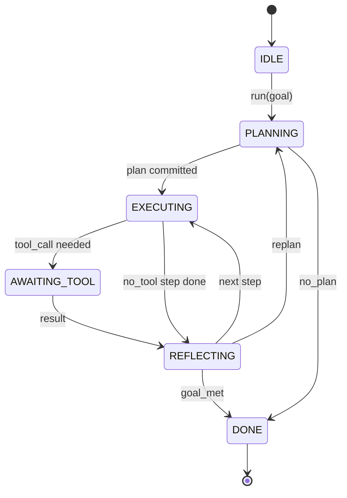

# 20 · 智能体执行循环协议

> 执行框架（harness）本身就是智能体。模型只是协处理器。本课将固化一套可接入任意模型的循环协议（loop contract）。

**类型：** 构建
**语言：** Python
**前置：** 第13阶段第01-07课，第14阶段第01课
**时长：** 约90分钟

## 学习目标

- 将智能体执行框架的循环设计为具备显式状态转移的确定性状态机。
- 实现十个生命周期钩子主题（hook topic），供运维人员接入策略、遥测与护栏逻辑。
- 定义两个拉取点（pull point），循环在此将控制权交还给调用方，并在收到新输入后恢复执行。
- 强制执行按会话的预算限制（轮次、工具调用次数、墙上时间），超限时不残留部分状态。
- 输出包含十一种事件类型的类型化流，供下游 UI 与追踪器订阅，无需直接检查循环内部。

## 框架

一个无人值守运行四十轮的编程智能体并非聊天循环。它是一台状态机，运维人员可以拦截其节点、审计其边。一旦你将这份协议写定，更换模型、工具或策略就不再是重构，而变成一次注册调用。

本课构建的正是这份协议。我们定义了六种状态、十个钩子主题、两个拉取点、十一种事件类型以及一个预算封装。执行框架中其余的一切（工具注册表、JSON-RPC 传输层、调度器、规划器）都接插到这个形态之上。

## 状态

循环共有六种状态。五种为活跃状态，一种为终止状态。



`IDLE` 是唯一合法的入口点。`DONE` 是唯一合法的出口。`AWAITING_TOOL` 是唯一产生拉取点的状态。其余所有转移均为内部转移。

状态机是确定性的。给定相同的事件日志，执行框架将重新进入相同的状态。正是这一特性让你能够在不重新调用模型的情况下重放会话以进行调试。

## 钩子主题

钩子是运维人员介入循环的接缝。执行框架触发十个主题。每个主题接受任意数量的订阅者。订阅者按注册顺序触发。订阅者可以修改负载数据（payload）、抛出异常以中止当前轮次，或返回一个哨兵值来跳过下一步。

```text
before_plan         after_plan
before_tool_call    after_tool_call
before_step         after_step
on_error
on_pause
on_budget_exceeded
on_complete
```

这一形态反映了 Claude Code、Cursor 和 OpenCode 在 2025 年中共同收敛到的设计。名称是功能性的，不带品牌色彩。阻止 `rm -rf` 的钩子存在于 `before_tool_call` 中。发送 OpenTelemetry span 的钩子存在于 `after_step` 中。在暂停会话上恢复执行的钩子存在于 `on_pause` 中。

## 拉取点

循环两次让出控制权。第一次在 `AWAITING_TOOL`，当没有工具结果就无法继续推进时。第二次在 `on_pause`，当预算耗尽或某个钩子显式请求人工审核时。

拉取点不是异常。它是一次返回。调用方检查执行框架状态，获取框架所请求的内容，然后调用 `resume(payload)`。框架从停下的地方继续执行。这与 Python 生成器的形态相同。拉取点之上的传输方式由你选择——TUI 中是按键，通过 MCP 是 `tools/call`，通过消息队列则是任务轮询。

## 事件流

循环在协议的特定节点将事件追加到类型化流中。该流只追加、不可删改，订阅者可以从任意偏移量重放。已实现的十一种事件类型如下：

- `session.start` —— 调用 `run(goal)` 时触发一次
- `plan.draft` —— 规划器返回草案计划时触发
- `plan.commit` —— 草案被提交为当前活跃计划后触发
- `step.start` —— 每个执行步骤开始时触发
- `step.end` —— 每个执行步骤结束时触发
- `tool.call` —— 需要工具的步骤将控制权交给调用方时触发
- `tool.result` —— 带着工具结果恢复执行时触发
- `tool.error` —— 带着错误恢复执行，或钩子中止调用时触发
- `budget.warn` —— 达到某一预算限制时触发
- `session.pause` —— 循环因暂停（预算或钩子）而让出控制权时触发
- `session.complete` —— 循环到达 `DONE` 时触发一次

事件不重复钩子的负载数据。钩子是命令式的（修改、中止）。事件是观察性的（记录、发送）。请将它们视为正交的两个维度。

## 预算封装

每个会话携带三种限制：轮次计数、工具调用计数、墙上时间秒数。每轮递增轮次计数一次。每次工具调用递增工具调用计数一次。每次状态转移时检查墙上时间。当任意限制达到时，循环触发 `on_budget_exceeded`，发出 `budget.warn`，然后在下一个拉取点以预算超限的原由转入 `IDLE`。

预算不是强制终止开关。它是一次让出。调用方决定是延长预算并恢复执行，还是关闭会话。

## 本课不涉及的内容

本课不调用模型。不注册真实工具。不实现传输层。这些是接下来四课的内容。本课只把协议敲定，好让接下来四课能直接接插进来而无需重写。

`main.py` 中的确定性规划器只是一个占位实现。它返回一个包含三个步骤的硬编码计划，其中两个步骤需要工具结果。重点在于循环本身，而非计划。

## 代码导读

`HarnessLoop` 是主类。它持有状态、触发钩子、发出事件。`Budget` 跟踪限制。`Event` 是流上的类型化信封。`HookRegistry` 是分发表。`_transition` 是唯一更改状态的函数，因此状态机的不变量都集中在一处。

先从头到尾阅读 `main.py`。然后阅读 `code/tests/test_loop.py`。测试用例覆盖了每一次转移和每一个钩子的触发顺序。

## 拓展

在生产环境中构建执行框架最困难的部分不是状态机，而是让协议可强制执行。协议必须能经受规划器的热重载。必须能经受工具返回格式错误的 JSON。必须能经受钩子在四十轮会话进行到三分之二时于 `before_tool_call` 中抛出异常。本课的测试演练了这些故障模式。运行它们。弄坏它们。添加更多用例。

下一课添加工具注册表。再下一课添加 JSON-RPC 传输层。再之后是调度器。到第二十四课时，本文件中的循环将以真实预算约束，对真实工具执行真实计划。
