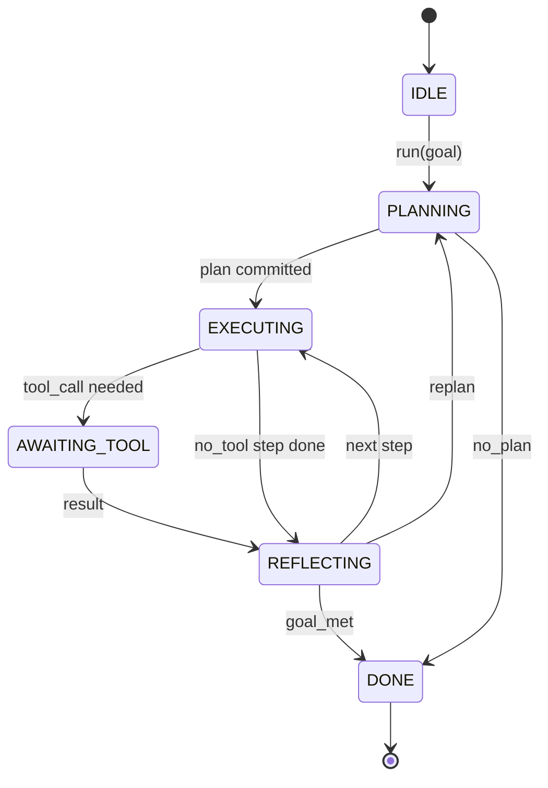

# Agent Harness 循环契约（Agent Harness Loop Contract）

> 译注：本文译自同目录 [`en.md`](./en.md)。术语遵循仓根 [TRANSLATION_GUIDE.md](../../../../TRANSLATION_GUIDE.md)。

> harness 才是 agent，模型只是一颗协处理器。本课要把循环契约（loop contract）冻结下来，让你之后能把任何模型直接接进去。

**Type:** Build
**Languages:** Python
**Prerequisites:** Phase 13 lessons 01-07, Phase 14 lesson 01
**Time:** ~90 minutes

## 学习目标（Learning Objectives）
- 把 agent harness 的循环规约成一台带显式状态转移的确定性状态机。
- 实现十个生命周期 hook 主题（topic），让运维人员把策略、遥测、guardrail（护栏）挂上去。
- 定义两个 pull point（拉取点），让循环能把控制权交还给调用方，再用新的输入恢复执行。
- 在不泄漏中间状态的前提下，强制执行单 session 的预算（轮数、tool call 次数、wall-clock 秒数）。
- 发出十一种类型的强类型事件流，让下游 UI 和 tracer 不必直接探查循环就能订阅。

## 全景（The frame）

一个无人值守跑四十轮的 coding agent 不是一个聊天循环。它是一台状态机：节点可以被运维拦截，边可以被运维审计。把契约一旦写下来，换模型、换 tool、换策略就不再是一次重构，而是一次注册调用。

本课就要把这份契约写出来。我们要点名六个状态、十个 hook 主题、两个 pull point、十一种事件类型，外加一个预算信封（budget envelope）。harness 里其他所有东西（tool registry、JSON-RPC transport、dispatcher、planner）都按这个形状插进来。

## 状态（The states）

循环有六个状态。五个是活动态，一个是终止态。



`IDLE` 是唯一合法的入口，`DONE` 是唯一合法的出口。`AWAITING_TOOL` 是唯一会产生 pull point 的状态。其他所有转移都是内部转移。

这台状态机是确定性（deterministic）的：给定相同的事件日志，harness 会重新进入相同的状态。正是这个性质让你能在 debug 时回放 session，而不必再次调用模型。

## Hook 主题（The hook topics）

Hook 是运维插进循环的接缝。harness 一共触发十个主题。每个主题接受任意多个订阅者，订阅者按注册顺序触发。订阅者可以改写 payload、抛异常以中断本轮、或返回一个哨兵值来跳过下一步。

```text
before_plan         after_plan
before_tool_call    after_tool_call
before_step         after_step
on_error
on_pause
on_budget_exceeded
on_complete
```

这套形状映射的是 Claude Code、Cursor、OpenCode 在 2025 年中期不约而同收敛到的设计。命名是功能性的，不带品牌色彩。拦 `rm -rf` 的 hook 属于 `before_tool_call`；发 OpenTelemetry span 的 hook 属于 `after_step`；恢复一个被 pause 的 session 的 hook 属于 `on_pause`。

## 拉取点（The pull points）

循环会把控制权让出两次。第一次是在 `AWAITING_TOOL`：没有 tool result 它就推进不下去；第二次是在 `on_pause`：要么预算耗尽，要么某个 hook 显式请求 human review（人工复核）。

pull point 不是异常，而是一次返回。调用方检查 harness 状态，把 harness 要的东西取来，然后调用 `resume(payload)`，harness 会从断点继续。这套形状跟 Python generator 完全一致。pull point 上的传输方式由你决定：在 TUI 里就是按键；在 MCP 上是 `tools/call`；在 queue 上是 job poll。

## 事件流（The event stream）

循环会在契约的特定位置往一条强类型流里 append 事件。这条流是 append-only 的，订阅者可以从任意 offset 回放。已实现的十一种事件类型如下：

- `session.start` — 调用 `run(goal)` 时发出一次
- `plan.draft` — planner 返回草案 plan 时发出
- `plan.commit` — 草案被提交为活动 plan 后发出
- `step.start` — 每个 executing 步骤开始时发出
- `step.end` — 每个 executing 步骤结束时发出
- `tool.call` — 需要 tool 的步骤把控制权让给调用方时发出
- `tool.result` — resume 携带 tool result 时发出
- `tool.error` — resume 携带错误时、或某 hook 中止 tool 调用时发出
- `budget.warn` — 任一预算限额触顶时发出
- `session.pause` — 循环因 pause（预算或 hook）让出控制时发出
- `session.complete` — 循环到达 `DONE` 时发出一次

事件不复用 hook payload。Hook 是命令式（修改、中止），事件是观察式（记录、外发）。把它们当成正交的两条线。

## 预算信封（The budget envelope）

一个 session 携带三条限额：轮数（turn count）、tool call 次数、wall-clock 秒数。每一轮把 turns 加一，每一次 tool call 把 tool calls 加一，wall-clock 在每次状态转移时检查。任一限额触顶时，循环会触发 `on_budget_exceeded`、发出 `budget.warn`，然后在下一个 pull point 上以「预算超限」为原因转回 `IDLE`。

预算不是 kill switch，而是一次 yield。调用方自己决定：是给预算续命然后 resume，还是关掉这个 session。

## 本课不做的事（What this lesson does not do）

不调用模型。不注册真实 tool。不实现 transport。这些都留给后面四课。本课只把契约钉死，好让后面四课往上插的时候不必返工。

`main.py` 里的确定性 planner 只是一个占位：它返回一个写死的三步 plan，其中两步需要 tool result。重点在循环，不在 plan。

## 怎么读这份代码（How to read the code）

`HarnessLoop` 是主类，持有状态、触发 hook、发出事件。`Budget` 跟踪限额。`Event` 是事件流上的强类型信封。`HookRegistry` 是 dispatch 表。`_transition` 是唯一会改状态的函数，所以状态机的不变量都集中在这一处。

`main.py` 从头读到尾，然后读 `code/tests/test_loop.py`。测试钉死了每一个状态转移、每一处 hook 的触发顺序。

## 再走一步（Going further）

生产里搭一个 harness 最难的部分不是状态机本身，而是怎么让契约可强制执行。契约要扛得住 planner 热重载，扛得住返回畸形 JSON 的 tool，扛得住一个 hook 在四十轮 session 跑到三分之二时在 `before_tool_call` 里抛异常。本课的测试已经覆盖了这些失败模式。把测试跑起来、把它们玩坏、再补 case。

下一课加上 tool registry。再下一课加 JSON-RPC transport。再下一课加 dispatcher。到第二十四课，本文件里的循环就会拿着真实预算、跑真实 plan、用真实 tool 了。
