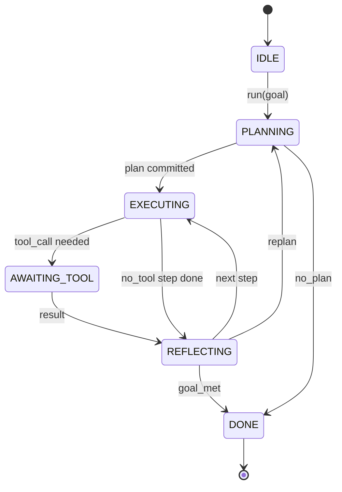

# Agent 编排循环契约

> 编排器（Harness）即 Agent 本身，模型（Model）是其协处理器。本课将冻结一个循环契约，你可以将任何模型接入其中。

**类型：** 构建
**语言：** Python
**前置条件：** 第 13 阶段第 01-07 课，第 14 阶段第 01 课
**时长：** ~90 分钟

## 学习目标

- 将 Agent 编排循环定义为具有明确转换的确定性状态机。
- 实现十个生命周期钩子主题，操作者可在此处接入策略、遥测与护栏。
- 定义两处拉取点，循环在此将控制权交还给调用者，并在收到新输入后恢复执行。
- 强制执行每次会话的预算（轮次、工具调用、实际时间），超出预算时不泄露不完整的状态。
- 发布一个包含十一种事件类型的类型化事件流，使下游 UI 和追踪器无需直接检测循环即可订阅。

## 框架

一个无监督运行四十轮的编码 Agent 并非聊天循环。它是一个状态机——操作者可以拦截其节点，审计其边。一旦你将契约写下来，更换模型、工具或策略就不再需要重构。它变成了一次注册调用。

本课将构建该契约。我们定义了六个状态、十个钩子主题、两处拉取点、十一种事件类型，以及一个预算包络。编排器中的所有其余部分（工具注册表、JSON-RPC 传输层、调度器、规划器）都插入到这个框架中。

## 状态

循环包含六个状态。其中五个是活跃状态，一个是终止状态。


```mermaid
stateDiagram-v2
    [*] --> IDLE
    IDLE --> PLANNING: run(goal)
    PLANNING --> EXECUTING: plan committed
    EXECUTING --> AWAITING_TOOL: tool_call needed
    AWAITING_TOOL --> REFLECTING: result
    EXECUTING --> REFLECTING: no_tool step done
    REFLECTING --> EXECUTING: next step
    REFLECTING --> PLANNING: replan
    REFLECTING --> DONE: goal_met
    PLANNING --> DONE: no_plan
    DONE --> [*]
```

`IDLE` 是唯一合法的入口。`DONE` 是唯一合法的出口。`AWAITING_TOOL` 是唯一产生拉取点的状态。所有其他转换均为内部转换。

该状态机是确定性的。给定相同的事件日志，编排器将重新进入相同的状态。这一特性使你无需重新调用模型即可回放会话以进行调试。

## 钩子主题

钩子是操作者接入循环的接口。编排器会触发十个主题。每个主题接受任意数量的订阅者。订阅者按照注册顺序依次触发。订阅者可以修改负载、触发中止当前轮次、或返回一个标记以跳过下一步。

```text
before_plan         after_plan
before_tool_call    after_tool_call
before_step         after_step
on_error
on_pause
on_budget_exceeded
on_complete
```

这一结构反映了 Claude Code、Cursor 和 OpenCode 在 2025 年中旬趋于一致的设计。这些名称是功能性的，而非品牌化的。用于阻止 `rm -rf` 的钩子位于 `before_tool_call` 中。用于发送 OpenTelemetry span 的钩子位于 `after_step` 中。用于恢复暂停会话的钩子位于 `on_pause` 中。

## 拉取点

循环会交出控制权两次。第一次是在 `AWAITING_TOOL` 状态，此时如果没有工具结果就无法继续推进。第二次是在 `on_pause` 状态，当预算耗尽或某个钩子明确请求人工审查时。

拉取点不是异常。它是一个返回。调用者检查编排器的状态，获取编排器请求的内容，然后调用 `resume(payload)`。编排器从停止的地方继续执行。这与 Python 生成器（generator）的结构相同。通过拉取点的传输机制由你自行选择。在 TUI 中，它是按键操作。在 MCP 上，它是 `tools/call`。在消息队列中，它是任务轮询。

## 事件流

循环在契约的特定位置将事件追加到一个类型化流中。该流是只追加的，订阅者可以从任意偏移量回放。已实现的十一种事件类型包括：

- `session.start` — 在调用 `run(goal)` 时发出一次
- `plan.draft` — 在规划器返回草案计划时发出
- `plan.commit` — 在草案计划被提交为当前活动计划后发出
- `step.start` — 在每一步执行开始时发出
- `step.end` — 在每一步执行结束时发出
- `tool.call` — 在需要工具的步骤将控制权交给调用者时发出
- `tool.result` — 在恢复执行并带回工具结果时发出
- `tool.error` — 在恢复执行时遇到错误，或钩子中止调用时发出
- `budget.warn` — 在达到预算限制时发出
- `session.pause` — 在循环因暂停（预算或钩子）而交出控制权时发出
- `session.complete` — 在循环到达 `DONE` 状态时发出一次

事件不会复制钩子的负载。钩子是命令式的（修改、中止）。事件是观察性的（记录、发送）。请将它们视为正交的两个层面。

## 预算包络

每个会话携带三个限制：轮次计数、工具调用计数、实际运行时间（秒）。每一轮增加一次轮次计数。每次工具调用增加一次工具调用计数。实际运行时间在每次状态转换时检查。当达到任一限制时，循环触发 `on_budget_exceeded`，发出 `budget.warn` 事件，然后在下一个拉取点以"预算超限"的原因转换到 `IDLE` 状态。

预算不是终止开关。它是一种让出（yield）。调用者决定是延长预算并恢复执行，还是结束会话。

## 本课未涵盖的内容

本课不会调用模型。不会注册真实工具。不会实现传输层。这些是后续四课的内容。本课将契约落实到位，使后续四课能够接入其中而无需重写。

`main.py` 中的确定性规划器只是一个占位实现。它返回一个硬编码的三步计划，其中两步需要工具结果。重点在于循环，而非计划。

## 如何阅读代码

`HarnessLoop` 是主类。它持有状态、触发钩子、发出事件。`Budget` 追踪限制。`Event` 是流上的类型化信封。`HookRegistry` 是调度表。`_transition` 是唯一改变状态的函数，因此状态机的不变量集中在一处。

请从上到下阅读 `main.py`。然后阅读 `code/tests/test_loop.py`。这些测试覆盖了每一次转换和每一个钩子的触发顺序。

## 更进一步

在生产环境中构建编排器最难的部分并非状态机本身。而是让契约具有可执行性。契约必须能够承受规划器的热重载。必须能够承受返回格式错误 JSON 的工具。必须能够承受在四十轮会话进行到三分之二时，某个钩子在 `before_tool_call` 中抛出异常。本课中的测试覆盖了这些失败模式。运行它们。破坏它们。添加新的用例。

下一课将添加工具注册表。之后是 JSON-RPC 传输层。再之后是调度器。到第二十四课时，此文件中的循环将使用真实的预算，针对真实的工具运行真实的计划。
