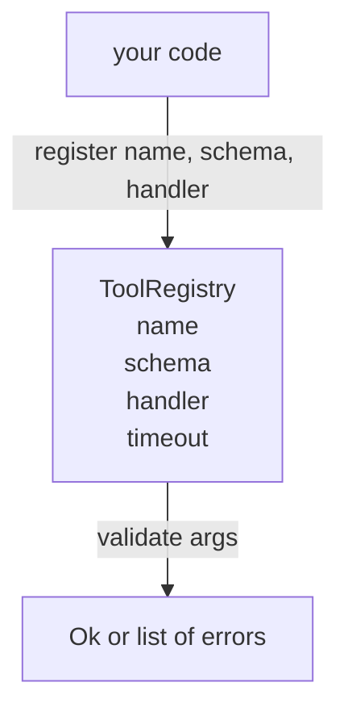

# スキーマ検証つき Tool Registry

> エージェントが検証できない tool は、エージェントが呼び出せない tool です。tool 本体を作る前に、registry と schema checker を作ります。

**種別:** 構築
**言語:** Python
**前提条件:** Phase 13 lessons 01-07, Phase 14 lesson 01
**所要時間:** 約90分

## 学習目標
- dispatcher が一度問い合わせれば以後信頼できる、tool name → schema → handler の型付き registry を保持する。
- tool call の 9 割で実際に使う keyword をカバーする JSON Schema 2020-12 の subset を実装する。
- model が 1 往復で自己修正できるように、json-pointer 形式の正確な error path を返す。
- 明示的な override なしの再登録を拒否する。silent overwrite は production の tool catalog がずれる典型原因だからです。
- replay log 上で再実行できるように、validator を pure に保つ（I/O、時刻、global state を使わない）。

## なぜ tool より registry が先なのか

2026 年の coding agent は、1 つの context window に収まりきらない数の tool を登録します。非自明な harness では 200 個の tool を登録し、その時点の turn で 10〜40 個を surface します。registry は「どの tool が存在するか」「引数はどんな形か」「どの handler を呼ぶか」の source of truth です。この 3 つが固定されれば、harness の残りは推測をやめられます。

避けたい失敗は、schema なしで handler を出荷すること、または validation なしで schema を出荷することです。どちらもよくあります。どちらも次の層（lesson 23 の dispatcher）を当て推量ゲームに変え、失敗モードを handler からの stack trace だけにしてしまいます。

## tool record の形

```text
ToolRecord
  name        : str          (unique, lowercase alphanumeric and underscore segments separated by dots, e.g., snake_case.segment.case)
  description : str          (one line, shown to the model)
  schema      : dict         (JSON Schema 2020-12 subset)
  handler     : Callable     (async or sync, returns Any)
  idempotent  : bool         (dispatcher uses this for retry decisions)
  timeout_ms  : int          (override per-tool dispatcher default)
```

validator が触るのは schema field だけです。handler は validator から見て opaque です。意図的に分けています。schema は data、handler は code です。混ぜると validation logic を handler の中に置きたくなります。それこそ止めたい bug です。

## JSON Schema 2020-12 subset

完全な 2020-12 spec は論文のような量があります。ここで必要なのは 8 つの keyword です。

```text
type           string / number / integer / boolean / object / array / null
properties     map of property name -> schema
required       list of property names
enum           list of allowed primitive values
minLength      integer, applies to strings
maxLength      integer, applies to strings
pattern        ECMA-262-compatible regex, applies to strings
items          schema applied to every array element
```

tool API が実際に必要とする範囲はこれで十分です。追加しない keyword（oneOf, anyOf, allOf, $ref, conditionals）は production schema では有効ですが、validator を cycle を持つ tree walker に変えます。ここで作るのは registry であり、JSON Schema engine ではありません。

## Json pointer error paths

validation に失敗すると、validator は error の list を返します。各 error は input 内の json-pointer path を持ちます。pointer は slash で始まる property name と array index の sequence です。

```text
{"a": {"b": [1, 2, "x"]}}
                    ^
                    /a/b/2
```

model は文章より error path をうまく読みます。schema が `args.user.email` を要求していて model が integer を渡したなら、error は `expected_type: string` を伴う `/user/email` であるべきです。model はそれを次の call で自然言語のやり取りなしに直せます。

## Registration と override

`register(name, schema, handler, **opts)` は default で再登録を拒否します。置き換えるには caller が `override=True` を渡す必要があります。これは運用上の hygiene です。codebase の 2 か所が同じ tool name を黙って登録する bug は、production で見つけるのに 1 週間かかる類のものです。

registry は 3 つの read method を公開します。`get(name)` は record を返すか raise します。`validate(name, args)` は `Ok` または error list を返します。`names()` は登録順に tool name を返します。

## validator がすること、しないこと

validator は schema tree を 1 回だけ再帰的に走査します。pure です。handler は呼びません。type coercion はしません（string `"42"` は number schema に通りません）。黙って truncate もしません。

これは security boundary ではありません。validation を通過したあとでも malicious handler は悪さができます。lesson 23 の dispatcher が timeout と sandbox layer を追加します。registry が追加するのは shape です。

## 形



## code の読み方

`code/main.py` は `ToolRegistry`, `ToolRecord`, `ValidationError`, そして 8 つの validator function を定義します。validator は `schema["type"]` で dispatch します（または `enum` を持つ schema を untyped enum check として扱います）。各 type validator は empty list または `ValidationError` の list を返します。top-level walker は error を連結し、下降するたびに path segment を prepend します。

`code/tests/test_registry.py` は registration、override、validation success、path つき validation failure、subset 内の全 keyword を cover します。

## さらに進む

この lesson が入ったあと欲しくなる extension は 2 つあります。local definitions block に対する `$ref` resolution と、厳密な shape のための `additionalProperties: false` です。どちらも小さいです。tool catalog が 50 個を超えるとよく追加されます。この lesson では file を 1 回で読める長さに保つため、あえて外しています。

次の lesson（22）は、この registry を model client に surface する JSON-RPC stdio transport を作ります。その次（23）は、timeout と retry を持つ dispatcher の背後に両方を包みます。
