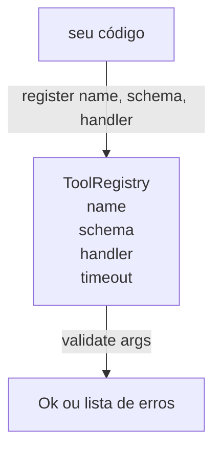

# Tool Registry com Schema Validation

> Uma ferramenta que o agente não consegue validar é uma ferramenta que o agente não consegue chamar. Construa o registry e o verificador de schema antes de construir as ferramentas.

**Tipo:** Build
**Linguagens:** Python
**Pré-requisitos:** Fase 13 aulas 01-07, Fase 14 aula 01
**Tempo:** ~90 minutos

## Objetivos de Aprendizado
- Manter um registry tipado de nome da ferramenta → schema → handler que o dispatcher pode consultar uma vez e confiar depois.
- Implementar um subconjunto do JSON Schema 2020-12 que cobre as palavras-chave que noventa por cento das chamadas de ferramenta realmente usam.
- Retornar caminhos de erro precisos, com formato de json-pointer, para que o model se auto-corrija em uma única viagem de ida e volta.
- Rejeitar re-registro sem override explícito, já que sobrescrevimentos silenciosos são como catálogos de ferramentas em produção derivam.
- Manter o validador puro (sem I/O, sem tempo, sem globals) para que possa ser re-executado em um log de replay.

## Por que o registry vem antes da ferramenta

Um coding agente em 2026 tem mais ferramentas registradas do que o model cabe em uma única janela de contexto. Um harness não trivial vai registrar duzentas ferramentas e expor dez a quarenta em qualquer turn. O registry é a fonte de verdade para "quais ferramentas existem," "qual é a forma dos seus argumentos," e "qual handler devo chamar." Uma vez que essas três respostas estão fixadas, o resto do harness pode parar de adivinhar.

O erro que estamos evitando é lançar handlers sem schemas, ou lançar schemas sem validação. Ambos são comuns. Ambos transformam a próxima camada (o dispatcher na aula vinte e três) em um jogo de adivinhação onde o único modo de falha é um stack trace do handler.

## Como é um registro de ferramenta

```text
ToolRecord
  name        : str          (único, lowercase alfanumérico e segmentos de underscore separados por pontos, ex.: snake_case.segment.case)
  description : str          (uma linha, mostrada ao model)
  schema      : dict         (subconjunto do JSON Schema 2020-12)
  handler     : Callable     (async ou sync, retorna Any)
  idempotent  : bool         (dispatcher usa isso para decisões de retry)
  timeout_ms  : int          (override do dispatcher por ferramenta)
```

O schema é o único campo que o validador toca. O handler é opaco para ele. Separamos de propósito. O schema são dados. O handler é código. Misturar them tente a colocar lógica de validação dentro do handler, que é o bug que estamos impedindo.

## O subconjunto do JSON Schema 2020-12

A eespecificaçãoificação completa de 2020-12 é um paper. Nós precisamos de oito palavras-chave.

```text
type           string / number / integer / boolean / object / array / null
properties     map de nome de propriedade -> schema
required       lista de nomes de propriedades
enum           lista de valores primitivos permitidos
minLength      inteiro, aplica a strings
maxLength      inteiro, aplica a strings
pattern        regex compatível com ECMA-262, aplica a strings
items          schema aplicado a cada elemento do array
```

Isso é suficiente para cobrir o que uma API de ferramenta realmente precisa. As palavras-chave que não adicionamos (oneOf, anyOf, allOf, $ref, condicionais) são válidas em schemas de produção mas transformam o validador em um caminhador de árvore com ciclos. Estamos construindo um registry, não um motor de JSON Schema.

## Caminhos de erro com json pointer

Quando a validação falha, o validador retorna uma lista de erros. Cada erro carrega um caminho de json-pointer para o input. Um pointer é uma sequência de nomes de propriedades e índices de array com prefixo de barra.

```text
{"a": {"b": [1, 2, "x"]}}
                    ^
                    /a/b/2
```

O model lê caminhos de erro melhor do que lê frases. Se um schema requer `args.user.email` e o model passou um inteiro, o erro deve ser `/user/email` com `expected_type: string`. O model corrige isso na próxima chamada sem uma rodada de linguagem natural.

## Registro e override

`register(name, schema, handler, **opts)` rejeita re-registro por padrão. O caller tem que passar `override=True` para substituir. Isso é higiene operacional. Duas partes do codebase registrando silenciosamente o mesmo nome de ferramenta é o tipo de bug que leva uma semana para encontrar em produção.

O registry expõe três métodos de leitura. `get(name)` retorna o record ou levanta exceção. `validate(name, args)` retorna um `Ok` ou uma lista de erros. `names()` retorna os nomes das ferramentas em ordem de registro.

## O que o validador é e o que não é

É um único passo sobre a árvore do schema, recursivo. É puro. Não chama handlers. Não converte tipos (uma string `"42"` não passa um schema de number). Não trunca silenciosamente.

Não é uma fronteira de segurança. Um handler malicioso ainda pode se comportar mal depois que a validação passa. O dispatcher na aula vinte e três adiciona camadas de timeout e sandbox. O registry adiciona forma.

## Forma



## Como ler o código

`code/main.py` define `ToolRegistry`, `ToolRecord`, `ValidationError`, e as oito funções de validação. O validador despacha em `schema["type"]` (ou trata um schema com `enum` como verificação de enum sem tipo). Cada validador de tipo retorna uma lista vazia ou uma lista de `ValidationError`. O caminhador de nível superior concatena erros e prepende segmentos de caminho conforme desce.

`code/tests/test_registry.py` cobre registro, override, sucesso de validação, falha de validação com caminhos, e cada palavra-chave no subconjunto.

## Indo além

As duas extensões que você vai querer assim que esta aula estiver pronta são resolução de `$ref` contra um bloco de definições local, e `additionalProperties: false` para forma estrita. Ambas são pequenas. Ambas são comuns de adicionar quando o catálogo de ferramentas cresce além de cinquenta ferramentas. Nós as deixamos fora da aula para manter o arquivo em uma única leitura.

A próxima aula (vinte e duas) constrói o JSON-RPC stdio transport que expõe este registry para um model client. A aula seguinte (vinte e três) encapsula ambos atrás de um dispatcher com timeouts e retries.
