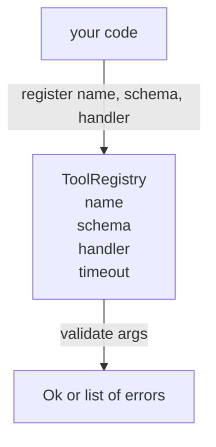

# Şema Doğrulamalı Araç Kaydı

> agent'ın doğrulayamadığı bir araç, agent'ın çağıramayacağı bir araçtır. Araçları oluşturmadan önce kayıt defterini ve şema denetleyiciyi oluşturun.

**Tür:** Yapım
**Diller:** Python
**Önkoşullar:** Aşama 13 dersleri 01-07, Aşama 14 dersi 01
**Süre:** ~90 dakika

## Öğrenme Hedefleri
- Dağıtımcının bir kez isteyebileceği ve daha sonra güvenebileceği, araç adı → şema → işleyicinin yazılı bir kaydını tutun.
- Araç çağrılarının yüzde doksanının gerçekte kullandığı anahtar kelimeleri kapsayan bir JSON Şeması 2020-12 alt kümesini uygulayın.
- Modelin tek bir gidiş dönüşte kendi kendini düzeltebilmesi için hassas, json işaretçisi şeklindeki hata yollarını döndürün.
- Sessiz üzerine yazma işlemleri, üretim aracı kataloglarının sürüklenme şekli olduğundan, açıkça geçersiz kılmadan yeniden kaydı reddedin.
- Doğrulayıcıyı saf tutun (G/Ç yok, zaman yok, global yok), böylece tekrar günlüğünde yeniden çalıştırılabilir.

## Kayıt defteri neden araçtan önce geliyor?

2026'daki bir agent kodlaması, modelin tek bir context window'ye sığabileceğinden daha fazla kayıtlı araca sahiptir. Önemsiz olmayan bir koşum takımı iki yüz aleti kaydedecek ve herhangi bir dönüşte on ila kırk arasında yüzeye çıkacak. Kayıt defteri, "hangi araçların mevcut olduğu", "argümanlarının hangi şekli aldığı" ve "hangi işleyiciyi çağıracağım" konularında gerçeğin kaynağıdır. Bu üç cevap sabitlendiğinde, koşumun geri kalanı tahmin etmeyi bırakabilir.

Kaçındığımız hata, şeması olmayan nakliye işleyicileri veya doğrulaması olmayan nakliye şemalarıdır. Her ikisi de yaygındır. Her ikisi de bir sonraki katmanı (yirmi üçüncü dersteki gönderici), tek başarısızlık modunun işleyiciden gelen yığın izlemesi olduğu bir tahmin oyununa dönüştürür.

## Bir takım kaydı nasıl görünür?

```text
ToolRecord
  name        : str          (unique, lowercase alphanumeric and underscore segments separated by dots, e.g., snake_case.segment.case)
  description : str          (one line, shown to the model)
  schema      : dict         (JSON Schema 2020-12 subset)
  handler     : Callable     (async or sync, returns Any)
  idempotent  : bool         (dispatcher uses this for retry decisions)
  timeout_ms  : int          (override per-tool dispatcher default)
```

Şema, doğrulayıcının dokunduğu tek alandır. İşleyici bunun için opaktır. Bunları bilerek ayırıyoruz. Şema veridir. İşleyici koddur. Bunları karıştırmak sizi, doğrulama mantığını işleyicinin içine koymaya teşvik eder, bu da durdurduğumuz hatadır.

## JSON Şeması 2020-12 alt kümesi

2020-12 spesifikasyonunun tamamı bir makaledir. Sekiz anahtar kelimeye ihtiyacımız var.

```text
type           string / number / integer / boolean / object / array / null
properties     map of property name -> schema
required       list of property names
enum           list of allowed primitive values
minLength      integer, applies to strings
maxLength      integer, applies to strings
pattern        ECMA-262-compatible regex, applies to strings
items          schema applied to every array element
```

Bu, bir araç API'sinin gerçekte neye ihtiyaç duyduğunu karşılamak için yeterlidir. Eklemediğimiz anahtar kelimeler (oneOf, anyOf, allOf, $ref,conditionals) üretim şemalarında geçerlidir ancak doğrulayıcıyı döngüleri olan bir ağaç yürütücüye dönüştürür. JSON Schema motoru değil, kayıt defteri oluşturuyoruz.

## Json işaretçisi hata yolları

Doğrulama başarısız olduğunda, doğrulayıcı bir hata listesi döndürür. Her hata, girişe bir json işaretçisi yolu taşır. İşaretçi, özellik adlarının ve dizi dizinlerinin eğik çizgi öneki dizisidir.

```text
{"a": {"b": [1, 2, "x"]}}
                    ^
                    /a/b/2
```

Model, hata yollarını cümleleri okuduğundan daha iyi okur. Bir şema `args.user.email` gerektiriyorsa ve model bir tamsayı aktarıyorsa, hata `expected_type: string` ile birlikte `/user/email` olmalıdır. Model, bir sonraki çağrıda, bir tur doğal dil olmadan bunu düzeltir.

## Kayıt ve geçersiz kılma

`register(name, schema, handler, **opts)` varsayılan olarak yeniden kaydı reddeder. Arayanın değiştirmek için `override=True` kodunu geçmesi gerekiyor. Bu operasyonel hijyendir. Kod tabanının iki bölümünün sessizce aynı araç adını kaydetmesi, üretimde bulunması bir hafta süren türden bir hatadır.

Kayıt defteri üç okuma yöntemini gösterir. `get(name)` rekoru döndürür veya artırır. `validate(name, args)` , bir `Ok` veya bir hata listesi döndürür. `names()` takım adlarını kayıt sırasına göre döndürür.

## Doğrulayıcı nedir, ne değildir?

Bu, şema ağacı üzerinden tek bir geçiştir ve özyinelemelidir. Bu saftır. İşleyicileri çağırmaz. Türleri zorlamaz ( `"42"` dizisi bir sayı şemasını geçmez). Sessizce kesilmez.

Bu bir güvenlik sınırı değildir. Kötü niyetli bir işleyici, doğrulama geçtikten sonra da hatalı davranabilir. Yirmi üçüncü dersteki sevk programı, zaman aşımı ve korumalı alan katmanlarını ekler. Kayıt defteri şekil katıyor.

## Şekil



## Kod nasıl okunur

`code/main.py` , `ToolRegistry`, `ToolRecord`, `ValidationError` ve sekiz doğrulayıcı işlevini tanımlar. Doğrulayıcı, `schema["type"]` üzerinde gönderim yapar (veya `enum` içeren bir şemaya, türlenmemiş numaralandırma kontrolü olarak davranır). Her tür doğrulayıcı ya boş bir liste ya da bir `ValidationError` listesi döndürür. Üst düzey yürüteç, hataları birleştirir ve aşağı inerken yol bölümlerini başına ekler.

`code/tests/test_registry.py` kaydı, geçersiz kılmayı, doğrulama başarısını, yollarla doğrulama başarısızlığını ve alt kümedeki her anahtar kelimeyi kapsar.

## Daha ileri gidiyoruz

Bu ders geldiğinde isteyeceğiniz iki uzantı, yerel tanımlar bloğuna karşı `$ref` çözüm ve katı şekil için `additionalProperties: false` 'dir. İkisi de küçük. Alet kataloğu elli aleti aştığında her ikisinin de eklenmesi yaygındır. Dosyayı tek okuma altında tutmak için onları dersin dışında bıraktık.

Sonraki ders (yirmi iki), bu kayıt defterini bir model istemciye gösteren JSON-RPC stdio aktarımını oluşturur. (Yirmi üç) sonraki ders, hem zaman aşımları hem de yeniden denemelerle bir dağıtıcının arkasına sarılır.
