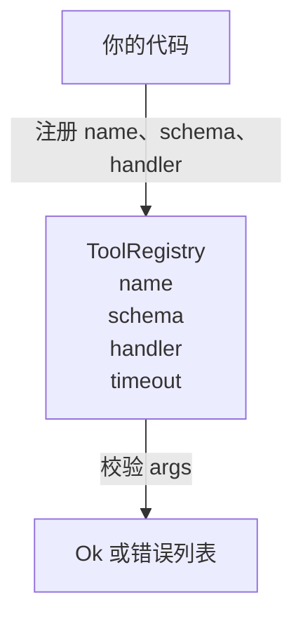

# 带 Schema 校验的 Tool Registry

> 译注：本文译自同目录 [`en.md`](./en.md)。术语遵循仓根 [TRANSLATION_GUIDE.md](../../../../TRANSLATION_GUIDE.md)。

> agent 没法校验的 tool，就是 agent 没法调用的 tool。先把 registry 和 schema 检查器写好，再去写 tool。

**Type:** Build
**Languages:** Python
**Prerequisites:** Phase 13 lessons 01-07, Phase 14 lesson 01
**Time:** ~90 minutes

## 学习目标（Learning Objectives）
- 维护一个有类型的 registry：tool 名称 → schema → handler，dispatcher 问一次之后就可以信任结果。
- 实现一个 JSON Schema 2020-12 的子集，覆盖 90% 的 tool call 真正会用到的关键字。
- 返回精确的、形如 json-pointer 的错误路径，让模型能在一次往返里自我纠正。
- 默认拒绝重复注册，必须显式 override 才覆盖——生产 tool 目录漂移就是从静默覆盖开始的。
- 让校验器保持纯函数（无 I/O、无时间、无全局状态），这样可以在 replay log 上重跑。

## 为什么 registry 要先于 tool 出场

2026 年的编码 agent，注册的 tool 数量已经远超模型单个 context window 能塞下的量。一个像样的 harness 会注册两百个 tool，每一轮里只往模型面前推十到四十个。registry 就是「有哪些 tool」「它们的参数长什么样」「该调哪个 handler」这三件事的真理之源。这三个答案钉死之后，harness 的其他部分才能不再靠猜。

我们要避免的错误是：写了 handler 却没 schema，或者写了 schema 却没校验。两种都很常见。两种都会让下一层（lesson 二十三里的 dispatcher）变成猜谜游戏——唯一的失败模式就是 handler 抛出的栈。

## 一条 tool record 长什么样

```text
ToolRecord
  name        : str          (unique, lowercase alphanumeric and underscore segments separated by dots, e.g., snake_case.segment.case)
  description : str          (one line, shown to the model)
  schema      : dict         (JSON Schema 2020-12 subset)
  handler     : Callable     (async or sync, returns Any)
  idempotent  : bool         (dispatcher uses this for retry decisions)
  timeout_ms  : int          (override per-tool dispatcher default)
```

校验器只碰 schema 这一个字段。handler 对它来说是不透明的。这种分离是有意为之：schema 是数据，handler 是代码。把它们混到一起，你就会忍不住把校验逻辑塞进 handler，而那正是我们要拦截的 bug。

## JSON Schema 2020-12 的子集

完整的 2020-12 规范是一篇论文。我们只要八个关键字。

```text
type           string / number / integer / boolean / object / array / null
properties     map of property name -> schema
required       list of property names
enum           list of allowed primitive values
minLength      integer, applies to strings
maxLength      integer, applies to strings
pattern        ECMA-262-compatible regex, applies to strings
items          schema applied to every array element
```

这就足以覆盖一个 tool API 真正需要的东西。我们没加的关键字（oneOf、anyOf、allOf、$ref、条件子句）在生产 schema 里也合法，但会把校验器变成一个带环的树遍历器。我们造的是 registry，不是 JSON Schema 引擎。

## json pointer 错误路径

校验失败时，校验器返回一个错误列表。每条错误都带一个指向输入的 json-pointer 路径。pointer 是用斜杠开头、由属性名和数组下标拼成的序列。

```text
{"a": {"b": [1, 2, "x"]}}
                    ^
                    /a/b/2
```

模型读错误路径比读句子更顺。如果 schema 要求 `args.user.email`，模型却传了个整数，错误就该是 `/user/email`、`expected_type: string`。模型下一次调用就直接修好，不需要走一轮自然语言。

## 注册与 override

`register(name, schema, handler, **opts)` 默认拒绝重复注册。调用方必须显式传 `override=True` 才能替换。这是运维卫生。代码库里两处地方静默注册了同一个 tool 名，这种 bug 在生产上能让你查一周。

registry 暴露三个只读方法：`get(name)` 返回 record 或抛异常；`validate(name, args)` 返回 `Ok` 或错误列表；`names()` 按注册顺序返回 tool 名称。

## 校验器是什么、不是什么

它是对 schema 树的一次单趟、递归遍历。它是纯的。它不调 handler。它不做类型强制（字符串 `"42"` 不会通过 number schema）。它不会偷偷截断。

它不是安全边界。校验通过之后，恶意 handler 仍然可以为非作歹。lesson 二十三的 dispatcher 会再加上超时和沙箱层。registry 只负责形状（shape）。

## 形状（Shape）



## 如何阅读代码（How to read the code）

`code/main.py` 定义了 `ToolRegistry`、`ToolRecord`、`ValidationError` 和八个校验函数。校验器按 `schema["type"]` 分派（带 `enum` 但没 type 的 schema 走无类型 enum 检查）。每个类型校验器要么返回空列表，要么返回一个 `ValidationError` 列表。顶层的遍历器在下钻时把路径段拼到前面，并把所有错误拼在一起。

`code/tests/test_registry.py` 覆盖了注册、override、校验成功、带路径的校验失败，以及子集里的每一个关键字。

## 再进一步（Going further）

这节课落地之后，你会想加的两个扩展是：对本地 definitions 块的 `$ref` 解析，以及 `additionalProperties: false` 来做严格形状校验。两个都很小。两个都是 tool 目录长到五十个以上时常见的补丁。我们没把它们放进这节课，是为了把文件控制在一次能读完的长度内。

下一节（二十二）会构建把这个 registry 暴露给模型客户端的 JSON-RPC stdio transport。再下一节（二十三）把两者一起包到一个带超时和重试的 dispatcher 后面。
