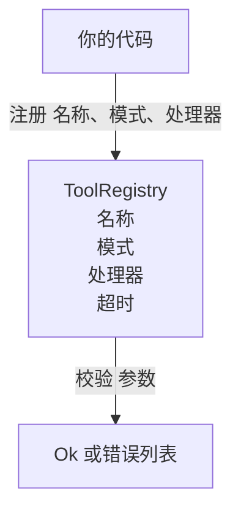

# 21 · 工具注册表与模式校验

> 代理无法校验的工具，就是代理无法调用的工具。先构建注册表和模式校验器，再构建工具。

**类型：** 构建
**语言：** Python
**前置：** 第 13 阶段第 01-07 课、第 14 阶段第 01 课
**时长：** 约 90 分钟

## 学习目标

- 维护一个类型化的注册表（registry），存储"工具名 → 模式 → 处理器"的映射，让调度器（dispatcher）只需查询一次即可信任后续结果。
- 实现一个 JSON Schema 2020-12 子集，覆盖 90% 实际工具调用所用到的关键字。
- 返回精确的、JSON 指针（json-pointer）形式的错误路径，使模型能在一次往返中自行修正。
- 默认拒绝重复注册，除非显式覆盖——生产环境中工具目录的漂移往往源于静默覆写。
- 保持校验器为纯函数（无 I/O、无时间依赖、无全局状态），使其可在回放日志上重复运行。

## 为什么注册表要在工具之前构建

2026 年的编程代理拥有的注册工具数量远超模型单次上下文窗口的容纳能力。一个正经的 harness 会注册两百个工具，每个轮次呈现十到四十个。注册表是以下问题的唯一真相来源："存在哪些工具？""它们的参数长什么样？""该调用哪个处理器？"一旦这三个答案被锚定，harness 的其余部分就不必再猜来猜去了。

我们要避免的错误是：交付没有模式的处理器，或交付没有校验的模式。两者都很常见。两者都会把下一层（第 23 课的调度器）变成一个猜谜游戏，唯一的失败模式是处理器抛出堆栈跟踪（stack trace）。

## 一条工具记录长什么样

```text
ToolRecord
  name        : str          (唯一标识，小写字母数字及下划线段，以点分隔，如 snake_case.segment.case)
  description : str          (一行描述，展示给模型)
  schema      : dict         (JSON Schema 2020-12 子集)
  handler     : Callable     (异步或同步，返回 Any)
  idempotent  : bool         (调度器借此决定是否重试)
  timeout_ms  : int          (覆盖每工具默认的调度器超时时间)
```

模式（schema）是校验器唯一关注的字段。处理器（handler）对校验器是不透明的。我们有意识地将二者分开。模式是数据，处理器是代码。混在一起会诱使你把校验逻辑塞进处理器里——这正是我们要杜绝的 bug。

## JSON Schema 2020-12 子集

完整的 2020-12 规范是一篇论文。我们只需要八个关键字。

```text
type            string / number / integer / boolean / object / array / null
properties      属性名 -> 模式的映射
required        必填属性名列表
enum            允许的原始值列表
minLength       整数，适用于字符串
maxLength       整数，适用于字符串
pattern         ECMA-262 兼容的正则表达式，适用于字符串
items           应用于每个数组元素的模式
```

这足以覆盖工具 API 实际所需的内容。我们没有加入的关键字（oneOf、anyOf、allOf、$ref、conditionals）在生产模式中是合法的，但会把校验器变成一个带环的树遍历器。我们构建的是注册表，不是 JSON Schema 引擎。

## JSON 指针错误路径

校验失败时，校验器返回一个错误列表。每条错误携带一个指向输入中的 JSON 指针（json pointer）路径。指针是以斜杠为前缀、由属性名和数组索引组成的序列。

```text
{"a": {"b": [1, 2, "x"]}}
                    ^
                    /a/b/2
```

模型阅读错误路径比阅读自然语言句子更高效。如果模式要求 `args.user.email` 而模型传入了一个整数，错误应该是 `/user/email`，附带 `expected_type: string`。模型在下一次调用中就能修正，无需多一轮自然语言往返。

## 注册与覆盖

`register(name, schema, handler, **opts)` 默认拒绝重复注册。调用者必须传入 `override=True` 才能替换。这是一种运维层面的卫生习惯。代码库中两个部分静默注册了同名工具——这种 bug 在生产环境中要花一个星期才能找到。

注册表暴露三个只读方法。`get(name)` 返回记录或抛出异常。`validate(name, args)` 返回 `Ok` 或错误列表。`names()` 按注册顺序返回工具名列表。

## 校验器的职责边界

它是模式树上的单次遍历，递归执行。它是纯函数。它不调用处理器。它不做类型强制转换（字符串 `"42"` 不会通过数字模式校验）。它不会静默截断。

它不是一个安全边界。恶意处理器在校验通过后仍然可以为非作歹。第 23 课的调度器会添加超时和沙箱层。注册表添加的是形状约束。

## 架构图



## 如何阅读代码

`code/main.py` 定义了 `ToolRegistry`、`ToolRecord`、`ValidationError` 以及八个校验函数。校验器根据 `schema["type"]` 进行分发（或者将带有 `enum` 的模式作为无类型的枚举检查处理）。每个类型校验器返回空列表或 `ValidationError` 列表。顶层遍历器在向下递归时拼接错误并附加路径段。

`code/tests/test_registry.py` 覆盖了注册、覆盖、校验成功、带路径的校验失败，以及子集中的每个关键字。

## 延伸方向

本课落地后，你可能想要的两个扩展是：针对本地 definitions 块的 `$ref` 解析，以及用于严格形状约束的 `additionalProperties: false`。两者都很小。当工具目录增长到超过 50 个工具时，两者都是常见的补充。我们将其留在本课之外，以保持文件在一次阅读量之内。

下一课（第 22 课）构建 JSON-RPC stdio 传输层，将该注册表暴露给模型客户端。再下一课（第 23 课）用一个带超时和重试的调度器将二者包裹在一起。
