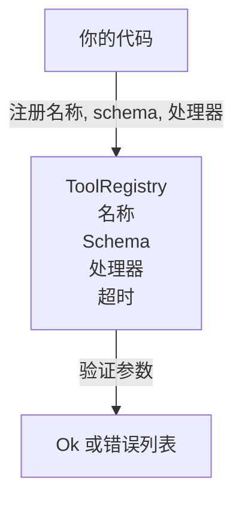

# 带 Schema 验证的工具注册中心

> 代理无法验证的工具，就是代理无法调用的工具。先构建注册中心和 Schema 检查器，再构建工具。

**类型：** 构建
**语言：** Python
**前置条件：** 阶段 13 第 01–07 课，阶段 14 第 01 课
**时长：** ~90 分钟

## 学习目标

- 维护一个带类型的工具名称 → Schema → 处理器注册中心，调度器只需查询一次即可信任。
- 实现 JSON Schema 2020-12 子集，覆盖百分之九十的工具调用实际使用的关键字。
- 返回精确的、json-pointer 格式的错误路径，使模型能在一轮交互内自我修正。
- 拒绝未经显式覆写的重复注册，因为静默覆盖是生产环境中工具目录漂移的根源。
- 保持验证器的纯函数特性（无 I/O、无时间依赖、无全局变量），使其可在回放日志上重新运行。

## 为什么注册中心先于工具

2026 年的编码代理拥有的注册工具数量可能超过模型单个上下文窗口的容纳能力。一个有实际意义的框架会注册两百个工具，并在每次轮次中展示十到四十个。注册中心是"有哪些工具"、"它们的参数是什么形状"以及"调用哪个处理器"的权威来源。一旦这三个答案确定下来，框架的其他部分就不再需要猜测。

我们要避免的错误是：发布不带 Schema 的处理器，或者发布不带验证的 Schema。这两种情况都很常见。它们都会使得下一层（第二十三课的调度器）变成猜谜游戏，唯一失败模式就是来自处理器的堆栈跟踪。

## 工具记录的样子

```text
ToolRecord
  name        : str          （唯一，由小写字母数字和下划线段以点号分隔，例如 snake_case.segment.case）
  description : str          （一行，展示给模型）
  schema      : dict         （JSON Schema 2020-12 子集）
  handler     : Callable     （异步或同步，返回 Any）
  idempotent  : bool         （调度器使用此字段决定是否重试）
  timeout_ms  : int          （覆盖调度器默认的每工具超时）
```

Schema 是验证器唯一会触及的字段。处理器对验证器是不透明的。我们有意将它们分离。Schema 是数据，处理器是代码。将它们混在一起会诱使你将在处理器内部放验证逻辑，而这正是我们要阻止的错误。

## JSON Schema 2020-12 子集

完整的 2020-12 规范是一本论文般的大部头。我们只需要八个关键字。

```text
type           string / number / integer / boolean / object / array / null
properties     属性名到 schema 的映射
required       属性名称列表
enum           允许的基础类型值列表
minLength      整数，适用于字符串
maxLength      整数，适用于字符串
pattern        ECMA-262 兼容的正则表达式，适用于字符串
items          应用于每个数组元素的 schema
```

这足以覆盖工具 API 实际需要的范围。我们不添加的关键字（oneOf、anyOf、allOf、$ref、条件式）在生产环境的 Schema 中是有效的，但会使验证器变成一个带循环的树遍历器。我们在构建注册中心，而不是 JSON Schema 引擎。

## Json Pointer 错误路径

当验证失败时，验证器返回一个错误列表。每个错误都携带一个指向输入的 json-pointer 路径。指针是一个以斜杠为前缀的属性名和数组索引序列。

```text
{"a": {"b": [1, 2, "x"]}}
                    ^
                    /a/b/2
```

模型读取错误路径的效果比读取自然语言句子更好。如果一个 Schema 要求 `args.user.email` 而模型传入了一个整数，错误信息应该是 `/user/email` 以及 `expected_type: string`。模型会在下一次调用中修复该问题，无需一轮自然语言对话。

## 注册与覆写

`register(name, schema, handler, **opts)` 默认拒绝重复注册。调用者必须传入 `override=True` 才能替换。这是运维层面的卫生习惯。代码库的两个部分静默地注册同一个工具名称，是需要花一周时间在生产环境中才能找到的那种错误。

注册中心暴露三个读取方法：`get(name)` 返回记录或抛出异常；`validate(name, args)` 返回 `Ok` 或错误列表；`names()` 按注册顺序返回工具名称列表。

## 验证器是什么，不是什么

它是一个单遍递归遍历 schema 树的函数。它是纯函数。它不会调用处理器。它不会进行类型强制转换（字符串 `"42"` 不会通过数字 schema 的验证）。它不会静默地截断数据。

它不是一个安全边界。一个恶意的处理器在通过验证后仍然可能行为异常。第二十三课的调度器会添加超时和沙箱层。注册中心负责的是形状约束。

## 结构图


```mermaid
flowchart TD
    code[你的代码]
    reg[ToolRegistry<br/>名称<br/>Schema<br/>处理器<br/>超时]
    out[Ok 或错误列表]
    code -->|注册名称, schema, 处理器| reg
    reg -->|验证参数| out
```

## 如何阅读代码

`code/main.py` 定义了 `ToolRegistry`、`ToolRecord`、`ValidationError` 以及八个验证器函数。验证器根据 `schema["type"]` 进行分发（或者将包含 `enum` 的 schema 视为无类型枚举检查）。每个类型验证器返回一个空列表或一个 `ValidationError` 列表。顶层遍历器在递归下降过程中拼接错误并前置路径段。

`code/tests/test_registry.py` 涵盖了注册、覆写、验证成功、带路径的验证失败以及子集中的每个关键字。

## 进一步拓展

在本课落地后，你可能会想要的两个扩展是：针对本地 definitions 块的 `$ref` 解析，以及用于严格形状约束的 `additionalProperties: false`。这两个扩展都很小。当工具目录超过五十个工具时，它们都很常见。我们将其排除在本课之外，以保持文件在一次阅读内的可控长度。

下一课（二十二）将构建 JSON-RPC stdio 传输层，将该注册中心暴露给模型客户端。再下一课（二十三）将把两者包装在一个带有超时和重试机制的调度器之后。
