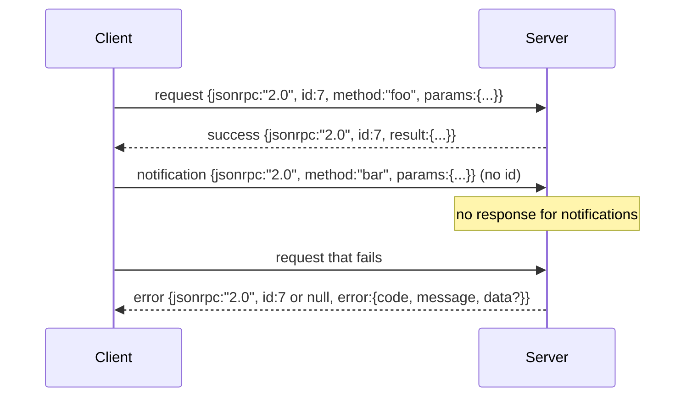

# Newline-Delimited Stdio 上の JSON-RPC 2.0

> model client と tool server の間の transport は、stdio 上の JSON-RPC です。一度 hand-roll すると、あらゆる framing layer が何にコストを払っているのかが見えます。

**種別:** 構築
**言語:** Python
**前提条件:** Phase 13 lessons 01-07, Phase 14 lesson 01
**所要時間:** 約90分

## 学習目標
- stdin/stdout 上の newline-delimited JSON として framing された JSON-RPC 2.0 を扱う。
- 5 つの standard error code（-32700, -32600, -32601, -32602, -32603）を対応づけ、正しい意味で surface する。
- 新しい envelope key を作らずに、request、response、notification、batch を区別する。
- stream の残りを汚染せず、1 line あたり 1 つの parse error として扱う。
- child process を spawn せずに lesson を実行できるよう、io.BytesIO を使った self-terminating demo を作る。

## なぜ JSON-RPC は lingua franca のままなのか

2026 年の coding agent は、1 つの session で 12 個程度の tool server と話します。各 server は別 process または remote endpoint です。wire format は 2013 年から同じです。JSON-RPC 2.0 は 2 ページの spec です。代替案（gRPC、call ごとの HTTP、custom binary）はすべて、JSON-RPC にはない tradeoff を課します。streaming、batching、transport coupling のどれかを選ばせるのです。JSON-RPC は stdio、socket、websocket、HTTP にまたがって対称であり、client は相手 server を見たことがなくても、双方が spec を守れば駆動できます。

この lesson では stdio variant を作ります。newline-delimited JSON です。各 request は 1 行。各 response も 1 行。transport boundary は `\n` です。

## wire の形

envelope は 4 種類あります。2 つは client が話し、2 つは server が話します。



notification には `id` がありません。server は response を返してはいけません。notification に response を返すと、client はそれを call site に結びつけられません。この 1 つの rule が framing の計算を単純に保ちます。

batch は request または notification の JSON array です。server は response の array を返します。順序は任意で、non-notification entry 1 つにつき response 1 つです。batch 内のすべてが notification なら、server は何も返しません。

## 5 つの error code

```text
-32700  Parse error      JSON could not be parsed
-32600  Invalid Request  Envelope shape is wrong
-32601  Method not found
-32602  Invalid params
-32603  Internal error
```

-32000 から -32099 までは server-defined error のために予約されています。それ以外は application-defined です。この lesson では 5 つだけに留めます。handler が raise した場合、transport はそれを -32603 として wrap し、exception class name を `data.exception` に入れます。

parse error には特別な rule があります。request は id を取り出せるほど parse できていないので、response の `id` は `null` です。

## Newline framing と BytesIO demo

transport は 1 行ずつ読みます。line は `\n` までを含む bytes です。line を parse できない場合、transport は `id: null` の -32700 response を書き込み、続行します。stream は汚染されません。次の line は新しく parse されます。

lesson では stdin と stdout として `io.BytesIO` の pair を wrap します。server は EOF まで request を読み、各 request の response を書き、戻ります。client は response を読み返します。process spawn も timeout もありません。Python の `io` interface は同じ `.readline()` と `.write()` contract を提示するので、transport behavior は実際の subprocess pipe と同じです。

## Method dispatch

transport はどの method が存在するかを知りません。harness が供給する callable `handler(method, params)` に渡します。handler は result を返すか raise します。3 つの exception class が specific code を surface します。

```text
MethodNotFound -> -32601
InvalidParams  -> -32602
Anything else  -> -32603 with exception name in data
```

transport は tool registry を見ません。registry は handler の背後にあります。これが欲しい layering です。transport は JSON-RPC を話します。registry は tool shape を話します。dispatcher（lesson 23）がそれらを縫い合わせます。

## error 時の stream behavior

```text
client writes              server reads             server writes
---------------            -----------              -------------
{...valid request...}      parses ok                {...response, id matches...}
{...broken json...         parse fails              {id:null, error: -32700}
{...valid request...}      parses ok                {...response, id matches...}
{...missing method...}     invalid envelope         {id:X, error: -32600}
```

broken JSON line は loop を止めません。`method` field の欠落も loop を止めません。handler exception も loop を止めません。transport は EOF まで読み続けます。

## Notifications と asymmetric flow

notification は fire-and-forget です。harness は progress event、cancellation signal、log line に notification を使います。long-running tool が各 status update に round-trip せずに status を stream する手段が notification です。

この lesson では outbound notification helper `write_notification` を 1 つ実装します。server は request の処理中に progress を emit するためにそれを使います。demo は pattern を示します。request が入り、handler が 2 つの progress notification を emit し、最後に final response を書きます。

## code の読み方

`code/main.py` は `StdioTransport`、parse helper（`parse_request`）、3 つの write helper（`write_response`, `write_error`, `write_notification`）、dispatch loop `serve` を定義します。error code constant は module scope にあります。

`code/tests/test_transport.py` は 5 つの error code、notification（response が書かれない）、batch（array in / array out、notification は skip）、broken JSON（parse error のあと continue）、handler が mid-call で notification を書く asymmetric flow を cover します。

## さらに進む

この transport は後続 lesson には十分です。production transport は 3 つを追加します。forwarding 後も残る correlation id field（あなたの `id` がすでにそれですが、mesh では outer trace id も必要です）。cancellation channel（in-flight call の id を持つ `$/cancelRequest` のような notification）。そして同じ socket で JSON-RPC と Streamable HTTP を話せるようにする content-type negotiation handshake です。これらはいずれも wire を変えません。metadata を追加するだけです。
