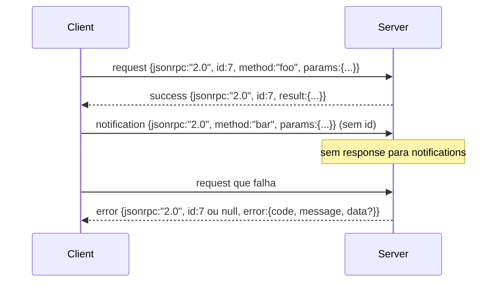

# JSON-RPC 2.0 Sobre Newline-Delimited Stdio

> O transport entre um model client e um ferramenta server é JSON-RPC sobre stdio. Implementar uma vez manualmente te ensina o que cada camada de framing está pagando.

**Tipo:** Build
**Linguagens:** Python
**Pré-requisitos:** Fase 13 aulas 01-07, Fase 14 aula 01
**Tempo:** ~90 minutos

## Objetivos de Aprendizado
- Falar JSON-RPC 2.0 com framing de JSON newline-delimited sobre stdin e stdout.
- Mapear os cinco códigos de erro padrão (-32700, -32600, -32601, -32602, -32603) e expô-los com a semântica correta.
- Distinguir requests, responses, notifications e batches sem inventar novas chaves de envelope.
- Tratar um erro de parse por linha sem envenenar o resto do stream.
- Construir uma demo auto-terminante usando `io.BytesIO` para que a aula rode sem spawnar um processo filho.

## Por que JSON-RPC continua sendo a língua franca

Um coding agente em 2026 conversa com talvez doze ferramenta servers em uma única sessão. Cada server é um processo separado ou um endpoint remoto. O formato de rede tem sido o mesmo desde 2013. JSON-RPC 2.0 é uma eespecificaçãoificação de duas páginas. Ela sobrevive porque as alternativas (gRPC, HTTP por chamada, binário customizado) todas impõem uma troca que JSON-RPC não: escolhem ou streaming ou batching ou acoplamento ao transport. JSON-RPC é simétrico entre stdio, sockets, websockets e HTTP, e um client pode dirigir um server que nunca viu se ambos honrarem a especificação.

Esta aula constrói a variante stdio. JSON newline-delimited. Cada request é uma linha. Cada response é uma linha. O limite de transport é `\n`.

## A forma da rede

Quatro formas de envelope existem. Duas são faladas pelo client. Duas são faladas pelo server.



Uma notification não tem `id`. O server não deve responder a ela. Se um server retorna uma response a uma notification, o client não tem como associá-la a um ponto de chamada. Essa única regra mantém a matemática de framing simples.

Um batch é um array JSON de requests ou notifications. O server responde com um array de responses, em qualquer ordem, uma por entrada que não é notification. Se cada entrada no batch é uma notification, o server não envia nada de volta.

## Os cinco códigos de erro

```text
-32700  Erro de parse      JSON não pôde ser parseado
-32600  Request inválido   Forma do envelope está errada
-32601  Método não encontrado
-32602  Parâmetros inválidos
-32603  Erro interno
```

Os códigos entre -32000 e -32099 são reservados para erros definidos pelo server. Todo o resto é definido pela aplicação. A aula se mantém nos cinco. Se seu handler levanta exceção, o transport envolve como -32603 com o nome da classe da exceção em `data.exception`.

Um erro de parse tem uma regra eespecificaçãoial. O `id` na response é `null`, porque o request nunca foi parseado o suficiente para extrair um id.

## Newline framing e a demo BytesIO

O transport lê uma linha por vez. Uma linha são bytes até e incluindo `\n`. Se uma linha não pôde ser parseada, o transport escreve uma response -32700 com `id: null` e continua. O stream não é envenenado. A próxima linha é parseada do zero.

Para a aula, envolvemos um par `io.BytesIO` como stdin e stdout. O server lê requests até EOF, escreve responses para cada um, e retorna. O client lê as responses de volta. Sem spawn de processo. Sem timeouts. O comportamento do transport é idêntico a um pipe real de subprocesso porque a interface `io` do Python apresenta o mesmo contrato de `.readline()` e `.write()`.

## Despacho de métodos

O transport não sabe quais métodos existem. Ele repassa para um callable `handler(method, params)` que o harness fornece. O handler retorna um resultado ou levanta exceção. Três classes de exceção expõem códigos eespecificaçãoíficos.

```text
MethodNotFound -> -32601
InvalidParams  -> -32602
Qualquer outra -> -32603 com nome da exceção em data
```

O transport nunca vê um ferramenta registry. O registry fica atrás do handler. Essa é a camada que queremos. O transport fala JSON-RPC. O registry fala formas de ferramentas. O dispatcher (aula vinte e três) costura eles juntos.

## Comportamento do stream em erros

```text
client escreve              server lê                 server escreve
---------------            -----------              -------------
{...request válido...}     parse ok                 {...response, id corresponde...}
{...json quebrado...       parse falha              {id:null, error: -32700}
{...request válido...}     parse ok                 {...response, id corresponde...}
{...método faltando...}    envelope inválido        {id:X, error: -32600}
```

Uma linha JSON quebrada não para o loop. Um campo `method` faltando não para o loop. Uma exceção no handler não para o loop. O transport continua lendo até EOF.

## Notifications e fluxos assimétricos

Uma notification é fire-and-forget. O harness usa notifications para eventos de progresso, sinais de cancelamento e linhas de log. Notifications são como uma ferramenta que roda por muito tempo pode transmitir atualizações de status sem round-trip para cada uma.

A aula implementa um helper de notification outbound, `write_notification`. O server usa para emitir progresso enquanto uma request está em voo. A demo mostra o padrão: uma request chega, o handler emite duas notifications de progresso, depois escreve a response final.

## Como ler o código

`code/main.py` define `StdioTransport`, o helper de parse (`parse_request`), os três helpers de escrita (`write_response`, `write_error`, `write_notification`), e o loop de despacho `serve`. As constantes de código de erro ficam no escopo do módulo.

`code/tests/test_transport.py` cobre os cinco códigos de erro, notifications (nenhum response escrito), batches (array entra, array sai, notifications ignoradas), JSON quebrado (erro de parse e continua), e o fluxo assimétrico onde um handler escreve uma notification no meio de uma chamada.

## Indo além

Este transport é suficiente para as aulas que seguem. Transports de produção adicionam três coisas. Um campo de correlation id que sobrevive ao forward (seu `id` já é isso, mas em um mesh você precisa de um trace id externo também). Um canal de cancelamento (uma notification como `$/cancelRequest` com o id da chamada em voo). E um handshake de content-type negotiation para que o mesmo socket possa falar JSON-RPC e Streamable HTTP. Nenhuma dessas muda a rede. Adicionam metadados.
