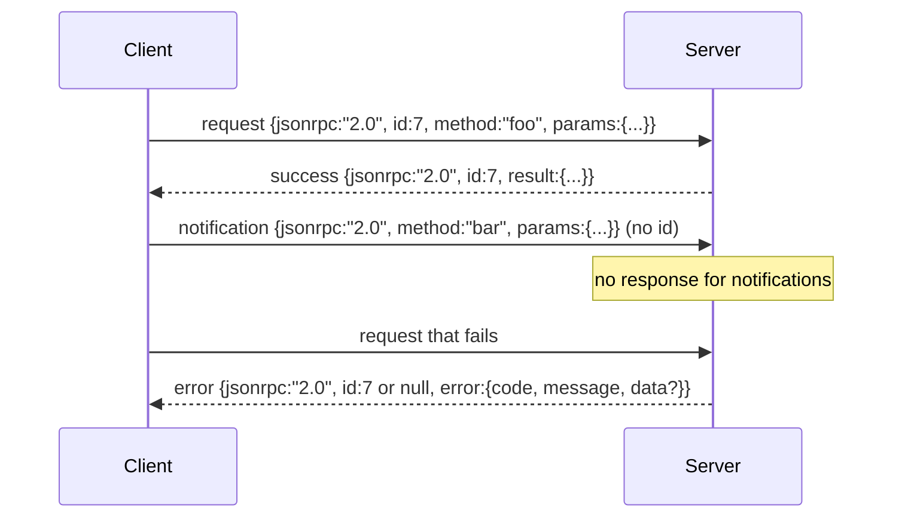

# JSON-RPC 2.0 Yeni Satırla Sınırlandırılmış Stdio Üzerinden

> Bir model istemcisi ile bir araç sunucusu arasındaki aktarım stdio üzerinden JSON-RPC'dir. Elle yuvarlamak size her çerçeveleme katmanının ne kadar para ödediğini öğretir.

**Tür:** Yapım
**Diller:** Python
**Önkoşullar:** Aşama 13 dersleri 01-07, Aşama 14 dersi 01
**Süre:** ~90 dakika

## Öğrenme Hedefleri
- JSON-RPC 2.0'ı stdin ve stdout üzerinden yeni satırla ayrılmış JSON olarak çerçeveleyerek konuşun.
- Beş standart hata kodunu (-32700, -32600, -32601, -32602, -32603) eşleştirin ve bunları doğru anlambilimle ortaya çıkarın.
- Yeni zarf anahtarları icat etmeden istekleri, yanıtları, bildirimleri ve grupları ayırt edin.
- Akışın geri kalanını zehirlemeden satır başına bir ayrıştırma hatasıyla başa çıkın.
- Dersin bir alt süreç oluşturmadan çalışması için io.BytesIO kullanarak kendi kendini sonlandıran bir demo oluşturun.

## JSON-RPC neden ortak dil olarak kalıyor?

2026'daki bir kodlama agent, tek bir oturumda belki on iki araç sunucusuyla konuşuyor. Her sunucu ayrı bir işlem veya uzak bir uç noktadır. Kablo formatı 2013'ten beri aynı. JSON-RPC 2.0 iki sayfalık bir spesifikasyondur. Alternatiflerin (gRPC, çağrı başına HTTP, özel ikili) tümü JSON-RPC'nin yapmadığı bir ödünleşim dayattığı için hayatta kalır: akış, toplu işlem veya taşıma bağlantısını seçerler. JSON-RPC; stdio, soketler, websocket'ler ve HTTP genelinde simetriktir ve her ikisinin de spesifikasyona uyması durumunda bir istemci, daha önce görmediği bir sunucuyu çalıştırabilir.

Bu ders stdio varyantını oluşturur. Yeni satırla ayrılmış JSON. Her istek bir satırdır. Her yanıt bir satırdır. Taşıma sınırı `\n`'dır.

## Tel şekli

Dört zarf şekli mevcuttur. Müşteri tarafından iki tanesi konuşulur. Sunucu tarafından iki kişi konuşuluyor.



Bir bildirimde `id` yok. Sunucu buna yanıt vermemelidir. Bir sunucu bir bildirime yanıt verirse, istemcinin bunu bir çağrı sitesine ekleme yolu yoktur. Bu tek kural çerçeveleme matematiğini basit tutar.

Toplu iş, isteklerin veya bildirimlerin bir JSON dizisidir. Sunucu, bildirim dışı giriş başına bir tane olmak üzere herhangi bir sırayla bir dizi yanıtla yanıt verir. Gruptaki her giriş bir bildirim ise sunucu hiçbir şeyi geri göndermez.

## Beş hata kodu

```text
-32700  Parse error      JSON could not be parsed
-32600  Invalid Request  Envelope shape is wrong
-32601  Method not found
-32602  Invalid params
-32603  Internal error
```

-32000 ile -32099 arasındaki kodlar sunucu tanımlı hatalara ayrılmıştır. Geriye kalan her şey uygulama tanımlıdır. Ders beşe kalıyor. İşleyiciniz yükselirse aktarım, istisna sınıfı adını `data.exception` ile -32603 olarak sarar.

Ayrıştırma hatasının özel bir kuralı vardır. Yanıttaki `id` `null`, çünkü istek hiçbir zaman bir kimlik çıkarmaya yetecek kadar ayrıştırılmadı.

## Yeni satır çerçeveleme ve BytesIO demosu

Aktarım her seferinde bir satır okur. Bir satır, `\n`'a kadar ve dahil baytlardan oluşur. Bir satır ayrıştırılamazsa aktarım, `id: null` ile -32700 yanıtını yazar ve devam eder. Dere zehirli değil. Bir sonraki satır taze olarak ayrıştırılır.

Ders için bir `io.BytesIO` çiftini stdin ve stdout olarak sarıyoruz. Sunucu, EOF'ye kadar istekleri okur, her biri için yanıtları yazar ve geri döner. Müşteri yanıtları geri okur. İşlem ortaya çıkma yok. Zaman aşımı yok. Python'un `io` arayüzü aynı `.readline()` ve `.write()` sözleşmesini sunduğundan aktarım davranışı gerçek bir alt süreç kanalıyla aynıdır.

## Yöntem gönderimi

Aktarım hangi yöntemlerin mevcut olduğunu bilmiyor. Kablo demetinin sağladığı çağrılabilir bir `handler(method, params)` 'ya aktarılır. İşleyici bir sonuç döndürür veya yükseltir. Üç istisna sınıfı belirli kodları ortaya çıkarır.

```text
MethodNotFound -> -32601
InvalidParams  -> -32602
Anything else  -> -32603 with exception name in data
```

Aktarım hiçbir zaman bir araç kaydını görmez. Kayıt defteri işleyicinin arkasında bulunur. Bu istediğimiz katmanlamadır. Aktarım JSON-RPC'yi konuşuyor. Kayıt defteri, araç şekillerini konuşur. Gönderici (yirmi üçüncü ders) bunları birbirine diker.

## Hatalarda akış davranışı

```text
client writes              server reads             server writes
---------------            -----------              -------------
{...valid request...}      parses ok                {...response, id matches...}
{...broken json...         parse fails              {id:null, error: -32700}
{...valid request...}      parses ok                {...response, id matches...}
{...missing method...}     invalid envelope         {id:X, error: -32600}
```

Bozuk bir JSON satırı döngüyü durdurmaz. Eksik bir `method` alanı döngüyü durdurmaz. Bir işleyici istisnası döngüyü durdurmaz. Aktarım EOF'a kadar okumaya devam eder.

## Bildirimler ve asimetrik akışlar

Bir bildirim, ateşle ve unut demektir. Koşum, ilerleme olayları, iptal sinyalleri ve günlük satırları için bildirimleri kullanır. Bildirimler, uzun süre çalışan bir aracın, her biri için gidiş-dönüş olmadan durum güncellemelerini nasıl aktarabileceğidir.

Ders bir giden bildirim yardımcısını uygular: `write_notification`. Sunucu, bir istek yayındayken ilerlemeyi yaymak için bunu kullanır. Demo modeli gösterir: bir istek gelir, işleyici iki ilerleme bildirimi gönderir ve ardından son yanıtı yazar.

## Kod nasıl okunur

`code/main.py` , `StdioTransport`, ayrıştırma yardımcısını (`parse_request`), üç yazma yardımcısını (`write_response`, `write_error`, `write_notification`) ve gönderme döngüsünü `serve` tanımlar. Hata kodu sabitleri modül kapsamında yayınlanır.

`code/tests/test_transport.py` beş hata kodunu, bildirimleri (yanıt yazılmadı), toplu işleri (dizi girişi, dizi çıkışı, atlanan bildirimler), bozuk JSON'u (ayrıştırma hatası sonra devam eder) ve bir işleyicinin çağrı ortasında bir bildirim yazdığı asimetrik akışı kapsar.

## Daha ileri gidiyoruz

Bu ulaşım sonraki dersler için yeterlidir. Üretim taşımaları üç şey ekler. İletimden sonra hayatta kalan bir korelasyon kimliği alanı ( `id` 'nız zaten bu, ancak bir ağda bir dış izleme kimliğine de ihtiyacınız var). Bir iptal kanalı (uçuş sırasındaki çağrının kimliğini içeren `$/cancelRequest` gibi bir bildirim). Ayrıca aynı soketin JSON-RPC ve Streamable HTTP konuşabilmesi için içerik türü anlaşma anlaşması. Bunların hiçbiri teli değiştirmez. Meta veriler eklerler.
