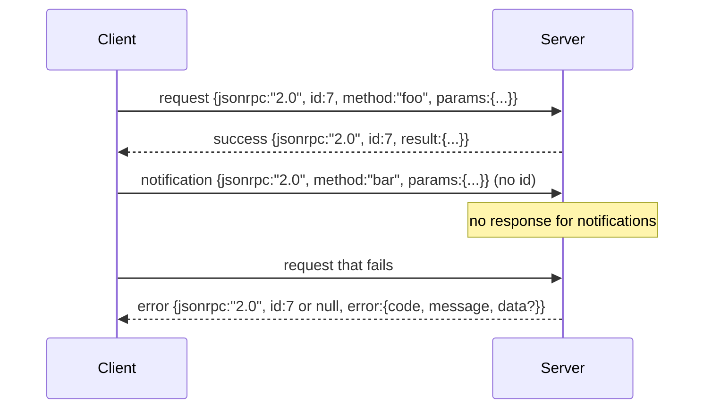

# 22 · 基于换行分隔标准输入输出的 JSON-RPC 2.0

> 模型客户端与工具服务器之间的传输层是运行在标准输入输出（stdio）上的 JSON-RPC。亲手实现一次，你就能明白每一层帧定界到底在为什么买单。

**类型：** 构建
**语言：** Python
**前置：** 第十三阶段第 01-07 课、第十四阶段第 01 课
**时长：** 约 90 分钟

## 学习目标
- 掌握以换行分隔 JSON（newline-delimited JSON）为帧定界方式、通过 stdin 与 stdout 传输的 JSON-RPC 2.0 协议。
- 映射五个标准错误码（-32700、-32600、-32601、-32602、-32603），并以正确的语义将其暴露出来。
- 区分请求（request）、响应（response）、通知（notification）和批量请求（batch），不自行发明新的信封键。
- 处理单行解析错误而不污染流的其余部分。
- 使用 `io.BytesIO` 构建一个自终止演示，使得本课无需启动子进程即可运行。

## 为什么 JSON-RPC 始终是通用语言

2026 年，一个编程智能体（coding agent）在单次会话中可能会与十来个工具服务器通信。每个服务器要么是一个独立进程，要么是一个远程端点。而线格式（wire format）自 2013 年以来一直没变。JSON-RPC 2.0 是一份只有两页的规范。它能存活至今，是因为所有替代方案（gRPC、每次调用走 HTTP、自定义二进制协议）都在某个方面做出了 JSON-RPC 不必做的取舍：它们要么选择流式传输，要么选择批量处理，要么与传输层耦合。JSON-RPC 在标准输入输出、套接字、WebSocket 和 HTTP 之间是对称的，只要双方都遵守规范，客户端就能驱动一个它从未见过的服务器。

本课构建的是标准输入输出的变体。换行分隔的 JSON。每个请求占一行。每个响应也占一行。传输边界就是 `\n`。

## 线格式形态

共有四种信封（envelope）形态。其中两种由客户端发出，两种由服务器发出。



通知不带 `id`。服务器不得对其做出响应。如果服务器对通知返回响应，客户端将无法将响应关联到任何调用点。仅此一条规则，就保证了帧定界逻辑的简洁。

批量请求是一个由请求或通知组成的 JSON 数组。服务器以一个响应数组作为回复，顺序不限，每个非通知条目对应一个响应。如果批量请求中的每个条目都是通知，服务器则什么都不返回。

## 五个错误码

```text
-32700  Parse error      JSON 无法解析
-32600  Invalid Request  信封形态有误
-32601  Method not found  未找到方法
-32602  Invalid params    参数无效
-32603  Internal error    内部错误
```

-32000 到 -32099 之间的错误码保留给服务器自定义错误。其他均为应用自定义。本课只关注这五个。如果你的处理器（handler）抛出异常，传输层会将其包装为 -32603，并在 `data.exception` 中附带异常类名。

解析错误有一条特殊规则。响应中的 `id` 为 `null`，因为该请求甚至没解析到足以提取出 id 的程度。

## 换行帧定界与 BytesIO 演示

传输层一次读取一行。一行是指直到并包含 `\n` 为止的字节序列。如果某行无法解析，传输层写入一条 `id: null` 的 -32700 响应，然后继续。流不会被污染。下一行会全新地重新解析。

在本课中，我们将一对 `io.BytesIO` 分别包装为标准输入和标准输出。服务器一直读取请求直到 EOF，为每个请求写入响应，然后返回。客户端再将响应读回。无需启动进程，无需设置超时。由于 Python 的 `io` 接口提供了相同的 `.readline()` 和 `.write()` 契约，其传输行为与真实的子进程管道完全一致。

## 方法分发

传输层并不知道存在哪些方法。它将调用交给一个由测试框架提供的可调用对象 `handler(method, params)`。处理器返回结果或抛出异常。三种异常类对应特定的错误码。

```text
MethodNotFound -> -32601
InvalidParams  -> -32602
Anything else  -> -32603，并在 data 中附带异常名
```

传输层永远看不到工具注册表。注册表位于处理器背后。这正是我们想要的分层。传输层负责 JSON-RPC 协议，注册表负责工具形态，而调度器（dispatcher，第二十三课）将二者缝合在一起。

## 错误场景下的流行为

```text
客户端写入                  服务器读取                 服务器写入
---------------            -----------              -------------
{...有效请求...}             解析成功                  {...响应, id 匹配...}
{...损坏的 JSON...           解析失败                  {id:null, error: -32700}
{...有效请求...}             解析成功                  {...响应, id 匹配...}
{...缺少 method...}         信封无效                  {id:X, error: -32600}
```

一行损坏的 JSON 不会中断循环。缺少 `method` 字段不会中断循环。处理器异常不会中断循环。传输层会一直读取直到 EOF。

## 通知与非对称流

通知是发后即忘（fire-and-forget）的。测试框架使用通知来传递进度事件、取消信号和日志行。通知使得长时间运行的工具能够流式推送状态更新，而无需为每条更新做一次往返。

本课实现了一个出站通知辅助函数 `write_notification`。服务器在请求处理过程中用它来发出进度通知。演示展示了这一模式：一个请求到达，处理器发出两条进度通知，然后写入最终响应。

## 如何阅读代码

`code/main.py` 定义了 `StdioTransport`、解析辅助函数（`parse_request`）、三个写入辅助函数（`write_response`、`write_error`、`write_notification`）以及调度循环 `serve`。错误码常量定义在模块作用域中。

`code/tests/test_transport.py` 覆盖了五个错误码、通知（不写响应）、批量请求（数组入、数组出、通知被跳过）、损坏的 JSON（解析错误后继续），以及处理器在调用中途写入通知的非对称流场景。

## 延伸阅读

本传输层足以支撑后续课程。生产环境的传输层会额外增加三样东西。一个能在转发后仍然存活的关联 ID 字段（你的 `id` 已经是这个角色，但在网状架构中你还需要一个外层的 trace id）。一个取消通道（类似 `$/cancelRequest` 的通知，携带正在执行的调用的 id）。以及一个内容类型协商握手，使得同一套接字既能讲 JSON-RPC，也能讲 Streamable HTTP。这些都不会改变线格式本身，只是增加了元数据。
