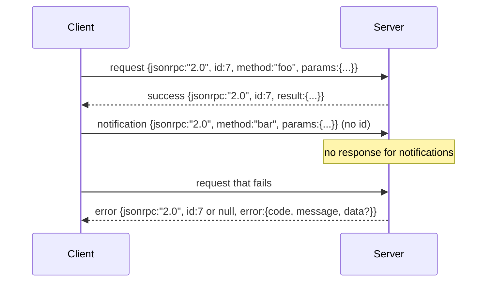

# 基于换行分隔 stdio 的 JSON-RPC 2.0

> 译注：本文译自同目录 [`en.md`](./en.md)。术语遵循仓根 [TRANSLATION_GUIDE.md](../../../../TRANSLATION_GUIDE.md)。

> 模型客户端与工具服务器之间的传输层就是跑在 stdio 之上的 JSON-RPC。亲手撸一遍，你就能明白每一层 framing（封帧）到底替你扛了什么。

**Type:** Build
**Languages:** Python
**Prerequisites:** Phase 13 lessons 01-07, Phase 14 lesson 01
**Time:** ~90 minutes

## 学习目标（Learning Objectives）
- 用换行分隔的 JSON 在 stdin/stdout 上跑 JSON-RPC 2.0。
- 掌握五个标准错误码（-32700、-32600、-32601、-32602、-32603），并以正确的语义把它们抛出去。
- 区分 request、response、notification、batch，不要自己再发明新的 envelope 字段。
- 一行解析失败时只丢这一行，不要污染整条流。
- 用 `io.BytesIO` 写一个能自终止的 demo，整节课不用真的去 spawn 子进程。

## 为什么 JSON-RPC 始终是通用语（Why JSON-RPC stays the lingua franca）

2026 年的一个 coding agent，在一次会话里大概要跟十二个工具服务器讲话。每个服务器要么是独立进程，要么是远端 endpoint。这套 wire format 从 2013 年到现在没变过。JSON-RPC 2.0 的规范只有两页。它能存活下来，是因为别的方案（gRPC、按调用走 HTTP、自定义二进制）都得在某处妥协，而 JSON-RPC 不用：那些方案要么只能流式、要么只能批量、要么强绑定某种传输。JSON-RPC 在 stdio、socket、websocket、HTTP 之间是对称的，只要双方都遵守规范，一个客户端就能驱动它从未见过的服务器。

本节实现的是 stdio 变种。换行分隔的 JSON。一个 request 就一行，一个 response 也一行。传输边界就是 `\n`。

## 线上长什么样（The wire shape）

总共有四种 envelope 形态。两种由客户端发出，两种由服务器发出。



notification 没有 `id`。服务器**不能**回它。如果服务器给一个 notification 回了响应，客户端根本没办法把它对应回某个调用点。就这一条规则，让整套 framing（封帧）的算账逻辑简单了下来。

batch 就是一个 JSON 数组，里面装 request 或 notification。服务器回一个数组，顺序随意，每个非 notification 的条目对应一个响应。如果整个 batch 全是 notification，服务器一个字都不返回。

## 五个错误码（The five error codes）

```text
-32700  Parse error      JSON could not be parsed
-32600  Invalid Request  Envelope shape is wrong
-32601  Method not found
-32602  Invalid params
-32603  Internal error
```

-32000 到 -32099 这一段是预留给服务器自定义错误的。其它的都属于应用自定义。本节只关心这五个。如果你的 handler 抛异常，传输层会把它包成 -32603，并把异常类名写到 `data.exception` 里。

parse error 有个特殊规则：响应里的 `id` 是 `null`，因为这个请求根本就没解析到能取出 id 的程度。

## 换行 framing 与 BytesIO demo（Newline framing and the BytesIO demo）

传输层一次读一行。一行就是直到（含）`\n` 的一段字节。如果某一行解析不了，传输层就写一个 `id: null` 的 -32700 响应，然后继续。流不会被污染。下一行重新开始解析。

本节用一对 `io.BytesIO` 当 stdin 和 stdout。服务器读 request 直到 EOF，每来一个就写一个响应，然后返回。客户端把响应读回去。没有 spawn 进程，没有超时。传输层的行为跟真子进程管道完全一致——因为 Python 的 `io` 接口提供的是同样的 `.readline()` 和 `.write()` 契约。

## 方法分派（Method dispatch）

传输层并不知道有哪些方法。它把这事甩给 harness 提供的一个 callable：`handler(method, params)`。handler 要么返回结果，要么抛异常。三类异常对应特定的错误码。

```text
MethodNotFound -> -32601
InvalidParams  -> -32602
Anything else  -> -32603 with exception name in data
```

传输层根本看不到工具注册表。注册表躺在 handler 后面。这就是我们想要的分层方式：传输层讲 JSON-RPC，注册表讲工具形状，dispatcher（第二十三节那个）负责把两者缝起来。

## 出错时的流行为（Stream behavior on errors）

```text
client writes              server reads             server writes
---------------            -----------              -------------
{...valid request...}      parses ok                {...response, id matches...}
{...broken json...         parse fails              {id:null, error: -32700}
{...valid request...}      parses ok                {...response, id matches...}
{...missing method...}     invalid envelope         {id:X, error: -32600}
```

一行坏 JSON 不会让循环停下来。缺 `method` 字段不会让循环停下来。handler 抛异常也不会。传输层就这么一直读，直到 EOF。

## notification 与非对称流（Notifications and asymmetric flows）

notification 是 fire-and-forget（发了不管）。harness 用 notification 来发进度事件、取消信号、日志行。notification 是一个长跑工具能把状态流式吐出来、又不必每次都 round-trip 的关键。

本节实现了一个出站 notification 的辅助函数 `write_notification`。服务器用它在 request 还在处理时发进度。demo 展示了这个套路：一个 request 进来，handler 先发两条进度 notification，再写最终响应。

## 怎么读这份代码（How to read the code）

`code/main.py` 定义了 `StdioTransport`、解析 helper（`parse_request`）、三个写入 helper（`write_response`、`write_error`、`write_notification`），以及分派循环 `serve`。错误码常量挂在模块级。

`code/tests/test_transport.py` 覆盖了五个错误码、notification（不写响应）、batch（数组进、数组出、notification 跳过）、坏 JSON（parse error 后继续）、以及 handler 在调用过程中写 notification 的非对称流。

## 走得更远（Going further）

这套传输层够后面几节用了。生产级传输还会再加三样东西：一个能跨转发存活的关联 id 字段（你的 `id` 已经是这个角色了，但在 mesh 里还需要一个外层 trace id）；一条取消通道（类似 `$/cancelRequest` 这样的 notification，带上正在飞的那个调用的 id）；以及一个 content-type 协商握手，这样同一个 socket 上既能跑 JSON-RPC，也能跑 Streamable HTTP。这三样都不改 wire format，只是加 metadata（元数据）。
