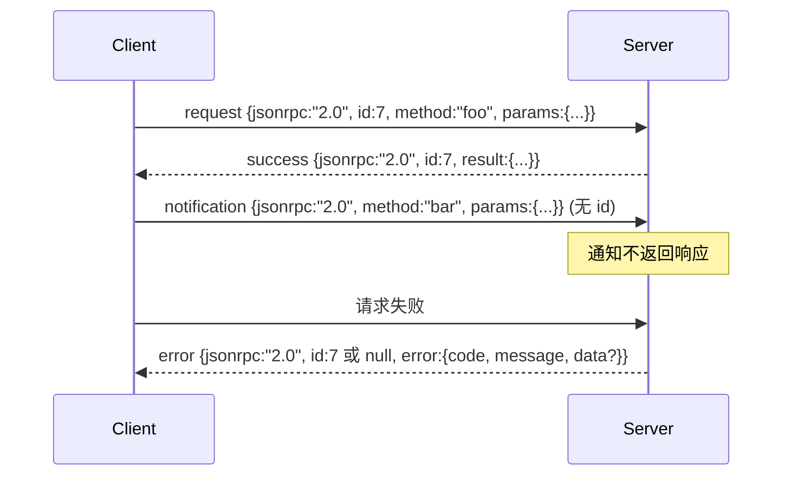

# 基于换行分隔 Stdio 的 JSON-RPC 2.0

> 模型客户端与工具服务器之间的传输层使用基于 stdio 的 JSON-RPC。亲手实现一次，你才能真正理解每个成帧层的价值。

**类型：** 构建
**语言：** Python
**前置知识：** 阶段 13 课程 01-07、阶段 14 课程 01
**时长：** ~90 分钟

## 学习目标

- 掌握以换行分隔 JSON 的形式在 stdin 和 stdout 上传输 JSON-RPC 2.0。
- 映射五个标准错误码（-32700、-32600、-32601、-32602、-32603），并正确体现其语义。
- 区分请求、响应、通知和批量请求，无需引入新的信封字段。
- 处理单行解析错误时不污染流中其他数据。
- 使用 `io.BytesIO` 构建自终止演示环境，无需启动子进程即可运行本课内容。

## 为什么 JSON-RPC 仍是通用协议

2026 年的编码智能体在一次会话中可能需要与十多个工具服务器通信。每个服务器都是一个独立进程或远程端点。而线缆格式自 2013 年以来从未改变。JSON-RPC 2.0 的规范只有两页。它之所以长盛不衰，是因为替代方案（gRPC、每次调用独立 HTTP、自定义二进制协议）都会引入一种 JSON-RPC 所没有的权衡：它们必须在流式、批处理或传输耦合中做出取舍。JSON-RPC 在 stdio、socket、WebSocket 和 HTTP 上保持对称性，并且只要双方遵守规范，客户端可以驱动一个从未见过的服务器。

本课构建的是 stdio 变体。换行分隔的 JSON。每个请求占一行。每个响应占一行。传输边界是 `\n`。

## 线缆格式

存在四种信封形状。客户端使用其中两种，服务器使用另外两种。


```mermaid
sequenceDiagram
    participant Client
    participant Server
    Client->>Server: request {jsonrpc:"2.0", id:7, method:"foo", params:{...}}
    Server-->>Client: success {jsonrpc:"2.0", id:7, result:{...}}
    Client->>Server: notification {jsonrpc:"2.0", method:"bar", params:{...}} (无 id)
    Note over Server: 通知不返回响应
    Client->>Server: 请求失败
    Server-->>Client: error {jsonrpc:"2.0", id:7 或 null, error:{code, message, data?}}
```

通知没有 `id`。服务器不得对其做出响应。如果服务器对通知返回了响应，客户端将无法将其关联到调用点。这一条简单规则保证了成帧计算的简洁性。

批量请求是一个包含请求或通知的 JSON 数组。服务器返回一个响应数组，顺序不限，每个非通知条目对应一个响应。如果批量请求中的每个条目都是通知，则服务器不返回任何内容。

## 五个错误码

```text
-32700  Parse error       无法解析 JSON
-32600  Invalid Request   信封格式错误
-32601  Method not found  方法未找到
-32602  Invalid params    参数无效
-32603  Internal error    内部错误
```

-32000 到 -32099 之间的错误码保留给服务端自定义错误。其余均可由应用自行定义。本课只使用这五个。如果你的处理器抛出异常，传输层会将其包装为 -32603，并在 `data.exception` 中附带异常类名称。

解析错误有一条特殊规则：响应中的 `id` 为 `null`，因为请求未能成功解析，无法提取出 id。

## 换行成帧与 BytesIO 演示

传输层每次读取一行。一行是以 `\n` 结尾的字节序列。如果某行无法解析，传输层会写入一条 `id: null` 的 -32700 响应，然后继续处理后续行。流不会被污染，下一行仍然会被正常解析。

在本课中，我们使用一对 `io.BytesIO` 来模拟 stdin 和 stdout。服务器逐行读取请求直到 EOF，为每个请求写入响应，然后返回。客户端读取这些响应。整个过程无需启动子进程，也无需设置超时。传输层的行为与真实的子进程管道完全一致，因为 Python 的 `io` 接口提供了相同的 `.readline()` 和 `.write()` 契约。

## 方法分发

传输层并不知晓具体存在哪些方法。它只负责将请求转交给调用方提供的可调用对象 `handler(method, params)`。处理器返回一个结果，或者抛出异常。三个异常类对应特定的错误码。

```text
MethodNotFound -> -32601
InvalidParams  -> -32602
其他异常       -> -32603，异常名称放入 data
```

传输层不接触工具注册表。注册表位于处理器之后。这正是我们想要的层次划分：传输层负责 JSON-RPC 协议，注册表负责工具形态，而调度器（第二十三课）将两者衔接起来。

## 错误时的流行为

```text
客户端写入                    服务器读取                  服务器写入
---------------               -----------                -------------
{...有效的请求...}             解析成功                    {...响应, id 匹配...}
{...损坏的 json...            解析失败                    {id:null, error: -32700}
{...有效的请求...}             解析成功                    {...响应, id 匹配...}
{...缺少 method...}           无效的信封                  {id:X, error: -32600}
```

一行损坏的 JSON 不会终止循环。缺少 `method` 字段不会终止循环。处理器抛出异常也不会终止循环。传输层会持续读取直到 EOF。

## 通知与非对称流

通知是一种"发后即忘"的消息。调用方使用通知来传递进度事件、取消信号和日志行。通知是长时间运行的工具在无需每次往返的情况下流式传输状态更新的方式。

本课实现了一个出站通知辅助函数 `write_notification`。服务器在处理请求的过程中使用它来发送进度通知。演示展示了这种模式：收到一个请求，处理器发出两条进度通知，然后写入最终响应。

## 如何阅读代码

`code/main.py` 定义了 `StdioTransport`、解析辅助函数（`parse_request`）、三个写入辅助函数（`write_response`、`write_error`、`write_notification`）以及分发循环 `serve`。错误码常量位于模块作用域中。

`code/tests/test_transport.py` 覆盖了五个错误码、通知（不写入响应）、批量请求（数组输入、数组输出、跳过通知）、损坏的 JSON（解析错误后继续处理），以及处理器在调用过程中写入通知的非对称流场景。

## 延伸阅读

本课实现的传输层足以支持后续课程。生产环境中的传输层还需要三个额外特性：一个能跨转发保持不变的关联 ID 字段（你的 `id` 已经承担了此角色，但在网状拓扑中你还需要一个外层追踪 ID）；一个取消通道（类似 `$/cancelRequest` 的通知，携带正在执行中的调用的 id）；以及一个内容类型协商握手机制，使同一个套接字既能使用 JSON-RPC，也能使用 Streamable HTTP。这些都不会改变线缆格式本身，它们只是附加的元数据。
