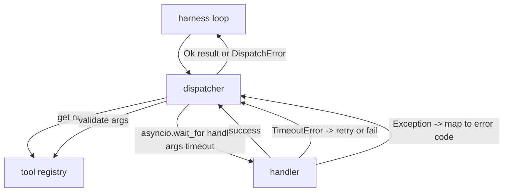
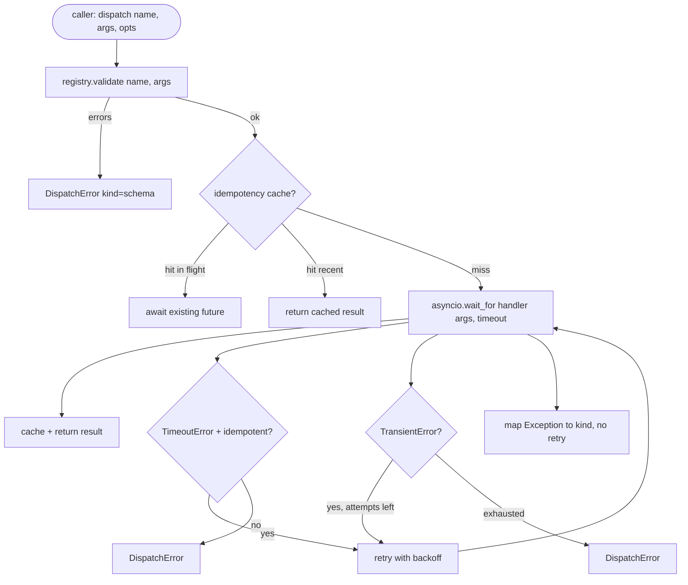

# Function Call Dispatcher

> dispatcher は、schema が約束したすべてのことに harness が支払いをする場所です。timeout、retry、dedupe、error mapping。すべてを 1 つの境界に集めます。

**種別:** 構築
**言語:** Python
**前提条件:** Phase 13 lessons 01-07, Phase 14 lesson 01
**所要時間:** 約90分

## 学習目標
- tool handler を per-call timeout で wrap し、loop を hang させる代わりに typed error を返す。
- jitter と maximum attempt count つきの exponential backoff retry を適用する。
- idempotency key で retry を deduplicate し、遅い original と競合した retry が二重実行されないようにする。
- handler exception と transport fault を、harness loop がすでに理解している単一の error envelope に map する。
- 40 個の tool call の fan-out が event loop を枯渇させないよう、parallel dispatch を concurrency limit で bound する。

## dispatcher の位置

harness loop（lesson 20）と tool registry（lesson 21）の間です。transport（lesson 22）が loop に入力します。loop は tool call を dispatcher に渡します。dispatcher は registry を呼び、handler を実行し、result または JSON-RPC 形式の error envelope を返します。



timer、retry、idempotency を知る唯一の layer が dispatcher です。loop は知りません。registry も知りません。handler も知りません。この分離が狙いです。

## Timeouts

各 tool には default timeout があります。registry record が `timeout_ms` を持ちます。harness が per-call override を渡した場合、dispatcher はそれで上書きします。ここでは `asyncio.wait_for` を使います。timeout 時には handler task が cancel され、dispatcher は `DispatchError(kind="timeout")` を返します。

timeout は、non-idempotent tool では default で retryable error ではありません。timeout した `db.write` は commit 済みかもしれないし未 commit かもしれません。retry は write を duplicate します。dispatcher は registry record の `idempotent` flag を尊重します。idempotent tool は retry します。non-idempotent tool は retry しません。

## exponential backoff つき retry

retry policy は最大 3 attempts です。backoff は jitter つき exponential です。

```text
attempt 1  -> delay 0
attempt 2  -> delay 0.1s * (1 + random[0..0.5])
attempt 3  -> delay 0.4s * (1 + random[0..0.5])
```

retry するのは `timeout` と `transient` error だけです。`schema` error、`not_found`、`internal` error は retry しません。schema error は deterministic です。retry しても結果は変わらず budget を燃やすだけです。

retry loop は harness の budget を尊重します。caller の残り tool call budget が 0 なら、dispatcher は初回 attempt で fail fast し、`kind="budget_exceeded"` を返します。

## Idempotency key dedupe

original がまだ in-flight の間に retry が発火するのは、現実に production bug です。最初の call は 4.9 秒（timeout 直前）で hang します。5 秒で retry が発火します。すると同じ backend に対して 2 つの request が競争します。tool が `payments.charge` なら二重課金です。

dispatcher は optional な `idempotency_key` を受け取ります。同じ key が in-flight のときに call が来たら、dispatcher は in-flight future を待ち、その result を返します。cache は completion 後 60 秒 key を保持し、遅れて来た retry を吸収します。

key は caller の責任です。harness は planner から `f"{step_id}:{tool_name}:{hash(args)}"` を導きます。dispatcher は key を発明しません。引数だけから key を導くと、意味的に異なる 2 つの call が同じに見えるからです。

## Error envelope

dispatch の失敗は単一の shape を返します。

```text
DispatchError
  kind        : "timeout" | "transient" | "schema" | "not_found" | "internal" | "budget_exceeded"
  message     : str
  attempts    : int
  jsonrpc_code: int   (one of -32601, -32602, -32603)
```

harness loop は `kind` を次の state に map します。`schema` と `not_found` は `on_error` に進み、replan を trigger します。`timeout` と `transient` は `on_error` に進み、attempt 数に応じて replan するかどうかが決まります。`budget_exceeded` は `on_budget_exceeded` を trigger します。

## fan-out の concurrency limit

`gather(*calls)` はすべての coroutine を同時に走らせます。40 個の tool call なら、40 個の open socket または 40 本の subprocess pipe です。ほとんどの backend は 1 client から 40 parallel connection を受けるのを好みません。

dispatcher は `gather` を semaphore で包みます。default concurrency limit は 8 です。各 call は dispatch 前に semaphore を acquire し、completion 時に release します。caller からは `gather` 形の output に見えますが、実際の scheduling は bound されています。

## 1 call の flow



## code の読み方

`code/main.py` は `Dispatcher`, `DispatchError`, `TransientError` を定義します。dispatcher は construction 時に registry を受け取ります。async `dispatch(name, args, ...)` が唯一の entry point です。per-attempt timeout は `_run_with_retries` の中で `asyncio.wait_for` を使って inline に適用されます。`gather_bounded(calls)` は concurrency limit つきで複数の dispatch を走らせます。

`code/tests/test_dispatcher.py` は timeout の発火、transient 時の retry、schema error で retry しないこと、idempotency dedupe（同じ key の concurrent call 2 つが handler invocation 1 回に畳まれる）、concurrency limiting（semaphore が効くこと）を cover します。

test は `asyncio.sleep(0)` と deterministic な `Counter` ベースの handler を使うので、millisecond 単位で終わり、wall-clock timing に依存しません。

## さらに進む

production dispatcher が追加する extension は 2 つです。1 つ目は、すべての transition で structured logging することです（loop の event stream がすでに提供しますが、dispatcher も `dispatch.attempt` と `dispatch.retry` event を emit するべきです）。2 つ目は circuit breaker です。window 内で N 回失敗したら、tool は cool-down 期間に入り、dispatch は handler を試さずに `kind="circuit_open"` を即返します。どちらも contract を変えずにこの dispatcher の上へ載せられます。

lesson 24 は dispatcher を plan-and-execute agent に接着し、4 つの piece が動くところを見せます。
