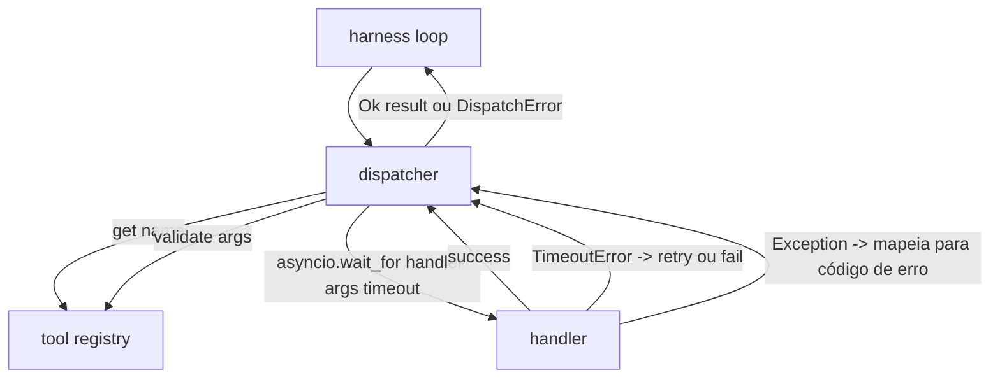
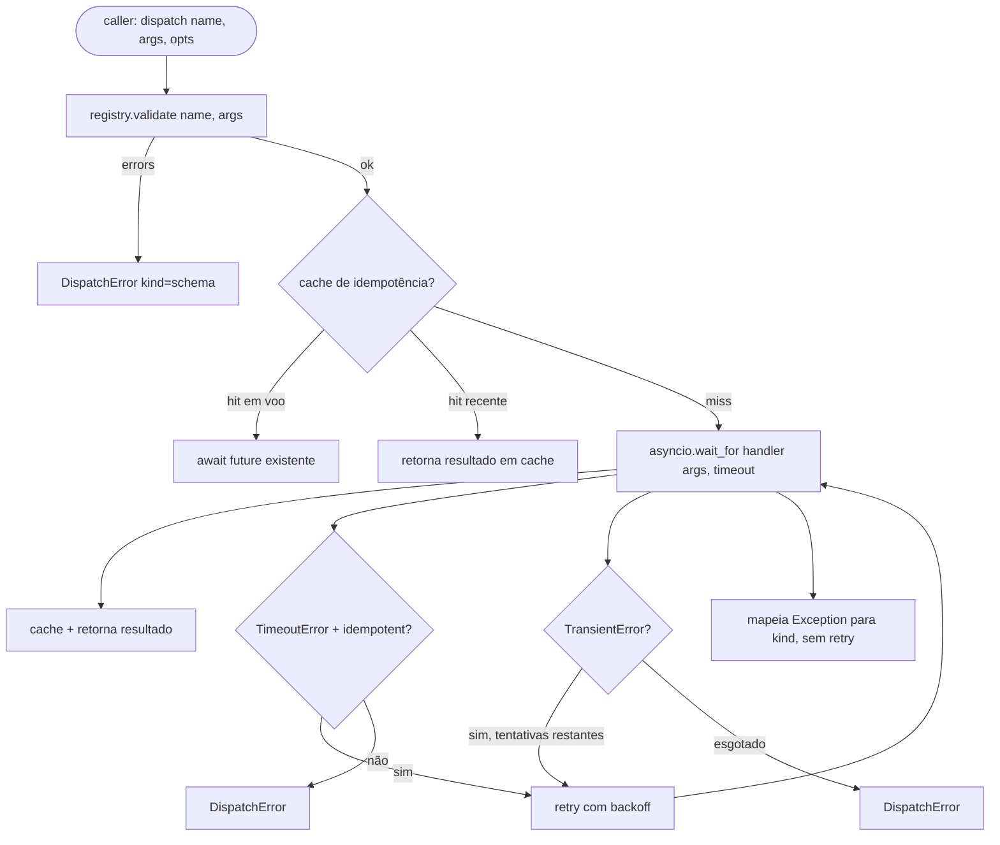

# Function Call Dispatcher

> O dispatcher é onde o harness paga por cada promessa que o schema fez. Timeouts, retries, dedupe, mapeamento de erros. Tudo em uma única costura.

**Tipo:** Build
**Linguagens:** Python
**Pré-requisitos:** Fase 13 aulas 01-07, Fase 14 aula 01
**Tempo:** ~90 minutos

## Objetivos de Aprendizado
- Envolver um ferramenta handler em um timeout por chamada que retorna um erro tipado em vez de travar o loop.
- Aplicar retry com backoff exponencial, jitter e contagem máxima de tentativas.
- Deduplicar retries em uma chave de idempotência para que um retry que compete com uma chamada original lenta não rode duas vezes.
- Mapear exceções do handler e falhas de transport em um único envelope de erro que o harness loop já entende.
- Limitar o despacho paralelo com um limite de concorrência para que um fan-out de quarenta chamadas de ferramenta não esgote o event loop.

## Onde o dispatcher fica

Entre o harness loop (aula vinte) e o ferramenta registry (aula vinte e uma). O transport (aula vinte e duas) alimenta o loop. O loop entrega uma chamada de ferramenta ao dispatcher. O dispatcher chama o registry, roda o handler, e retorna um resultado ou um envelope de erro com formato JSON-RPC.



O dispatcher é a única camada que sabe sobre timers, retries e idempotência. O loop não sabe. O registry não sabe. O handler não sabe. Essa isolamento é o ponto.

## Timeouts

Cada ferramenta tem um timeout padrão. O record do registry carrega `timeout_ms`. O dispatcher sobrescreve com um override por chamada quando o harness passa um. Usamos `asyncio.wait_for`. No timeout, a tarefa do handler é cancelada e o dispatcher retorna `DispatchError(kind="timeout")`.

Um timeout não é um erro retentável por padrão para ferramentas não idempotentes. Um `db.write` que fez timeout pode ou não ter commitado. Retry duplica a escrita. O dispatcher honra a flag `idempotent` do record do registry. Ferramentas idempotentes fazem retry. Ferramentas não idempotentes não fazem.

## Retries com backoff exponencial

A política de retry é três tentativas no máximo. Backoff é exponencial com jitter.

```text
tentativa 1  -> delay 0
tentativa 2  -> delay 0.1s * (1 + random[0..0.5])
tentativa 3  -> delay 0.4s * (1 + random[0..0.5])
```

Apenas erros de `timeout` e `transient` fazem retry. Erros de `schema`, `not_found` ou `internal` não fazem retry. Erros de schema são determinísticos. Retry não muda o resultado e queima o orçamento.

O loop de retry respeita o orçamento do harness. Se o orçamento do caller tem zero chamadas de ferramenta restantes, o dispatcher falha rápido na primeira tentativa e retorna `kind="budget_exceeded"`.

## Dedupe por chave de idempotência

Um retry que dispara enquanto a original ainda está em voo é um bug real em produção. A primeira chamada trava aos quatro ponto nove segundos (logo abaixo do timeout). O retry dispara aos cinco segundos. Agora duas requests competem contra o mesmo backend. Se a ferramenta é `payments.charge`, você cobrou duas vezes.

O dispatcher aceita uma `idempotency_key` opcional. Se a mesma chave está em voo quando uma chamada chega, o dispatcher espera o future em voo e retorna o resultado. O cache mantém chaves por sessenta segundos após a conclusão para absorver retries tardios.

A chave é responsabilidade do caller. O harness deriva do planner: `f"{step_id}:{tool_name}:{hash(args)}"`. O dispatcher não inventa chaves, porque derivar uma chave apenas dos argumentos faz duas chamadas semanticamente diferentes parecerem iguais.

## Envelope de erro

Uma falha de despacho retorna uma única forma.

```text
DispatchError
  kind        : "timeout" | "transient" | "schema" | "not_found" | "internal" | "budget_exceeded"
  message     : str
  attempts    : int
  jsonrpc_code: int   (um de -32601, -32602, -32603)
```

O harness loop mapeia `kind` para o próximo estado. `schema` e `not_found` vão para `on_error` e disparam um replan. `timeout` e `transient` vão para `on_error` e podem ou não replan dependendo das tentativas. `budget_exceeded` dispara `on_budget_exceeded`.

## Limite de concorrência no fan-out

`gather(*calls)` roda todas as coroutines simultaneamente. Com quarenta chamadas de ferramenta, são quarenta sockets abertos ou quarenta pipes de subprocesso. A maioria dos backends não gosta de quarenta conexões paralelas de um client.

O dispatcher envolve `gather` em um semaphore. Limite de concorrência padrão é oito. Cada chamada adquire o semaphore antes de despachar e libera na conclusão. O caller vê saída com formato `gather` mas o agendamento real é limitado.

## Fluxo para uma chamada



## Como ler o código

`code/main.py` define `Dispatcher`, `DispatchError` e `TransientError`. O dispatcher recebe um registry na construção. O async `dispatch(name, args, ...)` é a única entrada. Timeouts por tentativa são aplicados inline dentro de `_run_with_retries` usando `asyncio.wait_for`. `gather_bounded(calls)` roda várias despachos com o limite de concorrência.

`code/tests/test_dispatcher.py` cobre disparo de timeout, retry em transient, sem retry em erro de schema, dedupe de idempotência (duas chamadas concorrentes com a mesma chave colapsam para uma invocação de handler), e limite de concorrência (o semaphore em ação).

Os testes usam `asyncio.sleep(0)` e handlers determinísticos baseados em `Counter`, então terminam em milissegundos e não dependem de timing de wall-clock.

## Indo além

Duas extensões que dispatchers de produção adicionam. Primeiro, logging estruturado em cada transição (que o event stream do loop já te dá, mas o dispatcher também deve emitir eventos `dispatch.attempt` e `dispatch.retry`). Segundo, circuit breakers: depois de N falhas em uma janela, uma ferramenta ganha um período de cooldown onde despachos retornam imediatamente com `kind="circuit_open"` em vez de tentar o handler. Ambas se encaixam neste dispatcher sem mudar o contrato.

A aula vinte e quatro cola o dispatcher em um agente plan-and-execute para que você veja as quatro peças em movimento.
