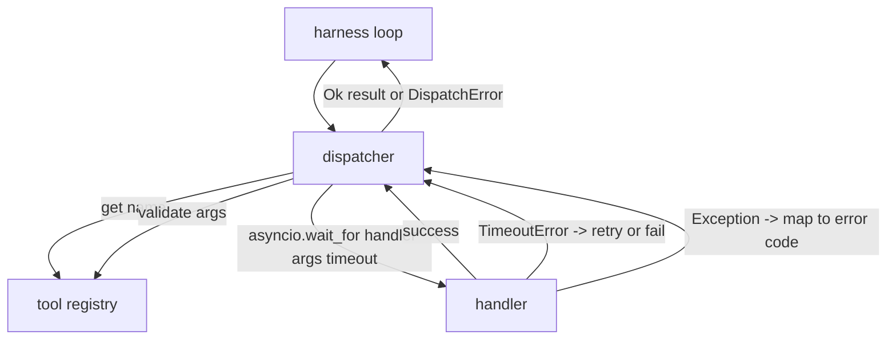
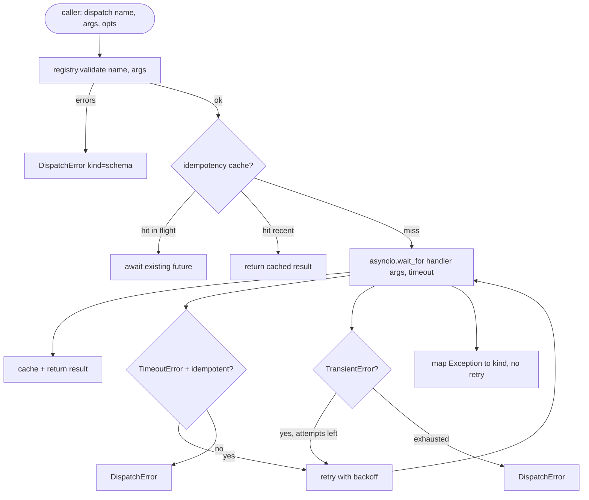

# İşlev Çağrı Göndericisi

> Sevk görevlisi, şemanın verdiği her sözün karşılığını koşumun ödediği yerdir. Zaman aşımları, yeniden denemeler, tekilleştirme, hata eşleme. Hepsi tek dikişte.

**Tür:** Yapım
**Diller:** Python
**Önkoşullar:** Aşama 13 dersleri 01-07, Aşama 14 dersi 01
**Süre:** ~90 dakika

## Öğrenme Hedefleri
- Bir araç işleyicisini, döngüyü asmak yerine yazılı bir hata döndüren çağrı başına zaman aşımına sarın.
- Titreşim ve maksimum deneme sayısıyla üstel geri çekilme yeniden denemesini uygulayın.
- Bir uyumsuzluk anahtarı üzerinde tekilleştirilmiş yeniden denemeler, böylece yavaş bir orijinalle yarışan bir yeniden deneme iki kez çalıştırılmaz.
- İşleyici istisnalarını ve taşıma hatalarını, kablo demeti döngüsünün zaten anladığı tek bir hata zarfına eşleyin.
- Eşzamanlılık sınırıyla paralel gönderimi birleştirerek kırk araç çağrısından oluşan bir yayılımın olay döngüsünü tüketmemesini sağlar.

## Sevk memurunun oturduğu yer

Emniyet kemeri döngüsü (yirmi ders) ile alet kaydı (yirmi birinci ders) arasında. Taşıma (yirmi ikinci ders) döngüyü besler. Döngü, dağıtıcıya bir araç çağrısı iletir. Dağıtıcı kayıt defterini çağırır, işleyiciyi çalıştırır ve bir sonuç veya JSON-RPC şeklinde bir hata zarfı döndürür.



Dağıtıcı, zamanlayıcılar, yeniden denemeler ve eş güçsüzlük hakkında bilgi sahibi olan tek katmandır. Döngü bunu yapmaz. Kayıt defteri bunu yapmaz. İşleyici bunu yapmaz. Önemli olan bu izolasyondur.

## Zaman Aşımları

Her aracın varsayılan bir zaman aşımı süresi vardır. Kayıt defteri kaydı `timeout_ms` taşır. Dağıtım görevlisi, koşum takımı bir tanesini geçtiğinde çağrı başına geçersiz kılma işlemini geçersiz kılar. `asyncio.wait_for` kullanıyoruz. Zaman aşımına uğradığında işleyici görevi iptal edilir ve dağıtıcı `DispatchError(kind="timeout")` değerini döndürür.

Zaman aşımı, idempotent olmayan araçlar için varsayılan olarak yeniden denenebilir bir hata değildir. Zaman aşımına uğrayan bir `db.write` taahhüt edilmiş veya edilmemiş olabilir. Yeniden denemek yazma işlemini kopyalar. Dağıtıcı, kayıt defteri kaydındaki `idempotent` bayrağını dikkate alır. Idempotent araçları yeniden deneyin. İdempotent olmayan araçlar bunu yapmaz.

## Üstel geri çekilmeyle yeniden denemeler

Yeniden deneme ilkesi en fazla üç denemedir. Geri çekilme titreşimle birlikte üsteldir.

```text
attempt 1  -> delay 0
attempt 2  -> delay 0.1s * (1 + random[0..0.5])
attempt 3  -> delay 0.4s * (1 + random[0..0.5])
```

Yalnızca `timeout` ve `transient` hataları yeniden denenir. `schema` hatası, `not_found` veya `internal` hatası yeniden denenmez. Şema hataları deterministiktir. Yeniden denemek sonucu değiştirmez ve bütçeyi yakar.

Yeniden deneme döngüsü, donanımdan gelen bütçeye saygı gösterir. Arayanın bütçesinde sıfır araç çağrısı kaldıysa sevk programı ilk denemede hızlı bir şekilde başarısız olur ve `kind="budget_exceeded"` değerini döndürür.

## Idempotency anahtarı tekilleştirme

Orijinali hâlâ uçuştayken gerçekleşen yeniden deneme, gerçek bir üretim hatasıdır. İlk çağrı dört virgül dokuz saniyede (zaman aşımının hemen altında) kalıyor. Yeniden deneme beş saniyede gerçekleşir. Artık iki istek aynı arka uca karşı yarışıyor. Alet `payments.charge` ise iki kez şarj etmişsinizdir.

Dağıtıcı isteğe bağlı bir `idempotency_key`'yi kabul eder. Bir çağrı geldiğinde aynı anahtar uçuştaysa, sevk görevlisi uçuş sırasındaki geleceği bekler ve sonucunu döndürür. Önbellek, geç yeniden denemeleri absorbe etmek için anahtarları tamamlandıktan sonra altmış saniye boyunca tutar.

Önemli olan arayanın sorumluluğundadır. Emniyet kemeri bunu planlayıcıdan alıyor: `f"{step_id}:{tool_name}:{hash(args)}"`. Gönderici anahtarları icat etmez, çünkü yalnızca argümanlardan bir anahtar türetmek, anlamsal olarak farklı iki çağrının aynı görünmesine neden olur.

## Hata zarfı

Başarısız bir gönderim tek bir şekil döndürür.

```text
DispatchError
  kind        : "timeout" | "transient" | "schema" | "not_found" | "internal" | "budget_exceeded"
  message     : str
  attempts    : int
  jsonrpc_code: int   (one of -32601, -32602, -32603)
```

Kablo demeti döngüsü `kind`'yi bir sonraki duruma eşler. `schema` ve `not_found`, `on_error`'ye gider ve bir yeniden planlamayı tetikler. `timeout` ve `transient`, `on_error`'ye gider ve denemelere bağlı olarak yeniden planlama yapabilir veya yapmayabilir. `budget_exceeded`, `on_budget_exceeded`'yi tetikler.

## Yaymada eşzamanlılık sınırı

`gather(*calls)` tüm eşyordamları aynı anda çalıştırır. Kırk takım çağrısıyla, kırk açık soket veya kırk alt işlem borusu demektir. Çoğu arka uç, bir istemciden kırk paralel bağlantıdan hoşlanmaz.

Dağıtıcı, `gather`'yi bir semaforla sarar. Varsayılan eşzamanlılık sınırı sekizdir. Her çağrı gönderilmeden önce semaforu alır ve tamamlandığında serbest bırakılır. Arayan kişi `gather` şeklindeki çıktıyı görür ancak gerçek zamanlama sınırlıdır.

## Bir çağrı için akış



## Kod nasıl okunur

`code/main.py`, `Dispatcher`, `DispatchError` ve `TransientError`'yi tanımlar. Sevk görevlisi inşaatla ilgili bir kayıt alır. Zaman uyumsuz `dispatch(name, args, ...)` tek giriş noktasıdır. Deneme başına zaman aşımları, `asyncio.wait_for` kullanılarak `_run_with_retries` içinde satır içi olarak uygulanır. `gather_bounded(calls)` birçok gönderimi eşzamanlılık sınırıyla çalıştırır.

`code/tests/test_dispatcher.py`, zaman aşımı tetiklemeyi, geçici durumda yeniden denemeyi, şema hatasında yeniden denemeyi, eş zamanlı tekilleştirmeyi (aynı anahtarla iki eşzamanlı çağrının tek bir işleyici çağrısına daraltılması) ve eşzamanlılık sınırlamayı (semaforun devrede olması) kapsar.

Testler `asyncio.sleep(0)` ve deterministik `Counter` tabanlı işleyicileri kullandığından milisaniyeler içinde tamamlanır ve duvar saati zamanlamasına bağlı değildir.

## Daha ileri gidiyoruz

İki uzantı üretim sevk görevlisi eklenir. İlk olarak, her geçişte yapılandırılmış günlük kaydı (döngünün olay akışının size zaten sağladığı, ancak dağıtıcının ayrıca `dispatch.attempt` ve `dispatch.retry` olaylarını da yayınlaması gerekir). İkincisi, devre kesiciler: Bir penceredeki N arızadan sonra, bir araç, işleyiciyi denemek yerine gönderimlerin hemen `kind="circuit_open"` ile geri döndüğü bir soğuma süresine girer. Her ikisi de sözleşmeyi değiştirmeden bu dağıtıcının üstüne sığar.

Yirmi dördüncü ders, sevk görevlisini bir planla ve uygula agent'ye yapıştırır, böylece dört parçanın tamamını hareket halinde görürsünüz.
