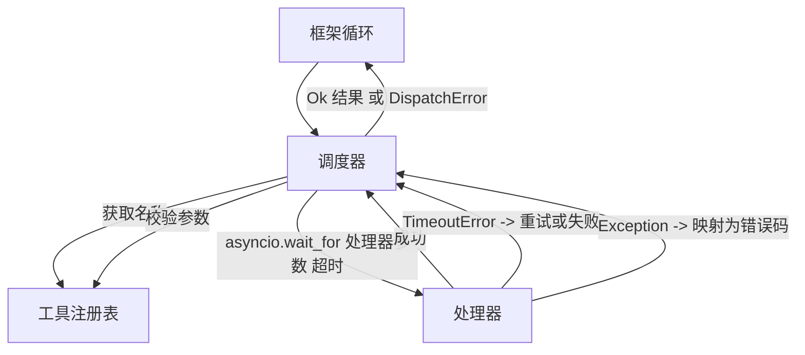
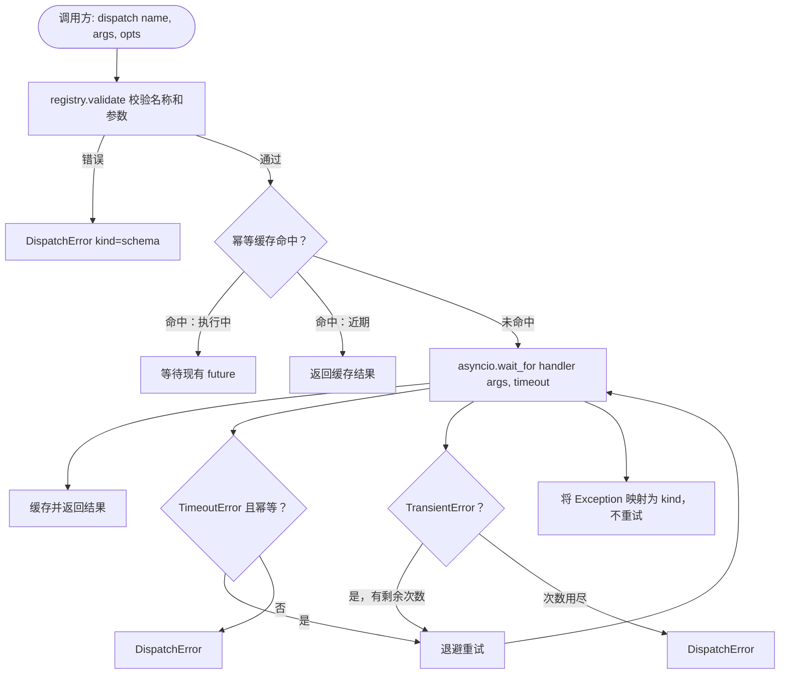

# 23 · 函数调用调度器（Function Call Dispatcher）

> 调度器是框架为 schema 所作承诺真正兑现的地方——超时、重试、去重、错误映射，全部集中在这一缝合层上。

**类型：** 构建
**语言：** Python
**前置：** 第 13 阶段第 01-07 课，第 14 阶段第 01 课
**时长：** 约 90 分钟

## 学习目标
- 为每次工具处理器调用包装超时机制，超时时返回带类型标记的错误，而不是让循环挂起。
- 采用带抖动的指数退避（exponential backoff with jitter）重试策略，并设定最大尝试次数。
- 通过幂等键（idempotency key）对重试进行去重，避免因重试与慢速原始调用竞态而导致重复执行。
- 将处理器异常和传输故障映射到框架循环已能识别的统一错误信封（error envelope）。
- 通过并发限制（concurrency limit）约束并行调度，避免四十个工具调用同时扇出（fan-out）耗尽可能句柄。

## 调度器所处的位置

调度器位于框架循环（第 20 课）与工具注册表（第 21 课）之间。传输层（第 22 课）为循环提供输入。循环将工具调用交给调度器。调度器调用注册表，运行处理器，然后返回结果或 JSON-RPC 格式的错误信封。



调度器是唯一了解计时器、重试和幂等性的层。循环不知道，注册表不知道，处理器也不知道——这种隔离正是其价值所在。

## 超时

每个工具都有默认超时。注册表记录中包含 `timeout_ms`。当框架传入按次调用覆盖值时，调度器会使用该值覆盖默认超时。我们使用 `asyncio.wait_for`。超时后，处理器任务被取消，调度器返回 `DispatchError(kind="timeout")`。

对于非幂等工具，超时默认不是可重试的错误。一次 `db.write` 超时了，可能已提交，也可能没有。重试会导致重复写入。调度器遵循注册表记录中的 `idempotent` 标志：幂等工具会重试，非幂等工具不会。

## 带指数退避的重试

重试策略最多三次尝试，采用带抖动的指数退避。

```text
第 1 次  -> 延迟 0
第 2 次  -> 延迟 0.1s * (1 + random[0..0.5])
第 3 次  -> 延迟 0.4s * (1 + random[0..0.5])
```

只有 `timeout` 和 `transient` 错误会触发重试。`schema` 错误、`not_found` 或 `internal` 错误不会重试。Schema 错误是确定性的，重试不会改变结果，只会浪费预算。

重试循环会遵循框架传入的预算。如果调用方的预算中剩余工具调用次数为零，调度器会在第一次尝试时快速失败，返回 `kind="budget_exceeded"`。

## 幂等键去重

重试触发时原始调用仍在进行中，这是一个真实的生产环境 bug。第一次调用在 4.9 秒时挂起（刚好在超时前），重试在 5 秒时触发。此时两个请求同时竞态访问同一个后端。如果工具是 `payments.charge`，就会重复扣款。

调度器接受一个可选的 `idempotency_key`。当调用到达时，如果同一个 key 正在执行中，调度器会等待正在执行的 future 并返回其结果。缓存会在完成后保留 key 六十秒，以吸收迟到的重试。

Key 由调用方负责生成。框架根据规划器派生：`f"{step_id}:{tool_name}:{hash(args)}"`。调度器不会自行生成 key，因为仅根据参数派生 key 会使两个语义不同的调用看起来相同。

## 错误信封

失败的调度返回统一的形状。

```text
DispatchError
  kind        : "timeout" | "transient" | "schema" | "not_found" | "internal" | "budget_exceeded"
  message     : str
  attempts    : int
  jsonrpc_code: int   （取 -32601、-32602、-32603 之一）
```

框架循环将 `kind` 映射到下一个状态。`schema` 和 `not_found` 进入 `on_error` 并触发重新规划。`timeout` 和 `transient` 进入 `on_error`，是否重新规划取决于尝试次数。`budget_exceeded` 触发 `on_budget_exceeded`。

## 扇出时的并发限制

`gather(*calls)` 会同时运行所有协程。四十个工具调用意味着四十个打开的 socket 或四十个子进程管道。大多数后端不喜欢来自同一客户端的四十个并行连接。

调度器用信号量（semaphore）包装 `gather`。默认并发限制为八。每个调用在开始调度前获取信号量，完成后释放。调用方看到的是 `gather` 形态的输出，但实际调度已被边界化。

## 单次调用流程



## 如何阅读代码

`code/main.py` 定义了 `Dispatcher`、`DispatchError` 和 `TransientError`。调度器在构造时接受一个注册表。异步方法 `dispatch(name, args, ...)` 是唯一入口点。每次尝试的超时在 `_run_with_retries` 内部通过 `asyncio.wait_for` 内联应用。`gather_bounded(calls)` 以并发限制运行多个调度。

`code/tests/test_dispatcher.py` 覆盖了超时触发、对瞬态错误的重试、对 schema 错误的不重试、幂等去重（两个使用相同 key 的并发调用会合并为一次处理器调用）以及并发限制（信号量的实际效果）。

测试使用 `asyncio.sleep(0)` 和基于确定性 `Counter` 的处理器，因此它们在毫秒内完成，不依赖真实时钟计时。

## 进一步探索

生产环境调度器通常会补充两个扩展。第一，在每个状态转换处进行结构化日志记录（框架循环的事件流已经提供，但调度器还应发出 `dispatch.attempt` 和 `dispatch.retry` 事件）。第二，熔断器（circuit breaker）：在一个时间窗口内发生 N 次失败后，工具进入冷却期，在此期间调度会立即返回 `kind="circuit_open"`，而不是尝试执行处理器。这两者都可以在不改变契约的情况下叠加到本调度器之上。

第 24 课将调度器接入规划-执行智能体（plan-and-execute agent），让你看到这四部分协同工作的完整画面。
