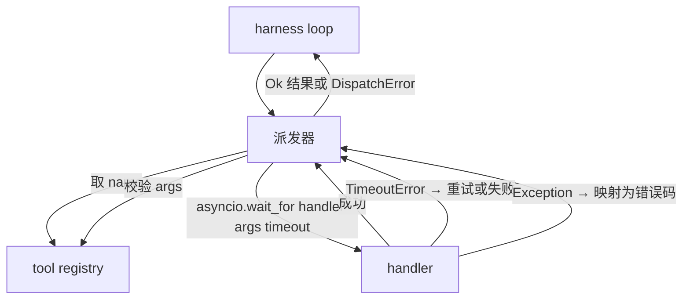
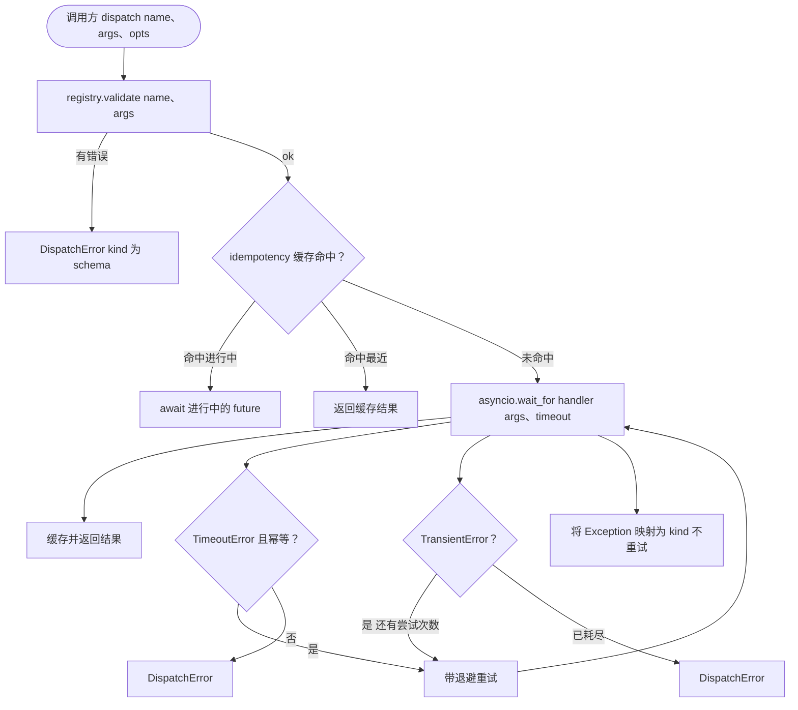

# Function Call 派发器（Function Call Dispatcher）

> 译注：本文译自同目录 [`en.md`](./en.md)。术语遵循仓根 [TRANSLATION_GUIDE.md](../../../../TRANSLATION_GUIDE.md)。

> 派发器是 harness 兑现 schema 一切承诺的地方。超时、重试、去重、错误映射，全压在这一道接缝上。

**Type:** Build
**Languages:** Python
**Prerequisites:** Phase 13 lessons 01-07, Phase 14 lesson 01
**Time:** ~90 minutes

## 学习目标（Learning Objectives）
- 用单次调用级别的超时把 tool handler 包起来，超时返回类型化错误，而不是让 loop 卡死。
- 应用带 jitter 的指数退避（exponential backoff）重试，并设置最大尝试次数。
- 基于 idempotency key（幂等键）对重试做去重，避免重试与一次缓慢的原始调用并发跑两遍。
- 把 handler 异常和 transport 故障统一映射到一个 harness loop 已经认识的错误信封里。
- 用并发上限约束并行派发，防止 40 个 tool call 的扇出把事件循环耗光。

## 派发器在哪一层（Where the dispatcher sits）

夹在 harness loop（lesson 二十）和 tool registry（lesson 二十一）之间。Transport（lesson 二十二）给 loop 喂数据。Loop 把一次 tool call 交给派发器。派发器调 registry、跑 handler，然后要么返回结果，要么返回一个 JSON-RPC 形状的错误信封。



派发器是唯一知道计时器、重试和幂等性这些事的层。Loop 不知道，registry 不知道，handler 也不知道。这种隔离正是它的意义所在。

## 超时（Timeouts）

每个 tool 都有一个默认超时。Registry 记录里带有 `timeout_ms`。当 harness 传入单次调用的覆盖值时，派发器会用它覆盖默认值。我们用 `asyncio.wait_for`。超时时，handler 任务被 cancel，派发器返回 `DispatchError(kind="timeout")`。

对于非幂等的 tool，超时默认不是可重试错误。一次超时的 `db.write` 可能已经 commit，也可能没有。重试就是把写操作重复一次。派发器尊重 registry 记录里的 `idempotent` 标记。幂等的 tool 重试，非幂等的 tool 不重试。

## 指数退避重试（Retries with exponential backoff）

重试策略最多三次。退避按指数增长，外加 jitter。

```text
attempt 1  -> delay 0
attempt 2  -> delay 0.1s * (1 + random[0..0.5])
attempt 3  -> delay 0.4s * (1 + random[0..0.5])
```

只有 `timeout` 和 `transient` 错误会重试。`schema` 错误、`not_found`、`internal` 错误都不重试。Schema 错误是确定性的，重试不会改变结果，只会烧 budget。

重试循环遵守来自 harness 的 budget。如果调用方 budget 里剩余的 tool call 次数为零，派发器会在第一次尝试就快速失败，返回 `kind="budget_exceeded"`。

## 幂等键去重（Idempotency key dedupe）

重试在原始调用还在飞的时候就触发，是一个真实的生产 bug。第一次调用在 4.9 秒上挂着（刚好低于超时）。重试在 5 秒处触发。现在两个请求同时打向同一个后端。如果 tool 是 `payments.charge`，你就扣了两次款。

派发器接受一个可选的 `idempotency_key`。如果一个调用进来时同样的 key 还在飞，派发器会 await 那个进行中的 future 并返回它的结果。完成后缓存还会保留 key 60 秒，吸收迟到的重试。

Key 是调用方的责任。Harness 从 planner 派生：`f"{step_id}:{tool_name}:{hash(args)}"`。派发器不会自己造 key，因为只从 args 派生 key 会让两个语义不同的调用看起来一模一样。

## 错误信封（Error envelope）

派发失败统一返回一个形状。

```text
DispatchError
  kind        : "timeout" | "transient" | "schema" | "not_found" | "internal" | "budget_exceeded"
  message     : str
  attempts    : int
  jsonrpc_code: int   (one of -32601, -32602, -32603)
```

Harness loop 把 `kind` 映射到下一个状态。`schema` 和 `not_found` 走 `on_error` 触发 replan。`timeout` 和 `transient` 走 `on_error`，根据尝试次数决定要不要 replan。`budget_exceeded` 触发 `on_budget_exceeded`。

## 扇出的并发上限（Concurrency limit on fan-out）

`gather(*calls)` 同时跑所有协程。40 个 tool call 就是 40 个开着的 socket 或 40 条子进程管道。大多数后端不喜欢一个客户端同时开 40 条并发连接。

派发器把 `gather` 包在一个 semaphore 里。默认并发上限是 8。每次调用在派发前先获取 semaphore，完成后释放。调用方看到的是 `gather` 形状的输出，但实际调度是被约束的。

## 单次调用的流程（Flow for one call）



## 怎么读这份代码（How to read the code）

`code/main.py` 定义了 `Dispatcher`、`DispatchError` 和 `TransientError`。派发器在构造时拿到一个 registry。异步方法 `dispatch(name, args, ...)` 是唯一入口。每次尝试的超时在 `_run_with_retries` 内部用 `asyncio.wait_for` 直接套上。`gather_bounded(calls)` 用并发上限跑大量派发。

`code/tests/test_dispatcher.py` 覆盖了超时触发、transient 错误重试、schema 错误不重试、idempotency 去重（同一个 key 的两个并发调用合并成一次 handler 调用）、以及并发限制（semaphore 实战）。

测试使用 `asyncio.sleep(0)` 和基于 `Counter` 的确定性 handler，所以毫秒级跑完，且不依赖墙钟。

## 更进一步（Going further）

生产级派发器通常会加两个扩展。第一是在每次状态切换都做结构化日志（loop 的事件流已经给了你这些，但派发器自己也应该发 `dispatch.attempt` 和 `dispatch.retry` 事件）。第二是 circuit breaker（熔断器）：在某个时间窗口内失败 N 次后，这个 tool 进入冷却期，派发立刻返回 `kind="circuit_open"`，不再尝试 handler。两者都能在不改变现有契约的前提下叠加在这个派发器之上。

Lesson 二十四会把派发器粘到一个 plan-and-execute agent 上，让你看到这四块拼图同时跑起来。
