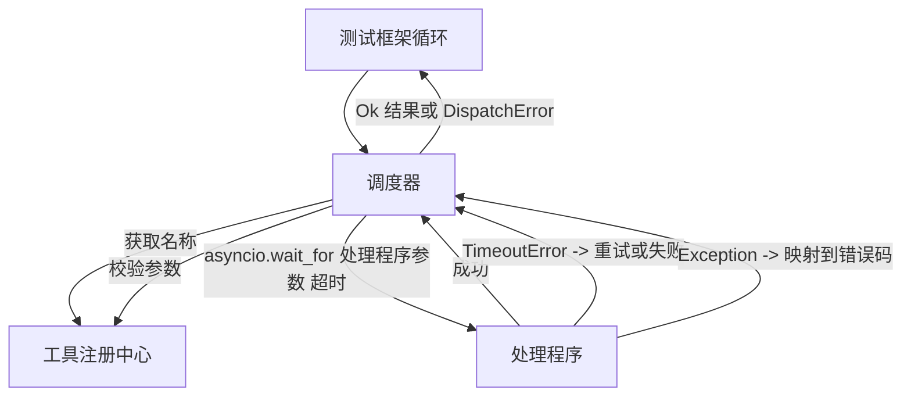
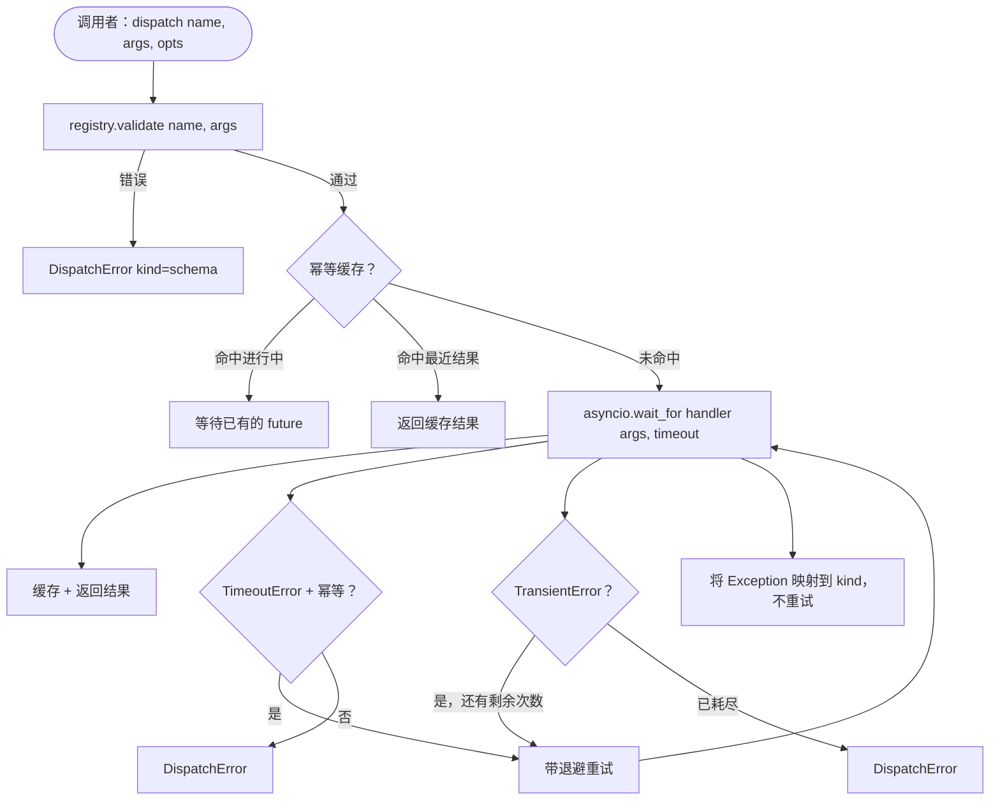

# 函数调用调度器

> 调度器是测试框架兑现 schema 所有承诺的地方。超时、重试、去重、错误映射——全部汇集在同一个接缝上。

**类型：** 构建
**语言：** Python
**前置要求：** 第 13 阶段课程 01-07、第 14 阶段课程 01
**预计用时：** ~90 分钟

## 学习目标

- 将工具处理程序包装在每次调用的超时机制中，返回类型化的错误而非挂起事件循环。
- 应用带抖动的指数退避重试策略，并设置最大尝试次数。
- 基于幂等键对重试进行去重，避免重试与原始慢请求竞态时重复执行两次。
- 将处理程序异常和传输层故障映射到测试框架循环已理解的统一错误信封中。
- 通过并发限制约束并行调度，防止四十个工具调用同时爆发耗尽事件循环。

## 调度器的位置

位于测试框架循环（课程二十）和工具注册中心（课程二十一）之间。传输层（课程二十二）向循环提供输入。循环将工具调用交给调度器。调度器调用注册中心，执行处理程序，然后返回结果或 JSON-RPC 格式的错误信封。


```mermaid
flowchart TD
    loop[测试框架循环]
    disp[调度器]
    reg[工具注册中心]
    handler[处理程序]
    loop --> disp
    disp -->|获取名称| reg
    disp -->|校验参数| reg
    disp -->|asyncio.wait_for 处理程序参数 超时| handler
    handler -->|成功| disp
    handler -->|TimeoutError -> 重试或失败| disp
    handler -->|Exception -> 映射到错误码| disp
    disp -->|Ok 结果或 DispatchError| loop
```

调度器是唯一知晓定时器、重试和幂等性的层次。循环不知道，注册中心不知道，处理程序也不知道。这种隔离正是关键所在。

## 超时

每个工具都有默认超时。注册记录中包含 `timeout_ms`。当测试框架传入每次调用的覆盖值时，调度器会覆盖默认值。我们使用 `asyncio.wait_for`。超时发生时，处理程序任务被取消，调度器返回 `DispatchError(kind="timeout")`。

对于非幂等工具，超时默认不是可重试的错误。一个超时的 `db.write` 可能已经提交，也可能没有。重试会导致重复写入。调度器会遵循注册记录中的 `idempotent` 标志。幂等工具进行重试，非幂等工具则不重试。

## 带指数退避的重试

重试策略最多尝试三次。退避采用带抖动的指数方式。

```text
第 1 次尝试  -> 延迟 0
第 2 次尝试  -> 延迟 0.1s * (1 + random[0..0.5])
第 3 次尝试  -> 延迟 0.4s * (1 + random[0..0.5])
```

只有 `timeout` 和 `transient` 类型的错误会触发重试。`schema` 错误、`not_found` 或 `internal` 错误不会重试。Schema 错误是确定性的，重试不会改变结果，只会浪费配额。

重试循环会遵循测试框架的预算。如果调用者的剩余工具调用预算为零，调度器在第一次尝试时就直接快速失败，返回 `kind="budget_exceeded"`。

## 幂等键去重

当原始请求仍在进行中时触发的重试是一个真实的生产环境 bug。第一次调用在 4.9 秒时挂起（刚好低于超时阈值）。重试在 5 秒时触发。现在两个请求竞相访问同一个后端。如果工具是 `payments.charge`，你就被扣了两次款。

调度器接受一个可选的 `idempotency_key`。如果同一键对应的调用正在进行中，调度器会等待该进行中的 future 并返回其结果。缓存会在完成后保留键值 60 秒，以吸收延迟到达的重试。

键的生成是调用者的责任。测试框架从计划器中派生它：`f"{step_id}:{tool_name}:{hash(args)}"`。调度器不会自行生成键，因为仅从参数派生键会让两个语义不同的调用看起来一样。

## 错误信封

失败的调度返回统一的数据结构。

```text
DispatchError
  kind        : "timeout" | "transient" | "schema" | "not_found" | "internal" | "budget_exceeded"
  message     : str
  attempts    : int
  jsonrpc_code: int   （值为 -32601、-32602 或 -32603）
```

测试框架循环将 `kind` 映射到下一个状态。`schema` 和 `not_found` 进入 `on_error` 并触发重新规划。`timeout` 和 `transient` 进入 `on_error`，是否重新规划取决于尝试次数。`budget_exceeded` 触发 `on_budget_exceeded`。

## 扇出时的并发限制

`gather(*calls)` 会同时运行所有协程。四十个工具调用意味着四十个打开的套接字或四十个子进程管道。大多数后端不喜欢来自同一客户端的四十个并行连接。

调度器用信号量包装 `gather`。默认并发限制为八个。每个调用在调度前获取信号量，完成后释放。调用者看到的输出格式与 `gather` 一致，但实际的调度是有界的。

## 单次调用的流程


```mermaid
flowchart TD
    start([调用者：dispatch name, args, opts])
    validate[registry.validate name, args]
    schema_err[DispatchError kind=schema]
    idem_check{幂等缓存？}
    in_flight[等待已有的 future]
    cached[返回缓存结果]
    attempt[asyncio.wait_for handler args, timeout]
    success[缓存 + 返回结果]
    timeout_branch{TimeoutError + 幂等？}
    retry[带退避重试]
    fail[DispatchError]
    transient_branch{TransientError？}
    other[将 Exception 映射到 kind，不重试]
    exhausted[DispatchError]

    start --> validate
    validate -->|错误| schema_err
    validate -->|通过| idem_check
    idem_check -->|命中进行中| in_flight
    idem_check -->|命中最近结果| cached
    idem_check -->|未命中| attempt
    attempt --> success
    attempt --> timeout_branch
    timeout_branch -->|是| retry
    timeout_branch -->|否| fail
    attempt --> transient_branch
    transient_branch -->|是，还有剩余次数| retry
    transient_branch -->|已耗尽| exhausted
    attempt --> other
    retry --> attempt
```

## 如何阅读代码

`code/main.py` 定义了 `Dispatcher`、`DispatchError` 和 `TransientError`。调度器在构造时接收注册中心。异步方法 `dispatch(name, args, ...)` 是唯一的入口点。每次尝试的超时在 `_run_with_retries` 内部通过 `asyncio.wait_for` 内联应用。`gather_bounded(calls)` 在并发限制下运行多个调度。

`code/tests/test_dispatcher.py` 覆盖了超时触发、瞬态错误重试、schema 错误不重试、幂等去重（两个使用相同键的并发调用合并为一次处理程序调用）以及并发限制（信号量的实际作用）。

测试使用 `asyncio.sleep(0)` 和基于确定性 `Counter` 的处理程序，因此它们在毫秒级完成，不依赖实际时钟时间。

## 延伸阅读

生产级调度器还会增加两个扩展。第一，在每个转换点添加结构化日志（虽然测试框架循环的事件流已经提供了这个能力，但调度器自身也应该发出 `dispatch.attempt` 和 `dispatch.retry` 事件）。第二，熔断器：如果在一个时间窗口内失败达到 N 次，工具会进入冷却期，在此期间调度直接返回 `kind="circuit_open"` 而不尝试执行处理程序。这两个扩展都可以在此调度器基础上实现，无需修改约定。

课程二十四将调度器与计划-执行代理结合起来，让你看到全部四个组件协同运作。
