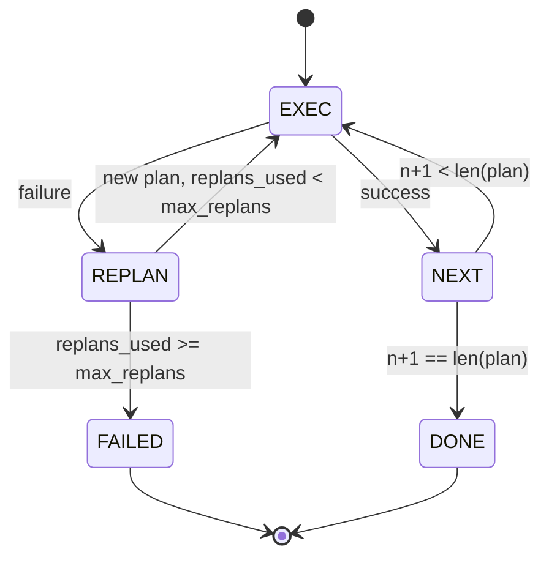

# Plan-Execute Control Flow

> 失敗に耐えられない plan は script です。replan できる script が agent です。まず replanner を作ります。

**種別:** 構築
**言語:** Python
**前提条件:** Phase 13 lessons 01-07, Phase 14 lesson 01
**所要時間:** 約90分

## 学習目標
- executor が進捗と outcome を推論できるように、plan を typed step の ordered list として表現する。
- step を sequential に実行し、制御された failure handoff を planner に戻す。
- prior error を context に入れた current cursor から replan し、次の plan に情報を反映する。
- downstream tracer や UI が plan 変更の理由を示せるように、revision ごとに plan diff を emit する。
- hard step ceiling と hard replan ceiling の 2 つの budget を enforce する。

## chain-of-thought ではなく plan and execute

chain-of-thought agent は token を emit し、tool call がどこで終わるかを loop に推測させます。plan-and-execute agent は先に structured plan を emit し、その後で各 step を deterministic に実行します。plan は harness が introspect できる data です。execution は、その data を dispatcher に通す harness の実行です。

piece は 2 つです。plan を作る planner。plan を走らせる executor。面白いのは、executor が failure に当たったときです。option は 3 つあります。

```text
1. Abort         (return failed, surface the error)
2. Skip          (mark step failed, continue with the rest)
3. Replan        (hand the error to the planner, get a new plan from the cursor)
```

script を agent に変えるのは Replan です。

## Step shape

```text
Step
  id              : int           (monotonic within a plan revision)
  tool_name       : str
  args            : dict
  expected_outcome: str           (planner's stated success condition)
  result          : Any | None
  error           : str | None
```

`expected_outcome` は planner が step と一緒に emit する短い文です。executor はそれを enforce しません。用途は 2 つです。replanner が plan を revise するときに読みます。event stream が emit するので tracer は「この step は X するはずだった」と表示できます。

## planner shape

```python
def planner(goal: str, history: list[Step], last_error: str | None) -> list[Step]:
    ...
```

pure function です。`goal` は user goal。`history` はすでに実行された step（result と error が埋まったもの）。`last_error` は初回 call では None、以後は最新 failure message です。planner は cursor 以降の次の plan を返します。

planner は executor を知りません。retry も知りません。timeout も知りません。plan を作るだけです。それで十分です。

## executor

executor は小さな state machine です。各 step は dispatcher を通ります。outcome は success、failure-replannable、failure-fatal の 3 つです。replannable failure は planner に戻します。fatal failure（budget exceeded、replan ceiling hit）は `FAILED` session result を返します。



## revision 時の plan diff

failure 後に planner が新しい plan を返すと、executor は 3 つの field を持つ `plan.diff` event を emit します。

```text
removed: list of step ids that were in the old plan and are not in the new
added  : list of step ids in the new plan that were not in the old
revised: list of step ids whose tool_name or args changed
```

tracer や UI は removed step に strikethrough、added step に highlight を出せます。重要なのは diff format ではありません。revision が silent rewrite ではなく visible event であることです。

## 2 つの budget はどちらも hard

`max_steps` は replan を含む session 全体の step execution 総数を cap します。default は 12 です。5-step の linear plan が 2 回 replan し、そのたびに 3 step 追加すると 16 execution に達し、budget を超えます。executor は replan を拒否し、FAILED を返します。

`max_replans` は初回 plan 後に planner が呼ばれる回数を cap します。default は 5 です。こちらの方が重要です。同じ broken plan を planner が 5 回連続で返すと、放っておけば step budget が捕まえるまで loop します。replan を cap すると failure が速くなり、理由も明確になります。

## この lesson の deterministic planner

この lesson では model を呼びません。`last_error` に基づいて plan を選ぶ deterministic planner を同梱します。

```text
last_error is None    -> emit a four-step plan
last_error matches X  -> emit a three-step plan that routes around X
last_error matches Y  -> emit a two-step plan that gives up gracefully
otherwise             -> return [] (signals nothing to replan)
```

これで executor behavior の全 transition path（success、replan-once、replan-twice、replan-exhaustion、step-budget exhaustion）を test するには十分です。

## Result shape

```text
SessionResult
  status      : "completed" | "failed"
  reason      : str     ("goal_met" | "step_budget" | "replan_budget" | "no_plan")
  history     : list[Step]
  revisions   : list[PlanDiff]
  events      : list[Event]
```

lesson 20 の harness loop はこれをそのまま読めます。lesson 23 の dispatcher が各 step を実行します。lesson 21 の registry が各 step の args を validate します。lesson 22 の transport は、この flow 全体を JSON-RPC 経由で model client に surface できます。

## code の読み方

`code/main.py` は `PlanExecuteAgent`, `Step`, `PlanDiff`, `SessionResult`, deterministic planner を定義します。executor は `SessionResult` を返す単一の `run(goal)` method です。plan diff は step id と `(tool_name, args)` tuple を比較して計算します。

`code/tests/test_agent.py` は linear success、mid-plan failure から 1 回 replan する case、`failed:replan_budget` を返す replan exhaustion、step-budget exhaustion、plan-diff event format を cover します。

## さらに進む

実 model に接続すると欲しくなる extension は 2 つです。1 つ目は partial-plan caching です。6 step 中 3 step 成功してから失敗した場合、最初の 3 step は再実行したくありません。executor はすでに history を保持しています。planner がそれを読むだけです。2 つ目は parallel branch です。現在の executor は厳密に sequential です。独立 branch（`next_step` ではなく `gather_step`）を emit する planner なら、dispatcher 経由で 2 つの tool call を concurrent に走らせられます。

どちらも実際の complexity を増やします。linear executor が固定されてからの方が追加しやすいです。この lesson はその土台を作ります。
