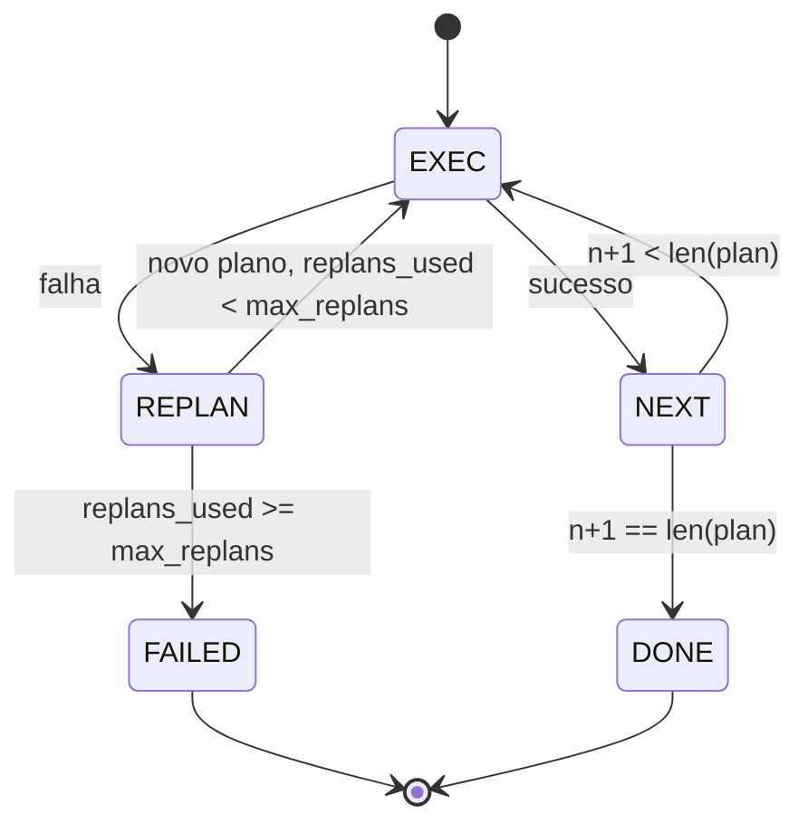

# Plan-Execute Control Flow

> Um plano que não sobrevive a uma falha é um script. Um script que pode replan é um agent. Construa o replanner primeiro.

**Tipo:** Build
**Linguagens:** Python
**Pré-requisitos:** Fase 13 aulas 01-07, Fase 14 aula 01
**Tempo:** ~90 minutos

## Objetivos de Aprendizado
- Representar um plano como uma lista ordenada de passos tipados para que o executor possa raciocinar sobre progresso e resultado.
- Executar passos sequencialmente com uma passagem de falha controlada de volta ao planner.
- Replan a partir do cursor atual com o erro anterior no contexto para que o próximo plano seja informado.
- Emitir um diff do plano a cada revisão para que um tracer ou UI downstream mostre por que o plano mudou.
- Forçar dois orçamentos: um teto rígido de passos e um teto rígido de replans.

## Plano e execute, não chain-of-thought

Um agente de chain-of-thought emite tokens e deixa o loop adivinhar onde a chamada de ferramenta termina. Um agente plan-and-execute emite um plano estruturado primeiro, depois executa cada passo deterministicamente. O plano são dados que o harness pode introespecificaçãotar. A execução é o harness rodando esses dados através de um dispatcher.

Duas peças. Um planner que produz um plano. Um executor que roda o plano. O trabalho interessante é o que acontece quando o executor encontra uma falha. Três opções:

```text
1. Abortar       (retorna falha, expõe o erro)
2. Pular         (marca passo como falhou, continua com o resto)
3. Replan        (entrega o erro ao planner, obtém um novo plano do cursor)
```

Replan é o que transforma um script em um agent.

## A forma do Step

```text
Step
  id              : int           (monotônico dentro de uma revisão de plano)
  tool_name       : str
  args            : dict
  expected_outcome: str           (condição de sucesso declarada pelo planner)
  result          : Any | None
  error           : str | None
```

`expected_outcome` é uma frase curta que o planner emite junto com o passo. Não é forçada pelo executor. É para duas coisas: o replanner le ao revisar o plano; o stream de eventos emite para que um tracer mostre "este passo deveria fazer X."

## A forma do planner

```python
def planner(goal: str, history: list[Step], last_error: str | None) -> list[Step]:
    ...
```

Uma função pura. `goal` é o objetivo do usuário. `history` são os passos já executados (com resultados e erros preenchidos). `last_error` é None na primeira chamada e a mensagem de falha mais recente em cada chamada subsequente. O planner retorna o próximo plano começando do cursor.

O planner não sabe sobre o executor. Não sabe sobre retries. Não sabe sobre timeouts. Produz um plano. Isso é tudo.

## O executor

O executor é uma pequena máquina de estados. Cada passo roda através do dispatcher. O resultado é uma de três coisas: sucesso, falha-replanável, falha-fatal. Falhas replanáveis são devolvidas ao planner. Falhas fatais (orçamento excedido, teto de replan atingido) retornam um resultado de sessão `FAILED`.



## Diffs de plano na revisão

Quando o planner retorna um novo plano após uma falha, o executor emite um evento `plan.diff` com três campos.

```text
removed: lista de ids de passos que estavam no plano antigo e não estão no novo
added  : lista de ids de passos no novo plano que não estavam no antigo
revised: lista de ids de passos cujo tool_name ou args mudou
```

Um tracer ou UI pode renderizar isso como tachado nos passos removidos e destaque nos adicionados. O ponto não é o formato do diff. O ponto é que a revisão é um evento visível, não uma reescrita silenciosa.

## Dois orçamentos, ambos rígidos

`max_steps` limita o total de execuções de passos em toda a sessão, incluindo replans. Padrão é doze. Um plano linear de cinco passos que replan duas vezes e adiciona três passos cada vez atinge dezesseis execuções e excederia o orçamento. O executor vai recusar o replan e retornar FAILED.

`max_replans` limita o número de vezes que o planner é chamado após o primeiro plano. Padrão é cinco. Este é o limite mais importante. Um planner que retorna o mesmo plano quebrado cinco vezes seguidas de outra forma faria loop até que o orçamento de passos o apanhe. Limitar replans torna a falha mais rápida e a razão mais clara.

## O planner determinístico nesta aula

Nós não chamamos um model nesta aula. A aula fornece um planner determinístico que escolhe um plano baseado em `last_error`.

```text
last_error é None     -> emite um plano de quatro passos
last_error combina X  -> emite um plano de três passos que contorna X
last_error combina Y  -> emite um plano de dois passos que desiste graciosamente
caso contrário        -> retorna [] (sinaliza nada para replan)
```

Isso é suficiente para testar o comportamento do executor em cada caminho de transição: sucesso, replan-uma-vez, replan-duas-vezes, replan-esgotamento, e esgotamento de orçamento de passos.

## Forma do resultado

```text
SessionResult
  status      : "completed" | "failed"
  reason      : str     ("goal_met" | "step_budget" | "replan_budget" | "no_plan")
  history     : list[Step]
  revisions   : list[PlanDiff]
  events      : list[Event]
```

O harness loop da aula vinte pode ler isso diretamente. O dispatcher da aula vinte e três é o que executa cada passo. O registry da aula vinte e uma valida os args de cada passo. O transport da aula vinte e duas exporia todo esse fluxo via JSON-RPC para um model client.

## Como ler o código

`code/main.py` define `PlanExecuteAgent`, `Step`, `PlanDiff`, `SessionResult` e o planner determinístico. O executor é um único método `run(goal)` que retorna um `SessionResult`. O diff do plano é computado comparando ids de passos e tuplas `(tool_name, args)`.

`code/tests/test_agent.py` cobre sucesso linear, falha no meio do plano que replan uma vez, esgotamento de replan que retorna `failed:replan_budget`, esgotamento de orçamento de passos, e o formato do evento plan-diff.

## Indo além

Duas extensões que você vai querer quando conectar isso a um model real. Primeiro, cache de plano parcial: quando um plano succeed nos três primeiros de seis passos e depois falha, você não quer re-executar os três primeiros. O executor já mantém história; o planner só precisa ler. Segundo, branches paralelos: o executor atual é estritamente sequencial. Um planner que emite um branch independente (`gather_step` em vez de `next_step`) pode rodar duas chamadas de ferramenta concorrentemente através do dispatcher.

Ambas adicionam complexidade real. Ambas são mais fáceis de adicionar uma vez que o executor linear está fixado. Isso é o que esta aula faz.
