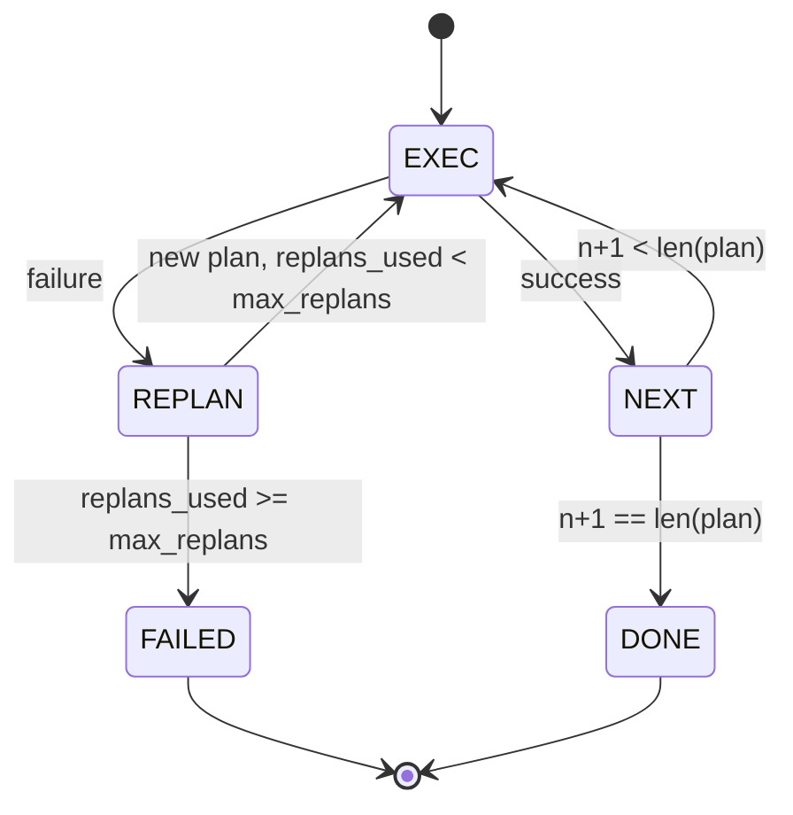

# Planla-Uygula Kontrol Akışı

> Başarısızlığa dayanamayacak bir plan bir senaryodur. Yeniden planlayabilen bir komut dosyası bir agent'dır. İlk önce yeniden planlayıcıyı oluşturun.

**Tür:** Yapım
**Diller:** Python
**Önkoşullar:** Aşama 13 dersleri 01-07, Aşama 14 dersi 01
**Süre:** ~90 dakika

## Öğrenme Hedefleri
- Bir planı, yazılı adımların sıralı bir listesi olarak temsil edin, böylece uygulayıcı ilerleme ve sonuç hakkında mantık yürütebilir.
- Planlayıcıya kontrollü bir arıza aktarımıyla adımları sırayla uygulayın.
- Bir sonraki planın bilgilendirilmesi için mevcut imleçten önceki hatayla birlikte yeniden planlama yapın.
- Her revizyonda bir plan farkı yayınlayın, böylece aşağı akış izleyicisi veya kullanıcı arayüzü planın neden değiştiğini gösterebilir.
- İki bütçeyi uygulayın: sert bir adım tavanı ve sert bir yeniden planlama tavanı.

## Düşünce zinciri yerine planlayın ve uygulayın

Bir düşünce zinciri agent, token'lar yayar ve döngünün, araç çağrısının nerede biteceğini tahmin etmesini sağlar. Planla ve uygula agent ilk önce yapılandırılmış bir plan yayınlar, ardından her adımı deterministik olarak yürütür. Plan, emniyet kemerinin iç gözlemleyebileceği verilerdir. Yürütme, bu verileri bir dağıtıcı aracılığıyla çalıştıran donanımdır.

İki parça. Plan üreten plancı. Planı yürüten bir uygulayıcı. İlginç olan, uygulayıcı başarısızlığa uğradığında ne olacağıdır. Üç seçenek:

```text
1. Abort         (return failed, surface the error)
2. Skip          (mark step failed, continue with the rest)
3. Replan        (hand the error to the planner, get a new plan from the cursor)
```

Yeniden planlama, bir betiği agent'a dönüştüren plandır.

## Adım şekli

```text
Step
  id              : int           (monotonic within a plan revision)
  tool_name       : str
  args            : dict
  expected_outcome: str           (planner's stated success condition)
  result          : Any | None
  error           : str | None
```

`expected_outcome` planlayıcının adımın yanında söylediği kısa bir cümledir. Yürütücü tarafından uygulanmaz. Bu iki şey içindir: Yeniden planlayıcı, planı revize ederken okur; olay akışı bunu yayar, böylece bir izleyici "bu adımın X yapması gerekiyordu" ifadesini gösterebilir.

## Planlayıcı şekli

```python
def planner(goal: str, history: list[Step], last_error: str | None) -> list[Step]:
    ...
```

Saf bir işlev. `goal` kullanıcı hedefidir. `history` halihazırda yürütülen adımlardır (sonuçlar ve hatalar doldurulmuş olarak). `last_error` ilk aramada Yoktur ve sonraki her aramada en son hata mesajıdır. Planlayıcı imleçten başlayarak bir sonraki planı döndürür.

Planlayıcının uygulayıcı hakkında bilgisi yoktur. Yeniden denemelerden haberi yok. Zaman aşımlarını bilmiyor. Bir plan üretir. Hepsi bu.

## Yürütücü

Yürütücü küçük bir durum makinesidir. Her adım dağıtıcıdan geçer. Sonuç üç şeyden biridir: başarı, başarısızlık yeniden planlanabilir, başarısızlık ölümcül. Yeniden planlanabilir başarısızlıklar planlamacıya geri döner. Önemli hatalar (bütçenin aşılması, tavana ulaşılmasının yeniden planlanması) `FAILED` oturum sonucunu döndürür.



## Revizyonda plan farklılıkları

Planlayıcı bir başarısızlıktan sonra yeni bir plan döndürdüğünde, yürütücü üç alanlı bir `plan.diff` olayı yayınlar.

```text
removed: list of step ids that were in the old plan and are not in the new
added  : list of step ids in the new plan that were not in the old
revised: list of step ids whose tool_name or args changed
```

Bir izleyici veya kullanıcı arayüzü, bunu kaldırılan adımlarda üstü çizili ve eklenen adımlarda vurgulu olarak görüntüleyebilir. Önemli olan fark formatı değil. Önemli olan, revizyonun sessiz bir yeniden yazma değil, görünür bir olay olmasıdır.

## İki bütçe, ikisi de zor

`max_steps` , yeniden planlamalar da dahil olmak üzere tüm oturum boyunca toplam adım yürütme işlemlerini sınırlar. Varsayılan on ikidir. İki kez yeniden planlama yapan ve her seferinde üç adım ekleyen doğrusal beş adımlı bir plan, on altı uygulamaya ulaşır ve bütçeyi aşar. Yürütücü yeniden planlamayı reddedecek ve BAŞARISIZ olarak geri dönecektir.

`max_replans` , ilk plandan sonra planlayıcının çağrılma sayısını sınırlar. Varsayılan beştir. Bu daha önemli sınırdır. Aynı bozuk planı art arda beş kez döndüren bir planlamacı, aksi takdirde adım bütçesi onu yakalayana kadar döngüye girer. Yeniden planların sınırlandırılması, başarısızlığın daha hızlı olmasını ve nedenini daha net hale getirir.

## Bu dersteki deterministik planlayıcı

Bu dersimizde model demiyoruz. Ders, `last_error`'a göre bir plan seçen deterministik bir planlayıcı sunar.

```text
last_error is None    -> emit a four-step plan
last_error matches X  -> emit a three-step plan that routes around X
last_error matches Y  -> emit a two-step plan that gives up gracefully
otherwise             -> return [] (signals nothing to replan)
```

Bu, uygulayıcının her geçiş yolundaki davranışını test etmek için yeterlidir: başarı, bir kez yeniden planlama, iki kez yeniden planlama, yeniden planlama-tükenme ve adım-bütçe tükenmesi.

## Sonuç şekli

```text
SessionResult
  status      : "completed" | "failed"
  reason      : str     ("goal_met" | "step_budget" | "replan_budget" | "no_plan")
  history     : list[Step]
  revisions   : list[PlanDiff]
  events      : list[Event]
```

Yirminci dersteki koşum takımı döngüsü bunu doğrudan okuyabilir. Yirmi üçüncü dersteki sevk görevlisi her adımı yürütür. Yirmi birinci dersteki kayıt, her adımın argümanlarını doğrular. Yirmi ikinci dersteki aktarım, tüm bu akışı JSON-RPC üzerinden bir model istemciye aktaracaktır.

## Kod nasıl okunur

`code/main.py` , `PlanExecuteAgent`, `Step`, `PlanDiff`, `SessionResult` ve deterministik planlayıcıyı tanımlar. Yürütücü, bir `SessionResult` döndüren tek bir `run(goal)` yöntemidir. Plan farkı, adım kimlikleri ve `(tool_name, args)` tuple'ları karşılaştırılarak hesaplanır.

`code/tests/test_agent.py` doğrusal bir başarıyı, bir kez yeniden planlama yapan bir orta plan başarısızlığını, `failed:replan_budget` döndüren yeniden planlama tükenmesini, adım bütçe tükenmesini ve plan farkı etkinlik biçimini kapsar.

## Daha ileri gidiyoruz

Bunu gerçek bir modele bağladığınızda isteyeceğiniz iki uzantı. Birincisi, kısmi plan önbelleğe alma: Bir plan altı adımdan ilk üçünde başarılı olup ardından başarısız olduğunda, ilk üçünü yeniden çalıştırmak istemezsiniz. Uygulayıcı zaten geçmişi tutuyor; planlamacının bunu okuması yeterli. İkincisi, paralel dallar: mevcut uygulayıcı kesinlikle sıralıdır. Bağımsız bir dal ( `next_step` yerine `gather_step` ) yayan bir planlayıcı, dağıtıcı aracılığıyla aynı anda iki araç çağrısını çalıştırabilir.

Her ikisi de gerçek karmaşıklığı artırır. Doğrusal yürütücü sabitlendikten sonra her ikisinin de eklenmesi daha kolaydır. Bu dersin yaptığı budur.
