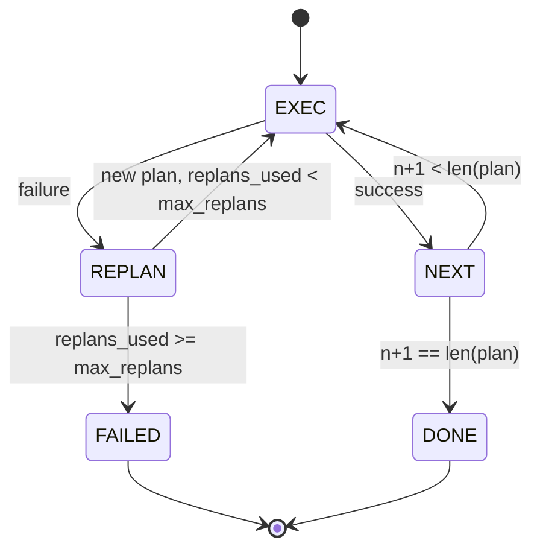

# 24 · 计划-执行控制流

> 无法从失败中恢复的计划只是脚本。能重新计划的脚本才是智能体（agent）。先构建重规划器。

**类型：** 构建
**语言：** Python
**前置：** 第 13 阶段第 1–7 课、第 14 阶段第 1 课
**时长：** 约 90 分钟

## 学习目标
- 将计划表示为带类型的有序步骤列表，使执行器（executor）能推理进度和结果。
- 按顺序执行步骤，并在失败时将控制权交还给规划器（planner）。
- 从当前游标位置重新规划，将先前的错误纳入上下文，使新计划获得信息。
- 每次修订时发出计划差异（plan diff），使下游追踪器或 UI 能展示计划变更原因。
- 强制执行两个预算：硬性步骤上限和硬性重规划上限。

## 计划与执行，而非思维链

思维链智能体（chain-of-thought agent）只是不断输出 token，让循环去猜测工具调用的结束位置。而计划-执行智能体（plan-and-execute agent）会先输出一个结构化的计划，然后确定性地执行每一步。计划是编排框架（harness）可以内省的数据。执行则是编排框架将这些数据通过调度器（dispatcher）来运行。

两个组件。一个规划器生成计划。一个执行器运行计划。有意思的部分在于执行器遇到失败时如何处理。三种选择：

```text
1. Abort         （返回失败，暴露错误）
2. Skip          （将步骤标记为失败，继续执行其余步骤）
3. Replan        （将错误交给规划器，从当前游标生成新计划）
```

Replan 就是那个把脚本变成智能体的选项。

## 步骤（Step）结构

```text
Step
  id              : int           （在同一个计划修订版本内单调递增）
  tool_name       : str
  args            : dict
  expected_outcome: str           （规划器声明的成功条件）
  result          : Any | None
  error           : str | None
```

`expected_outcome` 是规划器随步骤一起发出的简短描述。执行器不会强制校验它。它有两个用途：重规划器在修订计划时读取它；事件流发出它，以便追踪器能展示"该步骤本来应该做 X"。

## 规划器（planner）结构

```python
def planner(goal: str, history: list[Step], last_error: str | None) -> list[Step]:
    ...
```

一个纯函数。`goal` 是用户目标。`history` 是已经执行过的步骤（已填充结果和错误信息）。`last_error` 在首次调用时为 None，在后续每次调用时为最近一次失败的信息。规划器返回从当前游标开始的下一步计划。

规划器不知道执行器的存在。它不知道重试。不知道超时。它只产生计划。仅此而已。

## 执行器（executor）

执行器是一个小型状态机。每一步通过调度器执行。结果有三种：成功（success）、可重规划的失败（failure-replannable）、致命失败（failure-fatal）。可重规划的失败交还给规划器。致命失败（预算耗尽、重规划上限达到）返回 `FAILED` 的会话结果。



## 修订时的计划差异

当规划器在失败后返回新计划时，执行器会发出一个 `plan.diff` 事件，包含三个字段。

```text
removed: 旧计划中存在而新计划中不存在的步骤 id 列表
added  : 新计划中存在而旧计划中不存在的步骤 id 列表
revised: tool_name 或 args 发生变化的步骤 id 列表
```

追踪器或 UI 可以将此渲染为对已移除步骤的删除线和对新增步骤的高亮。关键不在于差异的格式。关键在于修订是一个可见的事件，而非悄无声息的重写。

## 两个预算，均为硬性上限

`max_steps` 限制整个会话中（含重规划）的总步骤执行次数。默认为 12。一个线性的五步计划如果重规划两次、每次增加三步，会执行十六次，超出预算。此时执行器将拒绝重规划并返回 FAILED。

`max_replans` 限制初始计划之后调用规划器的次数。默认为 5。这是更重要的限制。一个连续五次返回同样失败计划的规划器，如果只靠步骤预算来兜底，会无限循环。限制重规划次数能让失败更快发生、原因更清晰。

## 本课中的确定性规划器

本课不调用模型。课程提供了一个确定性规划器，它根据 `last_error` 来选择计划。

```text
last_error 为 None    -> 生成一个四步计划
last_error 匹配 X      -> 生成一个绕过 X 的三步计划
last_error 匹配 Y      -> 生成一个优雅放弃的两步计划
其他情况               -> 返回 [] （表示无法重规划）
```

这足以测试执行器在所有转换路径上的行为：成功、重规划一次、重规划两次、重规划耗尽，以及步骤预算耗尽。

## 结果（Result）结构

```text
SessionResult
  status      : "completed" | "failed"
  reason      : str     （"goal_met" | "step_budget" | "replan_budget" | "no_plan"）
  history     : list[Step]
  revisions   : list[PlanDiff]
  events      : list[Event]
```

第 20 课的编排循环可以直接读取此结构。第 23 课的调度器负责执行每一步。第 21 课的注册表（registry）校验每一步的参数。第 22 课的传输层（transport）会通过 JSON-RPC 将整个流程暴露给模型客户端。

## 如何阅读代码

`code/main.py` 定义了 `PlanExecuteAgent`、`Step`、`PlanDiff`、`SessionResult` 以及确定性规划器。执行器是一个单独的 `run(goal)` 方法，返回 `SessionResult`。计划差异通过比较步骤 id 和 `(tool_name, args)` 元组来计算。

`code/tests/test_agent.py` 覆盖了以下场景：线性成功、中途失败并重规划一次、重规划耗尽返回 `failed:replan_budget`、步骤预算耗尽，以及 plan-diff 事件格式。

## 扩展方向

当你将此与真实模型对接后，会需要两个扩展。第一，部分计划缓存：当计划的前三步成功、后三步失败时，你不希望重新执行前三步。执行器已经在维护历史记录；规划器只需读取它即可。第二，并行分支：当前执行器是严格串行的。如果规划器能发出独立分支（`gather_step` 而非 `next_step`），就可以通过调度器并发执行两个工具调用。

这两者都会带来实质性的复杂度。但两者在串行执行器稳定之后都更容易加入。这就是本课所做的工作。
