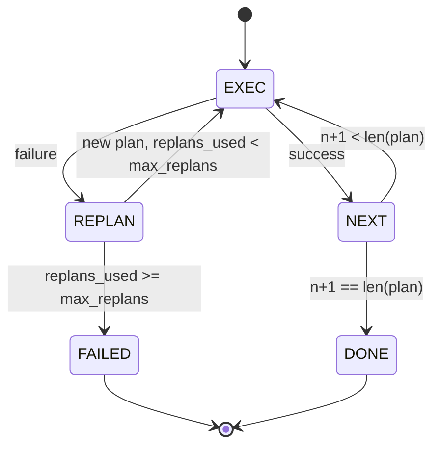

# Plan-Execute 控制流（Plan-Execute Control Flow）

> 译注：本文译自同目录 [`en.md`](./en.md)。术语遵循仓根 [TRANSLATION_GUIDE.md](../../../../TRANSLATION_GUIDE.md)。

> 一个无法在失败中存活的 plan 只是脚本。能 replan 的脚本才是 agent。先把 replanner 写出来。

**Type:** Build
**Languages:** Python
**Prerequisites:** Phase 13 lessons 01-07, Phase 14 lesson 01
**Time:** ~90 minutes

## 学习目标（Learning Objectives）
- 把 plan 表达成一个有类型的有序 step 列表，让 executor 能就进度和结果进行推理。
- 顺序执行各个 step，并把失败受控地交还给 planner。
- 从当前 cursor 位置开始 replan，并把上一次的错误带进 context，让下一版 plan 有据可依。
- 每次修订都发出一个 plan diff，让下游的 tracer 或 UI 能展示 plan 为什么变了。
- 强制两个预算：硬性的 step 上限和硬性的 replan 上限。

## Plan 加 execute，不是 chain-of-thought

一个 chain-of-thought（CoT）agent 吐 token，让循环去猜 tool 调用在哪里结束。一个 plan-and-execute agent 先吐出一个结构化的 plan，再确定性地执行每一个 step。Plan 是 harness 可以内省的数据。Execution 是 harness 把这份数据丢给 dispatcher 跑一遍。

两块东西。一个 planner 负责生成 plan。一个 executor 负责跑 plan。有意思的部分发生在 executor 撞上失败的时候。三种选择：

```text
1. Abort         (return failed, surface the error)
2. Skip          (mark step failed, continue with the rest)
3. Replan        (hand the error to the planner, get a new plan from the cursor)
```

Replan 才是把脚本升级成 agent 的那一步。

## Step 的形态（The Step shape）

```text
Step
  id              : int           (monotonic within a plan revision)
  tool_name       : str
  args            : dict
  expected_outcome: str           (planner's stated success condition)
  result          : Any | None
  error           : str | None
```

`expected_outcome` 是 planner 在 step 旁边写的一句短话。Executor 不会去强制校验它。它有两个用途：replanner 在修订 plan 时会读它；事件流会把它发出来，这样 tracer 就能展示「这个 step 本来是要做 X 的」。

## Planner 的形态（The planner shape）

```python
def planner(goal: str, history: list[Step], last_error: str | None) -> list[Step]:
    ...
```

一个纯函数。`goal` 是用户目标。`history` 是已经执行过的 step（结果和错误都填好了）。`last_error` 在第一次调用时是 None，之后每次都是最近一次的失败信息。Planner 返回从 cursor 开始的下一版 plan。

Planner 不知道 executor 长什么样。不知道 retry。不知道 timeout。它只产生一份 plan，仅此而已。

## Executor

Executor 是一台小型状态机。每个 step 都通过 dispatcher 跑。结局只有三种：success、failure-replannable、failure-fatal。可 replan 的失败会被交还给 planner。致命失败（超出预算、达到 replan 上限）会返回一个 `FAILED` 的 session 结果。



## 修订时的 Plan diff（Plan diffs on revision）

当 planner 在失败之后返回一份新 plan 时，executor 会发出一个 `plan.diff` 事件，带三个字段。

```text
removed: list of step ids that were in the old plan and are not in the new
added  : list of step ids in the new plan that were not in the old
revised: list of step ids whose tool_name or args changed
```

Tracer 或 UI 可以把它渲染成：被移除的 step 加删除线，新增的 step 高亮。重点不在 diff 的具体格式上，而在于：「修订」是一个看得见的事件，而不是一次悄悄的改写。

## 两个预算，都是硬约束（Two budgets, both hard）

`max_steps` 限制整个 session 里 step 的总执行次数，包括 replan 之后的。默认是 12。一个线性的 5-step plan，如果 replan 两次、每次新增 3 个 step，就会有 16 次执行，会超出预算。Executor 会拒绝那次 replan，并返回 FAILED。

`max_replans` 限制第一版 plan 之后 planner 被调用的次数。默认是 5。这是更重要的限制。一个连续 5 次返回同一份坏 plan 的 planner，否则会一直循环到撞上 step 预算才停。给 replan 设上限能让失败来得更快、原因更清楚。

## 本课的确定性 planner（The deterministic planner in this lesson）

本课不调模型。本课提供一个确定性 planner，它根据 `last_error` 选择 plan。

```text
last_error is None    -> emit a four-step plan
last_error matches X  -> emit a three-step plan that routes around X
last_error matches Y  -> emit a two-step plan that gives up gracefully
otherwise             -> return [] (signals nothing to replan)
```

这就足以测试 executor 在每条转移路径上的行为：成功、replan 一次、replan 两次、replan 用尽、step 预算用尽。

## 结果形态（Result shape）

```text
SessionResult
  status      : "completed" | "failed"
  reason      : str     ("goal_met" | "step_budget" | "replan_budget" | "no_plan")
  history     : list[Step]
  revisions   : list[PlanDiff]
  events      : list[Event]
```

第 20 课里的 harness 循环可以直接读它。第 23 课里的 dispatcher 负责执行每一个 step。第 21 课里的 registry 负责校验每个 step 的 args。第 22 课里的 transport 会把整个流程通过 JSON-RPC 暴露给一个模型客户端。

## 怎么读这份代码（How to read the code）

`code/main.py` 定义了 `PlanExecuteAgent`、`Step`、`PlanDiff`、`SessionResult` 和那个确定性 planner。Executor 就是一个单独的 `run(goal)` 方法，返回一个 `SessionResult`。Plan diff 通过比对 step id 和 `(tool_name, args)` 元组算出。

`code/tests/test_agent.py` 覆盖了：线性成功、plan 中途失败并 replan 一次、replan 用尽并返回 `failed:replan_budget`、step 预算用尽，以及 plan-diff 事件格式。

## 再往前走一步（Going further）

把这套东西接到真实模型时，你会想要两个扩展。第一是部分 plan 缓存：当一份 6-step plan 的前 3 步成功、之后失败时，你不想把前 3 步重跑一遍。Executor 本来就在维护 history；planner 只需要去读它。第二是并行分支：当前 executor 严格顺序执行。一个发出独立分支的 planner（用 `gather_step` 取代 `next_step`）可以让两个 tool 调用通过 dispatcher 并发跑。

两个扩展都会带来真正的复杂度。两个扩展都要等到线性 executor 钉死之后才更容易加。本课做的就是这件事。
