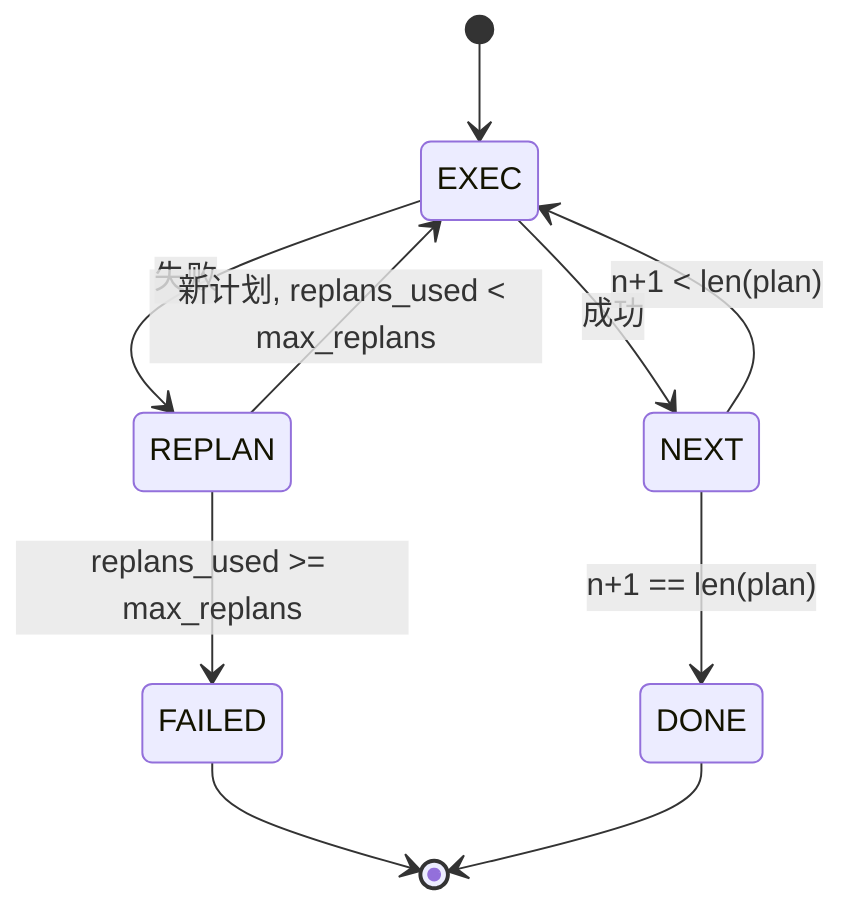

# 规划-执行控制流

> 无法在失败中存活的计划是脚本。能够重新计划的脚本是智能体。先构建重新规划器。

**类型：** 构建  
**语言：** Python  
**前置条件：** 阶段 13 第 01-07 课，阶段 14 第 01 课  
**时长：** ~90 分钟

## 学习目标

- 将计划表示为带类型的步骤有序列表，使执行器能推理进度和结果。
- 顺序执行步骤，并在失败时受控地将控制权交还给规划器。
- 从当前游标处重新规划，将先前错误放入上下文中，使后续计划更具信息量。
- 每次修订时生成计划差异（diff），供下游追踪器或 UI 展示计划变更原因。
- 强制执行两个预算：硬性步骤上限和硬性重新规划上限。

## 规划与执行，而非思维链

思维链智能体生成令牌，让循环猜测工具调用在哪里结束。而规划-执行智能体先生成结构化计划，再确定性地执行每个步骤。计划是可被框架内省的数据。执行则是框架通过调度器运行这些数据。

两个部分。一个生成计划的规划器。一个执行计划的执行器。有趣的工作在于执行器遇到失败时会发生什么。三种选项：

```text
1. 中止    （返回失败，展示错误）
2. 跳过    （标记步骤失败，继续执行其余步骤）
3. 重新规划（将错误交给规划器，从游标处获取新计划）
```

重新规划是将脚本转变为智能体的关键。

## 步骤结构

```text
Step
  id              : int           （计划修订内单调递增）
  tool_name       : str
  args            : dict
  expected_outcome: str           （规划器声明的成功条件）
  result          : Any | None
  error           : str | None
```

`expected_outcome` 是规划器在生成步骤时附带的一句简短说明。执行器不会强制执行它。它有两个用途：重新规划器在修订计划时读取它；事件流发出它以便追踪器能显示"此步骤本应执行 X"。

## 规划器结构

```python
def planner(goal: str, history: list[Step], last_error: str | None) -> list[Step]:
    ...
```

一个纯函数。`goal` 是用户目标。`history` 是已执行的步骤（已填入结果和错误）。`last_error` 在首次调用时为 None，在后续每次调用时为最近的失败消息。规划器从游标处返回下一个计划。

规划器不关心执行器。不关心重试。不关心超时。它只生成计划。仅此而已。

## 执行器

执行器是一个小型状态机。每个步骤通过调度器运行。结果有三种：成功、可重新规划的失败、致命失败。可重新规划的失败将控制权交还给规划器。致命失败（预算超限、重新规划次数达到上限）返回 `FAILED` 会话结果。


```mermaid
stateDiagram-v2
    [*] --> EXEC
    EXEC --> NEXT: 成功
    NEXT --> EXEC: n+1 < len(plan)
    NEXT --> DONE: n+1 == len(plan)
    EXEC --> REPLAN: 失败
    REPLAN --> EXEC: 新计划, replans_used < max_replans
    REPLAN --> FAILED: replans_used >= max_replans
    FAILED --> [*]
    DONE --> [*]
```

## 修订时的计划差异

当规划器在失败后返回新计划时，执行器发出一个包含三个字段的 `plan.diff` 事件。

```text
removed: 旧计划中存在但新计划中没有的步骤 id 列表
added  : 新计划中存在但旧计划中没有的步骤 id 列表
revised: tool_name 或 args 发生变化的步骤 id 列表
```

追踪器或 UI 可以将移除的步骤显示为删除线，新增的步骤高亮显示。重点不在于差异格式，而在于修订是一个可见的事件，而非静默的重写。

## 两个预算，均为硬性上限

`max_steps` 限制整个会话中步骤执行的总次数，包括重新规划产生的步骤。默认值为十二。一个五步线性计划重新规划两次且每次增加三步后，会执行十六次，超出预算。执行器将拒绝重新规划并返回 FAILED。

`max_replans` 限制首次计划后调用规划器的次数。默认值为五。这是更重要的限制。如果规划器连续五次返回相同的错误计划，否则会一直循环直到步骤预算将其终止。限制重新规划次数能加速失败并使原因更清晰。

## 本节课中的确定性规划器

本节课不调用模型。课程附带一个确定性规划器，根据 `last_error` 选择计划。

```text
last_error is None    -> 生成一个四步计划
last_error 匹配 X     -> 生成一个绕过 X 的三步计划
last_error 匹配 Y     -> 生成一个优雅放弃的两步计划
otherwise             -> 返回 []（表示无需重新规划）
```

这足以测试执行器在所有转换路径上的行为：成功、重新规划一次、重新规划两次、重新规划耗尽、步骤预算耗尽。

## 结果结构

```text
SessionResult
  status      : "completed" | "failed"
  reason      : str     ("goal_met" | "step_budget" | "replan_budget" | "no_plan")
  history     : list[Step]
  revisions   : list[PlanDiff]
  events      : list[Event]
```

第二十课的框架主循环可以直接读取此结果。第二十三课的调度器执行每个步骤。第二十一课的注册表验证每个步骤的参数。第二十二课的传输层可将此整个流程通过 JSON-RPC 暴露给模型客户端。

## 如何阅读代码

`code/main.py` 定义了 `PlanExecuteAgent`、`Step`、`PlanDiff`、`SessionResult` 和确定性规划器。执行器是一个返回 `SessionResult` 的 `run(goal)` 方法。计划差异通过比较步骤 id 和 `(tool_name, args)` 元组计算得出。

`code/tests/test_agent.py` 涵盖线性成功、一次重新规划的中途失败、返回 `failed:replan_budget` 的重新规划耗尽、步骤预算耗尽以及计划差异事件格式。

## 更进一步

两个扩展在你将此系统接入真实模型后会很需要。第一，部分计划缓存：当一个计划的前三步成功而第四步失败时，你不希望重新运行前三步。执行器已经保留了历史记录；规划器只需读取它即可。第二，并行分支：当前执行器严格按顺序执行。一个能够发出独立分支（`gather_step` 而非 `next_step`）的规划器可以通过调度器并发运行两个工具调用。

两者都会增加相当复杂度。但一旦线性执行器稳定下来，两者都更容易添加。这正是本节课的目标。
