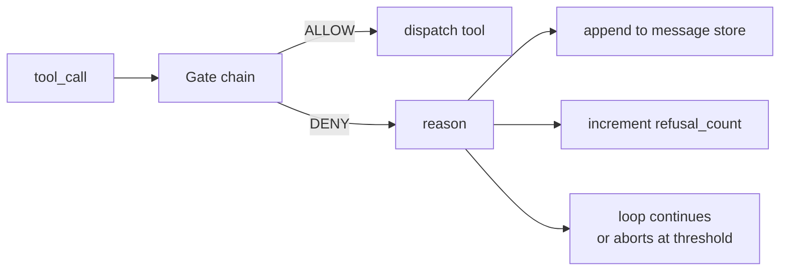
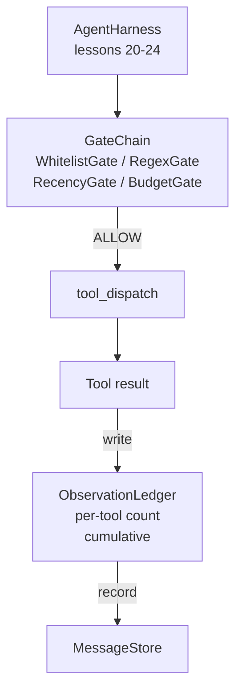

# Capstone Lesson 25: Verification Gates and the Observation Budget

> verification layer のない agent harness は、根拠のない願いです。この lesson では deterministic な gate chain を作り、tool call を実行してよいか、agent が output のどれだけを見てよいか、agent が読みすぎたため loop を止めるべきかを判断します。chain は小さく名前のついた gate 群と、model に見せた全 token を追跡する observation ledger で構成されます。

**種別:** 構築
**言語:** Python (stdlib)
**前提条件:** Phase 19 · 20-24 (Track A1: agent loop, tool registry, message store, prompt builder, model router), Phase 14 · 33 (instructions as constraints), Phase 14 · 36 (scope contracts), Phase 14 · 38 (verification gates)
**所要時間:** 約90分

## 学習目標

- deterministic な `evaluate(call)` method を持つ `VerificationGate` protocol を作る。
- budget、recency、whitelist、regex gate を short-circuit semantics の chain に compose する。
- tool と turn を key に、すべての observation を `ObservationLedger` で追跡する。
- cumulative observation budget を超える tool call を拒否する。
- downstream observability が取り込める structured `GateDecision` record を surface する。

## 問題

agent harness が model に自由な tool call を許すと、実利用の最初の 1 時間で 3 種類の bug が出ます。

1 つ目は unbounded observation です。200K 行の repo に対する grep が 50 万 token の output を次 turn に流し込みます。model は 1 KB に 1 件の match を見るだけで、残りの context は無駄になります。token bill は大きくなり、agent は task に対して良くなるどころか悪くなります。

2 つ目は stale recency です。long-running task が 50 個の tool call を蓄積します。model は turn 3 の最初の read_file を live state であるかのように読み返します。turn 47 の edit は、prompt builder が最古の observation を先に serialize したせいで出てきません。

3 つ目は privilege creep です。research task が `web_search` を呼ぶところから始まり、model が tool name を発明し、harness が permissive default だったため、いつの間にか `shell` を実行しています。trace を誰かが読む頃には /tmp に不要ファイルがあり、private API に curl が走っています。

verification gate は no と言う harness component です。model ではありません。judge でもありません。`(call, history, ledger)` の deterministic function で、reason つきの ALLOW または DENY を返します。reason は log されます。model に伝えられます。loop は続行するか abort します。

## コンセプト



gate は `evaluate(call, ctx) -> GateDecision` method を持つものなら何でも構いません。chain は ordered list です。最初の deny で short-circuit します。順序は重要です。安い structural gate を、高価な token-counting gate より前に走らせます。

この lesson は 4 つの gate を同梱します。

- `WhitelistGate`。allowed tool name は明示的な set です。範囲外は deny します。最も安い gate なので最初に走ります。
- `RegexGate`。tool arguments を regex に match します。`rm -rf` を含む shell call や internal IP への HTTP call を拒否するのに役立ちます。call payload に対して pure です。
- `RecencyGate`。model が見る observation を直近 N turn に限定します。古い observation は mask されます。この gate は、すでに aged out した observation window をさらに延ばす tool call を拒否します。
- `BudgetGate`。session 全体で model が読んだ cumulative tokens に ceiling を置きます。ledger が ceiling 到達を示すと、以後すべての tool call を deny します。

observation ledger は bookkeeping です。成功した tool call ごとに 1 row、tool name、turn、emitted tokens、cumulative を書きます。ledger は 2 つの質問に答えます。model は合計でどれだけ見たか。tool X についてどれだけ見たか。budget gate は前者を読みます。exercise として書く per-tool budget gate は後者を読みます。

## アーキテクチャ



harness は chain に問い合わせます。chain はうなずくか拒否します。うなずけば tool が走り、ledger が進み、result が message store に append されます。拒否すれば、model には refusal が system message として渡され、loop は retry するか abort するかを決めます。

## 作るもの

implementation は単一の `main.py` と tests です。

1. `Observation` と `ToolCall` dataclass が wire shape を定義する。
2. `ObservationLedger` が `(turn, tool, tokens)` row を記録し、`cumulative()` と `per_tool(name)` に答える。
3. `GateDecision` が `(allow, reason, gate_name)` を運ぶ。
4. `VerificationGate` が protocol。各 gate が `evaluate(call, ctx)` を実装する。
5. `GateChain` が ordered list を wrap する。各 gate を呼び、最初の deny を返すか、すべて pass すれば allow を返す。
6. demo が小さな synthetic agent loop を走らせる。3 turn。3 turn 目で budget gate が発火し、loop は non-zero refusal count つきの clean refusal を報告する。

token counter は意図的に単純な `len(text) // 4` heuristic です。この lesson の狙いは gate plumbing であり tokenizer ではありません。production では real tokenizer を差し込んでください。

## なぜ chain order が重要なのか

deny は allow より安いです。`WhitelistGate` は O(1) hash lookup です。`RegexGate` は O(pattern * argv) です。`RecencyGate` は message store の小さな slice を読みます。`BudgetGate` は ledger 全体を読みます。deny された call が高価な処理に進む前に short-circuit できるよう、ascending cost で並べます。

blast radius の観点でも並べます。Whitelist は最も強い主張です。この tool は contract にない。regex gate が次です。この argument は contract にない。Recency はその後です。harness はまだ関心がありますが、call は構造上 legal です。Budget は最後です。定義上、他のすべてを pass したときだけ発火するからです。

## Track A の他 lesson との合成

前の lesson は loop、tool registry、message store、prompt builder、model router を作りました。この lesson は model と tool の間の layer を追加します。Lesson 26 は gate chain が ALLOW と言ったあと、dispatcher が tool call を渡す sandbox を出荷します。Lesson 27 は refusal count を quality signal として記録する eval harness を出荷します。Lesson 28 は gate decision を OpenTelemetry span に wire します。Lesson 29 はそれらをまとめて working coding agent にします。

## 実行方法

```bash
cd phases/19-capstone-projects/25-verification-gates-observation-budget
python3 code/main.py
python3 -m pytest code/tests/ -v
```

demo は各 gate decision を含む turn-by-turn trace を print し、exit zero します。tests は ledger、各 gate 単体、chain short-circuit、synthetic loop の end-to-end を cover します。
