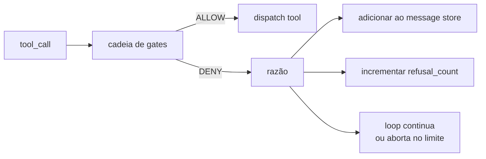
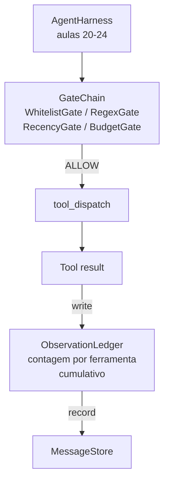

# Capstone Aula 25: Verification Gates e o Observation Budget

> Um agente harness sem uma camada de verificação é um desejo de casaco de trincheira. Esta aula constrói a cadeia de gates determinística que decide se uma chamada de ferramenta pode disparar, quanto da sua saída o agente pode ver, e quando o loop tem que parar porque o agente leu demais. A cadeia é uma função de gates pequenos e nomeados mais um ledger de observação que rastreia cada token que o model foi mostrado.

**Tipo:** Build
**Linguagens:** Python (stdlib)
**Pré-requisitos:** Fase 19 · 20-24 (Trilha A1: agente loop, ferramenta registry, message store, prompt builder, model router), Fase 14 · 33 (instruções como restrições), Fase 14 · 36 (contratos de escopo), Fase 14 · 38 (verification gates)
**Tempo:** ~90 minutos

## Objetivos de Aprendizado

- Construir um protocolo `VerificationGate` com um método determinístico `evaluate(call)`.
- Compor gates de orçamento, recência, whitelist e regex em uma cadeia com semântica de curto-circuito.
- Rastrear cada observação através de um `ObservationLedger` indexado por ferramenta e turn.
- Recusar uma chamada de ferramenta quando o orçamento cumulativo de observação seria excedido.
- Expor um registro estruturado `GateDecision` que observabilidade downstream pode ingerir.

## O Problema

Quando um agente harness deixa o model chamar ferramentas livremente, três classes de bug aparecem na primeira hora de uso real.

A primeira é observação ilimitada. Um grep em um repo de 200 mil linhas despeja meio milhão de tokens de saída no próximo turn. O model vê um match por kilobyte e o resto do contexto é desperdiçado. A conta de tokens é grande e o agente está agora pior, não melhor, na tarefa.

A segunda é recência obsoleta. Uma tarefa longa acumula cinquenta chamadas de ferramenta. O model relê o primeiro read_file do turn três como se fosse estado atual. Edições feitas no turn quarenta e sete nunca aparecem porque o prompt builder serializou as observações mais antigas primeiro.

A terceira é privilege creep. Uma tarefa de pesquisa começa chamando `web_search`, depois de alguma forma termina rodando `shell` porque o model inventou um nome de ferramenta e o harness defaultou para permissivo. Quando alguém lê o trace, um arquivo junk está em /tmp e um curl rodou contra uma API privada.

Um verification gate é o componente do harness que diz não. Não é um model. Não é um juiz. É uma função determinística de `(call, history, ledger)` que retorna ALLOW ou DENY com uma razão. A razão é logada. O model é informado. O loop continua ou aborta.

## O Conceito



Um gate é qualquer coisa com um método `evaluate(call, ctx) -> GateDecision`. A cadeia é uma lista ordenada. A avaliação curto-circuita no primeiro deny. A ordem importa: gates baratos estruturais rodam antes de gates caros de contagem de tokens.

Esta aula fornece quatro gates:

- `WhitelistGate`. Nomes de ferramentas permitidos são um conjunto explícito. Qualquer coisa fora é negado. Este é o gate mais barato e roda primeiro.
- `RegexGate`. Argumentos de ferramenta são casados contra uma regex. Útil para recusar chamadas de shell com `rm -rf`, ou chamadas HTTP para IPs internos. Puro no payload da chamada.
- `RecencyGate`. O model só vê observações dos últimos N turns. Observações mais antigas são mascaradas. O gate recusa uma chamada de ferramenta cujo resultado estenderia uma janela de observação que já envelheceu.
- `BudgetGate`. A soma cumulativa de tokens que o model leu na sessão tem um teto. Quando o ledger diz que o teto foi atingido, cada chamada de ferramenta adicional é negada.

O ledger de observação é o bookkeeping. Cada chamada de ferramenta bem-sucedida escreve uma linha: nome da ferramenta, turn, tokens emitidos, cumulativo. O ledger responde duas perguntas: quanto o model viu no total, e quanto viu da ferramenta X. O gate de orçamento lê a primeira. Um gate de orçamento por ferramenta, que você vai escrever como exercício, lê a segunda.

## Arquitetura



O harness pergunta à cadeia. A cadeia assente ou recusa. Se assente, a ferramenta roda, o ledger incrementa, e o resultado é adicionado ao message store. Se recusa, o model recebe a recusa como mensagem de sistema e o loop decide se tenta novamente ou aborta.

## O que você vai construir

A implementação é um único `main.py` mais testes.

1. Dataclasses `Observation` e `ToolCall` definem as formas de rede.
2. `ObservationLedger` registra linhas `(turn, tool, tokens)` e responde `cumulative()` e `per_tool(name)`.
3. `GateDecision` carrega `(allow, reason, gate_name)`.
4. `VerificationGate` é o protocolo. Cada gate implementa `evaluate(call, ctx)`.
5. `GateChain` envolve uma lista ordenada. Chama cada gate, retorna o primeiro deny, ou retorna allow se todos passaram.
6. A demo roda um mini agente loop sintético. Três turns. O terceiro turn dispara o gate de orçamento e o loop reporta uma recusa limpa com contagem de recusa não-zero.

O contador de tokens é intencionalmente uma heurística estúpida de `len(text) // 4`. O ponto desta aula é a tubulação de gates, não o tokenizer. Use um tokenizer real em produção.

## Por que a ordem da cadeia importa

Um deny é mais barato que um allow. `WhitelistGate` roda em busca hash O(1). `RegexGate` roda em O(pattern * argv). `RecencyGate` lê um pequeno fatia do message store. `BudgetGate` lê o ledger inteiro. Você ordena por custo crescente para que uma chamada negada curto-circuite antes de fazer o trabalho caro.

Você também ordena por raio de explosão. Whitelist é a afirmação mais forte: esta ferramenta não está no contrato. O gate regex é o próximo: este argumento não está no contrato. Recência vem depois: o harness ainda se importa mas a chamada é estruturalmente legal. Budget é último porque, por definição, só dispara quando tudo mais passou.

## Como isso compõe com o resto da Trilha A

As aulas anteriores te deram o loop, o ferramenta registry, o message store, o prompt builder e o model router. Esta aula adiciona a camada entre o model e as ferramentas. A aula 26 fornece o sandbox que o dispatcher entrega a chamada de ferramenta quando a cadeia de gates diz ALLOW. A aula 27 fornece o eval harness que registra contagens de recusa como sinal de qualidade. A aula 28 conecta as decisões de gate em spans de OpenTelemetry. A aula 29 costura tudo em um coding agente funcional.

## Rodando

```bash
cd phases/19-capstone-projects/25-verification-gates-observation-budget
python3 code/main.py
python3 -m pytest code/tests/ -v
```

A demo imprime um trace por turn incluindo cada decisão de gate e sai com zero. Os testes cobrem o ledger, cada gate isoladamente, o curto-circuito da cadeia, e o loop sintético ponta a ponta.
