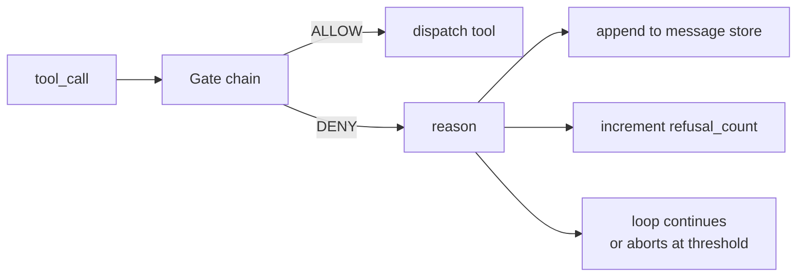
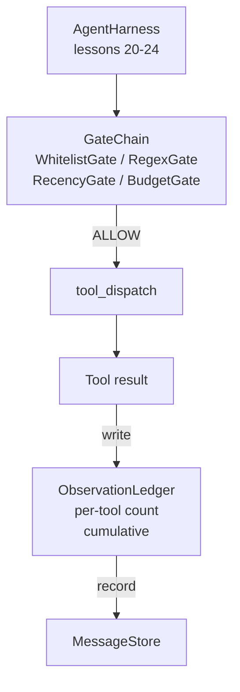

# Bitirme Noktası Ders 25: Doğrulama Kapıları ve Gözlem Bütçesi

> Doğrulama katmanı olmayan bir agent koşum takımı, trençkottaki bir dilektir. Bu ders, bir araç çağrısının tetiklenmesine izin verilip verilmeyeceğine, agent çıktısının ne kadarını görmesine izin verildiğine ve agent çok fazla okuduğu için döngünün ne zaman durması gerektiğine karar veren deterministik kapı zincirini oluşturur. Zincir, küçük, adlandırılmış kapıların ve modelin gösterildiği her token izleyen bir gözlem defterinin bir fonksiyonudur.

**Tür:** Yapım
**Diller:** Python (stdlib)
**Önkoşullar:** Aşama 19 · 20-24 (A1 Yolu: agent loop, araç kaydı, mesaj deposu, prompt oluşturucu, model yönlendirici), Aşama 14 · 33 (kısıtlamalar olarak talimatlar), Aşama 14 · 36 (kapsam sözleşmeleri), Aşama 14 · 38 (doğrulama kapıları)
**Süre:** ~90 dakika

## Öğrenme Hedefleri

- Deterministik bir `evaluate(call)` yöntemiyle bir `VerificationGate` protokolü oluşturun.
- Bütçe, yenilik, beyaz liste ve normal ifade kapılarını kısa devre semantiğine sahip bir zincir halinde oluşturun.
- Her gözlemi alet ve dönüşle anahtarlanan bir `ObservationLedger` aracılığıyla takip edin.
- Kümülatif gözlem bütçesinin aşılacağı durumlarda araç çağrısını reddedin.
- Aşağı yöndeki observability'nin alabileceği yapılandırılmış bir `GateDecision` kaydını yüzeye çıkarın.

## Sorun

Bir agent kablo demeti modelin araçları serbestçe çağırmasına izin verdiğinde, gerçek kullanımın ilk saati içinde üç hata sınıfı ortaya çıkar.

Birincisi sınırsız gözlemdir. 200K satırlık bir depodaki grep, yarım milyon tokens'lik çıktıyı bir sonraki tura aktarır. Model kilobayt başına bir eşleşme görüyor ve bağlamın geri kalanı boşa gidiyor. token faturası büyük ve agent artık görevde daha iyi değil, daha kötü.

İkincisi ise eskimiş güncelliktir. Uzun süren bir görevde elli araç çağrısı toplanır. Model, üçüncü turdaki ilk read_file dosyasını sanki canlı durummuş gibi yeniden okur. Kırk yedinci virajda yapılan düzenlemeler hiçbir zaman görünmüyor çünkü prompt oluşturucu ilk önce ilk gözlemleri serileştirdi.

Üçüncüsü ayrıcalık kaymasıdır. Bir araştırma görevi `web_search` çağrılmasıyla başlar, sonra bir şekilde `shell` çalıştırılırken sona erer çünkü model bir araç adı icat etmiştir ve donanım varsayılan olarak izin verici olarak ayarlanmıştır. Herkes izlemeyi okuduğunda, /tmp'de gereksiz bir dosya duruyor ve özel bir API'ye karşı bir kıvrılma çalışıyor.

Doğrulama kapısı, hayır diyen emniyet kemeri bileşenidir. Bu bir model değil. Bu bir yargıç değil. Bir sebeple İZİN VER veya REDDET döndüren, `(call, history, ledger)` 'nin deterministik bir fonksiyonudur. Nedeni günlüğe kaydedildi. Model anlatılıyor. Döngü devam eder veya durdurulur.

## Konsept



Kapı, `evaluate(call, ctx) -> GateDecision` yöntemine sahip herhangi bir şeydir. Zincir sıralı bir listedir. İlk reddetmede değerlendirme kısa devreleri. Sıra önemlidir: Ucuz yapısal kapılar, pahalı token-sayma kapılarından önce çalışır.

Bu derste dört kapı bulunur:

- `WhitelistGate`. İzin verilen araç adları açık bir kümedir. Dışarıdaki her şey reddedilir. Bu en ucuz kapıdır ve ilk önce çalışır.
- `RegexGate`. Araç argümanları bir regex ile eşleştirilir. İçinde `rm -rf` bulunan kabuk çağrılarını veya dahili IP'lere yapılan HTTP çağrılarını reddetmek için kullanışlıdır. Çağrı yükünde saf.
- `RecencyGate`. Model yalnızca son N dönüşteki gözlemleri görüyor. Daha eski gözlemler maskelenmiştir. Geçit, sonucu zaten eskimiş bir gözlem penceresini genişletecek bir araç çağrısını reddediyor.
- `BudgetGate`. Modelin oturum boyunca okuduğu kümülatif token değerlerinin bir tavanı vardır. Defter tavana ulaşıldığını söylediğinde, sonraki tüm araç çağrıları reddedilir.

Gözlem defteri muhasebedir. Her başarılı takım çağrısı bir satır yazar: takım adı, dönüş, tokens yayılır, kümülatif. Defter iki soruyu yanıtlıyor: Model toplamda ne kadar gördü ve X aracını ne kadar gördü. Bütçe kapısı ilkini okuyor. Alıştırma olarak yazacağınız araç başına bütçe kapısı ikincisini okur.

## Mimarlık



Koşum takımı zincire sorar. Zincir ya başını sallar ya da reddeder. Başını sallarsa araç çalışır, defter tıklanır ve sonuç mesaj deposuna eklenir. Reddederse, modele bir sistem mesajı olarak ret kararı verilir ve döngü yeniden denemeye veya iptal etmeye karar verir.

## Ne inşa edeceksiniz

Uygulama tek bir `main.py` artı testten oluşur.

1. `Observation` ve `ToolCall` veri sınıfları tel şekillerini tanımlar.
2. `ObservationLedger` , `(turn, tool, tokens)` satırı kaydeder ve `cumulative()` ve `per_tool(name)` yanıtlarını verir.
3. `GateDecision` , `(allow, reason, gate_name)`'yi taşır.
4. `VerificationGate` protokoldür. Her kapı `evaluate(call, ctx)`'yi uygular.
5. `GateChain` sıralı bir listeyi sarar. Her kapıyı çağırır, ilk reddi döndürür veya her kapı geçerse izin verir.
6. Demo küçük bir sentetik agent loop çalıştırıyor. Üç tur. Üçüncü dönüşte bütçe kapısı devreye girer ve döngü, sıfır olmayan bir ret sayısıyla temiz bir ret bildirir.

token sayacı kasıtlı olarak aptalca bir `len(text) // 4` buluşsal yöntemidir. Bu dersin amacı kapı tesisatıdır, tokenizer değil. Üretime gerçek bir tokenizer ekleyin.

## Zincir sırası neden önemlidir?

Reddetmek, izin vermekten daha ucuzdur. `WhitelistGate` , O(1) karma aramasında çalışır. `RegexGate` , O(pattern * argv) içinde çalışır. `RecencyGate` mesaj deposunun küçük bir bölümünü okur. `BudgetGate` defterin tamamını okur. Bunları maliyeti artırarak sipariş edersiniz, böylece reddedilen çağrı pahalı işi yapmadan önce kısa devre yapar.

Ayrıca bunları patlama yarıçapına göre de sıralayabilirsiniz. Beyaz liste en güçlü iddiadır: Bu araç sözleşmede yer almamaktadır. Sırada normal ifade kapısı var: bu argüman sözleşmede yok. Yenilik sonra gelir: emniyet kemeri hala umurundadır ancak çağrı yapısal olarak yasaldır. Bütçe sonuncudur çünkü tanımı gereği yalnızca diğer her şey geçtiğinde devreye girer.

## Bunun A Parçasının geri kalanıyla nasıl birleştiği

Önceki derslerde size döngü, araç kaydı, mesaj deposu, prompt oluşturucu ve model yönlendirici verildi. Bu ders, model ile araçlar arasına katman ekler. Ders 26, kapı zinciri İZİN VERDİ dediğinde sevk görevlisinin araç çağrısını ilettiği sanal alanı gönderir. Ders 27, ret sayılarını bir kalite sinyali olarak kaydeden değerlendirme donanımını sunar. Ders 28, kapı kararlarını OpenTelemetry aralıklarına bağlar. Ders 29, partiyi çalışan bir kodlama agent halinde birleştiriyor.

## Çalıştırıyorum

```bash
cd phases/19-capstone-projects/25-verification-gates-observation-budget
python3 code/main.py
python3 -m pytest code/tests/ -v
```

Demo, her kapı kararını içeren adım adım bir izleme yazdırır ve sıfırdan çıkar. Testler defteri, her bir kapıyı ayrı ayrı, zincir kısa devresini ve uçtan uca sentetik döngüyü kapsıyor.
