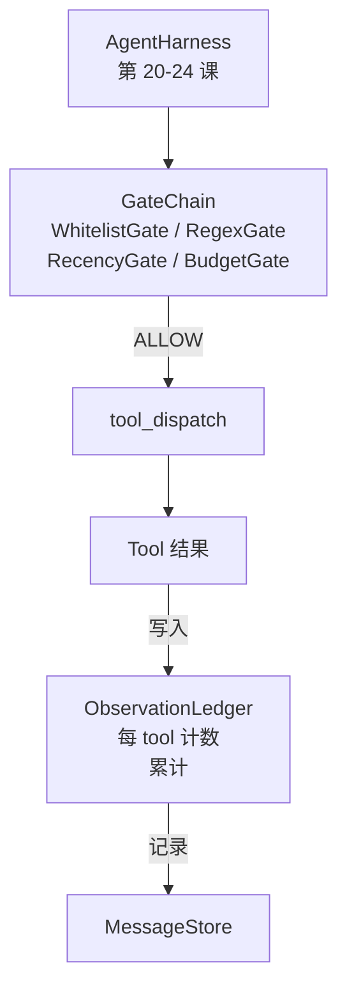

# Capstone 第 25 课：验证门与观测预算（Verification Gates and the Observation Budget）

> 译注：本文译自同目录 [`en.md`](./en.md)。术语遵循仓根 [TRANSLATION_GUIDE.md](../../../../TRANSLATION_GUIDE.md)。

> 一个没有验证层的 agent harness，不过是穿着风衣的许愿罢了。本课构建一条确定性的门链（gate chain），用来判定一次 tool call 是否被允许触发、agent 被允许看到多少输出、以及当 agent 已经读太多时何时必须停止 loop。这条链是若干小而具名的 gate 的函数组合，再加上一本观测账本（observation ledger），追踪模型被展示过的每一个 token。

**Type:** Build
**Languages:** Python (stdlib)
**Prerequisites:** Phase 19 · 20-24（Track A1：agent loop、tool registry、message store、prompt builder、model router）, Phase 14 · 33（instructions as constraints）, Phase 14 · 36（scope contracts）, Phase 14 · 38（verification gates）
**Time:** ~90 minutes

## 学习目标（Learning Objectives）

- 构建一个 `VerificationGate` 协议，提供确定性的 `evaluate(call)` 方法。
- 把 budget、recency、whitelist、regex 四种 gate 组合成一条具有短路语义的链。
- 通过 `ObservationLedger` 按 tool 与 turn 为键，追踪每一次观测。
- 当累计观测预算将被超出时，拒绝该次 tool call。
- 输出结构化的 `GateDecision` 记录，供下游可观测性（observability）系统采集。

## 问题（The Problem）

当 agent harness 允许模型自由调用工具时，真实使用的第一个小时内就会冒出三类 bug。

第一类是无界观测。一次跨 20 万行 repo 的 grep，会把五十万 token 的输出灌进下一个 turn。模型每千字节看到一条匹配，剩下的 context 全都浪费了。token 账单很大，agent 在该任务上反而变得更差，而不是更好。

第二类是过期 recency。一个长任务累积了五十次 tool call。模型把第三个 turn 里的 read_file 当作当前状态来重读。第四十七个 turn 做的修改始终不出现，因为 prompt builder 是把最早的观测先序列化的。

第三类是权限蔓延。一个研究任务一开始调用 `web_search`，结果不知怎么就跑去执行 `shell` 了——因为模型瞎编了一个 tool 名字，而 harness 默认是放行的。等有人看到 trace 时，/tmp 里已经躺着一个垃圾文件，curl 也已经打到了某个内部 API。

verification gate 就是 harness 里那个会说「不」的组件。它不是模型，也不是裁判。它是一个关于 `(call, history, ledger)` 的确定性函数，返回 ALLOW 或 DENY，并附带一个理由。理由会被记录下来，告诉模型，loop 决定继续还是中止。

## 概念（The Concept）


一个 gate 就是任何带有 `evaluate(call, ctx) -> GateDecision` 方法的对象。链是一个有序列表。求值在第一个 deny 处短路。顺序很重要：便宜的结构性 gate 先跑，昂贵的 token 计数 gate 后跑。

本课交付四种 gate：

- `WhitelistGate`。允许的 tool 名字是一个显式集合，集合外的一律拒绝。这是最便宜的 gate，第一个跑。
- `RegexGate`。tool 参数对正则进行匹配。可用于拒绝带 `rm -rf` 的 shell 调用，或拒绝打到内网 IP 的 HTTP 调用。它对 call payload 是纯函数。
- `RecencyGate`。模型只看到最近 N 个 turn 的观测，更早的被遮蔽。如果一次 tool call 的结果会扩展到一个已经过期的观测窗口，gate 就拒绝它。
- `BudgetGate`。模型在整个 session 中累计读到的 token 有一个上限。当 ledger 显示已达上限时，后续每一次 tool call 都被拒绝。

观测账本是这套机制的记账系统。每一次成功的 tool call 写入一行：tool 名、turn、产出 token 数、累计值。账本回答两个问题：模型一共看了多少，以及看了多少 X 工具的输出。budget gate 读第一个值。按 tool 维度的 budget gate（你将在练习中实现）读第二个值。

## 架构（Architecture）



harness 询问链。链要么点头，要么拒绝。点头的话，工具执行、账本更新、结果追加到 message store。拒绝的话，模型会以系统消息的形式收到这个 refusal，由 loop 决定重试还是中止。

## 你将构建什么（What you will build）

实现就是一个 `main.py` 加上测试。

1. `Observation` 与 `ToolCall` 两个 dataclass 定义线上数据形态。
2. `ObservationLedger` 记录 `(turn, tool, tokens)` 行，并回答 `cumulative()` 与 `per_tool(name)`。
3. `GateDecision` 携带 `(allow, reason, gate_name)`。
4. `VerificationGate` 是协议。每个 gate 实现 `evaluate(call, ctx)`。
5. `GateChain` 包装一个有序列表。它逐个调用 gate，返回第一个 deny，或在所有 gate 都通过时返回 allow。
6. demo 跑一个微型的合成 agent loop。三个 turn。第三个 turn 触发 budget gate，loop 报告一次干净的 refusal，并带上非零的 refusal count。

token 计数器特意写成了一个蠢办法：`len(text) // 4`。本课的重点是 gate 的管线，不是 tokenizer。生产环境换成真正的 tokenizer 即可。

## 为什么链的顺序重要（Why the chain order matters）

deny 比 allow 便宜。`WhitelistGate` 是 O(1) 哈希查找。`RegexGate` 是 O(pattern * argv)。`RecencyGate` 读 message store 的一小段切片。`BudgetGate` 读整本账本。按成本递增排序，被拒的 call 就能在做昂贵活之前短路掉。

你同时也要按「影响半径」排序。Whitelist 是最强的主张：这个工具不在合同里。Regex gate 紧随其后：这个参数不在合同里。Recency 再之后：harness 仍然在意，但调用在结构上是合法的。Budget 排最后，因为按定义它只在前面全过的时候才触发。

## 它如何与 Track A 的其他部分组合（How this composes with the rest of Track A）

之前几课给了你 loop、tool registry、message store、prompt builder 与 model router。本课加上模型与工具之间的那一层。第 26 课交付 sandbox，gate chain 说 ALLOW 后由 dispatcher 把 tool call 交给它。第 27 课交付 eval harness，把 refusal count 作为一个质量信号记录下来。第 28 课把 gate 决策接到 OpenTelemetry 的 span 上。第 29 课把这一切缝合成一个能干活的 coding agent。

## 运行它（Running it）

```bash
cd phases/19-capstone-projects/25-verification-gates-observation-budget
python3 code/main.py
python3 -m pytest code/tests/ -v
```

demo 会按 turn 打印 trace，包含每一次 gate 决策，并以 0 退出。测试覆盖账本、每个 gate 的独立行为、链的短路，以及合成 loop 的端到端。
