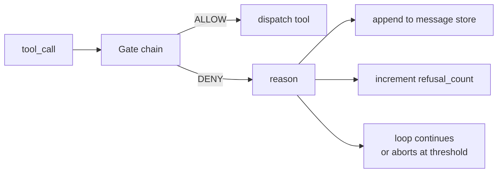
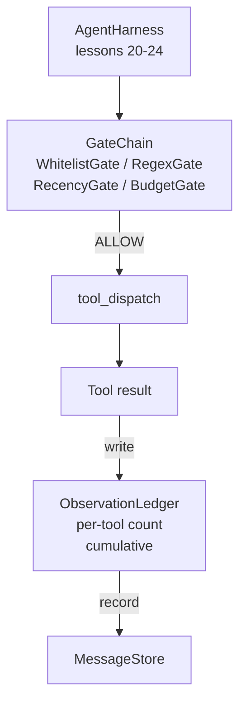

# 25 · 验证门控与观察预算

> 一个没有验证层的智能体（Agent）框架不过是一件披着风衣的愿望。本课构建一套确定性门控链，用于决定是否允许工具调用执行、允许智能体看到多少工具输出、以及在智能体阅读量过大时必须终止循环的时机。这条链由若干小型具名门控和一个记录模型见过的每个 token 的观察账本共同构成。

**类型：** 构建
**语言：** Python（标准库）
**前置：** Phase 19 · 20-24（Track A1：智能体循环、工具注册表、消息存储、提示构建器、模型路由）、Phase 14 · 33（作为约束的指令）、Phase 14 · 36（作用域合约）、Phase 14 · 38（验证门控）
**时长：** 约 90 分钟

## 学习目标

- 构建一个带 `evaluate(call)` 确定性方法的 `VerificationGate` 协议。
- 将预算门控、时效门控、白名单门控和正则门控按短路语义组合成一条链。
- 通过按工具和轮次键控的 `ObservationLedger` 跟踪每一次观察。
- 当累积观察预算即将超出时，拒绝工具调用。
- 输出一个可在下游可观测性（Observability）系统中摄入的结构化 `GateDecision` 记录。

## 问题所在

当智能体框架允许模型自由调用工具时，在实际使用的第一个小时内就会出现三类 bug。

第一类是无界观察（Unbounded Observation）。对一个 20 万行的代码仓库执行 grep，会把 50 万个 token 的输出倾泻进下一轮对话。模型每千字节只看到一个匹配，其余上下文全部浪费。Token 账单惊人，而智能体完成任务的能力反而变差了。

第二类是过时时效（Stale Recency）。一个长时间运行的任务积累了五十次工具调用。模型重读第三轮那次的第一个 `read_file` 结果，就好像它仍是实时状态一样。第四十七轮所做的修改永远不会出现，因为提示构建器先序列化了最早的观察结果。

第三类是权限蔓延（Privilege Creep）。一个研究任务起初调用的是 `web_search`，最后不知怎么就执行了 `shell`，因为模型编造了一个工具名称，而框架默认使用宽松策略。等到有人读取链路日志时，一个垃圾文件已经躺在 /tmp 里，一个 curl 已经打向了私有 API。

验证门控（Verification Gate）就是那个说"不"的框架组件。它不是一个模型。它不是一个裁判。它是 `(call, history, ledger)` 上的确定性函数，返回 ALLOW 或 DENY 并附带原因。原因被记录。模型被告知。循环继续或中止。

## 概念



门控可以是任何具有 `evaluate(call, ctx) -> GateDecision` 方法的东西。门控链是一个有序列表，评估在遇到第一个拒绝时短路。顺序至关重要：廉价的结构性门控先于昂贵的 token 计数门控执行。

本课提供四个门控：

- `WhitelistGate`（白名单门控）。允许的工具名称是一个显式集合。超出集合之外的一律拒绝。这是成本最低的门控，最先执行。
- `RegexGate`（正则门控）。工具参数与正则表达式进行匹配。适用于拒绝包含 `rm -rf` 的 shell 调用，或禁止向内部 IP 发起的 HTTP 调用。完全作用于调用载荷（Payload）层面。
- `RecencyGate`（时效门控）。模型只能看到最近 N 轮的工具观察结果。更早的观察结果被屏蔽。该门控会拒绝那些其结果将延长一个已经过期的观察窗口的调用。
- `BudgetGate`（预算门控）。模型在整个会话中阅读的累积 token 数设有上限。当账本显示已达到上限时，所有后续工具调用都将被拒绝。

观察账本（Observation Ledger）负责记账。每次成功的工具调用写入一行：工具名称、轮次、产生的 token 数、累积值。账本回答两个问题：模型总共阅读了多少，以及它对工具 X 的特定观察阅读了多少。预算门控读取第一个指标。你将在练习中实现的按工具预算门控读取第二个指标。

## 架构



框架询问门控链。链要么点头通过，要么拒绝。如果点头，工具运行，账本计数，结果追加到消息存储。如果拒绝，模型收到以系统消息形式传递的拒绝信息，循环决定是重试还是中止。

## 你将构建的内容

实现为一个独立的 `main.py` 加上测试。

1. `Observation` 和 `ToolCall` 数据类定义传输形态。
2. `ObservationLedger` 记录 `(turn, tool, tokens)` 行，并响应 `cumulative()` 和 `per_tool(name)` 查询。
3. `GateDecision` 携带 `(allow, reason, gate_name)`。
4. `VerificationGate` 是协议。每个门控实现 `evaluate(call, ctx)`。
5. `GateChain` 包装一个有序列表。它依次调用每个门控，返回第一个拒绝结果；如果所有门控都通过，则返回允许。
6. 演示运行一个小型合成智能体循环。三轮。第三轮触发预算门控，循环报告一次干净的拒绝，且拒绝计数非零。

Token 计数器有意采用了粗糙的 `len(text) // 4` 启发式方法。本课的重点是门控通道机制，而不是分词器（Tokenizer）。生产环境中替换为真实分词器即可。

## 为什么门控链的顺序很重要

拒绝比允许更廉价。`WhitelistGate` 以 O(1) 的哈希查找运行。`RegexGate` 以 O(pattern * argv) 运行。`RecencyGate` 读取消息存储的一个小切片。`BudgetGate` 读取整个账本。你按照成本递增的顺序排列它们，这样被拒绝的调用在进入昂贵操作之前就短路了。

你还要按影响范围排序。白名单是最强的声明：这个工具不在合约内。正则门控次之：这个参数不在合约内。时效门控紧随其后：框架仍然关心这个调用，但调用在结构上是合法的。预算门控排在最后，因为顾名思义，它只会在其他所有门控都通过之后才触发。

## 与其他 Track A 模块的衔接

前几课给出了循环、工具注册表、消息存储、提示构建器和模型路由。本课在这三者之间加入了模型到工具的中间层。第 26 课提供沙箱环境，门控链说 ALLOW 之后，调度器将工具调用交给它执行。第 27 课提供评测框架，将拒绝计数作为质量信号记录。第 28 课将门控决策接入 OpenTelemetry 追踪跨度。第 29 课将所有组件缝合进一个可工作的编程智能体。

## 运行方式

```bash
cd phases/19-capstone-projects/25-verification-gates-observation-budget
python3 code/main.py
python3 -m pytest code/tests/ -v
```

演示逐轮打印包含每个门控决策的链路日志，并以零退出码结束。测试覆盖了账本、每个门控的独立测试、链短路测试，以及合成循环的端到端测试。
