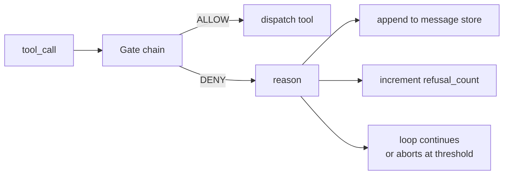
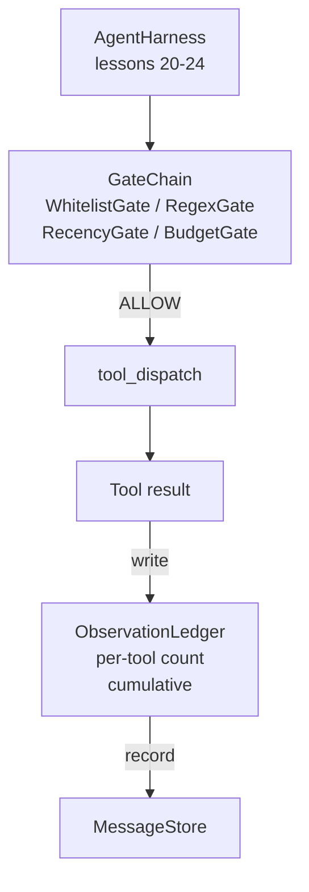

# 毕业设计第 25 课：验证门与观察预算

> 没有验证层的 Agent 外壳只是一件披着风衣的愿望。本课构建了决定工具调用是否被允许触发、Agent 能看到多少输出、以及当 Agent 读取过多时循环何时必须停止的确定性门控链。该链由一系列小型具名门控加上一个记录模型已看到每个 token 的观察账本组成。

**类型：** 构建
**语言：** Python（标准库）
**前置要求：** 第 19 阶段 · 20-24 课（Track A1：Agent 循环、工具注册表、消息存储、提示构建器、模型路由器），第 14 阶段 · 33 课（指令即约束），第 14 阶段 · 36 课（范围契约），第 14 阶段 · 38 课（验证门）
**时长：** ~90 分钟

## 学习目标

- 构建一个带有确定性 `evaluate(call)` 方法的 `VerificationGate` 协议。
- 将预算、时效、白名单和正则表达式门控组合成具有短路语义的链。
- 通过以工具和轮次为键的 `ObservationLedger` 跟踪每一条观察结果。
- 当累积观察预算将被超出时拒绝工具调用。
- 暴露一个结构化的 `GateDecision` 记录，供下游可观测性系统消费。

## 问题

当 Agent 外壳允许模型自由调用工具时，三个类别的 bug 会在实际使用的一小时内出现。

第一个是无界观察。一个跨 20 万行仓库的 grep 将五十万 token 的输出倾倒到下一轮。模型每千字节才看到一个匹配，其余上下文被浪费。token 账单巨大，而 Agent 现在更差，而不是更好。

第二个是过时时效。一个长时间运行的任务累积了五十次工具调用。模型重新读取第三轮的第一个 `read_file`，仿佛它仍是实时状态。第四十七轮所做的编辑永远不会出现，因为提示构建器将最早的观察结果序列化到了最前面。

第三个是权限爬升。一个研究任务以调用 `web_search` 开始，然后却以运行 `shell` 告终，因为模型发明了一个工具名而外壳默认采用了宽松模式。等有人查看 trace 时，/tmp 里已经有一个垃圾文件，并且一个 curl 已经对私有 API 执行过了。

验证门是外壳中说"不"的组件。它不是模型，不是裁判。它是一个 `(call, history, ledger)` 的确定性函数，返回 ALLOW 或 DENY 并附上理由。理由被记录。模型被告知。循环继续或中止。

## 概念


```mermaid
flowchart LR
  Call[tool_call] --> Chain[Gate chain]
  Chain -->|ALLOW| Dispatch[dispatch tool]
  Chain -->|DENY| Reason[reason]
  Reason --> Store[append to message store]
  Reason --> Refusal[increment refusal_count]
  Reason --> Loop[loop continues<br/>or aborts at threshold]
```

门控是任何带有 `evaluate(call, ctx) -> GateDecision` 方法的东西。门控链是一个有序列表。评估在第一个拒绝处短路。顺序很重要：廉价的结构性门控在昂贵的 token 计数门控之前运行。

本课提供了四个门控：

- `WhitelistGate`。允许的工具名是一个显式集合。集合之外的任何东西都被拒绝。这是最廉价的门控，最先运行。
- `RegexGate`。工具参数与正则表达式匹配。适用于拒绝含有 `rm -rf` 的 shell 调用，或指向内网 IP 的 HTTP 调用。纯基于调用负载。
- `RecencyGate`。模型只能看到最近 N 轮的观察结果。更早的观察结果被屏蔽。如果某个工具调用的结果会延长已经过期的观察窗口，该门控会拒绝该调用。
- `BudgetGate`。模型在整个会话中累积读取的 token 数有上限。当账本显示已达到上限时，每一个后续工具调用都被拒绝。

观察账本是记账机制。每一次成功的工具调用写入一行：工具名、轮次、生成的 token 数、累积值。账本回答两个问题：模型总共看到了多少，以及它看到了某个工具的多少。预算门控读取第一个。按工具计费的预算门控（你将作为练习编写）读取第二个。

## 架构


```mermaid
flowchart TD
  Harness[AgentHarness<br/>lessons 20-24] --> Chain[GateChain<br/>WhitelistGate / RegexGate<br/>RecencyGate / BudgetGate]
  Chain -->|ALLOW| Dispatch[tool_dispatch]
  Dispatch --> Result[Tool result]
  Result -->|write| Ledger[ObservationLedger<br/>per-tool count<br/>cumulative]
  Ledger -->|record| Store[MessageStore]
```

外壳询问门控链。门控链要么点头要么拒绝。如果点头，工具运行，账本更新，结果附加到消息存储。如果拒绝，模型收到一条拒绝消息作为系统消息，循环决定重试还是中止。

## 你要构建的内容

实现是一个单独的 `main.py` 加测试。

1. `Observation` 和 `ToolCall` 数据类定义了线路格式。
2. `ObservationLedger` 记录 `(turn, tool, tokens)` 行并回答 `cumulative()` 和 `per_tool(name)`。
3. `GateDecision` 携带 `(allow, reason, gate_name)`。
4. `VerificationGate` 是协议。每个门控实现 `evaluate(call, ctx)`。
5. `GateChain` 包装一个有序列表。它依次调用每个门控，返回第一个拒绝，如果所有门控都通过则返回允许。
6. 演示运行一个微小的合成 Agent 循环。三轮。第三轮触发预算门控，循环报告一个干净的拒绝并带有非零的拒绝计数。

token 计数器故意采用愚蠢的 `len(text) // 4` 启发式方法。本课的重点是门控管道，而不是分词器。在生产环境中替换为真正的分词器。

## 为什么门控链顺序很重要

拒绝比允许代价更低。`WhitelistGate` 以 O(1) 哈希查找运行。`RegexGate` 以 O(pattern * argv) 运行。`RecencyGate` 读取消息存储的一小部分。`BudgetGate` 读取整个账本。按成本升序排列，这样被拒绝的调用在执行昂贵工作之前就会短路。

你也要按影响范围排列。白名单是最强的主张：此工具不在契约中。正则表达式门控次之：此参数不在契约中。时效门控排在之后：外壳仍然关心，但调用在结构上是合法的。预算门控排在最后，因为按定义，它只在其他所有门控都通过时才会触发。

## 如何与 Track A 的其余部分组合

之前的课程为你提供了循环、工具注册表、消息存储、提示构建器和模型路由器。本课增加了模型和工具之间的层。第 26 课提供了调度器在门控链说 ALLOW 后将工具调用交给它的沙箱。第 27 课提供了将拒绝计数作为质量信号记录的评估框架。第 28 课将门控决策集成到 OpenTelemetry span 中。第 29 课将所有内容拼接成一个可工作的编码 Agent。

## 运行

```bash
cd phases/19-capstone-projects/25-verification-gates-observation-budget
python3 code/main.py
python3 -m pytest code/tests/ -v
```

演示逐轮打印包括每个门控决策在内的跟踪信息并以退出码 0 退出。测试覆盖账本、每个门控的独立测试、门控链短路以及端到端的合成循环。
