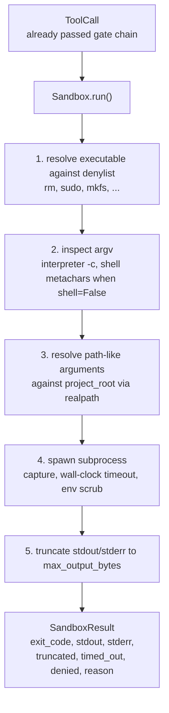
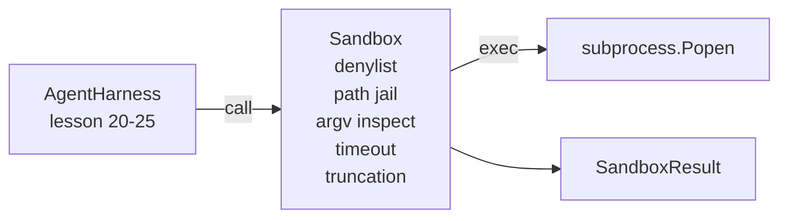

# Capstone Lesson 26: Denylist と Path Jail つき Sandbox Runner

> verification gate は tool call を実行してよいかを決めます。sandbox は、実行する場合に何が起きるかを決めます。この lesson では subprocess runner を出荷します。危険な executable、危険な argv shape を拒否し、すべての file path を project root に jail し、大きすぎる output を truncate し、wall-clock timeout で暴走 process を kill します。model と operating system の間に置く 2 層のうち 2 つ目です。

**種別:** 構築
**言語:** Python (stdlib)
**前提条件:** Phase 19 · 25 (verification gates and observation budget), Phase 14 · 33 (instructions as constraints), Phase 14 · 38 (verification gates)
**所要時間:** 約90分

## 学習目標

- timeout、capture、truncation を持つ `subprocess.run` wrapper として `Sandbox` class を作る。
- command name は denylist で、構造は argv inspector で拒否する。
- declared project root の外へ resolve される path argument を拒否する。
- shell mode が off のとき shell metacharacter を拒否する。
- downstream observability と eval harness が取り込める structured `SandboxResult` を返す。

## 問題

shell out できる coding agent は、1 turn で backdoor を入れ、key を exfiltrate し、developer laptop を壊し、cloud bill を積み上げられます。最も安い防御は shell を与えないことです。次に安い防御は、正確な pattern list に no と言う sandbox です。

agent trace では 3 種類の failure が繰り返し出ます。

1 つ目は dangerous executable です。path issue を直す pressure の下で model は `sudo`, `chmod -R 777`, `rm -rf`, `mkfs`, `dd` を試します。agent run にこれらは不要です。denylist は name と alias で捕まえます。

2 つ目は argv trick です。shell はだめだと言われた model が、interpreter 経由で攻撃を通します。`python3 -c "import os; os.system('rm -rf /')"`, `bash -c '...'`, `node -e '...'`, `perl -e '...'` です。sandbox は、`-c` 風の flag 付き interpreter run が、手順を増やしただけの shell call であることを知る必要があります。

3 つ目は path escape です。model は `./src/main.py` を読むように言われ、代わりに `../../etc/passwd` を読みます。sandbox はすべての path argument を `os.path.realpath` で resolve し、prefix を assert して jail します。

sandbox は operating system 的な意味での security boundary ではありません。code execution を持つ決意ある attacker はまだ抜け出せます。この sandbox は development-time guardrail です。よくある failure mode を loud にし、agent が単なる不器用さで damage を与えることを止めます。

## コンセプト



sandbox には 4 つの refusal axis があります。name、argv、path、structure です。各 axis は call に対する pure function であり、まだ subprocess はありません。すべての axis を pass した後にだけ subprocess を spawn します。

`SandboxResult` の exit code は conventional なものです。0 は success、non-zero は failure、さらに denied (-100)、timed_out (-101)、truncated（exit code は実際の値で flag が立つ）の sentinel code があります。後続 lesson は stderr を parse せず、この structured result を読みます。

## アーキテクチャ



denylist は executable basename の frozenset です。alias（`/bin/rm`, `/usr/bin/rm`）はいずれも同じ basename に resolve されます。argv inspector は interpreter shape を知っています。argv[0] が interpreter で、後続 arg が `-c` または `-e` で始まるものは deny します。shell metacharacter（`;`, `|`, `&`, `>`, `<`, backticks, `$()`）は、call が明示的に shell を要求していない場合に refusal になります。

path jail が最も subtle な部分です。sandbox は construction 時に `project_root` を受け取ります。path に見える引数（`/` を含む、または既存 file に match する）は `os.path.realpath` で normalize し、project root の realpath と照合します。resolved target が root 配下でなければ refusal です。project root 内の symlink が外を指す symlink escape attempt は、literal path ではなく realpath を見ることで block します。

## 作るもの

implementation は `main.py` と tests dir です。

1. `SandboxResult` dataclass: exit_code, stdout, stderr, truncated, timed_out, denied, reason, duration_ms。
2. `SandboxConfig` dataclass: project_root, max_output_bytes, timeout_seconds, denylist, interpreter_block。
3. `Sandbox` class: `run(argv, *, shell=False, cwd=None)` が `SandboxResult` を返す。
4. internal refusal helper: `_check_executable_denylist`, `_check_argv_interpreter`, `_check_shell_metachars`, `_check_path_jail`。
5. 明確な `truncated` flag と captured stream 内 marker line つきの output truncation。
6. bottom の demo: legitimate call と adversarial call の sequence。各 call を result とともに表示する。

sandbox は default で `shell=False`、`capture_output=True` の `subprocess.run` を使います。wall-clock timeout は `timeout` argument を使います。`TimeoutExpired` では process group を kill し、`SandboxResult` を synthesize します。

## なぜこれは本物の sandbox ではないのか

lesson sandbox は namespace、cgroup、seccomp、gVisor、Firecracker、kernel-level isolation を使いません。subprocess ができることは、sandbox もできます。protection は structural です。agent はよくある危険な invocation を deny され、silent に実行される代わりに loud refusal が observability に入ります。

production agent では上に layer を載せます。unprivileged Docker container 内で走らせる、microVM 内で走らせる、capability を drop する、project root を read-only で mount し scratch dir を read-write にする、memory と CPU に ulimit をかける、environment を known-safe whitelist に scrub する。Lesson 29 はこの一部を扱います。operating-system isolation はこの lesson の scope 外です。

## 実行方法

```bash
cd phases/19-capstone-projects/26-sandbox-runner-denylist
python3 code/main.py
python3 -m pytest code/tests/ -v
```

demo は temp directory を作り、そこに clean file を置き、call の battery を走らせます。legal call は success します。denied call は `denied=True` と reason を持つ SandboxResult を返します。timeout は `timed_out=True` を返します。truncation は `truncated=True` を立てます。demo は outcome の JSON table を print し、exit zero します。
