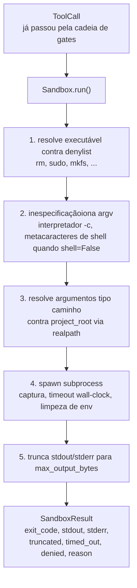
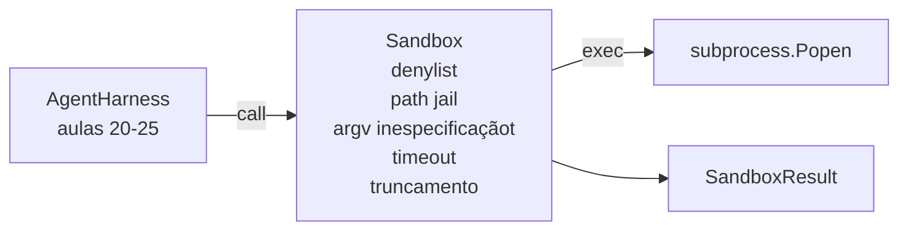

# Capstone Aula 26: Sandbox Runner com Denylist e Path Jail

> O verification gate decide se uma chamada de ferramenta deve rodar. O sandbox decide o que acontece quando ela roda. Esta aula fornece um runner de subprocesso que recusa executáveis perigosos, recusa formas de argv perigosas, jaula cada caminho de arquivo para um root do projeto, trunca saída de tamanho excessivo, e mata processos descontrolados em timeout de wall-clock. É a segunda de duas camadas que ficam entre o model e o sistema operacional.

**Tipo:** Build
**Linguagens:** Python (stdlib)
**Pré-requisitos:** Fase 19 · 25 (verification gates e observation budget), Fase 14 · 33 (instruções como restrições), Fase 14 · 38 (verification gates)
**Tempo:** ~90 minutos

## Objetivos de Aprendizado

- Construir uma classe `Sandbox` envolvendo `subprocess.run` com timeout, captura e truncamento.
- Recusar um comando por nome contra uma denylist e por estrutura contra um inspetor de argv.
- Recusar qualquer argumento de caminho que resolva fora de um root declarado do projeto.
- Recusar metacaracteres de shell quando o modo shell está desligado.
- Retornar um `SandboxResult` estruturado que observabilidade downstream e o eval harness podem ingerir.

## O Problema

Um coding agente que consegue dar shell pode instalar backdoors, exfiltrar keys, brickar um laptop de desenvolvimento e acumular uma conta de cloud em um único turn. A defesa de menor custo é não dar shell. A segunda de menor custo é um sandbox que diz não a uma lista precisa de padrões.

Três classes de falha recorrem em traces de agent.

A primeira são executáveis perigosos. Um model sob pressão para corrigir um problema de caminho vai tentar `sudo`, `chmod -R 777`, `rm -rf`, `mkfs`, `dd`. Nenhum desses pertence a um run de agent. A denylist os apanha por nome e por alias.

A segunda são truques de argv. Um model que recebeu "sem shell" vai canalizar um ataque através de um interpretador: `python3 -c "import os; os.system('rm -rf /')"`, `bash -c '...'`, `node -e '...'`, `perl -e '...'`. O sandbox precisa saber que qualquer interpretador rodado com uma flag `-c`-like é apenas uma chamada de shell com etapas extras.

A terceira é escape de caminho. O model é instruído a ler `./src/main.py` e em vez disso lê `../../etc/passwd`. O sandbox jaula cada argumento de caminho resolvendo via `os.path.realpath` e verificando o prefixo.

O sandbox não é uma fronteira de segurança no sentido de sistema operacional. Um atacante determinado com execução de código ainda pode escapar. O sandbox é um guardrail em tempo de desenvolvimento: torna os modos de falha comuns barulhentos e impede o agente de causar dano por pura incompetência.

## O Conceito



O sandbox tem quatro eixos de recusa: nome, argv, caminho, estrutura. Cada eixo é uma função pura da chamada, sem subprocesso ainda. O subprocesso só é spawnado depois que cada eixo passou.

Os códigos de exit do `SandboxResult` são os convencionais: 0 sucesso, não-zero falha, mais três códigos sentinela para denied (-100), timed_out (-101), e truncated (o exit code é o real, com uma flag setada). As aulas downstream leem esse resultado estruturado em vez de parsear stderr.

## Arquitetura



A denylist é um frozenset de basenames de executáveis. Aliases (`/bin/rm`, `/usr/bin/rm`) todos resolvem para o mesmo basename. O inspetor de argv conhece a forma do interpretador: qualquer argv onde argv[0] é um interpretador e qualquer argumento posterior começa com `-c` ou `-e` é negado. Metacaracteres de shell (`;`, `|`, `&`, `>`, `<`, backticks, `$()`) causam recusa quando a chamada não solicitou explicitamente um shell.

A jaula de caminho é a peça mais sutil. O sandbox aceita um `project_root` na construção. Qualquer argumento que pareça um caminho (contém `/` ou combina com um arquivo existente) é normalizado via `os.path.realpath`, depois verificado contra o realpath do root do projeto. Se o alvo resolvido não está sob o root, recusa. Tentativas de escape por symlink (um symlink no root do projeto que aponta para fora) são bloqueadas verificando o realpath, não o caminho literal.

## O que você vai construir

A implementação é `main.py` mais um diretório de testes.

1. Dataclass `SandboxResult`: exit_code, stdout, stderr, truncated, timed_out, denied, reason, duration_ms.
2. Dataclass `SandboxConfig`: project_root, max_output_bytes, timeout_seconds, denylist, interpreter_block.
3. Classe `Sandbox`: `run(argv, *, shell=False, cwd=None)` retorna um `SandboxResult`.
4. Helpers de recusa internos: `_check_executable_denylist`, `_check_argv_interpreter`, `_check_shell_metachars`, `_check_path_jail`.
5. Truncamento de saída com flag `truncated` clara e uma linha de marcador no stream capturado.
6. Demo no final: uma sequência de chamadas legítimas e adversárias. Cada uma é mostrada com seu resultado.

O sandbox usa `subprocess.run` com `shell=False` por padrão e `capture_output=True`. O timeout de wall-clock usa o argumento `timeout`; em `TimeoutExpired`, o sandbox mata o grupo de processos e sintetiza um SandboxResult.

## Por que isso não é um sandbox real

O sandbox da aula não usa namespaces, cgroups, seccomp, gVisor, Firecracker, ou qualquer isolamento de nível de kernel. Qualquer coisa que o subprocesso pode fazer, o sandbox pode fazer. A proteção é estrutural: o agente é negado as invocações perigosas mais comuns, e a recusa barulhenta vai para observabilidade em vez de rodar silenciosamente.

Para agentes de produção você camada acima: rode dentro de um container Docker não privilegiado, rode dentro de uma microVM, remova capabilities, monte o root do projeto como read-only e um diretório scratch como read-write, defina ulimit em memória e CPU, limpe o ambiente para uma whitelist conhecida segura. A aula 29 faz parte disso. Isolamento de sistema operacional está fora do escopo desta aula.

## Rodando

```bash
cd phases/19-capstone-projects/26-sandbox-runner-denylist
python3 code/main.py
python3 -m pytest code/tests/ -v
```

A demo cria um diretório temporário, coloca um arquivo limpo nele, depois roda uma bateria de chamadas. Chamadas legais são bem-sucedidas. Chamadas negadas retornam SandboxResult com `denied=True` e uma razão. Timeouts retornam `timed_out=True`. Truncamento seta `truncated=True`. A demo imprime uma tabela JSON de resultados e sai com zero.

## Como isso compõe com o resto da Trilha A

A aula 25 produziu a cadeia de gates. A aula 26 é o executor que roda após um gate ALLOW. O eval harness da aula 27 compara os resultados do sandbox contra o exit-code esperado por tarefa. A aula 28 emite um span `gen_ai.tool.execution` ao redor de cada invocação `Sandbox.run`. A demo ponta a ponta da aula 29 conecta um coding agente real através de ambas as camadas.
