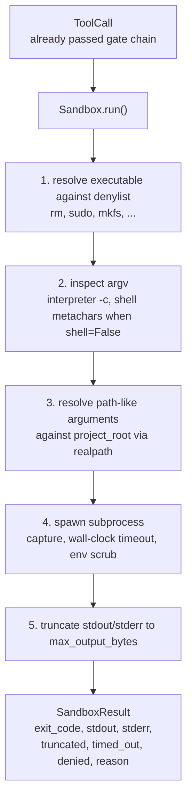
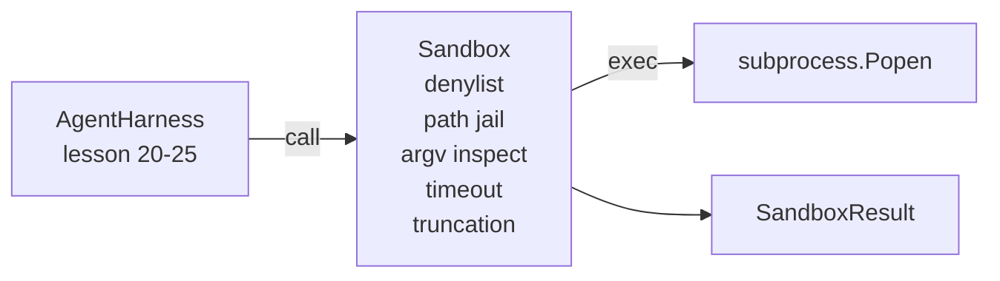

# Bitirme Dersi 26: Reddedenler ve Yol Hapishanesi ile Sandbox Runner

> Doğrulama kapısı bir araç çağrısının çalıştırılıp çalıştırılmayacağına karar verir. Korumalı alan gerçekleştiğinde ne olacağına karar verir. Bu ders, tehlikeli yürütülebilir dosyaları reddeden, tehlikeli argv şekillerini reddeden, proje köküne giden her dosya yolunu hapse atan, büyük boyutlu çıktıyı kesen ve duvar saati zaman aşımında kaçak süreçleri sonlandıran bir alt süreç çalıştırıcısı sunar. Model ile işletim sistemi arasında yer alan iki katmandan ikincisidir.

**Tür:** Yapım
**Diller:** Python (stdlib)
**Önkoşullar:** Aşama 19 · 25 (doğrulama kapıları ve gözlem bütçesi), Aşama 14 · 33 (kısıtlamalar olarak talimatlar), Aşama 14 · 38 (doğrulama kapıları)
**Süre:** ~90 dakika

## Öğrenme Hedefleri

- Zaman aşımı, yakalama ve kesme ile `subprocess.run` sarmalayan bir `Sandbox` sınıfı oluşturun.
- Bir red listesine karşı isme göre ve bir argv denetçisine karşı yapıya göre bir komutu reddedin.
- Bildirilen proje kökünün dışında çözümlenen herhangi bir yol bağımsız değişkenini reddedin.
- Kabuk modu kapalıyken kabuk meta karakterlerini reddedin.
- Aşağı akışlı observability ve değerlendirme koşum takımının alabileceği yapılandırılmış bir `SandboxResult` döndürün.

## Sorun

Dışarıya çıkabilen bir kodlama agent, tek bir dönüşte arka kapılar kurabilir, anahtarları sızdırabilir, geliştirici dizüstü bilgisayarını bloke edebilir ve bir bulut faturasını toplayabilir. En az maliyetli savunma ona mermi vermemektir. İkinci en ucuz olanı ise kesin bir kalıp listesine hayır diyen bir sanal alan.

agent izlemede üç sınıf başarısızlık yineleniyor.

Birincisi tehlikeli yürütülebilir dosyalardır. Bir yol sorununu düzeltme baskısı altındaki bir model, `sudo`, `chmod -R 777`, `rm -rf`, `mkfs`, `dd`'yi deneyecektir. Bunların hiçbiri bir agent çalıştırmaya ait değil. İnkar listesi onları adlarına ve takma adlarına göre yakalar.

İkincisi argv hileleridir. Kabuğun olmadığı söylenen bir model, bir yorumlayıcı aracılığıyla saldırıyı yönlendirecektir: `python3 -c "import os; os.system('rm -rf /')"`, `bash -c '...'`, `node -e '...'`, `perl -e '...'`. Korumalı alanın, `-c` benzeri bir işaretle çalıştırılan herhangi bir yorumlayıcının yalnızca ekstra adımları olan bir kabuk çağrısı olduğunu bilmesi gerekir.

Üçüncüsü ise yoldan kaçış. Modele `./src/main.py` okuması söylendi ve bunun yerine `../../etc/passwd` okuması yapıldı. Korumalı alan, her yol bağımsız değişkenini `os.path.realpath` aracılığıyla çözümleyerek ve öneki öne sürerek hapseder.

Korumalı alan, işletim sistemi anlamında bir güvenlik sınırı değildir. Kod yürütme becerisine sahip kararlı bir saldırgan yine de kaçabilir. Korumalı alan, geliştirme zamanı için bir korkuluktur: yaygın arıza modlarının sesini yükseltir ve agent'ın tamamen beceriksizlikten dolayı hasar vermesini engeller.

## Konsept



Korumalı alanın dört reddetme ekseni vardır: ad, argv, yol, yapı. Her eksen, çağrının saf bir işlevidir; henüz alt süreç yoktur. Alt süreç yalnızca her eksen geçtikten sonra ortaya çıkar.

`SandboxResult` çıkış kodları geleneksel olanlardır: 0 başarı, sıfır olmayan başarısızlık, artı reddedilen (-100), timed_out (-101) ve kesilmiş için üç nöbetçi kod (çıkış kodu, bayrak ayarlı gerçek koddur). Aşağı yöndeki dersler, stderr'i ayrıştırmak yerine bu yapılandırılmış sonucu okur.

## Mimarlık



Reddetme listesi, yürütülebilir temel adların dondurulmuş bir kümesidir. Takma adların (`/bin/rm`, `/usr/bin/rm`) tümü aynı temel adına çözümlenir. Argv denetçisi yorumlayıcının şeklini bilir: argv[0]'ın bir yorumlayıcı olduğu ve daha sonra `-c` veya `-e` ile başlayan herhangi bir argv'nin reddedilmesi. Kabuk meta karakterleri (`;`, `|`, `&`, `>`, `<`, geri tıklamalar, `$()`) , çağrı açıkça bir kabuk talep etmediğinde reddedilmeye neden olur.

Yol hapishanesi en incelikli parçadır. Korumalı alan yapım aşamasında bir `project_root` kabul eder. Yola benzeyen ( `/` içeren veya mevcut bir dosyayla eşleşen) herhangi bir bağımsız değişken, `os.path.realpath` aracılığıyla normalleştirilir, ardından proje kökünün gerçek yoluna göre kontrol edilir. Çözümlenen hedef kök altında değilse ret. Sembolik bağlantıdan kaçış girişimleri (proje kökünde dışarıya işaret eden bir sembolik bağlantı), gerçek yol değil, gerçek yol kontrol edilerek engellenir.

## Ne inşa edeceksiniz

Uygulama `main.py` artı bir test dizini şeklindedir.

1. `SandboxResult` veri sınıfı: çıkış_kodu, stdout, stderr, kesilmiş, timed_out, reddedildi, sebep, süre_ms.
2. `SandboxConfig` veri sınıfı: proje_kökü, max_output_bytes, timeout_seconds, reddetme listesi, yorumlayıcı_blok.
3. `Sandbox` sınıfı: `run(argv, *, shell=False, cwd=None)` , bir `SandboxResult` döndürür.
4. Dahili reddetme yardımcıları: `_check_executable_denylist`, `_check_argv_interpreter`, `_check_shell_metachars`, `_check_path_jail`.
5. Yakalanan akışta net bir `truncated` bayrağı ve bir işaret çizgisiyle çıktının kesilmesi.
6. Alttaki demo: meşru ve düşmanca çağrıların bir dizisi. Her biri sonucuyla birlikte gösterilir.

Korumalı alan, varsayılan olarak `shell=False` ve `capture_output=True` ile birlikte `subprocess.run` kullanır. Duvar saati zaman aşımı `timeout` argümanını kullanır; `TimeoutExpired` üzerinde sanal alan, süreç grubunu sonlandırır ve bir SandboxResult sentezler.

## Bu neden gerçek bir sanal alan değil?

Ders sanal alanında ad alanları, gruplar, seccomp, gVisor, Firecracker veya çekirdek düzeyinde herhangi bir izolasyon kullanılmaz. Alt sürecin yapabileceği her şeyi korumalı alan da yapabilir. Koruma yapısaldır: agent en yaygın tehlikeli çağrıları reddeder ve yüksek sesle reddetme, sessizce koşmak yerine observability'ya gider.

Üretim agent'lari için en üstte katman oluşturursunuz: ayrıcalığı olmayan bir Docker kapsayıcısının içinde çalıştırın, bir mikroVM'nin içinde çalıştırın, yetenekleri bırakın, proje kökünü salt okunur olarak ve bir karalama dizini okuma-yazma olarak monte edin, bellek ve CPU üzerinde ulimit ayarlayın, ortamı güvenli olduğu bilinen bir beyaz listeye temizleyin. Ders 29 bunun bir kısmını yapıyor. İşletim sistemi izolasyonu bu dersin kapsamı dışındadır.

## Çalıştırıyorum

```bash
cd phases/19-capstone-projects/26-sandbox-runner-denylist
python3 code/main.py
python3 -m pytest code/tests/ -v
```

Demo bir geçici dizin oluşturur, içine temiz bir dosya bırakır ve ardından bir dizi çağrı çalıştırır. Yasal çağrılar başarılı olur. Reddedilen çağrılar, `denied=True` ve bir neden ile birlikte SandboxResult'u döndürür. Zaman aşımları `timed_out=True` değerini döndürür. Kesme kümeleri `truncated=True`. Demo, bir JSON sonuç tablosu yazdırır ve sıfırdan çıkar.

## Bunun A Parçasının geri kalanıyla nasıl birleştiği

Ders 25 kapı zincirini oluşturdu. Ders 26, bir İZİN VER kapısından sonra çalışan uygulayıcıdır. Ders 27'nin değerlendirme donanımı, korumalı alan sonuçlarını görev başına beklenen çıkış koduyla karşılaştırır. Ders 28, her `Sandbox.run` çağrısının etrafında bir `gen_ai.tool.execution` aralığı yayar. Ders 29'un uçtan uca demosu, her iki katmana da gerçek bir kodlama agent bağlar.
