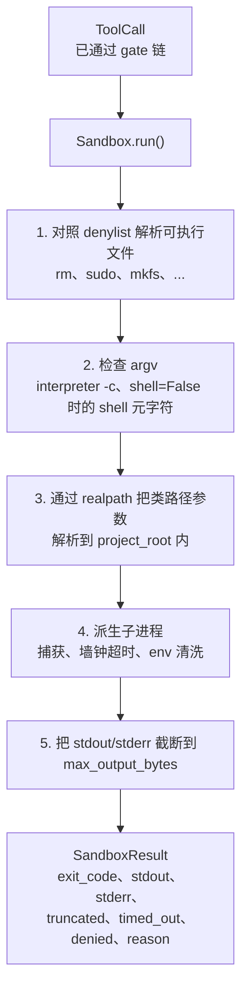
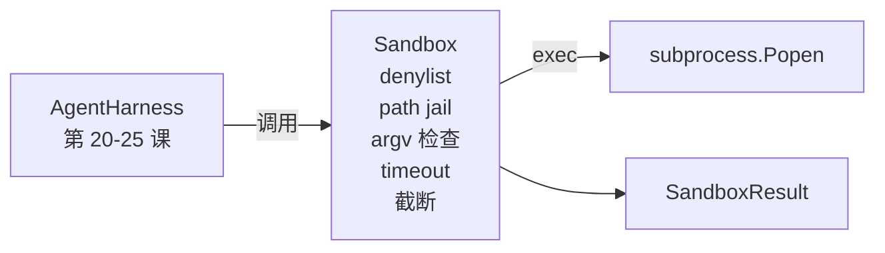

# Capstone Lesson 26：带 denylist 与路径牢笼的 Sandbox Runner

> 译注：本文译自同目录 [`en.md`](./en.md)。术语遵循仓根 [TRANSLATION_GUIDE.md](../../../../TRANSLATION_GUIDE.md)。

> 验证关卡（verification gate）决定一次工具调用该不该跑，sandbox（沙箱）决定真跑起来后会发生什么。本课交付一个子进程 runner：拒绝危险可执行文件，拒绝危险的 argv 形态，把每一个文件路径都关进项目根目录这个牢笼里，对超大输出做截断，还会按 wall-clock（挂钟）超时杀掉失控进程。它是夹在模型和操作系统之间的两层防线中的第二层。

**Type:** Build
**Languages:** Python (stdlib)
**Prerequisites:** Phase 19 · 25（验证关卡与观测预算）, Phase 14 · 33（指令即约束）, Phase 14 · 38（验证关卡）
**Time:** ~90 minutes

## 学习目标（Learning Objectives）

- 构建一个 `Sandbox` 类，包装 `subprocess.run`，提供超时、捕获和截断。
- 通过 denylist（黑名单）按名字拒绝命令，通过 argv 检查器按结构拒绝命令。
- 拒绝任何 resolve 到声明的项目根目录之外的路径参数。
- 在 shell 模式关闭时拒绝 shell 元字符。
- 返回一个结构化的 `SandboxResult`，下游的可观测性（observability）和评估 harness 可以直接消费。

## 问题（The Problem）

一个能够 shell out（开 shell 跑命令）的编码 agent，可以一回合内装上后门、外泄密钥、把开发笔记本搞砖、把云账单刷爆。代价最低的防御是干脆不给它 shell。次低代价的防御是一个 sandbox：对一份精确的模式清单说不。

agent 轨迹（trajectory）里反复出现三类失败。

第一类是危险可执行文件。模型在压力下要修一个路径问题时会试 `sudo`、`chmod -R 777`、`rm -rf`、`mkfs`、`dd`。这些都不该出现在 agent 跑出来的命令里。denylist 按名字以及别名把它们抓住。

第二类是 argv 花招。被告知不许用 shell 的模型，会把攻击通过解释器塞进去：`python3 -c "import os; os.system('rm -rf /')"`、`bash -c '...'`、`node -e '...'`、`perl -e '...'`。sandbox 必须明白：任何带着类 `-c` flag 跑起来的解释器，本质就是一个绕了一步的 shell 调用。

第三类是路径逃逸。模型被要求读 `./src/main.py`，结果它读了 `../../etc/passwd`。sandbox 通过把每个路径参数过一遍 `os.path.realpath` 并断言前缀，把它们关进牢笼。

这个 sandbox 不是操作系统意义上的安全边界。一个有代码执行能力的下定决心的攻击者依旧能突破。这个 sandbox 是开发期的 guardrail（护栏）：让常见失败模式发出响亮的拒绝声，并阻止 agent 因为单纯无能而搞出破坏。

## 概念（The Concept）



sandbox 有四条拒绝轴：名字、argv、路径、结构。每条轴都是这次调用的纯函数，此时还没有任何子进程。子进程只在所有轴都通过之后才会启动。

`SandboxResult` 的退出码遵循惯例：0 表示成功，非零表示失败，外加三个哨兵值：denied（-100）、timed_out（-101），以及 truncated（退出码仍是真实退出码，但会另外置一个 flag）。下游课程读取的是这个结构化结果，而不是去解析 stderr。

## 架构（Architecture）



denylist 是一个由可执行文件 basename（基础名）组成的 frozenset。别名（`/bin/rm`、`/usr/bin/rm`）都会 resolve 到同一个 basename。argv 检查器知道解释器形态：任何 argv，只要 argv[0] 是解释器，并且后面任意参数以 `-c` 或 `-e` 开头，就会被拒绝。shell 元字符（`;`、`|`、`&`、`>`、`<`、反引号、`$()`）在调用没有明确请求 shell 时会触发拒绝。

路径牢笼是其中最微妙的一块。sandbox 在构造时接受一个 `project_root`。任何看起来像路径（含有 `/` 或匹配到一个已有文件）的参数会先通过 `os.path.realpath` 标准化，然后与项目根目录的 realpath 进行比对。如果 resolve 后的目标不在根目录之下，就拒绝。symlink 逃逸尝试（项目根里有一个指向外部的 symlink）也会被拦下来——靠的就是检查 realpath，而不是字面路径。

## 你将构建什么（What you will build）

实现就是一个 `main.py` 加一个 tests 目录。

1. `SandboxResult` dataclass：exit_code、stdout、stderr、truncated、timed_out、denied、reason、duration_ms。
2. `SandboxConfig` dataclass：project_root、max_output_bytes、timeout_seconds、denylist、interpreter_block。
3. `Sandbox` 类：`run(argv, *, shell=False, cwd=None)` 返回一个 `SandboxResult`。
4. 内部拒绝辅助函数：`_check_executable_denylist`、`_check_argv_interpreter`、`_check_shell_metachars`、`_check_path_jail`。
5. 输出截断：带一个清晰的 `truncated` flag，并在被捕获的流里写入一行标记。
6. 文末 demo：一系列合法与对抗性调用，每条都展示其结果。

sandbox 默认用 `subprocess.run`，`shell=False`，并使用 `capture_output=True`。挂钟超时通过 `timeout` 参数实现；当 `TimeoutExpired` 触发时，sandbox 会杀掉整个进程组，并合成一个 SandboxResult。

## 为什么这不是真正的 sandbox（Why this is not a real sandbox）

本课的 sandbox 不使用 namespaces、cgroups、seccomp、gVisor、Firecracker，或任何内核级别的隔离。子进程能做的事，这个 sandbox 同样能做。它的保护是结构性的：agent 最常见的危险调用被拒绝，并且响亮的拒绝写进了可观测性，而不是悄无声息地跑过去。

对生产级 agent，你需要在上面再叠几层：跑在一个非特权 Docker 容器里、跑在一个 microVM 里、丢掉多余的 capability、把项目根挂载为只读再挂一个可写的 scratch 目录、对内存和 CPU 设 ulimit、把环境变量清洗成一个已知安全的白名单。Lesson 29 会做其中一部分。操作系统级隔离不在本课范围内。

## 运行它（Running it）

```bash
cd phases/19-capstone-projects/26-sandbox-runner-denylist
python3 code/main.py
python3 -m pytest code/tests/ -v
```

demo 会创建一个临时目录，往里面放一个干净文件，然后跑一连串调用。合法的调用会成功。被拒绝的调用返回 `denied=True` 加一个 reason 的 SandboxResult。超时返回 `timed_out=True`。截断会置 `truncated=True`。demo 会打印一张 JSON 结果表，然后以 0 退出。

## 它如何与 Track A 的其它部分组合（How this composes with the rest of Track A）

Lesson 25 产出了 gate chain（关卡链）。Lesson 26 是在 gate ALLOW 之后跑起来的执行器。Lesson 27 的评估 harness 会把 sandbox 的结果和每个任务期望的退出码做对比。Lesson 28 在每次 `Sandbox.run` 调用周围发出一个 `gen_ai.tool.execution` span。Lesson 29 的端到端 demo 把一个真实的编码 agent 接入这两层。
