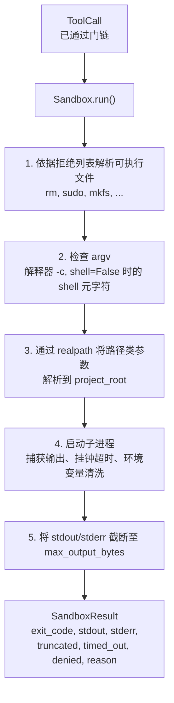
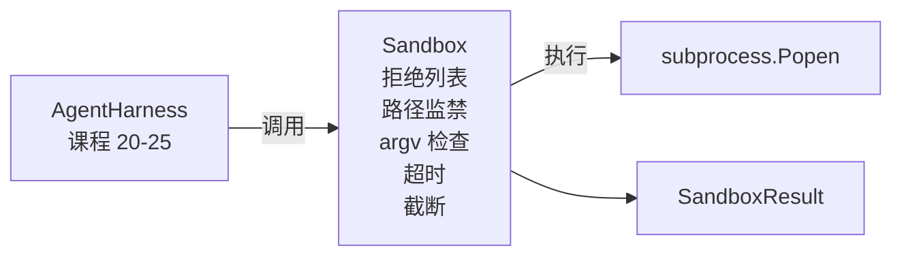

# 顶点课程 26：带拒绝列表与路径监禁的沙箱运行器

> 验证门决定一个工具调用是否应当执行。沙箱决定执行后会发生什么。本课程实现一个子进程运行器：它会拒绝危险的的可执行文件，拒绝危险的 argv 参数结构，将每个文件路径监禁到项目根目录，截断超长输出，并依据挂钟超时杀死失控进程。它是位于模型与操作系统之间的两层防护中的第二层。

**类型：** 构建
**语言：** Python（标准库）
**前置知识：** 第 19 阶段 · 25（验证门与观测预算），第 14 阶段 · 33（指令即约束），第 14 阶段 · 38（验证门）
**时长：** 约 90 分钟

## 学习目标

- 构建一个 `Sandbox` 类，封装 `subprocess.run`，支持超时、捕获和截断。
- 根据名称（拒绝列表）和结构（argv 检查器）拒绝命令。
- 拒绝任何解析到声明项目根目录之外的文件路径参数。
- 在 shell 模式关闭时拒绝 shell 元字符。
- 返回结构化的 `SandboxResult`，供下游可观测性和评估框架使用。

## 问题

一个能够执行 shell 命令的编码智能体可以在一次交互中安装后门、窃取密钥、搞垮开发者笔记本电脑并产生巨额云账单。成本最低的防御是不给它 shell。成本次低的防御是一个能针对精确的模式列表说"不"的沙箱。

在智能体的运行记录中，三类失败反复出现。

第一类是危险的可执行文件。一个迫于修复路径问题的模型会尝试使用 `sudo`、`chmod -R 777`、`rm -rf`、`mkfs`、`dd`。这些命令都不应该出现在智能体运行中。拒绝列表按名称和别名捕获它们。

第二类是 argv 技巧。一个被告知不能使用 shell 的模型会通过解释器发起攻击：`python3 -c "import os; os.system('rm -rf /')"`、`bash -c '...'`、`node -e '...'`、`perl -e '...'`。沙箱需要知道：任何使用 `-c` 类标志的解释器调用本质上都是 shell 调用，只是多绕了几步。

第三类是路径逃逸。模型被告知读取 `./src/main.py`，却读取了 `../../etc/passwd`。沙箱通过 `os.path.realpath` 解析每个路径参数并断言其前缀，从而监禁每个路径参数。

沙箱并非操作系统意义上的安全边界。一个拥有代码执行权限的坚定攻击者仍然可以突破。沙箱是一个开发阶段的护栏：它让常见的失败模式变得显眼，并阻止智能体因纯粹的无能而造成破坏。

## 概念


```mermaid
flowchart TD
  Call[ToolCall<br/>已通过门链] --> Run["Sandbox.run()"]
  Run --> S1[1. 依据拒绝列表解析可执行文件<br/>rm, sudo, mkfs, ...]
  S1 --> S2[2. 检查 argv<br/>解释器 -c, shell=False 时的 shell 元字符]
  S2 --> S3[3. 通过 realpath 将路径类参数<br/>解析到 project_root]
  S3 --> S4[4. 启动子进程<br/>捕获输出、挂钟超时、环境变量清洗]
  S4 --> S5[5. 将 stdout/stderr 截断至 max_output_bytes]
  S5 --> Result[SandboxResult<br/>exit_code, stdout, stderr,<br/>truncated, timed_out, denied, reason]
```

沙箱有四个拒绝维度：名称、argv、路径、结构。每个维度都是调用的纯函数，尚未启动子进程。只有每个维度都通过后，才会启动子进程。

`SandboxResult` 的退出码遵循惯例：0 表示成功，非零表示失败，外加三个哨兵值：拒绝（-100）、超时（-101）和截断（退出码为真实值，同时设置一个标志位）。后续课程直接读取这个结构化结果，而不是解析 stderr。

## 架构


```mermaid
flowchart LR
  Harness[AgentHarness<br/>课程 20-25] -->|调用| Sandbox[Sandbox<br/>拒绝列表<br/>路径监禁<br/>argv 检查<br/>超时<br/>截断]
  Sandbox -->|执行| Popen[subprocess.Popen]
  Sandbox --> Result[SandboxResult]
```

拒绝列表是一个由可执行文件基名组成的冻结集合。别名（`/bin/rm`、`/usr/bin/rm`）都解析到同一个基名。argv 检查器了解解释器的结构：任何 argv 中，如果 argv[0] 是一个解释器且后面的某个参数以 `-c` 或 `-e` 开头，则被拒绝。当调用没有显式请求 shell 时，shell 元字符（`;`、`|`、`&`、`>`、`<`、反引号、`$()`）会触发拒绝。

路径监禁是最微妙的部件。沙箱在构造时接受一个 `project_root`。任何看起来像路径的参数（包含 `/` 或匹配一个已有文件）都会通过 `os.path.realpath` 规范化，然后与项目根目录的 realpath 进行比较。如果解析后的目标不在根目录下，则拒绝。符号链接逃逸尝试（项目根目录中的指向外部的符号链接）通过检查 realpath 而非字面路径来阻止。

## 你要构建的内容

实现包括一个 `main.py` 和一个测试目录。

1. `SandboxResult` 数据类：exit_code、stdout、stderr、truncated、timed_out、denied、reason、duration_ms。
2. `SandboxConfig` 数据类：project_root、max_output_bytes、timeout_seconds、denylist、interpreter_block。
3. `Sandbox` 类：`run(argv, *, shell=False, cwd=None)` 返回一个 `SandboxResult`。
4. 内部拒绝辅助函数：`_check_executable_denylist`、`_check_argv_interpreter`、`_check_shell_metachars`、`_check_path_jail`。
5. 输出截断，带清晰的 `truncated` 标志以及捕获流中的标记行。
6. 底部的演示：一系列合法调用和对抗性调用，每个都展示其结果。

沙箱默认使用 `subprocess.run` 并设置 `shell=False` 和 `capture_output=True`。挂钟超时使用 `timeout` 参数；当 `TimeoutExpired` 发生时，沙箱杀死进程组并合成一个 SandboxResult。

## 为什么这不是真正的沙箱

本课程的沙箱不使用命名空间、cgroups、seccomp、gVisor、Firecracker 或任何内核级隔离。子进程能做的事，沙箱也能做。保护是结构性的：智能体被拒绝最常见的危险调用，且响亮的拒绝会进入可观测系统，而非静默运行。

对于生产环境，你需要在此基础上叠加：在无特权的 Docker 容器内运行，在微虚拟机内运行，移除能力，以只读方式挂载项目根目录并以读写方式挂载临时目录，对内存和 CPU 设置 ulimit，将环境变量清洗到已知安全的允许列表。课程 29 会涉及其中部分内容。操作系统隔离超出了本课程的范围。

## 运行方式

```bash
cd phases/19-capstone-projects/26-sandbox-runner-denylist
python3 code/main.py
python3 -m pytest code/tests/ -v
```

演示会创建一个临时目录，放入一个干净文件，然后运行一系列调用。合法调用成功。被拒绝的调用返回 `denied=True` 的 SandboxResult 以及原因。超时返回 `timed_out=True`。截断设置 `truncated=True`。演示打印一个 JSON 格式的结果表格并以退出码 0 结束。

## 如何与 Track A 的其余部分组合

课程 25 产生了门链。课程 26 是在门 ALLOW 之后执行的执行器。课程 27 的评估框架将沙箱结果与每个任务预期的退出码进行比较。课程 28 在每个 `Sandbox.run` 调用周围发出 `gen_ai.tool.execution` 跨度。课程 29 的端到端演示将真正的编码智能体连接到这两层。
