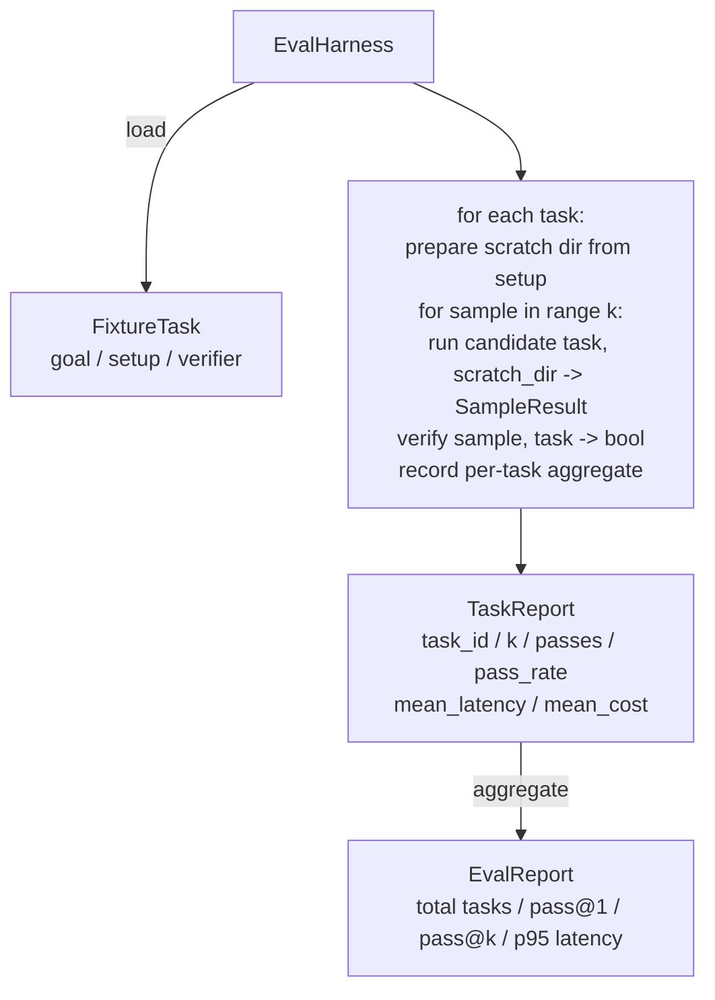

# Capstone Lesson 27: Fixture Tasks つき Eval Harness

> coding agent の質は、それを測る task suite の質で決まります。この lesson では fixture task の folder を受け取り、各 task を candidate agent に通し、deterministic verifier で pass/fail を採点し、pass@1、pass@k、mean latency、mean cost に aggregate する evaluation harness を作ります。harness は regression と refactor を見分けるための source of truth です。

**種別:** 構築
**言語:** Python (stdlib)
**前提条件:** Phase 19 · 25 (verification gates), Phase 19 · 26 (sandbox runner), Phase 14 · 30 (eval-driven agent development), Phase 14 · 19 (SWE-bench and GAIA benchmarks)
**所要時間:** 約90分

## 学習目標

- fixture task を goal、setup、verifier の triple として定義する。
- task ごとに複数 sample run を採点し、pass@1 と pass@k を計算する。
- latency と cost を mean と 95th-percentile metric に aggregate する。
- deterministic verifier（file diff、exit code、regex match）を reusable function に wire する。
- regression-tracking script が取り込める structured JSON report を emit する。

## 問題

eval harness なしで作られた agent benchmark は 3 つの failure mode に悩まされます。

1 つ目は unverified pass です。agent は bug を直したと言い、人間が diff を一瞥し、suite は green と mark されます。3 週間後、regression test が同じ bug を surface します。agent はもっともらしく推論しただけで、何も直していなかったのです。

2 つ目は undetected regression です。prompt template の変更で agent は目立つ task では 4% 良くなり、静かな task では 14% 悪くなります。goldset と per-task score がなければ、regression は main に入り、customer complaint で初めて出てきます。

3 つ目は per-task drift です。eval は月曜に 100 task で走り、金曜には誰かが 5 fixture を rename したため 95 task で走ります。pass rate は 5% improvement に見えます。実際には違います。

harness はこれらの failure を fact に変える program です。すべての fixture を、毎回、reproducible order で、true/false を deterministic check で返す verifier に対して実行します。

## コンセプト

```mermaid
flowchart LR
  F1[fixtures/task_001/<br/>task.json + expected/] --> Harness
  F2[fixtures/task_002/<br/>...] --> Harness
  Harness[Harness<br/>for each task:<br/>setup / run agent k samples /<br/>verify each sample /<br/>record latency, cost]
  Harness --> Report[EvalReport<br/>pass@1 / pass@k<br/>mean ms / p95 ms<br/>mean cost]
```

`FixtureTask` は小さな JSON file と optional な `expected/` directory です。JSON は `id`、`goal`（agent に渡す prompt）、`setup` block（scratch dir に置く file）、`verifier` block を宣言します。verifier block は harness の verifier registry 内の function を名指しし、その argument を渡します。

多くの有用な task は 3 種類の verifier shape で cover できます。

1 つ目は `file_equals` です。agent 実行後、指定 file を expected content と比較します。「この exact way で bug を直す」task を捕まえます。

2 つ目は `regex_match` です。指定 file の内容を regex に match します。「function が存在して X を返すべき」task のように acceptable solution が複数ある場合を捕まえます。

3 つ目は `shell_exit_zero` です。harness が shell command（lesson 26 の sandbox 経由）を実行し、command が exit zero のときだけ task を pass にします。「tests must pass」task を捕まえます。

harness は各 task を `k` 回走らせます。Pass@k は `1 - (1 - p)^k` です。p は empirical pass rate です。variance に気づけるよう、harness は raw count も report します。Latency は sample ごとの wall-clock です。Cost は agent が自己申告するもの（token count、USD、または両方）です。harness は sample 全体で合計し、per-task と aggregate number を提示します。

## アーキテクチャ



candidate は callable、`Callable[[FixtureTask, str], SampleResult]` です。harness は `tempfile.mkdtemp()` で scratch directory を作り、その path を plain string として渡します。harness は candidate の内部を気にしません。candidate は deterministic patch applier（harness self-test に便利）、real LLM agent、fuzzer のどれでもよいです。contract は SampleResult です。

## 作るもの

`main.py` には以下が入っています。

1. `FixtureTask` dataclass。
2. `SampleResult` dataclass: success_self_reported, latency_ms, cost_units, edits。
3. `TaskReport`, `EvalReport` dataclass と `to_dict()`。
4. verifier name から function への `VerifierRegistry`。built-in verifier: file_equals, regex_match, shell_exit_zero。
5. `EvalHarness` class。task directory を candidate に対して実行し、EvalReport を返す。
6. `tasks/` に同梱された 5 つの fixture task:
   - `fizzbuzz` の off-by-one
   - `factorial` の missing return
   - error message の typo
   - empty function body
   - linked-list traversal の off-by-one
7. harness が clean pass@1 = 1.0 を示すために使う deterministic reference candidate（`apply_known_fixes`）。
8. demo は EvalReport JSON を print し、exit zero する。

fixture task は `tasks/` の JSON file と、`tasks/<id>/buggy/` および `tasks/<id>/expected/` の paired source file として同梱されています。harness は buggy を scratch dir に copy し、candidate に渡し、expected と照合します。

## なぜ pass@k で、pass@1 だけではないのか

real LLM agent は stochastic です。pass@1 が 0.6 なら失敗に見えます。pass@5 が 0.95 なら、agent はたいてい正解に到達するが、early sample で選択を誤っていることを示します。fix は sampling と ranking であり、常に training を増やすことではありません。Pass@k はそれを見えるようにします。

pass@k は pass@1 と一緒に report します。pass@k は実際の failure を覆い隠すことがあるからです。model が 20 回に 1 回だけ正解するなら、有用な agent とは言えません。harness は両方を表示します。

## Track A の他 lesson との合成

Lesson 25 は gate chain を作りました。Lesson 26 は sandbox を作りました。harness は `shell_exit_zero` verifier に sandbox を使います。Lesson 28 は各 harness run を OTel trace で wrap します。Lesson 29 は同梱 fixture の 1 つに対して end-to-end demo を走らせ、reference candidate の pass@1 = 1.0 を assert します。

## 実行方法

```bash
cd phases/19-capstone-projects/27-eval-harness-fixture-tasks
python3 code/main.py
python3 -m pytest code/tests/ -v
```

demo は pass@1、pass@5、mean latency、per-task breakdown を含む EvalReport JSON を print します。exit code は zero です。tests は verifier function、pass@k math、fixture loading、同梱 reference candidate に対する harness end-to-end を cover します。
